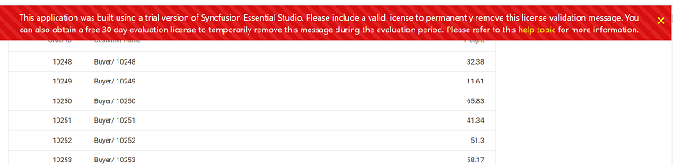
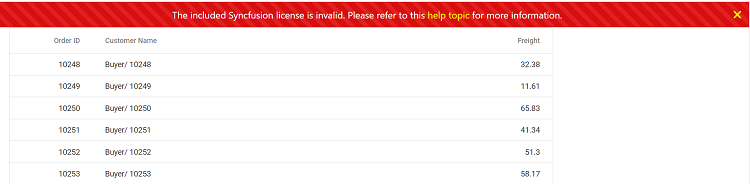
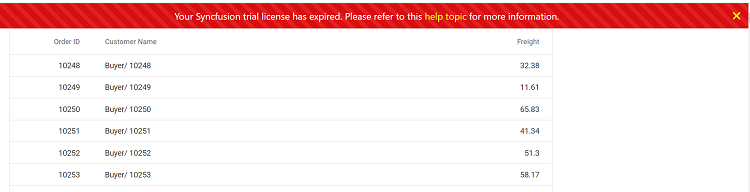
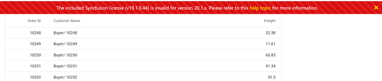

# Syncfusion&reg; Licensing Errors

Licensing error popups appear with various messages under different circumstances. Here are some ways to resolve different issues.

## Licensing Errors

### License Key Not Registered/Trial Expired

The following error message appears if a Syncfusion&reg; license key has not been registered in the application or if the trial key has expired after 30 days.

**Error message:**   This application was built using a trial version of Syncfusion&reg; Essential Studio&reg;. You should include the valid license key to remove the license validation message permanently.

**Solution:**

* If you use ReactJS components through the Syncfusion&reg; installer, choose from the options below:

1. If you **have a valid Syncfusion&reg; license**, you can **generate a license key for a specific version and product** from [this page](https://www.syncfusion.com/account/downloads).

   

2. If you **have a Syncfusion&reg; account and an active trial**, you can **generate the trial license key for a specific version and platform** from [this page](https://www.syncfusion.com/account/manage-trials/downloads).

3. If you **have a Syncfusion&reg; account but no active trials**, [purchase a license](https://www.syncfusion.com/sales/products) or [start your 30-day free trial](https://www.syncfusion.com/account/manage-trials/start-trials). Then you can generate the trial license key for **a specific version and platform** from [this page](https://www.syncfusion.com/account/downloads).

4. If you **do not already have a Syncfusion&reg; account**, you can create one [here](https://www.syncfusion.com/account) and [purchase a license](https://www.syncfusion.com/sales/products) or start your 30-day free trial. Then you can **generate the trial license key for a specific version and platform** from [this page](https://www.syncfusion.com/account/manage-trials/start-trials).

5. You can also generate the license key from the claim license key page by clicking **"Claim your FREE account"** from the licensing warning message. Refer to this [help topic](https://ej2.syncfusion.com/react/documentation/licensing/license-key-generation#claim-license-key) for more details.

* In your application, register the generated license key. Please refer to this [help topic](https://ej2.syncfusion.com/react/documentation/licensing/license-key-registration/) for information on registering the license key.

### Invalid Key

If the application is registered with an invalid key, another version of the license key, or a license key from another platform, the following error message appears when launching the application.

**Error Message:**   The included Syncfusion&reg; license key is invalid.

**Solution:**

* If you use ReactJS components through the Syncfusion&reg; installer, you can choose from the options listed below:

1. If you have a valid Syncfusion&reg; license, you can **generate a license key for a specific version and product** from [this page](https://www.syncfusion.com/account/downloads).

   

2. If you have a Syncfusion&reg; account and an active trial, you can **generate the trial license key for a specific version and product** from [this page](https://www.syncfusion.com/account/manage-trials/downloads).

3. If you **have a Syncfusion&reg; account but no active trials**, [purchase a license](https://www.syncfusion.com/sales/products) or [start your 30-day free trial](https://www.syncfusion.com/account/manage-trials/start-trials). Then you can **generate the trial license key for a specific version and product** from [this page](https://www.syncfusion.com/account/downloads).

4. If you **do not already have a Syncfusion&reg; account**, you can create one [here](https://www.syncfusion.com/account/register) and [purchase a license](https://www.syncfusion.com/sales/products) or [start your 30-day free trial](https://www.syncfusion.com/account/manage-trials/start-trials). Then you can **generate the trial license key for a specific version and product** from [this page](https://www.syncfusion.com/account/manage-trials/downloads).

5. You can also generate the license key from the claim license key page by clicking **"Claim your FREE account"** from the licensing warning message. Refer to this [help topic](https://ej2.syncfusion.com/react/documentation/licensing/license-key-generation#claim-license-key) for more details.

* In your application, register the generated license key. Please refer to this [help topic](https://ej2.syncfusion.com/react/documentation/licensing/license-key-registration/) for information on registering the license key.

## Licensing Errors from Version 16.2.0* to 20.3.0*

### License Key Not Registered

The following error message appears if a Syncfusion&reg; license key has not been registered in your application.

**Error message:**   This application was built using a trial version of Syncfusion&reg; Essential Studio&reg;. Please include a valid license to permanently remove this license validation message. You can also obtain a free 30 day evaluation license to temporarily remove this message during the evaluation period. Please refer to this [help topic](https://ej2.syncfusion.com/react/documentation/licensing/licensing-errors#license-key-not-registered) for more information.

**Solution:**

* If you use ReactJS components through the Syncfusion&reg; installer, you can choose from the options listed below:

1. If you **have a valid Syncfusion&reg; license**, you can **generate a license key for a specific version and product** from [this page](https://www.syncfusion.com/account/downloads).

   

2. If you **have a Syncfusion&reg; account and an active trial**, you can **generate the trial license key for a specific version and platform** from [this page](https://www.syncfusion.com/account/manage-trials/downloads).

3. If you **have a Syncfusion&reg; account but no active trials**, [purchase a license](https://www.syncfusion.com/sales/products) or [start your 30-day free trial](https://www.syncfusion.com/account/manage-trials/start-trials). Then you can generate the trial license key for **a specific version and platform** from [this page](https://www.syncfusion.com/account/downloads).

4. If you **do not already have a Syncfusion&reg; account**, you can create one [here](https://www.syncfusion.com/account/register) and [purchase a license](https://www.syncfusion.com/sales/products) or start your 30-day free trial. Then you can **generate the trial license key for a specific version and platform** from [this page](https://www.syncfusion.com/account/manage-trials/start-trials).

* In your application, register the generated license key. Please refer to this [help topic](https://ej2.syncfusion.com/react/documentation/licensing/license-key-registration/) for information on registering the license key.

### Invalid Key

If the application is registered with an invalid key, another version of license key, or another platform's license key, the following error message appears when launching the application.

**Error message:**   The included Syncfusion&reg; license is invalid. Please refer to this [help topic](https://ej2.syncfusion.com/react/documentation/licensing/licensing-errors/#invalid-key) for more information.

**Solution:**

* If you use ReactJS components through the Syncfusion&reg; installer, you can choose from the options listed below:

1. If you have a valid Syncfusion&reg; license, you can **generate a license key for a specific version and product** from [this page](https://www.syncfusion.com/account/downloads).

   

2. If you have a Syncfusion&reg; account and an active trial, you can **generate the trial license key for a specific version and product** from [this page](https://www.syncfusion.com/account/manage-trials/downloads).

3. If you **have a Syncfusion&reg; account but no active trials**, [purchase a license](https://www.syncfusion.com/sales/products) or [start your 30-day free trial](https://www.syncfusion.com/account/manage-trials/start-trials). Then you can **generate the trial license key for a specific version and product** from [this page](https://www.syncfusion.com/account/downloads).

4. If you **do not already have a Syncfusion&reg; account**, you can create one [here](https://www.syncfusion.com/account/register) and [purchase a license](https://www.syncfusion.com/sales/products) or [start your 30-day free trial](https://www.syncfusion.com/account/manage-trials/start-trials). Then you can **generate the trial license key for a specific version and product** from [this page](https://www.syncfusion.com/account/manage-trials/downloads).

* In your application, register the generated license key. Please refer to this [help topic](https://ej2.syncfusion.com/react/documentation/licensing/license-key-registration/) for information on registering the license key.

### Trial Expired

The following error message appears if the trial key has expired after 30 days.

**Error message:**   Your Syncfusion&reg; trial license has expired. Please refer to this [help topic](https://ej2.syncfusion.com/react/documentation/licensing/licensing-errors/#trial-expired) for more information.

**Solution:**   Purchase from [here](https://www.syncfusion.com/sales/products) to get a valid Syncfusion&reg; license.

### Platform Mismatch

If the application is registered with another platform's license key, the following error message appears when launching the application.

**Error message:**   The included Syncfusion&reg; license is invalid (Platform mismatch). Please refer to this [help topic](https://ej2.syncfusion.com/react/documentation/licensing/licensing-errors/#platform-mismatch) for more information.

**Solution:**

* License keys are version and product specific. If you use ReactJS components through the Syncfusion&reg; installer, you can choose from the options listed below:

1. If you have a valid Syncfusion&reg; license, you can **generate a license key for a specific version and product** from [this page](https://www.syncfusion.com/account/downloads).

   

2. If you have a Syncfusion&reg; account and an active trial, you can **generate the trial license key for a specific version and product** from [this page](https://www.syncfusion.com/account/manage-trials/downloads).

3. If you **have a Syncfusion&reg; account but no active trials**, [purchase a license](https://www.syncfusion.com/sales/products) or [start your 30-day free trial](https://www.syncfusion.com/account/manage-trials/start-trials). Then you can **generate the trial license key for a specific version and product** from [this page](https://www.syncfusion.com/account/downloads).

* In your application, register the generated license key. Please refer to this [help topic](https://ej2.syncfusion.com/react/documentation/licensing/license-key-registration/) for information on registering the license key.

### Version Mismatch

If the application is registered with another version's license key, the following error message appears when launching the application.

**Error message:**   The included Syncfusion&reg; license ({Registered Version}) is invalid for version {Required version}. Please refer to this [help topic](https://ej2.syncfusion.com/react/documentation/licensing/licensing-errors/#version-mismatch) for more information.

**Solution:**

* License keys are version and product specific. If you use ReactJS components through the Syncfusion&reg; installer, you can choose from the options listed below:

1. If you have a valid Syncfusion&reg; license, you can **generate a license key for a specific version and product** from [this page](https://www.syncfusion.com/account/downloads).

   

2. If you have a Syncfusion&reg; account and an active trial, you can **generate the trial license key for a specific version and product** from [this page](https://www.syncfusion.com/account/manage-trials/downloads).

3. If you **have a Syncfusion&reg; account but no active trials**, [purchase a license](https://www.syncfusion.com/sales/products) or [start your 30-day free trial](https://www.syncfusion.com/account/manage-trials/start-trials). Then you can **generate the trial license key for a specific version and product** from [this page](https://www.syncfusion.com/account/downloads).

* In your application, register the generated license key. Please refer to this [help topic](https://ej2.syncfusion.com/react/documentation/licensing/license-key-registration/) for information on registering the license key.

## License Key Validation Errors Using the npx Command

### Invalid Key

If you use the `npx syncfusion-license activate` command with an invalid license key structure, the following console error message appears in the CI or terminal.

**Error message:**   (Error) License key is not valid.

**Solution:**

* If you use ReactJS components through the Syncfusion&reg; installer, you can choose from the options listed below:

1. If you have a valid Syncfusion&reg; license, you can **generate a license key for a specific version and product** from [this page](https://www.syncfusion.com/account/downloads).

   

2. If you have a Syncfusion&reg; account and an active trial, you can **generate the trial license key for a specific version and product** from [this page](https://www.syncfusion.com/account/manage-trials/downloads).

3. If you **have a Syncfusion&reg; account but no active trials**, [purchase a license](https://www.syncfusion.com/sales/products) or [start your 30-day free trial](https://www.syncfusion.com/account/manage-trials/start-trials). Then you can **generate the trial license key for a specific version and product** from [this page](https://www.syncfusion.com/account/downloads).

4. If you **do not already have a Syncfusion&reg; account**, you can create one [here](https://www.syncfusion.com/account/register) and [purchase a license](https://www.syncfusion.com/sales/products) or [start your 30-day free trial](https://www.syncfusion.com/account/manage-trials/start-trials). Then you can **generate the trial license key for a specific version and product** from [this page](https://www.syncfusion.com/account/manage-trials/downloads).

* In your application, register the generated license key using the npx command. Please refer to this [help topic](https://ej2.syncfusion.com/react/documentation/licensing/license-key-registration/#register-syncfusion-license-key-using-the-npx-command) for information on registering the license key.

### Version Mismatch

If the application is activated with a license key from a different version, the following error message appears in the terminal when using the npx command.

**Error message:**   The key entered is for `23.*.*` version, please enter the key for `27.*.*` version.

**Solution:**

* License keys are version, platform, and product specific. If you use ReactJS components through the Syncfusion&reg; installer, you can choose from the options listed below:

1. If you have a valid Syncfusion&reg; license, you can **generate a license key for a specific version and product** from [this page](https://www.syncfusion.com/account/downloads).

   

2. If you have a Syncfusion&reg; account and an active trial, you can **generate the trial license key for a specific version and product** from [this page](https://www.syncfusion.com/account/manage-trials/downloads).

3. If you **have a Syncfusion&reg; account but no active trials**, [purchase a license](https://www.syncfusion.com/sales/products) or [start your 30-day free trial](https://www.syncfusion.com/account/manage-trials/start-trials). Then you can **generate the trial license key for a specific version and product** from [this page](https://www.syncfusion.com/account/downloads).

* In your application, register the generated license key. Please refer to this [help topic](https://ej2.syncfusion.com/react/documentation/licensing/license-key-registration/#register-syncfusion-license-key-using-the-npx-command) for information on registering the license key.

### Platform Mismatch

If the application is activated with a license key for a different platform, the following error message appears in the terminal when using the npx command.

**Error message:**   (Error) License key is not valid.

**Solution:**

* License keys are version, platform, and product specific. If you use ReactJS components through the Syncfusion&reg; installer, you can choose from the options listed below:

1. If you have a valid Syncfusion&reg; license, you can **generate a license key for a specific version and platform** from [this page](https://www.syncfusion.com/account/downloads).

   

2. If you have a Syncfusion&reg; account and an active trial, you can **generate the trial license key for a specific version and platform** from [this page](https://www.syncfusion.com/account/manage-trials/downloads).

3. If you **have a Syncfusion&reg; account but no active trials**, [purchase a license](https://www.syncfusion.com/sales/products) or [start your 30-day free trial](https://www.syncfusion.com/account/manage-trials/start-trials). Then you can **generate the trial license key for a specific version and platform** from [this page](https://www.syncfusion.com/account/downloads).

* In your application, register the generated license key. Please refer to this [help topic](https://ej2.syncfusion.com/react/documentation/licensing/license-key-registration/#register-syncfusion-license-key-using-the-npx-command) for information on registering the license key.

### Trial Expired

If the trial key has expired after 30 days, the following error message appears in the terminal when using the npx command.

**Error message:**   The included Syncfusion&reg; license key has expired.

**Solution:**   Purchase from [here](https://www.syncfusion.com/sales/products) to get a valid Syncfusion&reg; license.