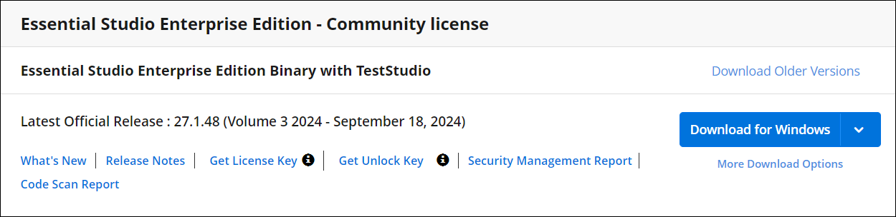

# Licensing Troubleshoot in React

## Is an internet connection required for license validation

No, an internet connection is not required for Syncfusion&reg; Essential Studio&reg; license validation. License validation is performed offline during application execution. Apps registered with a Syncfusion&reg; license key can be deployed on any system without an internet connection.

## Upgrade from the trial version after purchasing a license

To upgrade from the trial version, there are two possible solutions:

* Uninstall the trial version and install the fully licensed build from the [License & Downloads](https://www.syncfusion.com/account/downloads) section of the Syncfusion&reg; website.

* If you are using Syncfusion&reg; controls from [npm](https://www.npmjs.com/search?q=scope:syncfusion), replace the currently used trial license key with a paid license key that can be generated from the [License & Downloads](https://www.syncfusion.com/account/downloads) section of the Syncfusion&reg; website. Refer to [this topic](https://help.syncfusion.com/common/essential-studio/licensing/license-key#how-to-register-the-syncfusion-license-key) for more information regarding registering the license in the application.

> License registration is not required if you reference Syncfusion&reg; scripts from the Licensed installer. These licensing changes apply to all evaluators who refer to Syncfusion&reg; scripts from the evaluation installer and those who use the npm packages from [npm](https://www.npmjs.com/~syncfusionorg).

## Where can I get a License key

License keys can be generated from the [License & Downloads](https://syncfusion.com/account/downloads) or [Trial & Downloads](https://www.syncfusion.com/account/manage-trials/downloads) section of the Syncfusion&reg; website.

Syncfusion&reg; license keys are **version and platform-specific**. Refer to this [KB article](https://www.syncfusion.com/kb/8976/how-to-generate-license-key-for-licensed-products) to generate the license key for the required version and platform. Also, refer to this [KB article](https://www.syncfusion.com/kb/8951/which-version-syncfusion-license-key-should-i-use-in-my-application) to know which version of the Syncfusion&reg; license key should be used in the application.

> While using ASP.NET Core controls with JavaScript (ES5) components, you need to register the license key in both JavaScript (ES5) and [ASP.NET Core](https://ej2.syncfusion.com/aspnetcore/documentation/licensing/license-key-registration). This is because the license is validated on the client side for JavaScript (ES5) components and on the server side for ASP.NET Core components.

## Will the registered license key expire

No, Syncfusion&reg; license keys do not expire for a particular version, and you can continue to use them. Therefore, you won't encounter any problems on the live site. If you have used the trial key, it will expire in 30 days, and using it in production is not recommended.

> If you upgrade to newer versions of the Syncfusion&reg; packages, you must generate new license keys and use them.

## When to generate new license key while upgrading

You don't need to generate and change license keys for minor version upgrades. However, when upgrading from one major version to another major version, you must generate a new license key and update it in your application.

For example:
* If you are using a version like `25.1.X`, it is important to use the same version for all Syncfusion&reg; components in your application. The license key generated for version `25.X.XX` can be used across all minor versions within that major version, `v25`. This means you can upgrade all packages to `25.2.X` while still using the same license key.

* However, if you upgrade from one major version to another—such as from `25.1.X` to `26.1.X`—you will need to generate a new license key for the latest version and update it in your application.

> The above-mentioned guidelines are not applicable to packages on version `20.X.XX`, where `20.1` denotes one major version and `20.2` another major version. However, starting with release version 21, the pattern has been adjusted. So if you are using `20.1.X` and upgrade to `20.2.X`, you must generate new license keys for `20.2.X` and update them in the application. Therefore, these guidelines apply to versions `21` and later.

## License registration for multiple developers on your project

Syncfusion&reg; license keys are version-based and not developer-based. You don't need to register different keys for each developer. Just register one valid license key when developing and publishing the software.

## Can I use the same key for all the web apps under the project

Yes, you can use the same license key for all web apps.

## Does the license registration access any resources or data

No, the license registration does not access any data or resources.

## License & Downloads page shows "Essential Studio&reg; Enterprise Edition Binary with Test Studio" and "Project License". Which license to use

Use any licenses shown on the [License & Downloads](https://www.syncfusion.com/account/downloads) page. It shows two licenses because if you are part of your company's enterprise portal Global license and an individual license is also assigned to your account, both the individual license and your enterprise portal Global license are displayed.

 

Refer to this [KB article](https://www.syncfusion.com/kb/11532/definition-of-terms-for-syncfusion-licenses) which explains the licenses offered by Syncfusion&reg;.

## If I registered the license key in both the application and the license text file

The application-registered license key takes priority and is used for license validation.

## Reactivating license once after updating the package version while using npx

It is necessary to reactivate the license key when upgrading Syncfusion&reg; packages if the license has been registered through the `npx` command.

## Potential causes of licensing errors in applications

Below are the possible reasons that could lead to a license error within the application:

* The application may have a license issue due to duplicate Syncfusion&reg; packages.

* An invalid license issue may occur because Syncfusion&reg; packages are referenced with multiple versions.

* Registering a license key of a different version than the referenced Syncfusion&reg; package version in the application can also cause licensing errors.

* Inclusion of [non-React packages](#license-issue-due-to-including-non-react-packages-in-the-dependencies) in the dependencies may lead to licensing errors due to the presence of duplicate instances of packages.

### License issue due to duplicate Syncfusion&reg; packages in the application

One possible cause of license issues in your application is duplicate packages that exist after upgrading packages to the next or latest version. To remove duplicate packages, follow these steps:

* Delete the `@syncfusion` folder from `node_modules` and the [`package-lock.json`](https://docs.npmjs.com/cli/v6/commands/npm-dedupe) file from the application root folder.

* Clear the npm `.cache` by running the command `npm cache clean --force`, or you can directly delete the cache folder in the application.

* It is recommended to update all Syncfusion&reg; components in the package.json file to the **same major version**. This ensures consistency and compatibility across the project. For instance, if the updated version being utilized is `v20.4.XX`, it is advised to upgrade all components to the same version.

* Run `npm install` command.

> If you are using React with Next.js, ensure to remove the `.cache` folder created inside the `.next` folder.

### Invalid license issue because of Syncfusion&reg; packages referenced with multiple versions

It is important to ensure that all components used in a project are compatible and work seamlessly together. One common issue that arises is **version mismatch**. Version mismatch occurs when different components have different major versions, leading to compatibility issues and difficulties in license registration.

For example, if one component in the project has a version of `v20.1.XX` while another component has a version of `v20.2.XX`, a version mismatch occurs, leading to license errors. To avoid version mismatch and ensure smooth functioning of the project, it is crucial to use the **same major version** for all Syncfusion&reg; components. This will ensure compatibility and prevent any licensing issues that may arise due to version incompatibility.

### Registering the license key of a different version than the referenced Syncfusion&reg; package version in the application

When developing an application with Syncfusion&reg; packages, it is important to register the appropriate license key that matches the version of the package installed. Failure to do so may result in license errors within the application.

For instance, if you are using a component version labeled as `(v20.4.XX)`, it is essential to register the license key generated **specifically** for that version. This ensures smooth functioning of the controls and provides access to all features and functionality without encountering any license validation errors.

### License issue due to including non-React packages in the dependencies

When integrating Syncfusion&reg; with your React project, it is essential to include only React component packages in the dependencies, as shown in the image below.

Avoid including TypeScript packages separately.

These are sub-dependencies of React component packages and are automatically installed along with them. Including them separately may sometimes result in duplicate instances of packages, which can lead to issues with license validation. Therefore, to ensure proper license validation and avoid conflicts, include only React component packages in your project dependencies.