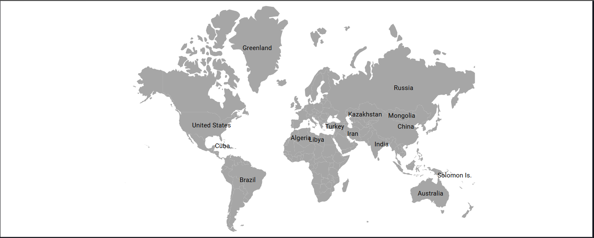

---
layout: post
title: Getting started with React Maps component | Syncfusion
description: Check out and learn about Getting started with React Maps component of Syncfusion Essential JS 2 and more details.
control: Getting started 
platform: ej2-react
documentation: ug
domainurl: ##DomainURL##
---

# Getting Started with React Map component

This section explains the steps required to create a basic map component.

You can explore some useful features in the Maps component using the following video.



## Prerequisites

Before getting started, ensure that your development environment meets the [system requirements for Syncfusion® React UI components](https://ej2.syncfusion.com/react/documentation/system-requirement)

## Before You Begin

This guide uses the React application structure generated by Vite with the TypeScript template.

The main files used in this guide are:

* `src/App.tsx` — Defines the root React component.
* `src/main.tsx` — Application entry point.
* `index.html` — Root HTML file.

> **Note:** In a Vite React TypeScript application, the root component is commonly generated as `src/App.tsx`. If your application uses JavaScript, the equivalent file is typically `src/App.jsx`.

> **Note:** This guide uses the TypeScript template for better type checking with Accumulation Chart models.

## Installation and configuration

> **Note:** As an alternative, you can create a React application using [`create-react-app`](https://github.com/facebook/create-react-app) For detailed instructions, refer to this [documentation](https://ej2.syncfusion.com/react/documentation/getting-started/create-app).

### Step 1: Set up the React environment

Use [Vite](https://vitejs.dev/) to create and manage React applications. Vite provides a fast development environment and optimized builds for modern React applications. Syncfusion® React documentation also recommends Vite for setting up React applications.

Start by opening a terminal on your system **(Command Prompt, PowerShell, or Terminal)**. You may work from the default C: drive location or create a new folder and open the terminal in it.

### Step 2: Create a React application

Create a new React application using the below command.

```bash
npm create vite@latest my-maps-app -- --template react-ts
```

If Vite prompts you to install dependencies and start the project immediately, choose **No**. The Syncfusion package is installed in a later step.

Navigate to the project folder:

```bash
cd my-maps-app
```

Install the application dependencies:

```bash
npm install
```

> **Note:** If you prefer JavaScript instead of TypeScript, create the application using `npm create vite@latest my-maps-app -- --template react`.

### Step 3: Install the Syncfusion® React Map package

All Syncfusion Essential® JS 2 packages are available in the [npmjs.com](https://www.npmjs.com/~syncfusionorg) registry.

Install the React Chart package using the following command:

```bash
npm install @syncfusion/ej2-react-maps --save
```

> Installing `@syncfusion/ej2-react-maps` automatically installs the required dependency packages. The –save will instruct NPM to include the Chart package inside of the **dependencies** section of the package.json.

The steps up to this point can be completed using the initially opened terminal or command prompt. For adding Map components, open the project in the IDE installed on your device.


### Step 4: Add Map to the project

Add the Map component to `src/App.tsx` using the following code.

> **Note:** Before running this code, download the `world_map.ts` file from the link provided below and place it in your project's src folder. Refer to the world_map GeoJSON data at Syncfusion [Downloads](https://www.syncfusion.com/downloads/support/directtrac/general/ze/world-map-2091224620). This data must be imported into `src\App.tsx`.

```ts
import { world_map } from './world_map.ts';
import { MapsComponent, LayersDirective, LayerDirective } from '@syncfusion/ej2-react-maps';

function App() {
    return (
        <div className="App">
            <MapsComponent id="maps">
                <LayersDirective>
                    <LayerDirective shapeData={world_map}>
                    </LayerDirective>
                </LayersDirective>
            </MapsComponent>
        </div>
    );
}

export default App;
```
**Note:** At this stage, only the basic map is rendered, without any additional features applied.

### Step 5: Module Injection

The Maps component is divided into feature-specific modules. To use a feature, inject its module with the `Inject` method. You only need to inject the modules for features you are actually using in your application. In this guide, the Data Label module is injected and used.

* DataLabel - Inject this provider to use data label feature.

For example, to use the tooltip, data label, and legend features, import the corresponding modules and inject them into the Maps component using the `Inject` component.

```ts
import { MapsComponent, Inject, DataLabel, LayerDirective, LayersDirective } from '@syncfusion/ej2-react-maps';
import { world_map } from './world_map.ts';

export function App() {
  return (<MapsComponent >
    <Inject services={[DataLabel]} />
    <LayersDirective>
      <LayerDirective shapeData={world_map} dataLabelSettings={{ visible: true, labelPath: 'name', smartLabelMode: 'Hide' }}>
      </LayerDirective>
    </LayersDirective>
  </MapsComponent>
  );
}

export default App;
```

### Step 6: Run the application

Run the application using the following command:

```bash
npm run dev
```
Open the generated local URL (for example, `localhost:5173/`) from terminal in the browser. The application displays the basic map as shown below:



> **Note:** You can refer to our [React Maps Library](https://www.syncfusion.com/react-components/react-maps-library) feature tour page for its groundbreaking feature representations. You can also explore our [React Maps Library example](https://ej2.syncfusion.com/react/demos/#/bootstrap5/maps/default) that shows you how to configure the Maps Library in React.
