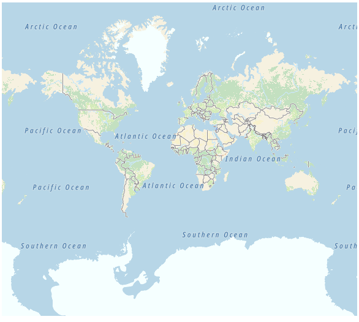
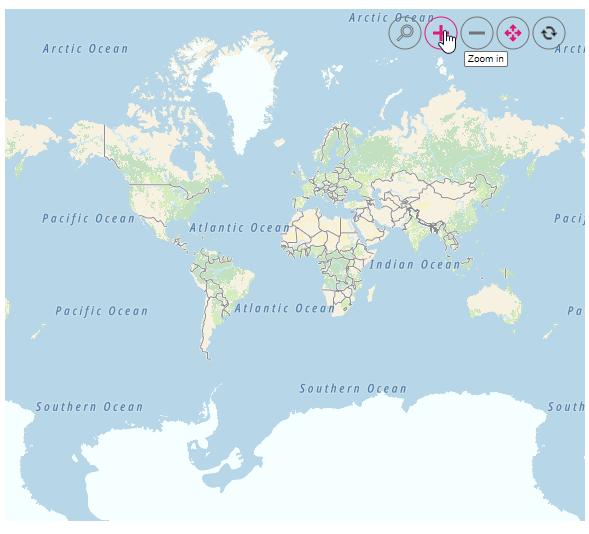
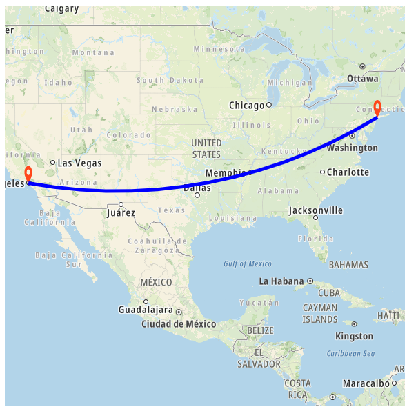

# Other maps in React Maps component

In addition to OpenStreetMap, Bing Maps, and Azure Maps, the Maps component supports integration with other third-party online map service providers. Custom map providers can be rendered by specifying their tile server URL in the [urlTemplate](https://ej2.syncfusion.com/react/documentation/api/maps/layerSettingsModel#urltemplate) property. The Maps component supports any tile-based map provider that uses standard URL template formats for tile requests.

## URL template format

The Maps component uses a standardized URL template format for requesting map tiles. Any map service provider using the following tile URL structure is compatible with the component:

<!-- markdownlint-disable MD034 -->

Sample Template: https://< domain_name >/maps/basic/{z}/{x}/{y}.png

* **{z}** - Represents the zoom level (automatically replaced by the control)
* **{x}** - Represents the tile X coordinate (automatically replaced by the control)
* **{y}** - Represents the tile Y coordinate (automatically replaced by the control)

The Maps component automatically substitutes these placeholders with the appropriate values based on the current map view, zoom level, and visible tile range. Authentication keys or API tokens required by the map provider can be appended to the URL as query parameters.

## Prerequisites

Before integrating a third-party map provider, the following prerequisites should be met:

* **Provider account** - An active account with the chosen map service provider
* **API key or token** - Valid authentication credentials for accessing the tile service
* **Service terms** - Understanding of the provider's usage terms, rate limits, and attribution requirements

## Adding TomTom Maps

The following example demonstrates how to integrate TomTom Maps. To obtain a TomTom API key, visit the [TomTom Developer Portal](https://developer.tomtom.com/map-display-api/documentation/product-information/introduction), create an account, and generate an API key. Replace `subscription_key` in the URL template with the actual API key.

```ts

import * as React from "react";
import * as ReactDOM from "react-dom";
import { MapsComponent, LayersDirective, LayerDirective } from '@syncfusion/ej2-react-maps';


export function App() {
return(
            <MapsComponent>
                <LayersDirective>
                    <LayerDirective urlTemplate= "http://api.tomtom.com/map/1/tile/basic/main/level/tileX/tileY.png?key=subscription_key" />
                </LayersDirective>
            </MapsComponent>
);
}
const root = ReactDOM.createRoot(document.getElementById('container'));
root.render(<App />);
```



## Enabling zooming and panning

Tile-based map layers support zooming and panning interactions for enhanced map exploration. Zooming provides a closer view of specific areas for detailed analysis, while panning allows navigation across different regions of the map. These features can be enabled using the [zoomSettings](https://ej2.syncfusion.com/react/documentation/api/maps/zoomSettingsModel) property with toolbar controls for user interaction.


```ts

import * as React from "react";
import * as ReactDOM from "react-dom";
import { MapsComponent, LayersDirective, LayerDirective, Zoom, Maps, Inject } from '@syncfusion/ej2-react-maps';

export function App() {
return(
            <MapsComponent zoomSettings = { { enable: true, toolbarSettings:{
                                            buttonSettings: {
                                            toolbarItems: ['Zoom', 'ZoomIn', 'ZoomOut', 'Pan', 'Reset']
                                        }}} }>
            <Inject services={[Zoom]}/>
                <LayersDirective>
                    <LayerDirective urlTemplate= "http://api.tomtom.com/map/1/tile/basic/main/level/tileX/tileY.png?key=subscription_key" />
                </LayersDirective>
            </MapsComponent>
);
}
const root = ReactDOM.createRoot(document.getElementById('container'));
root.render(<App />);

```
 



## Adding markers and navigation line

Markers can be added to tile-based map layers to highlight specific locations by setting the latitude and longitude coordinates using [MarkerDirective](https://ej2.syncfusion.com/react/documentation/api/maps/layerSettingsModel#markersettings) property. Navigation lines can be drawn on top of the tile layer to visualize routes or connections between locations by configuring the [NavigationLineDirective](https://ej2.syncfusion.com/react/documentation/api/maps/layerSettingsModel#navigationlinesettings) with corresponding latitude and longitude coordinates.


```ts

import * as React from "react";
import * as ReactDOM from "react-dom";
import { MapsComponent, LayersDirective, LayerDirective, Zoom, MarkersDirective, NavigationLine, NavigationLinesDirective, NavigationLineDirective, MarkerDirective, Marker, Maps, Inject } from '@syncfusion/ej2-react-maps';

export function App() {
return(
            <MapsComponent zoomSettings= {{ zoomFactor: 4}}
                                     centerPosition = {{
                                         latitude: 29.394708,
                                         longitude: -94.954653
                                     }}>
            <Inject services={[Zoom, NavigationLine, Marker]} />
                <LayersDirective>
                    <LayerDirective urlTemplate= "http://api.tomtom.com/map/1/tile/basic/main/level/tileX/tileY.png?key=subscription_key">
                        <MarkersDirective>
                        <MarkerDirective visible={true}
                                            height={25}
                                            width={15}
                                            dataSource={[
                                                {
                                                    latitude: 34.060620,
                                                    longitude: -118.330491,
                                                    name: "California"
                                                },
                                                {
                                                    latitude: 40.724546,
                                                    longitude: -73.850344,
                                                    name: "New York"
                                                }
                                            ]}
                                        >
                            </MarkerDirective>
                            </MarkersDirective>
                            <NavigationLinesDirective>
                            <NavigationLineDirective visible={true}
                                                     latitude={[34.060620, 40.724546]}
                                                     longitude={[-118.330491,-73.850344]}
                                                     color="blue"
                                                     angle={90}
                                                     width={5} />
                        </NavigationLinesDirective>
                    </LayerDirective>
                </LayersDirective>
            </MapsComponent>
);
}
const root = ReactDOM.createRoot(document.getElementById('container'));
root.render(<App />);

```
 



## Adding sublayer

GeoJSON shapes can be rendered as a sublayer on top of the tile-based map layer to highlight specific regions such as continents, countries, or custom geographic areas. This is accomplished by adding an additional layer and setting the [type](https://ej2.syncfusion.com/react/documentation/api/maps/layerSettingsModel#type) property to **SubLayer**. The sublayer overlays the base map tiles while maintaining interactivity with the underlying map.


```ts

import { africa_continent } from 'africa-continent.ts';
import * as React from "react";
import * as ReactDOM from "react-dom";
import { MapsComponent, LayersDirective, LayerDirective } from '@syncfusion/ej2-react-maps';

export function App() {
return(
            <MapsComponent>
                <LayersDirective>
                    <LayerDirective urlTemplate= "http://api.tomtom.com/map/1/tile/basic/main/level/tileX/tileY.png?key=subscription_key" />
                    <LayerDirective shapeData= {africa_continent}
                                    type= 'SubLayer'
                                    shapeSettings = {{
                                        fill: 'blue'
                                    }}>
                    </LayerDirective>
                </LayersDirective>
            </MapsComponent>
);
}
const root = ReactDOM.createRoot(document.getElementById('container'));
root.render(<App />);
```
 


## Enabling legend

A legend can be displayed with tile-based maps to provide visual context for markers, shapes, or data classifications. The legend is enabled by setting the [visible](https://ej2.syncfusion.com/react/documentation/api/maps/legendSettingsModel#visible) property of [legendSettings](https://ej2.syncfusion.com/react/documentation/api/maps/legendSettingsModel) to **true**. The legend can be configured to display marker shapes, custom icons, and interactive toggle functionality for controlling layer visibility.



```ts

import { markerDataSource } from 'markerdata.ts';
import * as React from "react";
import * as ReactDOM from "react-dom";
import { MapsComponent, LayersDirective, LayerDirective, MarkersDirective, MarkerDirective, Marker, Legend, Inject } from '@syncfusion/ej2-react-maps';

export function App() {
return(
            <MapsComponent
              legendSettings={{
                visible: true,
                type: 'Markers',
                useMarkerShape: true,
                toggleLegendSettings: {
                  enable: true,
                  applyShapeSettings: false,
                  border: {
                    color: 'green',
                    width: 2,
                  }
                }
              }}
            >
              <Inject services={[Marker, Legend]} />
              <LayersDirective>
                <LayerDirective urlTemplate="http://api.tomtom.com/map/1/tile/basic/main/level/tileX/tileY.png?key=subscription_key">
                  <MarkersDirective>
                    <MarkerDirective
                      visible={true}
                      dataSource={markerDataSource}
                      colorValuePath="color"
                      shapeValuePath="shape"
                      legendText="country"
                    ></MarkerDirective>
                  </MarkersDirective>
                </LayerDirective>
              </LayersDirective>
            </MapsComponent>
);
}
const root = ReactDOM.createRoot(document.getElementById('container'));
root.render(<App />);

```
 


