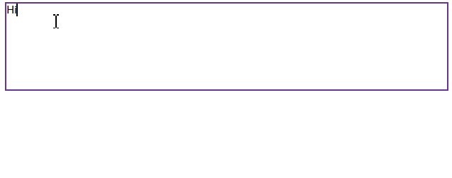

# Customization in React Mention component

## Show or hide mention character

By default, the `showMentionChar` which does not display the text content with the mentioned character is disabled. If the property [showMentionChar](https://ej2.syncfusion.com/react/documentation/api/mention/#showmentionchar) is enabled, it allows the respective [mentionChar](https://ej2.syncfusion.com/react/documentation/api/mention/#mentionchar) configured along with the text content opted from the suggested list to display.

`[Class-component]`










 

`[Functional-component]`










 

## Adding the suffix character after selection

The Mention has provided support to specify the custom suffix to append alongside the mentioned selected item while inserting. You can append space or new line character as [suffixText](https://ej2.syncfusion.com/react/documentation/api/mention/#suffixtext).

`[Class-component]`










 

`[Functional-component]`










 

## Configure the popup list

You can customize the suggestion list width and height using the [popupHeight](https://ej2.syncfusion.com/react/documentation/api/mention/#popupheight) and [popupWidth](https://ej2.syncfusion.com/react/documentation/api/mention/#popupwidth) properties.

By default, the popup list width value is set as `auto`. Depending on the mentioned suggestion data list, the width value is automatically adjusted. The popup list height value is set as `300px`.

`[Class-component]`










 

`[Functional-component]`










 

## Trigger character

You can customize the trigger character by using the [mentionChar](https://help.syncfusion.com/cr/aspnetmvc-js2/Syncfusion.EJ2.DropDowns.Mention.html#Syncfusion_EJ2_DropDowns_Mention_MentionChar) property in the Mention component. The trigger character triggers the suggestion list to display in the target area.

By default, the [mentionChar](https://help.syncfusion.com/cr/aspnetmvc-js2/Syncfusion.EJ2.DropDowns.Mention.html#Syncfusion_EJ2_DropDowns_Mention_MentionChar) is `@`.

## Leading Space Requirement

The [requireLeadingSpace](https://ej2.syncfusion.com/react/documentation/api/mention/#requireleadingspace) property in Mention controls whether a space is needed before triggering the Mention suggestion popup. 

When set to `false`, the mention can be activated without a preceding space. When set to `true`, a space is required before the mention character to activate suggestions.

`[Class-component]`










 

`[Functional-component]`










 

