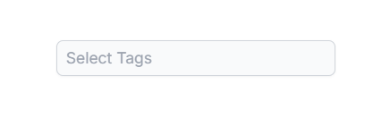

# Disabled Items in React MultiSelect component

The MultiSelect supports enabling or disabling individual items as needed. Map the [disabled](https://ej2.syncfusion.com/react/documentation/api/multi-select/#fields) field from your data source to control item availability. Disabled items cannot be selected. Configure the disabled state mapping using the `fields.disabled` property.

The following example demonstrates disabling specific states using the `disabled` field.

`[Class-component]`










 

`[Functional-component]`










 

## Disable Item Method

Use the [disableItem](https://ej2.syncfusion.com/react/documentation/api/multi-select/#disableItem) method to dynamically disable individual items. To disable multiple items, iterate this method through your items list or array. The disabled state updates in the [dataSource](https://ej2.syncfusion.com/react/documentation/api/multi-select/#datasource) when items are disabled. If a selected item is disabled, its selection is automatically cleared.

| Parameter | Type | Description |
|------|------|------|
| itemHTMLLIElement |  <code>HTMLLIElement</code> |  It accepts the HTML Li element of the item to be removed.  |
| itemValue | <code>string</code> \| <code>number</code> \| <code>boolean</code> \| <code>object</code> | It accepts the string, number, boolean and object type value of the item to be removed. |
| itemIndex | <code>number</code> | It accepts the index of the item to be removed. |

## Disable the Component

To disable the entire component, set the [enabled](https://ej2.syncfusion.com/react/documentation/api/multi-select/#enabled) property to **false**.

