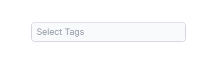

# Disabled Items in React MultiSelect Dropdown

You can disable items in the MultiSelect at three levels: by mapping a `disabled` field in your data source, by calling the `disableItem` method at runtime, or by disabling the entire component. The sections below describe each approach.

## Disable individual items via data binding

You can enable or disable individual items in the MultiSelect. Map the [`fields.disabled`](https://ej2.syncfusion.com/react/documentation/api/multi-select/index-default#fields) sub-field from your data source to control item availability; disabled items cannot be selected. The `fields.disabled` property works alongside [`fields.text`](https://ej2.syncfusion.com/react/documentation/api/multi-select/index-default#fields) and [`fields.value`](https://ej2.syncfusion.com/react/documentation/api/multi-select/index-default#fields) to define each list item.

Configure the disabled state by setting the `disabled` sub-field of the `fields` property. Disabled items cannot be selected.

The following example demonstrates disabling specific items using the `disabled` field.

`[Class-component]`










 

`[Functional-component]`










 

## Disable Item Method

Use the [`disableItem`](https://ej2.syncfusion.com/react/documentation/api/multi-select/index-default#disableitem) method to dynamically disable individual items. Call `disableItem` for each item you want to disable, looping through your data array. The disabled state updates in the [dataSource](https://ej2.syncfusion.com/react/documentation/api/multi-select/index-default#datasource) when items are disabled. If a selected item is disabled, its selection is automatically cleared.

| Parameter | Type | Description |
|------|------|------|
| itemHTMLLiElement | <code>HTMLLIElement</code> | It accepts the HTML LI element of the item to be disabled. |
| itemValue | <code>string</code> \| <code>number</code> \| <code>boolean</code> \| <code>object</code> | It accepts the string, number, boolean and object type value of the item to be disabled. |
| itemIndex | <code>number</code> | It accepts the index of the item to be disabled. |

## Disable the Component

To disable the entire component, set the [`enabled`](https://ej2.syncfusion.com/react/documentation/api/multi-select/index-default#enabled) property to `false`.

> Disabling the entire component also disables keyboard interaction and applies the appropriate ARIA `aria-disabled` state, so the component is no longer focusable or operable by assistive technologies.

