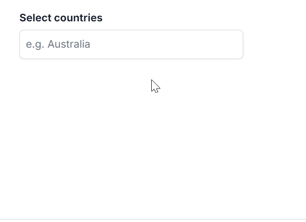

# Resizing in React MultiSelect component

Enable popup resizing in the MultiSelect component using the [AllowResize](https://ej2.syncfusion.com/react/documentation/api/multi-select/#allowresize) property. When enabled, users can dynamically adjust the popup size to improve visibility. Resized dimensions persist across sessions, providing a consistent user experience.

`[Class-component]`










`[Functional-component]`










