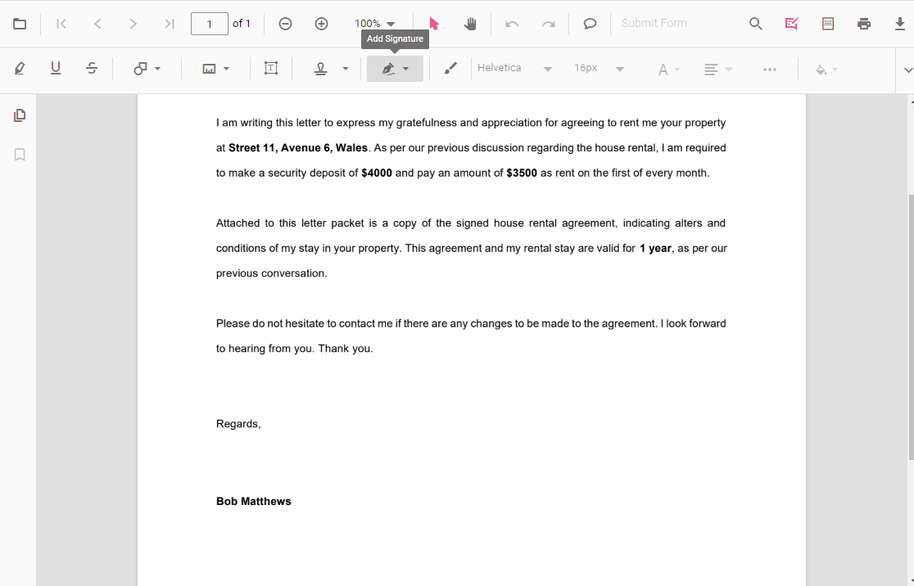
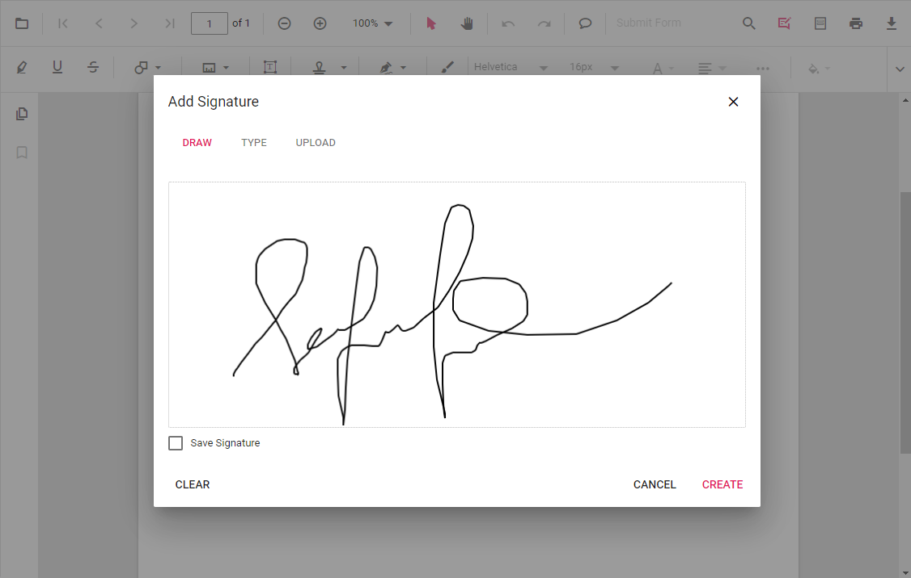
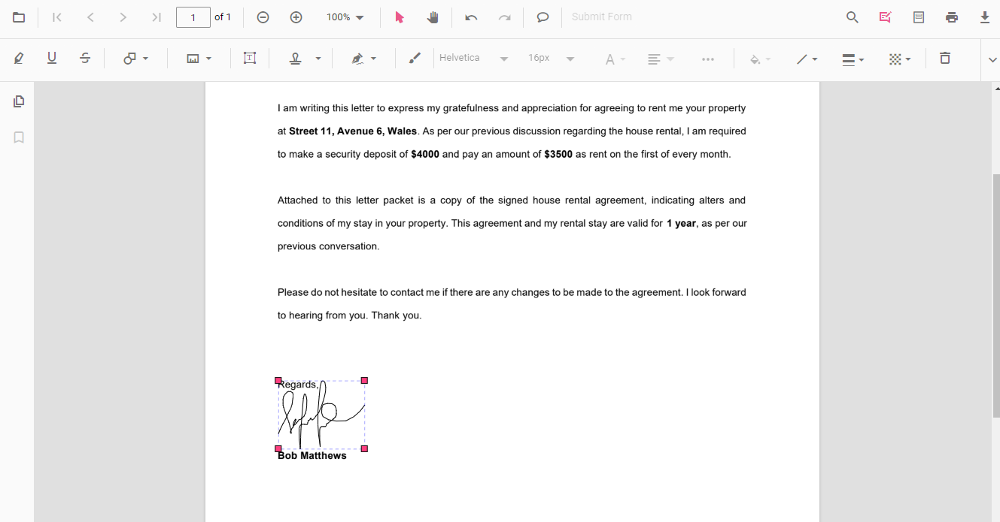
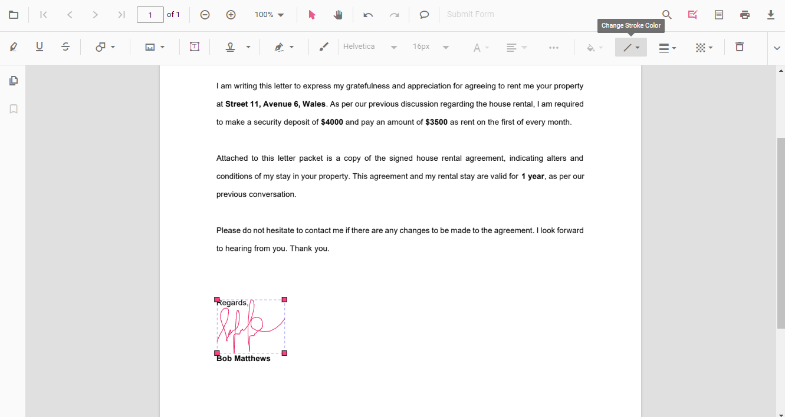
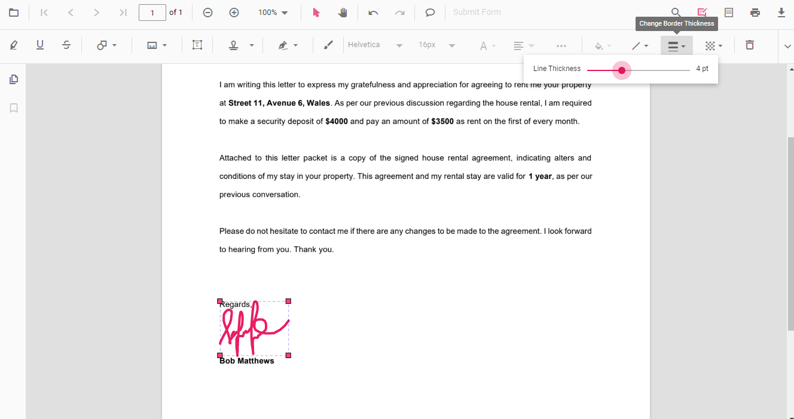
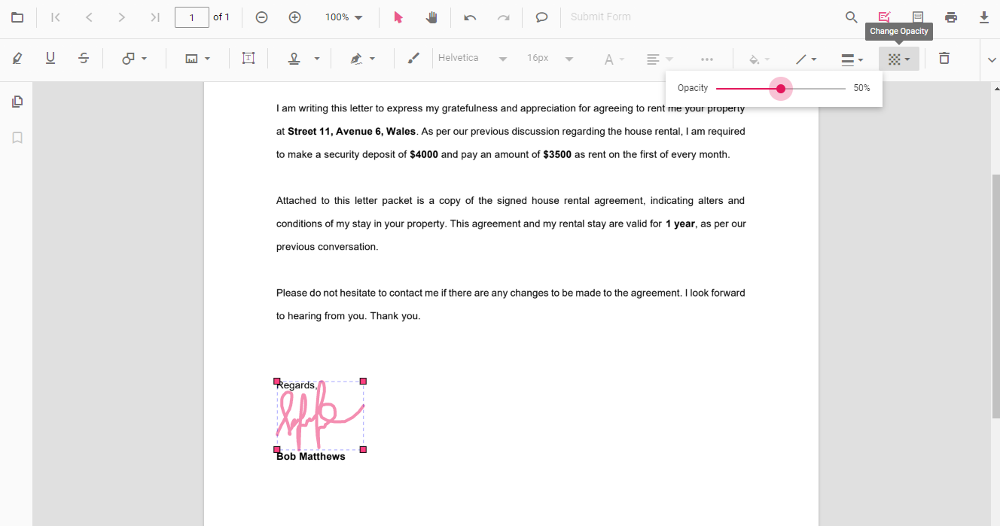

# Handwritten signature in React PDF Viewer component

The PDF Viewer control supports adding handwritten signatures to a PDF document. The handwritten signature reduces the paper work of reviewing the content and verifies it digitally.

## Adding a handwritten signature to the PDF document

The handwritten signature can be added to the PDF document using the annotation toolbar.

* Click the **Edit Annotation** button in the PDF Viewer toolbar. A toolbar appears below it.
* Select the **HandWritten Signature** button in the annotation toolbar. The signature panel will appear.

* Draw the signature in the signature panel.

* Then click **Create** button and move the signature using the mouse and place them in the desired location.

Refer to the following code sample to switch to the handwritten signature mode programmatically.



 

import * as ReactDOM from 'react-dom';
import * as React from 'react';
import './index.css';
import { PdfViewerComponent, Toolbar, Magnification, Navigation, LinkAnnotation, BookmarkView, ThumbnailView, 
         Print, TextSelection, Annotation, TextSearch, FormFields, FormDesigner, Inject } from '@syncfusion/ej2-react-pdfviewer';

function App() {
  function handWrittenSignature() {
    var viewer = document.getElementById('container').ej2_instances[0];
    viewer.annotation.setAnnotationMode('HandWrittenSignature');
  }
  return (

    <button onClick={handWrittenSignature}>HandWritten Signature mode</button>
    

      <PdfViewerComponent
        id="container" 
        documentPath="https://cdn.syncfusion.com/content/pdf/pdf-succinctly.pdf"
        style={{ 'height': '640px' }}>

              <Inject services={[ Toolbar, Annotation, Magnification, Navigation, LinkAnnotation, BookmarkView, 
                                  ThumbnailView, Print, TextSelection, TextSearch, FormDesigner, FormFields ]}/>
      </PdfViewerComponent>
    

  
);
}
const root = ReactDOM.createRoot(document.getElementById('sample'));
root.render(<App />);




 

import * as ReactDOM from 'react-dom';
import * as React from 'react';
import './index.css';
import { PdfViewerComponent, Toolbar, Magnification, Navigation, LinkAnnotation, BookmarkView, ThumbnailView, 
         Print, TextSelection, Annotation, TextSearch, FormFields, FormDesigner, Inject } from '@syncfusion/ej2-react-pdfviewer';

function App() {
  function handWrittenSignature() {
    var viewer = document.getElementById('container').ej2_instances[0];
    viewer.annotation.setAnnotationMode('HandWrittenSignature');
  }
  return (

    <button onClick={handWrittenSignature}>HandWritten Signature mode</button>
    

      <PdfViewerComponent
        id="container" 
        documentPath="https://cdn.syncfusion.com/content/pdf/pdf-succinctly.pdf"
        serviceUrl="https://services.syncfusion.com/react/production/api/pdfviewer"
        style={{ 'height': '640px' }}>

              <Inject services={[ Toolbar, Annotation, Magnification, Navigation, LinkAnnotation, BookmarkView, 
                                  ThumbnailView, Print, TextSelection, TextSearch, FormDesigner, FormFields ]}/>
      </PdfViewerComponent>
    

  
);
}
const root = ReactDOM.createRoot(document.getElementById('sample'));
root.render(<App />);





## How to enable the handwritten signature

The following code snippet describes how to enable the handwritten signature in PDF Viewer. When the value is set to `false` it disables the handwritten signature.



 

import * as ReactDOM from 'react-dom';
import * as React from 'react';
import './index.css';
import { PdfViewerComponent, Toolbar, Magnification, Navigation, LinkAnnotation, BookmarkView, ThumbnailView, 
         Print, TextSelection, Annotation, TextSearch, FormFields, FormDesigner, Inject } from '@syncfusion/ej2-react-pdfviewer';

function App() {
  return (

    

      {/* Render the PDF Viewer */}
      <PdfViewerComponent
        id="container"
        documentPath="https://cdn.syncfusion.com/content/pdf/pdf-succinctly.pdf"
        // Enable or disable handwritten signature.
        enableHandwrittenSignature = {true}
        style={{ 'height': '640px' }}>

        <Inject services={[Toolbar, Magnification, Navigation, Annotation, LinkAnnotation, BookmarkView, ThumbnailView,
                  Print, TextSelection, TextSearch, FormFields, FormDesigner]} /> 
      </PdfViewerComponent>
    

  
);
}
const root = ReactDOM.createRoot(document.getElementById('sample'));
root.render(<App />);




 

import * as ReactDOM from 'react-dom';
import * as React from 'react';
import './index.css';
import { PdfViewerComponent, Toolbar, Magnification, Navigation, LinkAnnotation, BookmarkView, ThumbnailView, 
         Print, TextSelection, Annotation, TextSearch, FormFields, FormDesigner, Inject } from '@syncfusion/ej2-react-pdfviewer';

function App() {
  return (

    

      {/* Render the PDF Viewer */}
      <PdfViewerComponent
        id="container"
        documentPath="https://cdn.syncfusion.com/content/pdf/pdf-succinctly.pdf"
        // Enable or disable handwritten signature.
        enableHandwrittenSignature = {true}
        serviceUrl="https://services.syncfusion.com/react/production/api/pdfviewer"
        style={{ 'height': '640px' }}>

        <Inject services={[Toolbar, Magnification, Navigation, Annotation, LinkAnnotation, BookmarkView, ThumbnailView,
                  Print, TextSelection, TextSearch, FormFields, FormDesigner]} /> 
      </PdfViewerComponent>
    

  
);
}
const root = ReactDOM.createRoot(document.getElementById('sample'));
root.render(<App />);





## Editing the properties of handwritten signature

The stroke color, border thickness, and opacity of the handwritten signature can be edited using the edit stroke color tool, edit thickness tool, and edit opacity tool in the annotation toolbar.

### Editing stroke color

The stroke color of the annotation can be edited using the color palette provided in the Edit Stroke Color tool.

### Editing thickness

The thickness of the border of the annotation can be edited using the range slider provided in the Edit Thickness tool.

### Editing opacity

The opacity of the annotation can be edited using the range slider provided in the Edit Opacity tool.

