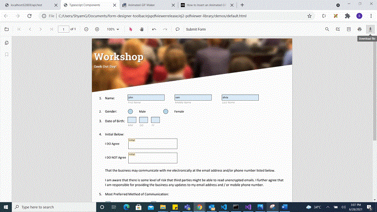
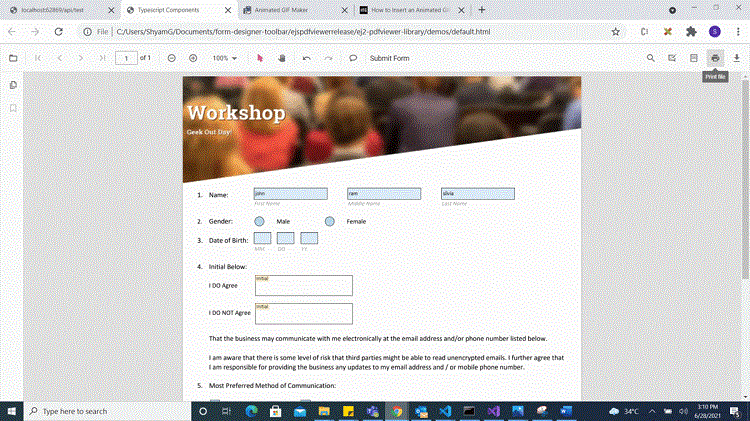
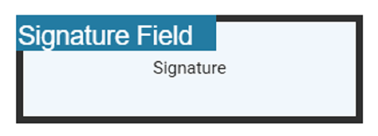
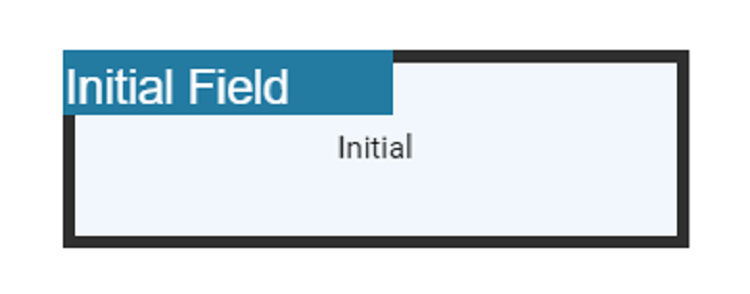

# Create programmatically in React Pdfviewer component

The PDF Viewer control provides the option to add, edit and delete the Form Fields. The Form Fields type supported by the PDF Viewer Control are:

    * Textbox
    * Password
    * CheckBox
    * RadioButton
    * ListBox
    * DropDown
    * SignatureField
    * InitialField

## Add a form field to PDF document programmatically

Using addFormField method, the form fields can be added to the PDF document programmatically. We need to pass two parameters in this method. They are Form Field Type and Properties of Form Field Type. To add form field programmatically, Use the following code.










 

## Edit/Update form field programmatically

Using updateFormField method, Form Field can be updated programmatically. We should get the Form Field object/Id from FormFieldCollections property that you would like to edit and pass it as a parameter to updateFormField method. The second parameter should be the properties that you would like to update for Form Field programmatically. We have updated the value and background Color properties of Textbox Form Field.










 

## Delete form field programmatically

Using deleteFormField method, the form field can be deleted programmatically. We should retrieve the Form Field object/Id from FormFieldCollections property that you would like to delete and pass it as a parameter to deleteFormField method. To delete a Form Field programmatically, use the following code.










 

## setFormFieldMode programmatically

The `setFormFieldMode` method is a function in the Syncfusion React PDF Viewer library that allows you to add a form field dynamically by passing the type of the form field. You can pass the form fields as a parameter like below.



```ts

import * as ReactDOM from 'react-dom';
import * as React from 'react';
import { PdfViewerComponent, Toolbar, Magnification, Navigation, LinkAnnotation, BookmarkView, ThumbnailView, 
         Print, TextSelection, Annotation, TextSearch, FormFields, FormDesigner, Inject } from '@syncfusion/ej2-react-pdfviewer';

function App() {
  function addPasswordField() {
    var viewer = document.getElementById('container').ej2_instances[0];
    viewer.formDesignerModule.setFormFieldMode("Password");
  }
  return (<div>
    <div className='control-section'>
      {/* Render the PDF Viewer */}
      <button onClick={addPasswordField}>Add Password Field</button>
      <PdfViewerComponent 
        id="container"
        documentPath="PDF_Succinctly.pdf"
        serviceUrl="https://ej2services.syncfusion.com/production/web-services/api/pdfviewer"
        style={{ 'height': '640px' }}>

              <Inject services={[ Toolbar, Magnification, Navigation, LinkAnnotation, Annotation, BookmarkView,
                                  ThumbnailView, Print, TextSelection, TextSearch, FormDesigner, FormFields]} />
      </PdfViewerComponent>
    </div>
  </div>);
}
const root = ReactDOM.createRoot(document.getElementById('sample'));
root.render(<App />);

```


## Saving the form fields

When the download icon is selected on the toolbar, the Form Fields will be saved in the PDF document and this action will not affect the original document. Refer the below GIF for further reference.



You can invoke download action using following code snippet.,



```ts

import * as ReactDOM from 'react-dom';
import * as React from 'react';
import { PdfViewerComponent, Toolbar, Magnification, Navigation, LinkAnnotation, BookmarkView,ThumbnailView,
         Print, TextSelection, Annotation, TextSearch, Inject } from '@syncfusion/ej2-react-pdfviewer';
let pdfviewer;

function App() {
  function downloadClicked() {
    var viewer = document.getElementById('container').ej2_instances[0];
    viewer.download();
  }
  return (<div>
    <div className='control-section'>
      {/* Render the PDF Viewer */}
      <button onClick={downloadClicked}>Download</button>
      <PdfViewerComponent ref={(scope) => { pdfviewer = scope; }}
        id="container"
        documentPath="PDF_Succinctly.pdf"
        serviceUrl="https://ej2services.syncfusion.com/production/web-services/api/pdfviewer"
        style={{ 'height': '640px' }}>

              <Inject services={[ Toolbar, Magnification, Navigation, LinkAnnotation, Annotation, BookmarkView,
                                  ThumbnailView, Print, TextSelection, TextSearch]} />
      </PdfViewerComponent>
    </div>
  </div>);
}
const root = ReactDOM.createRoot(document.getElementById('sample'));
root.render(<App />);

```


## Printing the form fields

When the print icon is selected on the toolbar, the PDF document will be printed along with the Form Fields added to the pages and this action will not affect the original document. Refer the below GIF for further reference.





```ts

import * as ReactDOM from 'react-dom';
import * as React from 'react';
import { PdfViewerComponent, Toolbar, Magnification, Navigation, LinkAnnotation, BookmarkView,ThumbnailView,
         Print, TextSelection, TextSearch, Annotation, Inject } from '@syncfusion/ej2-react-pdfviewer';
let pdfviewer;

function App() {
  return (<div>
    <div className='control-section'>
      {/* Render the PDF Viewer */}
      <PdfViewerComponent ref={(scope) => { pdfviewer = scope; }}
        id="container"
        documentPath="PDF_Succinctly.pdf"
        enablePrint={true}
        serviceUrl="https://ej2services.syncfusion.com/production/web-services/api/pdfviewer"
        style={{ 'height': '640px' }}>

              <Inject services={[ Toolbar, Annotation, Magnification, Navigation, LinkAnnotation, BookmarkView,
                                  ThumbnailView, Print, TextSelection, TextSearch ]} />
      </PdfViewerComponent>
    </div>
  </div>);
}
const root = ReactDOM.createRoot(document.getElementById('sample'));
root.render(<App />);

```


## Open the existing PDF document

We can open the already saved PDF document contains Form Fields in it by clicking the open icon in the toolbar. Refer the below GIF for further reference.


## Validate form fields

The form fields in the PDF Document will be validated when the `enableFormFieldsValidation` is set to true and hook the validateFormFields. The validateFormFields will be triggered when the PDF document is downloaded or printed with the non-filled form fields. The non-filled fields will be obtained in the `nonFillableFields` property of the event arguments of validateFormFields.

Add the following code snippet to validate the form fields,



```ts

import * as ReactDOM from 'react-dom';
import * as React from 'react';
import { PdfViewerComponent, Toolbar, Magnification, Navigation, LinkAnnotation, BookmarkView,ThumbnailView,
         Print, TextSelection, Annotation, TextSearch, Inject, FormDesigner, FormFields } from '@syncfusion/ej2-react-pdfviewer';
let pdfviewer;

function App() {
  function documentLoaded () {
    var viewer = document.getElementById('container').ej2_instances[0];
    viewer.formDesignerModule.addFormField("Textbox", { name: "Textbox", bounds: { X: 146, Y: 229, Width: 150, Height: 24 }});
  }
  function validateFormFields(args){
    var viewer = document.getElementById('container').ej2_instances[0];
    viewer.nonfilledFormFields = args.nonFillableFields
  }
  return (<div>
    <div className='control-section'>
      {/* Render the PDF Viewer */}
      <PdfViewerComponent ref={(scope) => { pdfviewer = scope; }}
        id="container"
        documentPath="FormDesigner.pdf"
        serviceUrl="https://ej2services.syncfusion.com/production/web-services/api/pdfviewer"
        documentLoad={documentLoaded}
        enableFormFieldsValidation={true}
        ValidateFormFields= {validateFormFields}
        style={{ 'height': '640px' }}>

            <Inject services={[ Toolbar, Magnification, Navigation, Annotation, LinkAnnotation, BookmarkView,
                                ThumbnailView, Print, TextSelection, TextSearch, FormDesigner, FormFields ]} />
      </PdfViewerComponent>
    </div>
  </div>);
}
const root = ReactDOM.createRoot(document.getElementById('sample'));
root.render(<App />);

```


## Export and import form fields

The PDF Viewer control provides the support to export and import the form field data in the following formats using the methods `importFormFields`, `exportFormFields`, `exportFormFieldsAsObject`.

* FDF
* XFDF
* JSON

### Export and import as FDF

Using the `exportFormFields` method, the form field data can be exported in the specified data format. This method accepts two parameters:

* The first one must be the destination path for the exported data. If path is not specified, it will ask for the location while exporting.
* The second parameter should be the format type of the form data.

The following code explains how to export and import the form field data as FDF.

```

<button onclick="OnExportFdf()">Export FDF</button>
<button onclick="OnImportFdf()">Import FDF</button>

```

```ts
// Event triggers on the Export FDF button click.
function OnExportFdf() {
  var viewer = document.getElementById('container').ej2_instances[0];
  // Data must be the desired path for the exported document.
  viewer.exportFormFields('Data', FormFieldDataFormat.Fdf);
}

// Event triggers on the Import FDF button click.
function OnImportFdf() {
  var viewer = document.getElementById('container').ej2_instances[0];
  // The file for importing the form fields should be placed in the desired location and the path should be provided correctly
  viewer.importFormFields('File', FormFieldDataFormat.Fdf);
}
```

### Export and import as XFDF

The following code explains how to export and import the form field data as XFDF.

```

<button onclick="OnExportXfdf()">Export XFDF</button>
<button onclick="OnImportXfdf()">Import XFDF</button>

```

```ts
// Event triggers on the Export XFDF button click.
function OnExportXfdf(){
  var viewer = document.getElementById('container').ej2_instances[0];
  // Data must be the desired path for the exported document.
  viewer.exportFormFields('Data', FormFieldDataFormat.Xfdf);
}

// Event triggers on the Import XFDF button click.
function OnImportXfdf(){
  var viewer = document.getElementById('container').ej2_instances[0];
  // The file for importing the form fields should be placed in the desired location and the path should be provided correctly
  viewer.importFormFields('File', FormFieldDataFormat.Xfdf);
}
```

### Export and import as JSON

The following code explains how to export and import the form field data as JSON.

```

<button onclick="OnExportJson()">Export JSON</button>
<button onclick="OnImportJson()">Import JSON</button>

```

```ts
// Event triggers on the Export JSON button click.
function OnExportJson(){
  var viewer = document.getElementById('container').ej2_instances[0];
  // Data must be the desired path for the exported document.
  viewer.exportFormFields('Data', FormFieldDataFormat.Json);
}

// Event triggers on the Import JSON button click.
function OnImportJson(){
  var viewer = document.getElementById('container').ej2_instances[0];
  // The file for importing the form fields should be placed in the desired location and the path should be provided correctly
  viewer.importFormFields('File', FormFieldDataFormat.Json);
}
```

### Export and import as Object

The PDF Viewer control supports exporting the form field data as an object, and the exported data will be imported into the current PDF document from the object.

The following code shows how to export the form field data as an object and import the form field data from that object into the current PDF document via a button click.

```

<button onclick="exportDataAsObject()">Export Object</button>
<button onclick="importData()">Import Data</button>

```

```ts
var exportedData;

// Event triggers on the Export Object button click.
function exportDataAsObject(){
  var viewer = document.getElementById('container').ej2_instances[0];
  // Export the form fields data to an FDF object.
  exportedData = viewer.exportFormFieldsAsObject(FormFieldDataFormat.Fdf);
  //// Export the form fields data to an XFDF object.
  //exportedData = viewer.exportFormFieldsAsObject(FormFieldDataFormat.Xfdf);
  //// Export the form fields data to an JSON object.
  //exportedData = viewer.exportFormFieldsAsObject(FormFieldDataFormat.Json);
}

// Event triggers on Import Data button click.
function importData(){
  var viewer = document.getElementById('container').ej2_instances[0];
  // Import the form fields data from the FDF object into the current PDF document.
  viewer.importFormFields(exportedData, FormFieldDataFormat.Fdf);
  //// Import the form fields data from the XFDF object into the current PDF document.
  //viewer.importFormFields(exportedData, FormFieldDataFormat.Xfdf);
  //// Import the form fields data from the JSON object into the current PDF document.
  //viewer.importFormFields(exportedData, FormFieldDataFormat.Json);
}
```

## Signature and initial fields settings

Using the `updateFormField` method, the form fields can be updated programmatically.

The following code example explains how to update the signature field properties on a button click.

```

<button onclick="updateProperties()">Update Properties</button>

```

```ts
// Event triggers on the Update Properties button click.
function updateProperties(){
  var viewer = document.getElementById('container').ej2_instances[0];
  var formField = viewer.retrieveFormFields();
  viewer.formDesignerModule.updateFormField(formField[0], {
    name: 'Initial',
    isReadOnly: true,
    visibility: 'visible',
    isRequired: false,
    isPrint: true,
    tooltip: 'Initial',
    thickness: 4
  });
}

```

The following code example explains how to update the properties of the signature field added to the document from the form designer toolbar.


```ts

{/* Defines the signature field settings */}
let signatureFieldSettings = {
  name: 'Signature', isReadOnly: false, visibility: 'visible', isRequired: false, isPrint: true,
  tooltip: 'Signature', thickness: 4,
  // Specify the properties of the signature indicator in the signature field.
  signatureIndicatorSettings: {
    opacity: 1, backgroundColor: '#237ba2', height: 50,
    fontSize: 15,  text: 'Signature Field', color: 'white'
  },
  // Specify the properties of the signature Dialog Settings in the intial field.
  signatureDialogSettings: {
    displayMode: DisplayMode.Draw | DisplayMode.Upload | DisplayMode.Text, hideSaveSignature: false
  }
};
//   . . .
//   . . .
 <PdfViewerComponent
    id="container"
    documentPath="PDF_Succinctly.pdf"
    serviceUrl="https://ej2services.syncfusion.com/production/web-services/api/pdfviewer"
    style={{ height: '640px' }}
    signatureFieldSettings={signatureFieldSettings}>

        <Inject services={[ Toolbar, Magnification, Navigation, LinkAnnotation, BookmarkView, ThumbnailView,
                            Print, TextSelection, TextSearch, Annotation, FormFields, FormDesigner ]}/>

 </PdfViewerComponent>

```




The following code example explains how to update the properties of the initial field added to the document from the form designer toolbar.


```ts

{/* Defines the initial field settings */}
  let initialFieldSettings = {
    name: 'Initial', isReadOnly: false, visibility: 'visible',
    isRequired: false, isPrint: true, tooltip: 'Initial', thickness: 4,
    // Specify the properties of the initial indicator in the initial field.
    initialIndicatorSettings: {
      opacity: 1, backgroundColor: '#237ba2', height: 50, fontSize: 15, text: 'Initial Field',  color: 'white'
    },
    // Specify the properties of the initial Dialog Settings in the intial field.
    initialDialogSettings: {
      displayMode: DisplayMode.Draw | DisplayMode.Upload | DisplayMode.Text, hideSaveSignature: false
    }
  };

//   . . .
//   . . .

{/* Render the PDF Viewer */}
<PdfViewerComponent
  id="container" documentPath="PDF_Succinctly.pdf"
  serviceUrl="https://ej2services.syncfusion.com/production/web-services/api/pdfviewer"
  style={{ height: '640px' }}
  initialFieldSettings={initialFieldSettings}>

      <Inject services={[ Toolbar, Magnification, Navigation, LinkAnnotation, BookmarkView,
                          ThumbnailView, Print, TextSelection, TextSearch, Annotation, FormFields, FormDesigner ]} />

</PdfViewerComponent>

```


