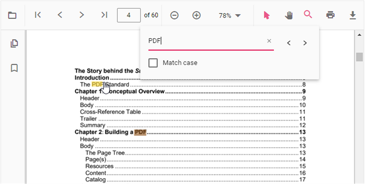

# Text search in React Pdfviewer component

The Text Search option in PDF Viewer is used to find and highlight the text content from the document. You can enable/disable the text search using the following code snippet.



```ts

import * as ReactDOM from 'react-dom';
import * as React from 'react';
import { PdfViewerComponent, Toolbar, Magnification, Navigation, LinkAnnotation, BookmarkView,
         ThumbnailView, Print, TextSelection, TextSearch, Annotation, Inject } from '@syncfusion/ej2-react-pdfviewer';

function App() {
  return (
  <div>
    <div className='control-section'>
      {/* Render the PDF Viewer */}
      <PdfViewerComponent
        id="container"
        documentPath="PDF_Succinctly.pdf"
        enableTextSearch={true}
        serviceUrl="https://ej2services.syncfusion.com/production/web-services/api/pdfviewer"
        style={{ 'height': '640px' }}>

             <Inject services={[ Toolbar, Annotation, Magnification, Navigation, LinkAnnotation, 
                                 BookmarkView, ThumbnailView, Print, TextSelection, TextSearch]} />
      </PdfViewerComponent>
    </div>
  </div>);

}
const root = ReactDOM.createRoot(document.getElementById('sample'));
root.render(<App />);

```


The following text search methods are available in the PDF Viewer,

* [**Search text**](https://ej2.syncfusion.com/vue/documentation/api/pdfviewer/textSearch/#searchtext):- Searches the target text in the PDF document and highlights the occurrences in the pages.
* [**Search next**](https://ej2.syncfusion.com/vue/documentation/api/pdfviewer/textSearch/#searchnext):- Searches the next occurrence of the searched text from the current occurrence of the PdfViewer.
* [**Search previous**](https://ej2.syncfusion.com/vue/documentation/api/pdfviewer/textSearch/#searchprevious):- Searches the previous occurrence of the searched text from the current occurrence of the PdfViewer.
* [**Cancel text search**](https://ej2.syncfusion.com/vue/documentation/api/pdfviewer/textSearch/#canceltextsearch):- The text search can be cancelled and the highlighted occurrences from the PDF Viewer can be removed .



## See also

* [Toolbar items](./toolbar)
* [Feature Modules](./feature-module)