# Calculated field in React Pivot Table

A calculated field creates a new **value field** from a formula that combines existing fields and standard operators or functions. The result appears in the pivot table like any other measure, which enables derived metrics such as margins, ratios, or totals that the raw data does not provide directly.

Calculated fields can be:

- **Created at runtime** through the built-in calculated field dialog in the Field List.
- **Pre-configured in code** with the [`calculatedFieldSettings`](https://ej2.syncfusion.com/react/documentation/api/pivotview/datasourcesettings#calculatedfieldsettings) property, and then created, edited, renamed, or reused at runtime from the UI.

For example, the formula `"Sum(Amount)"-"Sum(Sold)"` displays the difference between two existing measures as a single calculated value field.

## Creating calculated fields

Calculated fields can be created through the built-in calculated field dialog or pre-configured in code with the [`calculatedFieldSettings`](https://ej2.syncfusion.com/react/documentation/api/pivotview/datasourcesettings#calculatedfieldsettings) property.

To make the dialog available, set the [`allowCalculatedField`](https://ej2.syncfusion.com/react/documentation/api/pivotview/index-default#allowcalculatedfield) property to **true**. This adds the **CALCULATED FIELD** button to the Field List; clicking the button opens the calculated field dialog, where fields are created and managed.

### Defining calculated fields programmatically

Calculated fields are defined as an array of field configurations in the [`calculatedFieldSettings`](https://ej2.syncfusion.com/react/documentation/api/pivotview/datasourcesettings#calculatedfieldsettings) property, which is suitable for pre-configuring calculations before the pivot table is rendered. Each configuration uses the following properties:

- [`name`](https://ej2.syncfusion.com/react/documentation/api/pivotview/calculatedfieldsettingsmodel#name): Specifies a unique name for the calculated field.
- [`formula`](https://ej2.syncfusion.com/react/documentation/api/pivotview/calculatedfieldsettingsmodel#formula): Defines the mathematical expression using existing fields, arithmetic operators, and functions. Field references must include an aggregation type and be enclosed in double quotes, such as `"Sum(Amount)"`, as described in [Formula syntax](#formula-syntax).

To display a formatted result, add the calculated field to the [`formatSettings`](https://ej2.syncfusion.com/react/documentation/api/pivotview/formatsettings) property of the data source settings, as shown in the code sample below.

The `CalculatedField` module must be injected for the calculated field feature to work. In `App.tsx`, the module is added through `Inject services={[CalculatedField, ...]}` inside `PivotViewComponent` (see the code sample below for the full setup).

N>
- The calculated field feature applies only to value fields. By default, calculated fields created programmatically are added to the field list and calculated field dialog UI. To display a calculated field in the pivot table UI, it must be added to the [`values`](https://ej2.syncfusion.com/react/documentation/api/pivotview/datasourcesettings#values) property, as shown in the code below.


















## Opening the calculated field dialog programmatically

The calculated field dialog can also be opened by code instead of through the Field List button. The [`createCalculatedFieldDialog`](https://ej2.syncfusion.com/react/documentation/api/pivotview/index-default#createcalculatedfielddialog) method is invoked from an external button handler, which keeps the dialog available without reserving a Field List button.


















## Editing a calculated field

Existing calculated fields can be updated at runtime — field name, formula, or format — without recreating the field. All edits happen in the calculated field dialog, which can be opened from two places.

### From the field list or grouping bar

1. Locate the calculated field button in either the field list or the grouping bar.
2. Click the **Edit** icon next to the calculated field name.
3. The calculated field dialog opens, displaying the current settings.
4. Make changes to the field name, formula, or format as needed.
5. Click **OK** to apply the changes.

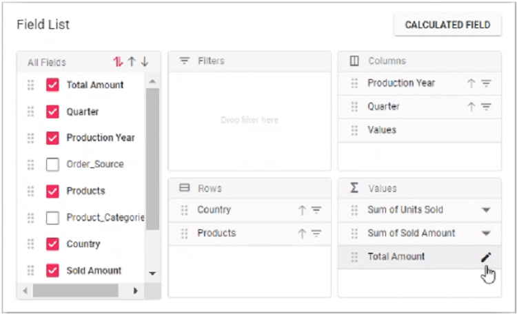
<br/>

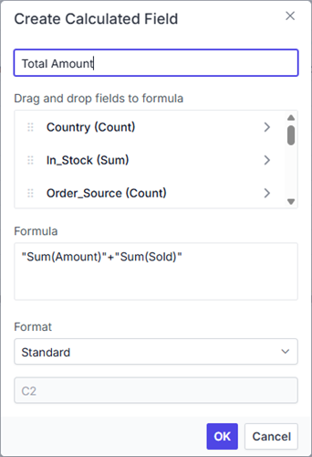

### From the calculated field dialog

1. Open the calculated field dialog (create or edit entry).
2. Select the calculated field from the tree view list.
3. The existing formula appears in a multiline text box at the bottom of the dialog.
4. Update the name in the text box at the top, the formula, or the format setting.
5. Click **OK** to save the changes.

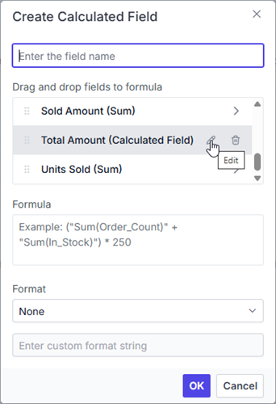
<br/>

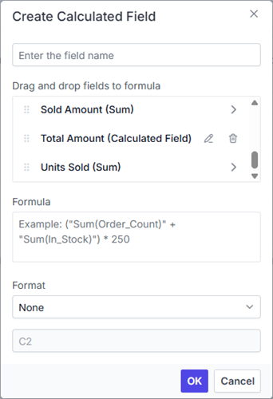
<br/>

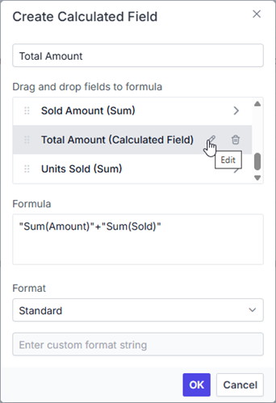
<br/>

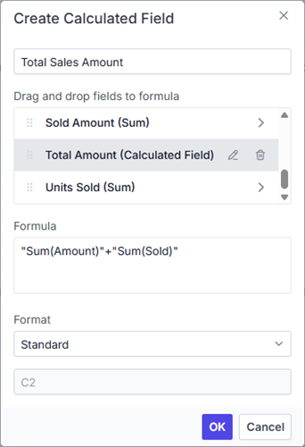

## Reusing an existing formula in a new calculated field

A new calculated field can be created from the formula of an existing one, which keeps calculations consistent and saves re-entry.

To reuse an existing formula:

1. Open the calculated field dialog to create a new field.
2. Locate the existing calculated field whose formula is to be reused.
3. Drag the existing calculated field from the tree view.
4. Drop it into the **Formula** section.
5. The formula from the existing field is automatically added to the new calculated field.
6. Modify the formula further if needed, or use it as is.
7. Click **OK** to create the new calculated field.

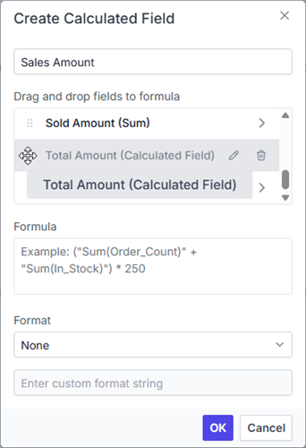
<br/>

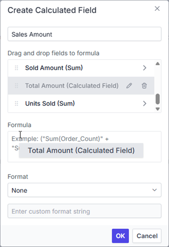
<br/>

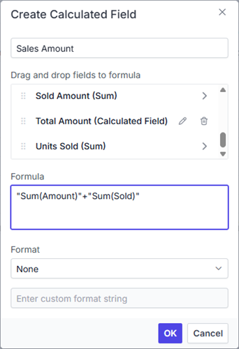

## Applying formatting to calculated field values

Calculated field values can be formatted in the calculated field dialog or in code, which keeps numeric output readable and consistent with the rest of the table.

In code, formatting is set through the [`formatSettings`](https://ej2.syncfusion.com/react/documentation/api/pivotview/formatsettings) property. The full list of supported number formats is described in [Number formatting](./number-formatting).

### Formatting through the user interface

The calculated field dialog provides a built-in **Format** dropdown with the following predefined options:

* **Standard** - Displays numbers using the default numeric format (equivalent to the `N` format).
* **Currency** - Displays numbers as currency values.
* **Percent** - Displays numbers as percentage values.
* **Custom** - Accepts a custom format pattern.
* **None** - Applies no formatting to the values.

> **Note:** By default, **None** is selected in the dropdown.

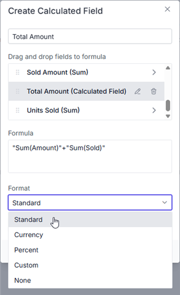

### Applying custom formatting

The **Custom** option in the **Format** dropdown accepts any custom format pattern, which is useful for display requirements beyond the predefined options.

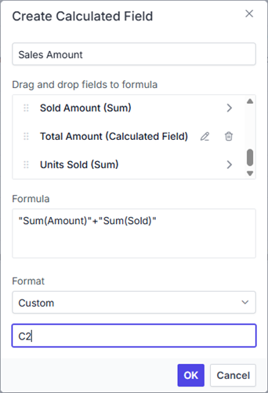

## Supported operators and functions for the calculated field formula

### Formula syntax

A calculated field formula is a string expression. Follow these rules when writing it:

- Field references must include an aggregation type, such as `Sum(Amount)`, `Count(Sold)`, or `Average(Quantity)`. Bare field names without an aggregation type are not supported in formulas.
- Field references must be enclosed in double quotes: `"Sum(Amount)"`.
- Operators combine two field references: `"Sum(Amount)"+"Sum(Sold)"`.
- Functions and [Math](https://developer.mozilla.org/en-US/docs/Web/JavaScript/Reference/Global_Objects/Math) methods take quoted field references as arguments: `abs("Sum(Amount)")`, `Math.round("Sum(Amount)")`.

> **Note**: The following advanced aggregation types are not supported within calculated field formulas: `Index`, `RunningTotals`, `PercentageOfRunningTotals`, `PercentageOfGrandTotal`, `PercentageOfColumnTotal`, `PercentageOfRowTotal`, `PercentageOfParentColumnTotal`, `PercentageOfParentRowTotal`, `DifferenceFrom`, `PercentageOfDifferenceFrom`, and `PercentageOfParentTotal`.

Below is a list of operators and functions that can be used in the formula to create the calculated fields.

* `+` – addition operator.

   ```typescript
     Syntax: X + Y
   ```

* `-` – subtraction operator.

    ```typescript
       Syntax: X - Y
    ```

* `*` – multiplication operator.

    ```typescript
       Syntax: X * Y
    ```

* `/` – division operator.

    ```typescript
       Syntax: X / Y
    ```

* `^` – power operator.

    ```typescript
     Syntax: X^Y
    ```

* `<` – less than operator.

    ```typescript
      Syntax: X < Y
    ```

* `<=` – less than or equal operator.

    ```typescript
      Syntax: X <= Y
    ```

* `>` – greater than operator.

    ```typescript
      Syntax: X > Y
    ```

* `>=` – greater than or equal operator.

    ```typescript
      Syntax: X >= Y
    ```

* `==` – equal operator.

    ```typescript
      Syntax: X == Y
    ```

* `!=` – not equal operator.

    ```typescript
     Syntax: X != Y
    ```

* `|` – OR operator.

    ```typescript
      Syntax: X | Y
    ```

* `&` – AND operator.

     ```typescript
      Syntax: X & Y
     ```

* `?` – conditional operator.

    ```typescript
     Syntax: condition ? valueIfTrue : valueIfFalse
   ```

* `isNaN` – function that checks if the value is not a number (returns `true` for `NaN`).

    ```typescript
    Syntax: isNaN(value)
   ```

* `!isNaN` – function that checks if the value is a number (returns `true` for any number).

    ```typescript
      Syntax: !isNaN(value)
    ```

* `abs` – function that returns the absolute value of a number.

    ```typescript
     Syntax: abs(number)
    ```

* `min` – function that returns the minimum value.

    ```typescript
     Syntax: min(number1, number2)
    ```

* `max` – function that returns the maximum value.

    ```typescript
     Syntax: max(number1, number2)
    ```

 > The JavaScript [Math](https://developer.mozilla.org/en-US/docs/Web/JavaScript/Reference/Global_Objects/Math) object properties and methods can also be used directly in the formula.


















## Event

The Pivot Table provides the following events to monitor calculated field operations. Each event exposes a specific stage of the operation lifecycle, which can be tracked, validated, or intercepted. Calculated field actions carry the following `actionName` values, which are consistent across the `actionBegin`, `actionComplete`, and `actionFailure` events:

| User Action | `actionBegin` / `actionFailure` Action Name | `actionComplete` Action Name |
|-------------|---------------------------------------------|------------------------------|
| [Clicking the calculated field button](./calculated-field#creating-calculated-fields) | Open calculated field dialog | — |
| [Creating a calculated field](./calculated-field#creating-calculated-fields) | — | Calculated field applied |
| [Clicking the edit icon for a calculated field](./calculated-field#editing-a-calculated-field) | Edit calculated field | Calculated field edited |
| [Context menu in the calculated field dialog tree view](./calculated-field#creating-calculated-fields) | Calculated field context menu | — |

### CalculatedFieldCreate

The [`calculatedFieldCreate`](https://ej2.syncfusion.com/react/documentation/api/pivotview/index-default#calculatedfieldcreate) event is triggered when the **OK** button is clicked in the calculated field dialog, before the entered details are applied to the pivot table. The event allows the calculated field information to be validated or modified before it is saved, which prevents invalid configurations from being applied.

**Event Parameters:**

The event provides the following parameters to facilitate interaction with calculated field data:

* [`calculatedField`](https://ej2.syncfusion.com/react/documentation/api/pivotview/calculatedfieldcreateeventargs#calculatedfield): Contains the calculated field information (new or existing) that was entered in the dialog.

* [`calculatedFieldSettings`](https://ej2.syncfusion.com/react/documentation/api/pivotview/datasourcesettings#calculatedfieldsettings): Provides access to the current [`calculatedFieldSettings`](https://ej2.syncfusion.com/react/documentation/api/pivotview/datasourcesettings#calculatedfieldsettings) of the pivot table.

* [`cancel`](https://ej2.syncfusion.com/react/documentation/api/pivotview/calculatedfieldcreateeventargs#cancel): A boolean property that prevents the dialog changes from being applied when set to **true**.

* [`dataSourceSettings`](https://ej2.syncfusion.com/react/documentation/api/pivotview/calculatedfieldcreateeventargs#datasourcesettings): Contains the current data source configuration, including input data, rows, columns, values, filters, and format settings.

* [`fieldName`](https://ej2.syncfusion.com/react/documentation/api/pivotview/calculatedfieldcreateeventargs#fieldname): Specifies the name of the field being created or updated.

**Example:**

The following example prevents calculated fields from being created without a set format:


















### ActionBegin

The [`actionBegin`](https://ej2.syncfusion.com/react/documentation/api/pivotview/index-default#actionbegin) event fires before a calculated field operation is executed, which allows the action to be validated or restricted.

This event is triggered by the following interactions with calculated field functionality:
- Clicking the calculated field button
- Clicking the edit icon for an existing calculated field
- Using the context menu in the tree view within the calculated field dialog

The event provides the following parameters:

**Event Parameters:**

- [`dataSourceSettings`](https://ej2.syncfusion.com/react/documentation/api/pivotview/pivotactionbegineventargs#datasourcesettings): Contains the current data source configuration, including input data, rows, columns, values, filters, format settings, and other pivot table settings.

- [`actionName`](https://ej2.syncfusion.com/react/documentation/api/pivotview/pivotactionbegineventargs#actionname): Identifies the specific action being attempted. The available action names are listed in the [action name table](#event) above this section.

- [`fieldInfo`](https://ej2.syncfusion.com/react/documentation/api/pivotview/pivotactionbegineventargs#fieldinfo): Provides information about the selected field when the action involves a specific field. This parameter is available only when the action involves a specific field, such as filtering, sorting, removing a field from the grouping bar, editing, or changing the aggregation type.

- [`cancel`](https://ej2.syncfusion.com/react/documentation/api/pivotview/pivotactionbegineventargs#cancel): A boolean property that prevents the current action from completing when set to **true**.

**Example:**

The following example prevents access to the calculated field dialog by setting the **args.cancel** property to **true** in the [`actionBegin`](https://ej2.syncfusion.com/react/documentation/api/pivotview/index-default#actionbegin) event when the calculated field button is clicked:


















### ActionComplete

The [`actionComplete`](https://ej2.syncfusion.com/react/documentation/api/pivotview/index-default#actioncomplete) event fires after a calculated field operation completes successfully. It is useful for performing follow-up actions or logging activity after fields are created or modified.

The event provides the following parameters:

**Event Parameters:**

- [`dataSourceSettings`](https://ej2.syncfusion.com/react/documentation/api/pivotview/pivotactioncompleteeventargs#datasourcesettings): Contains the updated data source configuration, including input data, rows, columns, values, filters, format settings, and other pivot table settings after the operation is completed.

- [`actionName`](https://ej2.syncfusion.com/react/documentation/api/pivotview/pivotactioncompleteeventargs#actionname): Identifies the specific action that completed. The available action names are listed in the [action name table](#event) above this section.

- [`fieldInfo`](https://ej2.syncfusion.com/react/documentation/api/pivotview/pivotactioncompleteeventargs#fieldinfo): Provides information about the selected field when the action involves a specific field, as described for the [`actionBegin`](https://ej2.syncfusion.com/react/documentation/api/pivotview/index-default#actionbegin) event.

- [`actionInfo`](https://ej2.syncfusion.com/react/documentation/api/pivotview/pivotactioncompleteeventargs#actioninfo): Contains detailed information about the completed action. For calculated field operations, this includes the complete calculated field information, its formula, and the field name.

**Example:**

The example below demonstrates how to use the [`actionComplete`](https://ej2.syncfusion.com/react/documentation/api/pivotview/index-default#actioncomplete) event to log information when calculated field operations are completed:


















### ActionFailure

The [`actionFailure`](https://ej2.syncfusion.com/react/documentation/api/pivotview/index-default#actionfailure) event is triggered when a UI action fails to produce the expected result. This event provides detailed information about the failure through the following parameters:

* [`actionName`](https://ej2.syncfusion.com/react/documentation/api/pivotview/pivotactionfailureeventargs#actionname): It holds the name of the current action that failed. The available action names are listed in the [action name table](#event) above this section.

* [`errorInfo`](https://ej2.syncfusion.com/react/documentation/api/pivotview/pivotactionfailureeventargs#errorinfo): It holds the error information of the current UI action.
















