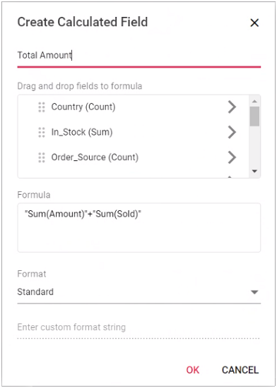
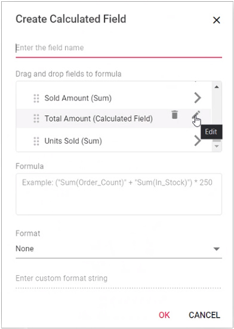
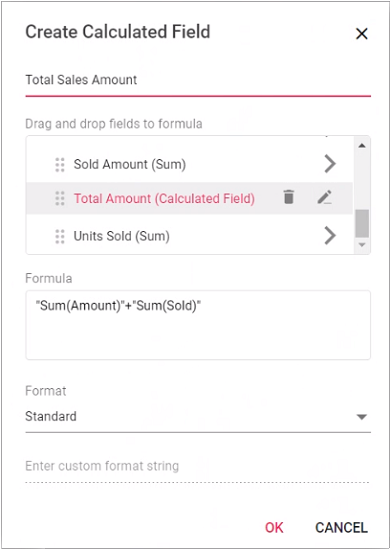
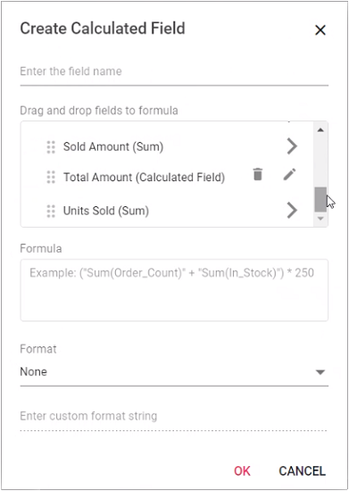
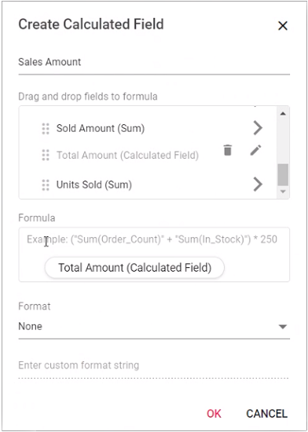
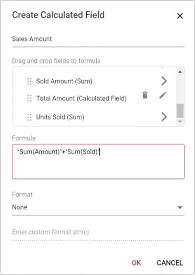
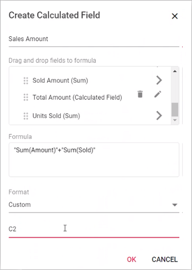

# Calculated field in React Pivotview component

Allows end user to create a new calculated field in the pivot table, based on available fields from the bound data source or using simple formula with basic arithmetic operators. It can be added at runtime through the built-in dialog, invoked from Field List UI. To do so, set the [`allowCalculatedField`](https://ej2.syncfusion.com/react/documentation/api/pivotview/#allowcalculatedfield) property to **true** in the pivot table. End user can now see a "CALCULATED FIELD" button enabled in Field List UI automatically, which on clicking will invoke the calculated field dialog and perform necessary operation.

Calculated field can also be included in the pivot table through code behind using the [`calculatedFieldsSettings`](https://ej2.syncfusion.com/react/documentation/api/pivotview/dataSourceSettings/#calculatedfieldsettings). The required properties to create a new calculate field are:
* [`name`](https://ej2.syncfusion.com/react/documentation/api/pivotview/calculatedFieldSettingsModel/#name): It allows to indicate the calculated field with a unique name.
* [`formula`](https://ej2.syncfusion.com/react/documentation/api/pivotview/calculatedFieldSettingsModel/#formula): It allows to set the formula.
* [`formatSettings`](https://ej2.syncfusion.com/react/documentation/api/pivotview/formatSettings/): It helps to set the number format for the resultant value.

To use calculated field option, you need to inject the `CalculatedField` module in pivot table.

> The calculated field is applicable only for value fields. Also, calculated field created through code behind will be automatically listed in the UI dialog as well.
















 

Meanwhile, user can also view calculated field dialog in UI by invoking [`createCalculatedFieldDialog`](https://ej2.syncfusion.com/react/documentation/api/pivotview/#createcalculatedfielddialog) method on an external button click which is shown in the below code sample.

> To use calculated field option, you need to inject the `CalculatedField` module in pivot table.
















 

## Editing through the field list and the grouping bar

User can also modify the existing calculated field using the built-in edit option available directly in the field list (or) grouping bar. To do so, click the "Edit" icon available in the calculated field button. Now the calculated field dialog is opened and the current calculated field name, formula and format can be changed at runtime.


<br/>
<br/>


## Renaming the existing calculated field

Existing calculated field can be renamed only through the UI at runtime. To do so, open the calculated field dialog, select the target field and click "Edit" icon. User can now see the existing name getting displayed in the text box at the top of the dialog. Now, change the name based on user requirement and click "OK".

<!-- markdownlint-disable MD012 -->

<br/>
<br/>


## Editing the existing calculated field formula

Existing calculated field formula can be edited only through the UI at runtime. To do so, open the calculated field dialog, select the target field and click "Edit" icon. User can now see the existing formula getting displayed in a multiline text box at the bottom of the dialog. Now, change the formula based on user requirement and click "OK".


<br/>
<br/>


## Reusing the existing formula in a new calculate field

While creating a new calculated field, if user wants to the add the formula of an existing calculated field, it can be done easily. To do so, simply drag-and-drop the existing calculated field to the "Formula" section.


<br/>
<br/>

<br/>
<br/>


## Apply the format to the calculated field values

Values in a new or existing calculated field can be formatted via the calculated field UI or code behind. The [`formatSettings`](https://ej2.syncfusion.com/react/documentation/api/pivotview/formatSettings/) property in code-behind can be used to specify the desired format. For more information about the supported formats refer [`here`](https://ej2.syncfusion.com/react/documentation/pivotview/number-formatting/).

To apply format to calculated field values at runtime via UI, a built-in dropdown under the "Format" label is available, from which the user can select the pre-defined format options listed below.

* **Standard** - Denotes the numeric type.
* **Currency** - Denotes the currency type.
* **Percent** - Denotes the percentage type.
* **Custom** - Denotes the custom format. For example: "C2". This shows the value "9584.3" as "$9584.30."
* **None** - Denotes that no format will be applied.

> By default, **None** will be selected from the dropdown.


In addition, you can specify the desired custom formats by selecting the **Custom** option from the "Format" dropdown.



## Supported operators and functions for the calculated field formula

Below is a list of operators and functions that can be used in the formula to create the calculated fields.

* `+` – addition operator.

    ```ts
    Syntax: X + Y
    ```

* `-` – subtraction operator.

    ```ts
    Syntax: X - Y
    ```

* `*` – multiplication operator.

    ```ts
    Syntax: X * Y
    ```

* `/` – division operator.

    ```ts
    Syntax: X / Y
    ```

* `^` – power operator.

    ```ts
    Syntax: X^2
    ```

* `<` - less than operator.

    ```ts
    Syntax: X < Y
    ```

* `<=` – less than or equal operator.

    ```ts
    Syntax: X <= Y
    ```

* `>` – greater than operator.

    ```ts
    Syntax: X > Y
    ```

* `>=` – greater than or equal operator.

    ```ts
    Syntax: X >= Y
    ```

* `==` – equal operator.

    ```ts
    Syntax: X == Y
    ```

* `!=` – not equal operator.

    ```ts
    Syntax: X != Y
    ```

* `|` – OR operator.

    ```ts
    Syntax: X | Y
    ```

* `&` – AND operator.

    ```ts
    Syntax: X & Y
    ```

* `?` – conditional operator.

    ```ts
    Syntax: condition ? then : else
    ```

* `isNaN` – function that checks if the value is not a number.

    ```ts
    Syntax: isNaN(value)
    ```

* `!isNaN` – function that checks if the value is a number.

    ```ts
    Syntax: isNaN(value)
    ```

* `abs` – function that returns the absolute value of a number.

    ```ts
    Syntax: abs(number)
    ```

* `min` – function that returns the minimum value.

    ```ts
    Syntax: min(number1, number2)
    ```

* `max` – function that returns the maximum value.

    ```ts
    Syntax: max(number1, number2)
    ```

 > Also, you can use JavaScript [Math](https://developer.mozilla.org/en-US/docs/Web/JavaScript/Reference/Global_Objects/Math) object properties and methods directly to the formula.
















 

## Event

### CalculatedFieldCreate

The event [`calculatedFieldCreate`](https://ej2.syncfusion.com/react/documentation/api/pivotview#calculatedfieldcreate) fires while closing the dialog on "OK" button click. It allows to customize the new or existing calculated field information obtained from the dialog. It has the following parameters  

* `calculatedField`: It holds the new or existing calculated field information obtained from dialog.

* [`calculatedFieldSettings`](https://ej2.syncfusion.com/react/documentation/api/pivotview/dataSourceSettings/#calculatedfieldsettings): It holds the [`calculatedFieldSettings`](https://ej2.syncfusion.com/react/documentation/api/pivotview/dataSourceSettings/#calculatedfieldsettings) property of the pivot report.

* `cancel`: It is a boolean property and by setting this to true , the customization done in calculated field dialog won’t be applied to calculated field.

In the below sample, creating a calculated field without setting the format is restricted.
















 

### ActionBegin

The event [`actionBegin`](https://ej2.syncfusion.com/react/documentation/api/pivotview/#actionbegin) triggers when clicking calculated field button, calculated field edit icon and context menu in the tree view inside the calculated field dialog. This allows user to identify the current action being performed at runtime. It has the following parameters:

* `dataSourceSettings`: It holds the current data source settings such as input data source, rows, columns, values, filters, format settings and so on.

* `actionName`: It holds the name of the current action began. The following are the UI actions and their names:

        | Action | Action Name|
        |------|-------------|
        | [`Calculated field button`](./calculated-field/#Calculated-Field)| Open calculated field dialog|
        | [`Edit icon in calculated field`](./calculated-field/#Editing-through-the-field-list-and-the-grouping-bar)| Edit calculated field|
        | [`Context menu in the tree view inside the calculated field dialog`](./calculated-field/#Calculated-Field)| Calculated field context menu|

* `fieldInfo`: It holds the selected field information.

>Note: This option is applicable only when the field based UI actions are performed such as filtering, sorting, removing field from grouping bar, editing and aggregation type change.

* `cancel`: It allows user to restrict the current action.

In the below sample, the calculated field button click action, that is, opening of the calculated field dialog can be restricted by setting the **args.cancel** option to **true** in the `actionBegin` event.
















 

### ActionComplete

The event [`actionComplete`](https://ej2.syncfusion.com/react/documentation/api/pivotview/#actioncomplete) triggers when the calculated field is completely created or edited. This allows user to identify the current UI action being completed at runtime. It has the following parameters:  

* `dataSourceSettings`: It holds the current data source settings such as input data source, rows, columns, values, filters, format settings and so on.

* `actionName`: It holds the name of the current action completed. The following are the UI actions and their names:

        | Action | Action Name|
        |------|-------------|
        | [`Calculated field button`](./calculated-field/#Calculated-Field)| Calculated field applied|
        | [`Edit icon in calculated field`](./calculated-field/#Editing-through-the-field-list-and-the-grouping-bar)| Calculated field edited|

* `fieldInfo`: It holds the selected field information.

>Note: This option is applicable only when the field based UI actions are performed such as filtering, sorting, removing field from grouping bar, editing and aggregation type change.

* `actionInfo`:  It holds the unique information about the current UI action. For example, if the edit action is completed, this event will be triggered, and the argument will display information such as the entire calculated field information and its formula, including the field name.

        
        
        
        
        
        
        
        
        
        
        
        
        
        

        

### ActionFailure

The event [`actionFailure`](https://ej2.syncfusion.com/react/documentation/api/pivotview/#actionfailure) triggers when the current UI action fails to achieve the desired result. It has the following parameters:

* `actionName`: It holds the name of the current action failed. The following are the UI actions and their names:

        | Action | Action Name |
        |------|-------------|
        | [`Calculated field button`](./calculated-field/#Calculated-Field)| Open calculated field dialog|
        | [`Edit icon in calculated field`](./calculated-field/#Editing-through-the-field-list-and-the-grouping-bar)| Edit calculated field|
        | [`Context menu in the tree view inside the calculated field dialog`](./calculated-field/#Calculated-Field)| Calculated field context menu|

* `errorInfo`: It holds the error information of the current UI action.

        
        
        
        
        
        
        
        
        
        
        
        
        
        

        