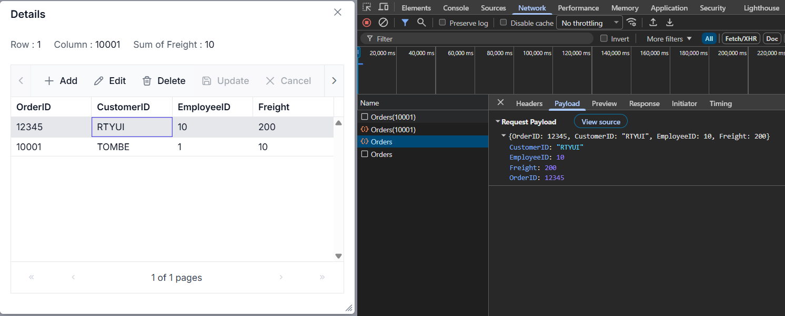

# OData Remote Data Binding in Syncfusion React Pivot Table

The [ODataV4Adaptor](https://ej2.syncfusion.com/react/documentation/data/adaptors/odatav4-adaptor) in the Syncfusion<sup style="font-size:70%">&reg;</sup> React DataManager enables seamless integration between the React Pivot Table and OData V4 services by handling OData‑formatted request and response processing. It converts Pivot Table CRUD operations into OData V4-compliant requests and sends them to the server. The adaptor also parses the structured OData V4 JSON response, extracting the result set and count values, ensuring smooth remote data binding for the Pivot Table without custom query or response logic.

**What is the DataManager?**

The [DataManager](https://ej2.syncfusion.com/react/documentation/data/getting-started) is a data source manager used by Syncfusion<sup style="font-size:70%">&reg;</sup> React components to handle data operations. It acts as a bridge between the Pivot Table and the data source (local array, REST API, OData, GraphQL, etc.). The [DataManager](https://ej2.syncfusion.com/react/documentation/data/getting-started) is responsible for fetching data and performing CRUD operations, while communicating with the appropriate endpoint using the configured adaptor.

**What is the ODataV4Adaptor?**

The [ODataV4Adaptor](https://ej2.syncfusion.com/react/documentation/data/adaptors/odatav4-adaptor) is an adaptor available in the [DataManager](https://ej2.syncfusion.com/react/documentation/data/getting-started) that is specifically designed to interact with OData V4 services. The [ODataV4Adaptor](https://ej2.syncfusion.com/react/documentation/data/adaptors/odatav4-adaptor) facilitates seamless communication with OData V4 endpoints, enabling efficient data operations while ensuring full OData V4 protocol compliance. It sends HTTP requests to OData V4 endpoints and parses the structured OData V4 JSON response in the format `{ "@odata.context": "<metadata-url>", value: [] }`, which the Pivot Table understands. This adaptor also supports CRUD operations through standard HTTP methods (GET, POST, PATCH, DELETE) using OData V4-compliant payloads.

**Key benefits of the ODataV4Adaptor approach:**

- **Full OData V4 protocol compliance**: Built specifically for OData V4 services, ensuring standardized request and response formats across the entire application.
- **Standardized CRUD payload support**: Sends OData V4-compliant payloads for Create, Read, Update, and Delete operations, eliminating custom request body construction.
- **Reduced complexity**: Removes the need for custom CRUD request formatting and response parsing logic on the client side, since the adaptor handles these automatically.
- **Seamless component integration**: Works out of the box with Syncfusion<sup style="font-size:70%">&reg;</sup> React components like the Pivot Table, enabling end-to-end OData scenarios with minimal configuration.
- **Server-side data processing**: Leverages the OData V4 infrastructure on the backend for efficient CRUD handling, reducing payload size and improving performance.
- **Open standard support**: As OASIS standard, OData V4 is supported by a wide range of platforms, services, and tools, enabling long-term maintainability and interoperability.
- **Automatic CRUD handling**: The adaptor automatically manages HTTP verbs (GET, POST, PATCH, DELETE) for CRUD operations and parses OData V4-compliant responses without custom transformation logic.

## Prerequisites

Ensure the following software and packages are installed before proceeding:

| Software/Package | Version | Purpose |
| ------------------ | -------- | --------- |
| Node.js | 18.x or later | Runtime for React development |
| React | 18.x or later | Create and run React applications |
| TypeScript | 5.x or later | Type-checks the `.tsx` client source used in this sample |
| .NET SDK | 8.0 or later | Build and run ASP.NET Core Web API |
| Visual Studio or Visual Studio Code | Latest | Configure the backend API service |
| @syncfusion/ej2-react-pivotview | 33.1.45 or later | React Pivot Table component |
| Microsoft.AspNetCore.OData | 8.0.x or later | OData V4 services for ASP.NET Core |
| Microsoft.AspNetCore.Mvc.NewtonsoftJson | 8.0.x or later | Preserves original property casing during JSON serialization |

## Setting up the ASP.NET Core Backend API

The ASP.NET Core Web API is the backend service that supplies data to the React Pivot Table. It listens for HTTP requests from the Pivot Table, returns data in the format the component expects, and accepts CRUD operations from the client. In this section, you will create the project, install the required packages, build the model and controller, configure JSON serialization and CORS, and finally run the API locally.

### Step 1: Create the ASP.NET Core Web API project





#### Create a new ASP.NET Core Web API project in Visual Studio

To create a new ASP.NET Core Web API project named **ODataV4Adaptor** in Visual Studio, follow these steps:

1. Open **Visual Studio**.
2. Select **Create a new project**.
3. Choose the **ASP.NET Core Web API** project template.
4. Name the project **ODataV4Adaptor**.
5. Click **Create**.





#### Create a new ASP.NET Core Web API project in Visual Studio Code

To create the project using Visual Studio Code, open the integrated terminal by pressing <kbd>Ctrl</kbd>+<kbd>`</kbd> and run the following commands:





dotnet new webapi -n ODataV4Adaptor --use-controllers
cd ODataV4Adaptor





The above command creates a project with a **Controllers** folder. To create a **Models** folder, run the following command:





mkdir Models









### Step 2: Install required NuGet packages

Two NuGet packages are required for this project: `Microsoft.AspNetCore.OData` for OData V4 service support and `Microsoft.AspNetCore.Mvc.NewtonsoftJson` for JSON serialization support that preserves the original property casing of the data source.

#### Install the Microsoft.AspNetCore.OData package

The `Microsoft.AspNetCore.OData` package provides the OData V4 services, routing, and query support required by the controller and the `Program.cs` configuration (steps 5–6).

**In Visual Studio:**

Navigate to **Tools** → **NuGet Package Manager** → **Manage NuGet Packages for Solution**. Search for `Microsoft.AspNetCore.OData`, select it, and click **Install**. Ensure the package is installed in the **ODataV4Adaptor** project.

**Via package manager console:**

```bash
Install-Package Microsoft.AspNetCore.OData
```

**Via .NET CLI:**

```bash
dotnet add package Microsoft.AspNetCore.OData
```

#### Install the Microsoft.AspNetCore.Mvc.NewtonsoftJson package

The `Microsoft.AspNetCore.Mvc.NewtonsoftJson` package provides the necessary formatters to handle JSON data correctly and to preserve the original property casing of the data source.

#### Installation options

**In Visual Studio:**

Navigate to **Tools** → **NuGet Package Manager** → **Manage NuGet Packages for Solution**. Search for `Microsoft.AspNetCore.Mvc.NewtonsoftJson`, select it, and click **Install**. Ensure the package is installed in the **ODataV4Adaptor** project.

**Via package manager console:**

```bash
Install-Package Microsoft.AspNetCore.Mvc.NewtonsoftJson
```

**Via .NET CLI:**

```bash
dotnet add package Microsoft.AspNetCore.Mvc.NewtonsoftJson
```

### Step 3: Create a model class

The model class represents the structure of the data displayed in the Pivot Table. Create a model class named **OrdersDetails.cs** in the **Models** folder to represent the order data structure. This class also contains a static list of sample order data, which simulates a data source for demonstration purposes. In a real application, this data would typically be fetched from a database.




using System.ComponentModel.DataAnnotations;

namespace ODataV4Adaptor.Models
{
    public class OrdersDetails
    {
        public static List<OrdersDetails> order = new List<OrdersDetails>();
        public OrdersDetails()
        {

        }
        public OrdersDetails(
        int OrderID, string CustomerId, int EmployeeId, double Freight)
        {
            this.OrderID = OrderID;
            this.CustomerID = CustomerId;
            this.EmployeeID = EmployeeId;
            this.Freight = Freight;
        }

        public static List<OrdersDetails> GetAllRecords()
        {
            if (order.Count() == 0)
            {
                int code = 10000;
                for (int i = 1; i <= 9; i++)
                {
                    order.Add(new OrdersDetails(code + 1, "ALFKI", i + 0, 10.0));
                    order.Add(new OrdersDetails(code + 2, "ANATR", i + 2, 20.0));
                    order.Add(new OrdersDetails(code + 3, "ANTON", i + 1, 30.0));
                    order.Add(new OrdersDetails(code + 4, "BLONP", i + 3, 40.0));
                    order.Add(new OrdersDetails(code + 5, "BOLID", i + 4, 50.0));
                    code += 5;
                }
            }
            return order;
        }
        [Key]
        public int? OrderID { get; set; }
        public string? CustomerID { get; set; }
        public int? EmployeeID { get; set; }
        public double? Freight { get; set; }
    }
}




**Table Structure Explanation:**

| Column | Data Type | Description |
|--------|-----------|-------------|
| OrderID | int? | Unique identifier for each order (serves as the primary key) |
| CustomerID | string? | Identifier of the customer who placed the order |
| EmployeeID | int? | Identifier of the employee handling the order |
| Freight | double? | Shipping cost for the order |

### Step 4: Create an API controller

Create a file named `OrdersController.cs` under the **Controllers** folder to handle data communication between the Pivot Table and the backend. This controller exposes the HTTP endpoints that the Pivot Table uses to retrieve and modify data. The `Get()` method returns a list of sample order data for the Pivot Table to read from the configured report.




using Microsoft.AspNetCore.Mvc;
using Microsoft.AspNetCore.OData.Query;
using Microsoft.AspNetCore.OData.Routing.Controllers;
using ODataV4Adaptor.Models;

namespace ODataV4Adaptor.Controllers
{
    [Route("[controller]")]
    [ApiController]
    public class OrdersController : ODataController
    {
        // READ: Get all orders
        [HttpGet]
        [EnableQuery]
        public IActionResult Get()
        {
            var data = OrdersDetails.GetAllRecords().AsQueryable();
            return Ok(data);
        }
    }
}




> The `Get()` method retrieves sample order data. Replace this with custom logic to fetch data from a database or any other data source as needed.

### Step 5: Configure Program.cs

The `Program.cs` file configures all the services and middleware for the ASP.NET Core application: the OData V4 Entity Data Model, OData services, JSON serialization, and CORS. The sections below explain each part; the complete consolidated `Program.cs` is provided at the end of this step.

#### Build the OData Entity Data Model

To construct the Entity Data Model (EDM) for your ODataV4 service, use the `ODataConventionModelBuilder` to define the model's structure. Start by creating an instance of the `ODataConventionModelBuilder`, and then register the entity set **Orders** using the `EntitySet<T>` method, where `OrdersDetails` represents the CLR type containing order details.

```cs
using Microsoft.OData.ModelBuilder;

// Create the web application builder.
var builder = WebApplication.CreateBuilder(args);

// Create an ODataConventionModelBuilder to build the OData model
var modelBuilder = new ODataConventionModelBuilder();

// Register the "Orders" entity set with the OData model builder
modelBuilder.EntitySet<OrdersDetails>("Orders");
```

#### Register the ODataV4 services

Register the OData V4 services in the service collection. The `AddControllers().AddOData(...)` call registers the OData route components under the `odata` route prefix, enables the `$count` query option, and applies the EDM model. Chain `.AddNewtonsoftJson(...)` onto the same `AddControllers()` call so both OData formatters and Newtonsoft JSON formatters are configured on a single MVC pipeline (registering them separately can cause one to override the other).

```cs
using Microsoft.AspNetCore.OData;
using Newtonsoft.Json.Serialization;

// Add controllers with OData support and Newtonsoft JSON serialization.
builder.Services.AddControllers()
    .AddOData(options => options
        .Count()
        .AddRouteComponents("odata", modelBuilder.GetEdmModel()))
    .AddNewtonsoftJson(options =>
    {
        // Preserves the original property casing of the data source.
        options.SerializerSettings.ContractResolver = new DefaultContractResolver();
    });
```

> **Why chain `AddNewtonsoftJson` to `AddControllers`?** Calling `builder.Services.AddMvc().AddNewtonsoftJson(...)` separately from `AddControllers().AddOData(...)` registers two MVC pipelines. The second registration can override the formatters of the first, causing either OData serialization or property-casing preservation to stop working. Chaining both onto the same `AddControllers()` call keeps a single pipeline and both features active.

#### Configure CORS

CORS (Cross-Origin Resource Sharing) is a browser security feature that blocks web pages from making requests to a different domain or port. When the React frontend (for example, `https://localhost:3000`) and the ASP.NET Core backend (for example, `https://localhost:5001`) run on different ports, browsers block cross-origin requests by default. Configuring CORS in the backend tells the browser that the API is allowed to accept requests from the frontend origin, enabling the two services to communicate.

```cs
// Add CORS policy to allow frontend access.
// WARNING: AllowAnyOrigin() is for development only. In production, restrict to your frontend domain.
builder.Services.AddCors(options =>
{
  options.AddDefaultPolicy(policy =>
  {
    policy.AllowAnyOrigin()      // Allow requests from any origin (development only; restrict in production).
          .AllowAnyMethod()       // Allow GET, POST, PUT, DELETE, etc.
          .AllowAnyHeader();      // Allow any request headers.
  });
});
```

The following error occurs when CORS is not configured:

```
Access to XMLHttpRequest at 'https://localhost:<port>/odata/Orders' from origin 
'https://localhost:3000' has been blocked by CORS policy.
```

**Production CORS configuration:** Replace `AllowAnyOrigin()` with a specific frontend URL:
```cs
policy.WithOrigins("https://yourdomain.com")  // Restrict to your frontend domain.
```

#### Build the app pipeline

After registering the services, build the application pipeline. The middleware order matters: `UseCors()` should be called before `app.MapControllers()` so CORS headers are applied to the controller responses. Static file support (`UseDefaultFiles` and `UseStaticFiles`) is optional for the development workflow shown here (the React client runs on its own dev server) and is only required if you plan to serve the built React bundle directly from the ASP.NET Core host.

```cs
var app = builder.Build();

// Enable CORS middleware (must be called before MapControllers).
app.UseCors();

// Optional: serve the built React app from wwwroot when not using a separate dev server.
app.UseDefaultFiles();
app.UseStaticFiles();

// Map controller endpoints
app.MapControllers();

app.Run();
```

#### Complete Program.cs

The following is the complete `Program.cs` file with all the configuration applied:

```cs
using Microsoft.AspNetCore.OData;
using Microsoft.OData.ModelBuilder;
using Newtonsoft.Json.Serialization;
using ODataV4Adaptor.Models;

var builder = WebApplication.CreateBuilder(args);

// Build the OData Entity Data Model (EDM).
var modelBuilder = new ODataConventionModelBuilder();
modelBuilder.EntitySet<OrdersDetails>("Orders");

// Add controllers with OData support and Newtonsoft JSON serialization (preserves property casing).
builder.Services.AddControllers()
    .AddOData(options => options
        .Count()
        .AddRouteComponents("odata", modelBuilder.GetEdmModel()))
    .AddNewtonsoftJson(options =>
    {
        options.SerializerSettings.ContractResolver = new DefaultContractResolver();
    });

// Configure CORS (development only; restrict to specific origins in production).
builder.Services.AddCors(options =>
{
    options.AddDefaultPolicy(policy =>
    {
        policy.AllowAnyOrigin()
              .AllowAnyMethod()
              .AllowAnyHeader();
    });
});

var app = builder.Build();

app.UseCors();           // Enable CORS before MapControllers.
app.UseDefaultFiles();   // Optional: serves index.html from wwwroot.
app.UseStaticFiles();    // Optional: serves static assets from wwwroot.
app.MapControllers();

app.Run();
```

### Step 6: Run the backend API

Open a terminal in the project folder and run:

```bash
dotnet run
```

The application will be accessible at a URL like `https://localhost:<port>`. To verify that the API returns order data correctly, navigate to `https://localhost:<port>/odata/Orders`, where `<port>` is the port number assigned by the CLI output.

### Step 7: Understanding the required response format

When using the [ODataV4Adaptor](https://ej2.syncfusion.com/react/documentation/data/adaptors/odatav4-adaptor), every backend API endpoint must return data in a specific JSON structure. This ensures that Syncfusion<sup style="font-size:70%">&reg;</sup> React DataManager can correctly interpret the response and bind it to the component. The expected format is:

```json
{
  "@odata.context": "https://localhost:<port>/odata/$metadata#Orders",
  "value": [
    { "OrderID": 10001, "CustomerID": "ALFKI", "EmployeeID": 1, "Freight": 10.0 },
    { "OrderID": 10002, "CustomerID": "ANATR", "EmployeeID": 3, "Freight": 20.0 },
    { "OrderID": 10003, "CustomerID": "ANTON", "EmployeeID": 2, "Freight": 30.0 },
    { "OrderID": 10004, "CustomerID": "BLONP", "EmployeeID": 4, "Freight": 40.0 },
    { "OrderID": 10005, "CustomerID": "BOLID", "EmployeeID": 5, "Freight": 50.0 }
  ]
}
```

- **@odata.context**: The metadata URL that describes the entity set and model returned by the endpoint (for example, `https://localhost:<port>/odata/$metadata#Orders`). The OData V4 middleware generates this automatically; it is used by clients to discover the schema of the response payload.
- **value**: Returns the data records for the current page/request displayed in the UI.

## Setting up the React Pivot Table client

With the backend API configured and running, the next step is to connect the React Pivot Table to it on the client side. This section explains how to integrate the Pivot Table with the backend using the [ODataV4Adaptor](https://ej2.syncfusion.com/react/documentation/data/adaptors/odatav4-adaptor).

### Step 1: Set up a React project with Pivot Table

Set up a React project with the Pivot Table by following the [Getting Started](../getting-started) documentation. Ensure that all necessary Syncfusion<sup style="font-size:70%">&reg;</sup> EJ2 Pivot Table dependencies are installed in the React project.

### Step 2: Configure the Pivot Table with ODataV4Adaptor

The Pivot Table connects to the backend API through the [ODataV4Adaptor](https://ej2.syncfusion.com/react/documentation/data/adaptors/odatav4-adaptor). This adaptor handles communication between the Pivot Table and the REST API endpoint. Configure the Pivot Table in the React application as shown in the following code example.





import * as React from 'react';
import { PivotViewComponent } from '@syncfusion/ej2-react-pivotview';
import { DataManager, ODataV4Adaptor } from '@syncfusion/ej2-data';
import type { DataSourceSettingsModel } from '@syncfusion/ej2-pivotview/src/model/datasourcesettings-model';
import './App.css';

function App(): React.ReactElement {
    // Configure DataManager with ODataV4Adaptor.
    const data: DataManager = new DataManager({
        url: 'http://localhost:<port>/odata/Orders',
        adaptor: new ODataV4Adaptor(),
    });

    const dataSourceSettings: DataSourceSettingsModel = {
        dataSource: data,
        expandAll: false,
        rows: [{ name: 'CustomerID' }],
        columns: [{ name: 'OrderID' }],
        values: [{ name: 'Freight' }],
        formatSettings: [{ name: 'Freight', format: 'N0' }],
    };

    const pivotObj = React.useRef<PivotViewComponent>(null);

    return (
        <div className='control-section' style={{ margin: 100 }}>
            <PivotViewComponent ref={pivotObj} id='PivotView' height={350} width={700} dataSourceSettings={dataSourceSettings}>
            </PivotViewComponent>
        </div>
    );
}

export default App;





**Code Explanation:**

- [DataManager](https://ej2.syncfusion.com/react/documentation/data/getting-started): Creates a typed data source that targets the ASP.NET Core Web API endpoint at `http://localhost:<port>/odata/Orders`. Replace `<port>` with the port number shown in the `dotnet run` output. The `DataManager` type annotation (`: DataManager`) lets the TypeScript compiler validate the configuration object.
- [ODataV4Adaptor](https://ej2.syncfusion.com/react/documentation/data/adaptors/odatav4-adaptor): Tells the [DataManager](https://ej2.syncfusion.com/react/documentation/data/getting-started) to use the OData V4 adaptor, which automatically handles OData V4-compliant HTTP requests and JSON response parsing for the Pivot Table.
- [dataSourceSettings](https://ej2.syncfusion.com/react/documentation/api/pivotview/index-default#datasourcesettings): Typed with `DataSourceSettingsModel` so the row, column, value, and format string definitions are checked at compile time. It defines the Pivot Table layout:
  - [rows](https://ej2.syncfusion.com/react/documentation/api/pivotview/datasourcesettingsmodel#rows): Displays **CustomerID** values as row headers.
  - [columns](https://ej2.syncfusion.com/react/documentation/api/pivotview/datasourcesettingsmodel#columns): Displays **OrderID** values as column headers.
  - [values](https://ej2.syncfusion.com/react/documentation/api/pivotview/datasourcesettingsmodel#values): Aggregates the **Freight** field based on the row and column combinations.
  - [formatSettings](https://ej2.syncfusion.com/react/documentation/api/pivotview/datasourcesettingsmodel#formatsettings): Applies a number format (`N0`) so that aggregated values are displayed without decimals.
- [PivotViewComponent](https://ej2.syncfusion.com/react/documentation/api/pivotview/index-default): Renders the Pivot Table with the configured data and layout. The `ref` is typed with `React.useRef<PivotViewComponent>(null)` so the Pivot Table instance can be accessed in a type-safe way from other parts of the component.

### Step 3: Run and verify the Pivot Table

**Start the ASP.NET Core API server:**

Open a terminal in the backend project folder and run:

```bash
dotnet run
```

The server will start and listen on `https://localhost:<port>` by default. The API endpoint will be available at `http://localhost:<port>/odata/Orders`. Note the `<port>` number from the output (typically 5001, 7181, or 5092).

**Start the React application:**

Open a separate terminal in the client application folder and run:

```bash
npm run dev
```

Once both the server and client are running:

- The Pivot Table retrieves data from the backend API through the [ODataV4Adaptor](https://ej2.syncfusion.com/react/documentation/data/adaptors/odatav4-adaptor) and displays it according to the defined report layout.
- The resulting Pivot Table appears as shown in the following image:


The Pivot Table is now successfully connected to the backend API and displays the data in the configured layout.

### Verify data binding

To confirm the API is working correctly:
1. Open the browser's **Developer Tools** (F12) → **Network** tab.
2. Load the React application. You should see an OData V4-compliant request to `http://localhost:<port>/odata/Orders` with a 200 status and a JSON response containing `@odata.context` and `value`.
3. If the Pivot Table appears empty, check the Network tab for failed requests or the Console tab for JavaScript errors.

## CRUD operations with Pivot Table

The Syncfusion<sup style="font-size:70%">&reg;</sup> React Pivot Table supports CRUD (Create, Read, Update, Delete) operations. When an edit action (add, update, or delete) is performed through the Pivot Table's built-in editing pop-up, the [DataManager](https://ej2.syncfusion.com/react/documentation/data/getting-started) automatically sends an HTTP request to the corresponding server endpoint. The server processes the operation and returns the updated data. This enables the following operations:

- **Create**: Add new records through the Pivot Table editing pop-up.
- **Read**: Display data from the backend (already configured by the `Get()` method in Step 4).
- **Update**: Edit existing records in place.
- **Delete**: Remove records from the data source.

### Implement backend CRUD methods

Extend the **OrdersController.cs** file by adding `Post`, `Patch`, and `Delete` methods. These methods are called automatically when data is edited through the Pivot Table. Before editing can be triggered, double-click any pivot cell to open the drill-through (edit) grid — all CRUD operations in the following subsections are performed from that grid.

#### Insert operation

To add a new record, double-click a pivot cell to open the editing pop-up, then click the **Add** button to create a new empty row. Enter the required data in the row fields and click the **Update** button to save the record. Use the `HttpPost` method in the controller for the insert operation. The new record details are passed through the **addRecord** parameter.

```cs

// CREATE: Insert new order
[HttpPost]
[EnableQuery]
// [Route("Insert")]
public IActionResult Post([FromBody] OrdersDetails addRecord)
{
    if (addRecord == null)
    {
        return BadRequest("Order cannot be null");
    }

    // Add to the beginning of the list
    OrdersDetails.GetAllRecords().Insert(0, addRecord);
    return Created(addRecord);
}

```



#### Update operation

To modify an existing record, double-click a pivot cell to open the editing pop-up, select the row to edit, and click the **Edit** button. After making the required changes, click **Update** to save them. Use the `HttpPatch` method in the controller for the update operation. The updated record details are passed through the **updatedOrder** parameter.

```cs

// UPDATE: Modify existing order
[HttpPatch("{key}")]
public IActionResult Patch(int key, [FromBody] OrdersDetails updatedOrder)
{
    if (updatedOrder == null)
    {
        return BadRequest("Order data cannot be null");
    }

    var existingOrder = OrdersDetails.GetAllRecords().FirstOrDefault(o => o.OrderID == key);
    if (existingOrder == null)
    {
        return NotFound();
    }

    // Update properties (null-coalescing handles partial updates)
    existingOrder.CustomerID = updatedOrder.CustomerID ?? existingOrder.CustomerID;
    existingOrder.EmployeeID = updatedOrder.EmployeeID ?? existingOrder.EmployeeID;
    existingOrder.Freight = updatedOrder.Freight ?? existingOrder.Freight;

    return Ok(existingOrder);
}

```


**How it works:**

- The `Patch` method locates the existing record by matching the **OrderID** with the primary key sent in the request.
- If a matching record is found, its properties are updated with the new values received from the Pivot Table.

#### Delete operation

To remove a record, double-click a pivot cell to open the editing pop-up, select the row to delete, and click the **Delete** button. Use the `HttpDelete` method in the controller for the delete operation. The primary key value of the record to be removed is passed through the **key** route parameter (for example, `DELETE /odata/Orders(10001)`).

**Response format:** The Remove endpoint should return a 200 OK status (or 204 No Content). The response body is not parsed; only the HTTP status code matters. On success, the Pivot Table automatically refreshes.

```cs
// DELETE: Remove order
[HttpDelete("{key}")]
public IActionResult Delete(int key)
{
    var order = OrdersDetails.GetAllRecords().FirstOrDefault(o => o.OrderID == key);
    if (order == null)
    {
        return NotFound();
    }

    OrdersDetails.GetAllRecords().Remove(order);
    return NoContent(); // 204 No Content is standard for successful DELETE
}
```

**How it works:**

- The `Delete` method extracts the **OrderID** from the `key` route value of the request URL (for example, `/odata/Orders(10001)`).
- It searches the in-memory data collection for a matching record and removes it if found.

#### Error handling in CRUD operations

If a CRUD endpoint returns a non-2xx HTTP status code (for example, 400, 404, 500) or returns invalid JSON, the [DataManager](https://ej2.syncfusion.com/react/documentation/data/getting-started) will:
1. Log the error to the browser console for debugging.
2. Close the edit dialog without applying changes.
3. Keep the Pivot Table in its current state.

**Best practice:** Always include try-catch blocks in backend CRUD methods and return appropriate HTTP status codes:
```cs
try {
    // CRUD logic here
    return Ok();  // 200 OK
} catch (Exception ex) {
    return BadRequest(ex.Message);  // 400 Bad Request
}
```

### Configure client-side CRUD endpoints

Update the React **App.tsx** file to enable editing in the Pivot Table. With the ODataV4Adaptor, CRUD routes are derived automatically from the OData conventions and the single `url` configured on the [DataManager](https://ej2.syncfusion.com/react/documentation/data/getting-started) (for example, `POST /odata/Orders`, `PATCH /odata/Orders(<key>)`, `DELETE /odata/Orders(<key>)`), so no separate CRUD URLs need to be set on the client. This involves two steps: enabling edit settings on the Pivot Table and configuring the `beginDrillThrough` event to set the primary key.

#### Enable edit settings

Import the `CellEditSettings` type from `@syncfusion/ej2-react-pivotview` and configure the [editSettings](https://ej2.syncfusion.com/react/documentation/api/pivotview/index-default#editsettings) property to enable CRUD operations in the Pivot Table. Typing the constant with `CellEditSettings` lets the TypeScript compiler validate the edit configuration at build time:

```typescript
import { PivotViewComponent, CellEditSettings } from '@syncfusion/ej2-react-pivotview';

// ...

  // Enable editing functionality
  const editSettings: CellEditSettings = {
    allowEditing: true,    // Enables the Edit button and allows users to modify existing records.
    allowAdding: true,     // Enables the Add button and allows users to create new records.
    allowDeleting: true,   // Enables the Delete button and allows users to remove records.
    mode: 'Normal'         // Uses Normal mode (popup dialog) for editing; other options: 'Dialog', 'Batch', 'CommandColumn'.
  };

  return (
    <PivotViewComponent
      id='PivotView'
      ref={pivotObj}
      editSettings={editSettings}
      >
    </PivotViewComponent>
  );
```

The Pivot Table supports different editing modes (Normal, Dialog, Batch, and Command Column) that can be configured using the [mode](https://ej2.syncfusion.com/react/documentation/api/pivotview/celleditsettingsmodel#mode) property. For detailed information about each editing mode and its usage, refer to the [Editing documentation](https://ej2.syncfusion.com/react/documentation/pivotview/editing).

#### Configure primary key for editing

**What is drill-through editing?**

Drill-through editing opens a detailed data grid showing all source records when you click a pivot cell. This grid is where users add, edit, or delete individual records that feed into the pivot summary. The [beginDrillThrough](https://ej2.syncfusion.com/react/documentation/pivotview/drill-through#begindrillthrough) event is triggered just before this edit grid opens. This is where the primary key column is configured.

**Why is the primary key important?**

The primary key (**OrderID**) uniquely identifies each record. When the [DataManager](https://ej2.syncfusion.com/react/documentation/data/getting-started) performs update or delete operations, it uses the primary key to locate the exact record to modify. Without a correctly configured primary key, the [DataManager](https://ej2.syncfusion.com/react/documentation/data/getting-started) cannot identify which record to update or delete, and the request will fail.

Configure the primary key by importing the `BeginDrillThroughEventArgs` type from `@syncfusion/ej2-pivotview` and annotating the event handler parameter. Typing the `args` parameter ensures the TypeScript compiler can validate accesses to `args.gridObj.columns`:

```typescript
import type { BeginDrillThroughEventArgs } from '@syncfusion/ej2-pivotview';

// ...

    // Configure the beginDrillThrough event to set the primary key for CRUD operations
    function beginDrillThrough(args: BeginDrillThroughEventArgs) {
        // Iterate through all columns in the drill-through grid
        for (var i = 0; i < args.gridObj.columns.length; i++) {
            // Check if the current column is the primary key column
            if (args.gridObj.columns[i].field === "OrderID") {
                // Mark this column as the primary key
                args.gridObj.columns[i].isPrimaryKey = true;
            } else {
                // Make all other columns visible so users can view and edit them
                args.gridObj.columns[i].visible = true;
                // Configure the edit type for date fields to use a date-time picker when editing
                if (args.gridObj.columns[i].field === 'OrderDate' || args.gridObj.columns[i].field === 'ShippedDate') {
                    args.gridObj.columns[i].editType = 'datetimepickeredit';
                }
            }
        }
    }

  return (
    <PivotViewComponent
      id='PivotView'
      ref={pivotObj}
      beginDrillThrough={beginDrillThrough}
      >
    </PivotViewComponent>
  );
```

**How it works:**

- The event iterates through all columns in the drill-through (edit) grid.
- The column whose `field` matches the primary key name (`OrderID`) is flagged with `isPrimaryKey = true`. This tells the [DataManager](https://ej2.syncfusion.com/react/documentation/data/getting-started) which field uniquely identifies each record.

### Important notes

- **Primary key field**: The primary key field (**OrderID**) cannot be modified during editing. Changing it causes data inconsistency because it uniquely identifies each record.
- **Real-time updates**: After each CRUD operation, the Pivot Table automatically refreshes to display the updated data from the backend.
- **Edit modes**: The Pivot Table supports different editing modes (Normal, Dialog, Batch, and Command Column) that can be configured using the [mode](https://ej2.syncfusion.com/react/documentation/api/pivotview/celleditsettingsmodel#mode) property. For details, refer to the [Editing documentation](https://ej2.syncfusion.com/react/documentation/pivotview/editing).

## Best Practices for ODataV4Adaptor Integration

### 1. API Design

- **Consistent response shape**: Always return the `{ "@odata.context", value }` structure from data endpoints. The OData V4 middleware generates the `@odata.context` metadata URL automatically, and the Pivot Table uses the `value` array to display the records.

### 2. Property Casing

- **Preserve original casing**: Use `DefaultContractResolver` in **Program.cs** so the API response uses the same casing as your model classes. Mismatched casing leads to empty Pivot Table layouts because field bindings become case-sensitive.

### 3. Security

- **Restrict CORS in production**: The `AllowAnyOrigin` policy is intended for development. In production, restrict allowed origins to the specific domain of your React application by using `policy.WithOrigins("https://yourdomain.com")`.
- **Use HTTPS**: Always expose the API over HTTPS in production to protect data in transit.

### 4. Error Handling

- **Wrap operations in try-catch**: Catch database or serialization exceptions in the controller methods and return a meaningful HTTP status code (for example, 400 for bad requests, 500 for server errors). See the inline error-handling guidance in the [CRUD operations](#error-handling-in-crud-operations) section for a code pattern.
- **Log failures**: Use the built-in ASP.NET Core logging to capture request and error details. The logs make it easier to diagnose issues when running the API in a production environment.

### 5. Performance

- **Response payload optimization**: Keep the `value` array focused on the fields the Pivot Table actually binds to. Although `@odata.context` and the `value` array are the only required top-level properties for the basic response, you can add `$count=true` (or the `$count` segment) to the OData query when server-side paging is needed — the middleware then returns an additional `@odata.count` field reflecting the total record count across all pages.
- **Asynchronous endpoints**: For large data sources, consider making the controller methods `async` and using asynchronous database calls to free up server threads.

## Troubleshooting

The following table lists common issues and their resolutions when working with the [ODataV4Adaptor](https://ej2.syncfusion.com/react/documentation/data/adaptors/odatav4-adaptor) and the Pivot Table. Each scenario includes the symptom you might observe and a step-by-step resolution.

| Issue | Symptom | Resolution |
|-------|---------|-----------|
| **Empty Pivot Table** | The Pivot Table loads without errors, but no rows or values are shown. | Verify that `GetAllRecords()` returns data correctly and the response follows the `{ "@odata.context", value }` format. Also confirm that the property names returned by the API match the field names used in `dataSourceSettings`. |
| **404 error** | Network tab shows a 404 response when the Pivot Table tries to load data. | Ensure the controller route is configured as `[Route("[controller]")]` (matching the `/odata/Orders` endpoint registered via `AddRouteComponents("odata", ...)` in **Program.cs**) and the API server is running. Verify the URL in the React [DataManager](https://ej2.syncfusion.com/react/documentation/data/getting-started) matches the actual API port. |
| **500 error** | The Pivot Table fails to load, and the browser shows a server error. | Check the Visual Studio Output window or the terminal for server logs and error details. Common causes include null reference exceptions and serialization errors. |
| **CORS error** | Browser console shows: `Access to XMLHttpRequest at 'http://localhost:5092/odata/Orders' from origin 'https://localhost:3000' has been blocked by CORS policy.` | Verify that CORS is properly configured in **Program.cs** and `app.UseCors()` is called before `app.MapControllers()`. |
| **CRUD operations not saving** | The Pivot Table editing pop-up closes, but the changes are not reflected in the data source. | Ensure the primary key is correctly configured in the `beginDrillThrough` event (so the [DataManager](https://ej2.syncfusion.com/react/documentation/data/getting-started) can target the right record) and that the backend `Post`, `Patch`, and `Delete` methods resolve under the OData route prefix configured in **Program.cs**. |
| **Property casing mismatch** | The Pivot Table appears empty or shows a "field not found" warning, even though the API returns data. | Confirm that `DefaultContractResolver` is added in **Program.cs** to preserve original property casing. Without it, the API returns camelCase property names that do not match the field names configured in the Pivot Table. |
| **Pivot Table loads slowly** | The Pivot Table takes a long time to render or becomes unresponsive. | Ensure the API only returns the fields the Pivot Table needs (keep the `value` array lean) and that the OData V4 middleware is generating the response from a queryable source. For large data sources, consider implementing server-side aggregation to reduce the payload returned to the client. |
| **SSL/TLS certificate error** | Browser console shows: `net::ERR_CERT_AUTHORITY_INVALID` or browser warning about untrusted certificate. | ASP.NET Core uses a self-signed certificate for localhost HTTPS by default. In development, the certificate is usually auto-generated. If the error persists, run `dotnet dev-certs https --clean` followed by `dotnet dev-certs https --trust` to regenerate and trust the certificate. (Windows/macOS only; on Linux, manually trust the certificate or use HTTP for local testing.) |

## Complete sample repository

For a complete working implementation, refer to the [GitHub repository](https://github.com/SyncfusionExamples/odatav4-adaptor-with-pivot-table).

## See Also

- [**PivotTable Data Binding**](https://ej2.syncfusion.com/react/documentation/pivotview/data-binding)
- [**DataManager**](https://ej2.syncfusion.com/react/documentation/data/getting-started)
- [**ODataV4Adaptor**](https://ej2.syncfusion.com/react/documentation/data/adaptors/odatav4-adaptor)
- [**PivotTable Editing**](https://ej2.syncfusion.com/react/documentation/pivotview/editing)
