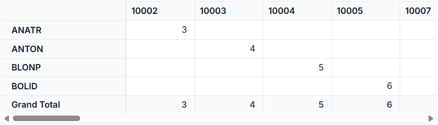
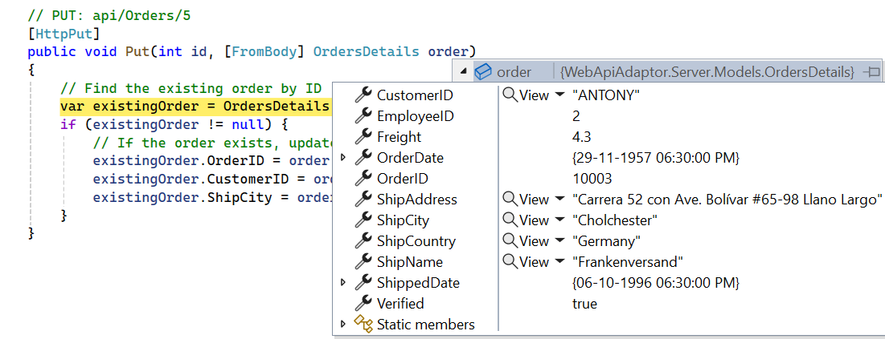
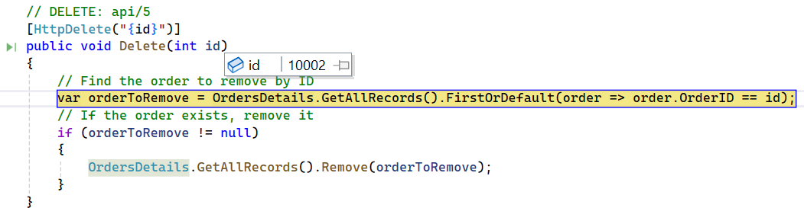

# ASP.NET Web API Remote Data Binding in React Pivot Table

The [WebApiAdaptor](https://ej2.syncfusion.com/react/documentation/data/adaptors/webapi-adaptor) connects the React Pivot Table with ASP.NET Web API endpoints that support OData-style querying. Since it is derived from the `ODataAdaptor`, the Web API must accept OData-formatted query parameters.

## How it works

When performing data operations in the Pivot Table, OData-formatted query strings are sent to the Web API endpoint. The Web API processes these requests and returns data in JSON format. The [WebApiAdaptor](https://ej2.syncfusion.com/react/documentation/data/adaptors/webapi-adaptor) then processes the returned data and displays it in the Pivot Table. This approach allows easy remote data binding with Web API services that support OData, without requiring additional configuration or data transformation.

**What is the DataManager?**

The [DataManager](https://ej2.syncfusion.com/react/documentation/data/getting-started) is a data source manager used by Syncfusion<sup style="font-size:70%">&reg;</sup> React components to handle data operations. It acts as a bridge between the Pivot Table and the data source (local array, REST API, OData, GraphQL, etc.). The [DataManager](https://ej2.syncfusion.com/react/documentation/data/getting-started) is responsible for fetching data and performing CRUD operations, while communicating with the appropriate endpoint using the configured adaptor.

**What is the WebApiAdaptor?**

The [WebApiAdaptor](https://ej2.syncfusion.com/react/documentation/data/adaptors/webapi-adaptor) is an adaptor available in the [DataManager](https://ej2.syncfusion.com/react/documentation/data/getting-started) that extends the `ODataAdaptor` and is specifically designed to interact with ASP.NET Web APIs that support OData query conventions. The [WebApiAdaptor](https://ej2.syncfusion.com/react/documentation/data/adaptors/webapi-adaptor) facilitates seamless communication with Web API endpoints, enabling efficient data operations while ensuring compatibility with standard Web API architecture. It sends HTTP requests to Web API endpoints and parses the JSON response in the format `{ Items: [], Count: number }`, which the Pivot Table understands. This adaptor also supports CRUD operations through standard HTTP methods (POST, PUT, DELETE).

**Key benefits of the WebApiAdaptor approach:**

- **ASP.NET Web API compatibility**: Designed specifically for ASP.NET Web API projects with full control over server-side query processing and custom business logic.
- **Flexible response formatting**: Unlike strict OData services, WebApiAdaptor allows custom response formats (`{ Items, Count }`) tailored to your backend architecture.
- **OData-style queries without full OData infrastructure**: Supports OData query syntax without requiring the complete OData V4 framework, reducing overhead and complexity.
- **Existing API integration**: Works seamlessly with existing Web APIs, making it ideal for integrating legacy systems or custom-built services.
- **Full server-side control**: You have complete control over query parameter processing, filtering logic, and data transformation on the backend.
- **Separation of concerns**: The React UI focuses on presentation while the backend handles data access, validation, and business logic independently.

## Prerequisites

Ensure the following software and packages are installed before proceeding:

| Software/Package | Version | Purpose |
| ------------------ | -------- | --------- |
| Node.js | 18.x or later | Runtime for React development |
| React | 18.x or later | Create and run React applications |
| .NET SDK | 8.0 or later | Build and run ASP.NET Core Web API |
| Visual Studio or Visual Studio Code | Latest | Configure the backend API service |
| @syncfusion/ej2-react-pivotview | 33.1.45 or later | React Pivot Table component |
| Microsoft.AspNetCore.Mvc.NewtonsoftJson | 8.0.x or later | Preserves original property casing during JSON serialization |

## Setting up the ASP.NET Core Backend API

The ASP.NET Core Web API is the backend service that supplies data to the React Pivot Table. It listens for HTTP requests from the Pivot Table, returns data in the format the component expects, and accepts CRUD operations from the client. Throughout this section, you will create the project, install the required packages, build the model and controller, configure JSON serialization and CORS, and finally run the API locally.

### Step 1: Create the ASP.NET Core Web API project





#### Create a new ASP.NET Core Web API project in Visual Studio

To create a new ASP.NET Core Web API project named **WebApiAdaptor** in Visual Studio, follow these steps:

1. Open **Visual Studio**.
2. Select **Create a new project**.
3. Choose the **ASP.NET Core Web API** project template.
4. Name the project **WebApiAdaptor**.
5. Click **Create**.





#### Create a new ASP.NET Core Web API project in Visual Studio Code

To create the project using Visual Studio Code, open the integrated terminal by pressing <kbd>Ctrl</kbd>+<kbd>`</kbd> and run the following commands:





dotnet new webapi -n WebApiAdaptor --use-controllers
cd WebApiAdaptor





The above command creates a project with a **Controllers** folder. To create a **Models** folder, run the following command:





mkdir Models









### Step 2: Install required NuGet package

The `Microsoft.AspNetCore.Mvc.NewtonsoftJson` package is required for JSON serialization support in the ASP.NET Core application. This package provides the necessary formatters to handle JSON data correctly and to preserve the original property casing of the data source.

#### Installation options

**In Visual Studio:**

Navigate to **Tools** → **NuGet Package Manager** → **Manage NuGet Packages for Solution**. Search for `Microsoft.AspNetCore.Mvc.NewtonsoftJson`, select it, and click **Install**. Ensure the package is installed in the **WebApiAdaptor** project.

**Via package manager console:**

```bash
Install-Package Microsoft.AspNetCore.Mvc.NewtonsoftJson
```

**Via .NET CLI:**

```bash
dotnet add package Microsoft.AspNetCore.Mvc.NewtonsoftJson
```

### Step 3: Create a model class

The model class represents the structure of the data displayed in the Pivot Table. Create a model class named **OrdersDetails.cs** in the **Models** folder to represent the order data structure. This class also contains a static list of sample order data, which simulates a data source for demonstration purposes. In a real application, this data would typically be fetched from a database.




namespace WebApiAdaptor.Models
{
    public class OrdersDetails
    {
        public static List<OrdersDetails> order = new List<OrdersDetails>();
        public OrdersDetails()
        {

        }

        public OrdersDetails(
        int OrderID, string CustomerId, int EmployeeId, double Freight, bool Verified, DateTime OrderDate, string ShipCity, string ShipName, string ShipCountry, DateTime ShippedDate, string ShipAddress)
        {
            this.OrderID = OrderID;
            this.CustomerID = CustomerId;
            this.EmployeeID = EmployeeId;
            this.Freight = Freight;
            this.ShipCity = ShipCity;
            this.Verified = Verified;
            this.OrderDate = OrderDate;
            this.ShipName = ShipName;
            this.ShipCountry = ShipCountry;
            this.ShippedDate = ShippedDate;
            this.ShipAddress = ShipAddress;
        }

        public static List<OrdersDetails> GetAllRecords()
        {
            if (order.Count() == 0)
            {
                int code = 10000;
                for (int i = 1; i < 5; i++)
                {
                    order.Add(new OrdersDetails(code + 2, "ANATR", i + 2, 3.3 * i, true, new DateTime(1990, 04, 04), "Madrid", "Queen Cozinha", "Brazil", new DateTime(1996, 9, 11), "Avda. Azteca 123"));
                    order.Add(new OrdersDetails(code + 3, "ANTON", i + 1, 4.3 * i, true, new DateTime(1957, 11, 30), "Cholchester", "Frankenversand", "Germany", new DateTime(1996, 10, 7), "Carrera 52 con Ave. Bolívar #65-98 Llano Largo"));
                    order.Add(new OrdersDetails(code + 4, "BLONP", i + 3, 5.3 * i, false, new DateTime(1930, 10, 22), "Marseille", "Ernst Handel", "Austria", new DateTime(1996, 12, 30), "Magazinweg 7"));
                    order.Add(new OrdersDetails(code + 5, "BOLID", i + 4, 6.3 * i, true, new DateTime(1953, 02, 18), "Tsawassen", "Hanari Carnes", "Switzerland", new DateTime(1997, 12, 3), "1029 - 12th Ave. S."));
                    code += 5;
                }
            }
            return order;
        }

        public int? OrderID { get; set; }
        public string? CustomerID { get; set; }
        public int? EmployeeID { get; set; }
        public double? Freight { get; set; }
        public string? ShipCity { get; set; }
        public bool? Verified { get; set; }
        public DateTime OrderDate { get; set; }
        public string? ShipName { get; set; }
        public string? ShipCountry { get; set; }
        public DateTime ShippedDate { get; set; }
        public string? ShipAddress { get; set; }
    }
}




**Table Structure Explanation:**

| Column | Data Type | Description |
|--------|-----------|-------------|
| OrderID | int? | Unique identifier for each order (serves as the primary key) |
| CustomerID | string? | Identifier of the customer who placed the order |
| EmployeeID | int? | Identifier of the employee handling the order |
| Freight | double? | Shipping cost for the order |
| ShipCity | string? | City to which the order is shipped |
| Verified | bool? | Indicates whether the order has been verified |
| OrderDate | DateTime | Date when the order was placed |
| ShipName | string? | Name of the shipping recipient |
| ShipCountry | string? | Country to which the order is shipped |
| ShippedDate | DateTime | Date when the order was shipped |
| ShipAddress | string? | Full shipping address of the order |

### Step 4: Create an API controller

Create a file named `OrdersController.cs` under the **Controllers** folder to handle data communication between the Pivot Table and the backend. This controller exposes the HTTP endpoints that the Pivot Table uses to retrieve and modify data. The `GetOrderData()` method returns a list of sample order data, and the `Post` method is invoked by the Pivot Table to fetch data for the configured report.




using Microsoft.AspNetCore.Http;
using Microsoft.AspNetCore.Mvc;
using WebApiAdaptor.Models;

namespace WebApiAdaptor.Controllers
{
    [Route("api/[controller]")]
    [ApiController]
    public class OrdersController : ControllerBase
    {
        [HttpGet]
        public object GetOrderData()
        {
            var data = OrdersDetails.GetAllRecords().ToList();
            return new { Items = data, Count = data.Count() };
        }
    }
}




> The `GetOrderData()` method retrieves sample order data. Replace this with custom logic to fetch data from a database or any other data source as needed.

### Step 5: Configure Program.cs

Update the `Program.cs` file to configure JSON serialization and enable CORS so the React frontend can communicate with the API.

#### Configure JSON serialization

In ASP.NET Core, JSON results are returned in camelCase format by default. To maintain the original property casing of the data source, add `DefaultContractResolver` in **Program.cs**. This is important because the Pivot Table's `dataSourceSettings` are configured with the original property names (for example, `ShipCity`, `OrderID`). If the API returns `shipCity` or `orderID`, the field mapping breaks, and the Pivot Table appears empty.

#### Configure CORS

CORS (Cross-Origin Resource Sharing) is a browser security feature that blocks web pages from making requests to a different domain or port. When the React frontend (for example, `https://localhost:3000`) and the ASP.NET Core backend (for example, `https://localhost:5001`) run on different ports, browsers block cross-origin requests by default. Configuring CORS in the backend tells the browser that the API is allowed to accept requests from the frontend origin, enabling the two services to communicate.

The following consolidated **Program.cs** listing adds the Newtonsoft.Json serializer (to preserve property casing), registers a CORS policy, and wires up the middleware pipeline. Copy it into your **Program.cs** in place of the default template:

```cs
using Newtonsoft.Json.Serialization;

var builder = WebApplication.CreateBuilder(args);

// Add controllers (Web API template).
builder.Services.AddControllers();

// Configure JSON serialization (preserves property casing).
builder.Services.AddControllers().AddNewtonsoftJson(options =>
{
    options.SerializerSettings.ContractResolver = new DefaultContractResolver();
});

// Add CORS policy to allow frontend access.
// WARNING: AllowAnyOrigin() is for development only. In production, restrict to your frontend domain.
builder.Services.AddCors(options =>
{
    options.AddDefaultPolicy(policy =>
    {
        policy.AllowAnyOrigin()      // Allow requests from any origin (development only; restrict in production).
              .AllowAnyMethod()      // Allow GET, POST, PUT, DELETE, etc.
              .AllowAnyHeader();     // Allow any request headers.
    });
});

var app = builder.Build();

// Enable CORS middleware (call before MapControllers so the policy applies to endpoints).
app.UseCors();

// Map controller endpoints.
app.MapControllers();

app.Run();
```

The following error occurs when CORS is not configured:

```
Access to XMLHttpRequest at 'https://localhost:<port>/api/Orders' from origin 
'https://localhost:3000' has been blocked by CORS policy.
```

**Production CORS configuration:** Replace `AllowAnyOrigin()` with a specific frontend URL:
```cs
policy.WithOrigins("https://yourdomain.com")  // Restrict to your frontend domain
```

### Step 6: Understand the required response format

When using the [WebApiAdaptor](https://ej2.syncfusion.com/react/documentation/data/adaptors/webapi-adaptor), every backend API endpoint must return data in a specific JSON structure. This ensures that the Syncfusion<sup style="font-size:70%">&reg;</sup> React [DataManager](https://ej2.syncfusion.com/react/documentation/data/getting-started) correctly interprets the response and binds the data to the Pivot Table. The expected format is:

```json
{
  "Items": [
    { "OrderID": 10001, "CustomerID": "ALFKI", "ShipCity": "Berlin" },
    { "OrderID": 10002, "CustomerID": "ANATR", "ShipCity": "Madrid" },
    ...
    ...
  ],
  "Count": 16
}
```

#### Response structure details

- **Items**: Contains the data records for the current page or request, which are displayed in the Pivot Table. The property names inside each object must match the field names configured in the Pivot Table's `dataSourceSettings` (for example, `ShipCity`, `OrderID`).
- **Count**: Indicates the total number of records in the complete dataset.

### Step 7: Run the backend API

If this is the first time running the app over HTTPS, trust the self-signed development certificate so the browser does not block requests:

```bash
dotnet dev-certs https --trust
```

Open a terminal in the project folder and run:

```bash
dotnet run
```

The application will be accessible at a URL like `https://localhost:<port>`. To verify that the API returns order data correctly, navigate to `https://localhost:<port>/api/Orders`, where `<port>` is the port number assigned by the CLI output.

## Setting up the React Pivot Table client

With the backend API configured and running, the next step is to connect the React Pivot Table to it on the client side. This section explains how to integrate the Pivot Table with the backend using the [WebApiAdaptor](https://ej2.syncfusion.com/react/documentation/data/adaptors/webapi-adaptor).

### Step 1: Set up a React project with Pivot Table

Set up a React project with the Pivot Table by following the [Getting Started](../getting-started) documentation. Ensure that all necessary Syncfusion<sup style="font-size:70%">&reg;</sup> EJ2 Pivot Table dependencies are installed in the React project:

```bash
npm install @syncfusion/ej2-react-pivotview
```

### Step 2: Configure the Pivot Table with WebApiAdaptor

The Pivot Table connects to the backend API through the [WebApiAdaptor](https://ej2.syncfusion.com/react/documentation/data/adaptors/webapi-adaptor). This adaptor handles communication between the Pivot Table and the REST API endpoint. Configure the Pivot Table in the React application as shown in the following code example.




import * as React from 'react';
import { PivotViewComponent } from '@syncfusion/ej2-react-pivotview';
import { DataManager, WebApiAdaptor } from '@syncfusion/ej2-data';
import type { DataSourceSettingsModel } from '@syncfusion/ej2-pivotview/src/model/datasourcesettings-model';
import './App.css';

function App(): React.ReactElement {
    // Configure DataManager with WebApiAdaptor.
    const data: DataManager = new DataManager({
        url: 'https://localhost:<port>/api/Orders',  // Replace <port> with the backend port.
        adaptor: new WebApiAdaptor(),            // Specify WebApiAdaptor for custom REST API.
        crossDomain: true                        // Required when the API is served from a different origin/port than the React app.
    });
    const dataSourceSettings: DataSourceSettingsModel = {
        dataSource: data,
        expandAll: false,
        rows: [{ name: 'CustomerID' }],
        columns: [{ name: 'OrderID' }],
        values: [{ name: 'Freight' }],
        formatSettings: [{ name: 'Freight', format: 'N0' }],
    };
    let pivotObj = React.useRef<PivotViewComponent>(null);
    return (
        <PivotViewComponent ref={pivotObj} id='PivotView' height={350} width={'100%'} dataSourceSettings={dataSourceSettings}>
        </PivotViewComponent>
    );
}

export default App;





**Code Explanation:**

- [DataManager](https://ej2.syncfusion.com/react/documentation/data/getting-started): Creates a data source that targets the ASP.NET Core Web API endpoint at `https://localhost:<port>/api/Orders`. Replace `<port>` with the port number shown by `dotnet run` output.
- [WebApiAdaptor](https://ej2.syncfusion.com/react/documentation/data/adaptors/webapi-adaptor): Tells the [DataManager](https://ej2.syncfusion.com/react/documentation/data/getting-started) to use the WebApi Adaptor, which automatically handles HTTP GET requests and JSON response parsing for the Pivot Table.
- [dataSourceSettings](https://ej2.syncfusion.com/react/documentation/api/pivotview/index-default#datasourcesettings): Defines the Pivot Table layout:
  - [rows](https://ej2.syncfusion.com/react/documentation/api/pivotview/datasourcesettingsmodel#rows): Displays **CustomerID** values as row headers.
  - [columns](https://ej2.syncfusion.com/react/documentation/api/pivotview/datasourcesettingsmodel#columns): Displays **OrderID** values as column headers.
  - [values](https://ej2.syncfusion.com/react/documentation/api/pivotview/datasourcesettingsmodel#values): Aggregates the **Freight** field based on the row and column combinations.
  - [formatSettings](https://ej2.syncfusion.com/react/documentation/api/pivotview/datasourcesettingsmodel#formatsettings): Applies a number format (`N0`) so that aggregated values are displayed without decimals.
- [PivotViewComponent](https://ej2.syncfusion.com/react/documentation/api/pivotview/index-default): Renders the Pivot Table with the configured data and layout.

### Step 3: Run and verify the Pivot Table

The backend API server was already started in **Step 7** of the backend setup (`dotnet run`, then trust the HTTPS dev cert). If it is no longer running, restart it from the backend project folder and note the `<port>` number from the output (typically 5001 or 7001).

**Start the React application:**

Open a separate terminal in the client application folder and run:

```bash
npm run dev
```

Once both the server and client are running:

- The Pivot Table retrieves data from the backend API through the [WebApiAdaptor](https://ej2.syncfusion.com/react/documentation/data/adaptors/webapi-adaptor) and displays it according to the defined report layout.
- The resulting Pivot Table appears as shown in the following image:



The Pivot Table is now successfully connected to the backend API and displays the data in the configured layout.

### Verify data binding

To confirm the API is working correctly:
1. Open the browser's **Developer Tools** (F12) → **Network** tab.
2. Load the React application. The Pivot Table engine issues one or more **GET** requests to `https://localhost:<port>/api/Orders`. Look for a 200 HTTP status with a JSON response body containing the `Items` and `Count` properties. A representative request URL looks like the following:
   `GET https://localhost:<port>/api/Orders?$top=N&$count=true` (the `WebApiAdaptor` appends OData-style query parameters automatically).
3. If the Pivot Table appears empty, check the Network tab for failed requests or the Console tab for JavaScript errors.

## CRUD operations with Pivot Table

The Syncfusion<sup style="font-size:70%">&reg;</sup> React Pivot Table supports CRUD (Create, Read, Update, Delete) operations. When an edit action (add, update, or delete) is performed through the Pivot Table's built-in editing pop-up, the [DataManager](https://ej2.syncfusion.com/react/documentation/data/getting-started) automatically sends an HTTP request to the corresponding server endpoint. The server processes the operation and returns the updated data. This enables the following operations:

- **Create**: Add new records through the Pivot Table editing pop-up.
- **Read**: Display data from the backend (already configured in the previous section).
- **Update**: Edit existing records in place.
- **Delete**: Remove records from the data source.

### Implement backend CRUD methods

Extend the **OrdersController.cs** file by adding Post, Put, and Delete methods. These methods are called automatically when data is edited through the Pivot Table.

#### Insert operation

To add a new record, double-click a pivot cell to open the editing pop-up, then click the **Add** button to create a new empty row. Enter the required data in the row fields and click the **Update** button to save the record. Use the `HttpPost` method in the controller for the insert operation. The new record details are passed through the **newRecord** parameter.

```cs

// POST: api/Orders
[HttpPost]
public IActionResult Post([FromBody] OrdersDetails newRecord)
{
    if (newRecord == null || newRecord.OrderID == null)
    {
        return BadRequest("OrderID is required.");  // 400
    }
    // Insert a new record into the OrdersDetails data.
    OrdersDetails.GetAllRecords().Insert(0, newRecord);
    return Ok();  // 200
}
```


#### Update operation

To modify an existing record, double-click a pivot cell to open the editing pop-up, select the row to edit, and click the **Edit** button. After making the required changes, click **Update** to save them. Use the `HttpPut` method in the controller for the update operation. The updated record details are passed through the **updatedOrder** parameter.

```cs

// PUT: api/Orders
[HttpPut]
public IActionResult Put([FromBody] OrdersDetails updatedOrder)
{
    // Find the existing order by ID.
    var existingOrder = OrdersDetails.GetAllRecords().FirstOrDefault(o => o.OrderID == updatedOrder.OrderID);
    if (existingOrder == null)
    {
        return NotFound();  // 404 — no record matched the supplied key.
    }
    // Update the order properties (do not overwrite the primary key).
    existingOrder.CustomerID = updatedOrder.CustomerID;
    existingOrder.EmployeeID = updatedOrder.EmployeeID;
    existingOrder.Freight = updatedOrder.Freight;
    existingOrder.ShipCity = updatedOrder.ShipCity;
    // Update other properties similarly.
    return Ok();  // 200
}

```



**How it works:**

- The `Put` method locates the existing record by matching the **OrderID** with the primary key sent in the request.
- If a matching record is found, its properties are updated with the new values received from the Pivot Table.

#### Delete operation

To remove a record, double-click a pivot cell to open the editing pop-up, select the row to delete, and click the **Delete** button. Use the `HttpDelete` method in the controller for the remove operation. The primary key value of the record to be removed is appended to the request URL as a route segment (for example, `DELETE /api/Orders/10001`).

**Response format:** The Remove endpoint should return a 200 OK status (or 204 No Content). The response body is not parsed; only the HTTP status code matters. On success, the Pivot Table automatically refreshes. If no record matches the supplied key, return 404 Not Found so the client can surface the error.

```cs
// DELETE: api/Orders/{key}
[HttpDelete("{key}")]
public IActionResult Delete(int key)
{
    // Find the order to remove by ID.
    var orderToRemove = OrdersDetails.GetAllRecords().FirstOrDefault(order => order.OrderID == key);
    // Remove the order if it exists.
    if (orderToRemove == null)
    {
        return NotFound();  // 404 — no record matched the supplied key.
    }
    OrdersDetails.GetAllRecords().Remove(orderToRemove);
    return Ok();  // 200 — record removed successfully.
}
```



**How it works:**

- The `Delete` method reads the **OrderID** from the `{key}` route segment of the request URL.
- It searches the in-memory data collection for a matching record and removes it if found; otherwise it returns 404.

#### Error handling in CRUD operations

If a CRUD endpoint returns a non-200 HTTP status code (e.g., 500, 400) or returns invalid JSON, the [DataManager](https://ej2.syncfusion.com/react/documentation/data/getting-started) will:
1. Log the error to the browser console for debugging.
2. Close the edit dialog without applying changes.
3. Keep the Pivot Table in its current state.

**Best practice:** Always include try-catch blocks in backend CRUD methods and return appropriate HTTP status codes:
```cs
try {
    // CRUD logic here
    return Ok();  // 200 OK
} catch (Exception ex) {
    return BadRequest(ex.Message);  // 400 Bad Request
}
```

### Configure client-side CRUD endpoints

Update the React **App.tsx** file to enable editing in the Pivot Table. This involves three steps: enabling the [editSettings](https://ej2.syncfusion.com/react/documentation/api/pivotview/index-default#editsettings), configuring the `beginDrillThrough` event to set the primary key, and wiring both onto the same `PivotViewComponent` shown earlier. The complete consolidated App.tsx appears at the end of this section.

#### Enable edit settings

Configure the [editSettings](https://ej2.syncfusion.com/react/documentation/api/pivotview/index-default#editsettings) property to enable CRUD operations in the Pivot Table:

```typescript
import { PivotViewComponent, CellEditSettings } from '@syncfusion/ej2-react-pivotview';

  // Enable editing functionality
const editSettings: CellEditSettings = { 
    allowEditing: true,    // Enables the Edit button and allows users to modify existing records.
    allowAdding: true,     // Enables the Add button and allows users to create new records.
    allowDeleting: true,   // Enables the Delete button and allows users to remove records.
    mode: 'Normal'         // Normal = inline editing; other options: 'Dialog' (popup), 'Batch', 'CommandColumn'.
  };
```

The Pivot Table supports different editing modes (Normal, Dialog, Batch, and Command Column) that can be configured using the [mode](https://ej2.syncfusion.com/react/documentation/api/pivotview/celleditsettingsmodel#mode) property. For detailed information about each editing mode and its usage, refer to the [Editing documentation](https://ej2.syncfusion.com/react/documentation/pivotview/editing).

#### Configure primary key for editing

**What is drill-through editing?**

Drill-through editing opens a detailed data grid showing all source records when you click a pivot cell. This grid is where users add, edit, or delete individual records that feed into the pivot summary. The [beginDrillThrough](https://ej2.syncfusion.com/react/documentation/pivotview/drill-through#begindrillthrough) event is triggered just before this edit grid opens. This is where the primary key column is configured.

**Why is the primary key important?**

The primary key (**OrderID**) uniquely identifies each record. When the [DataManager](https://ej2.syncfusion.com/react/documentation/data/getting-started) performs update or delete operations, it uses the primary key to locate the exact record to modify. Without a correctly configured primary key, the [DataManager](https://ej2.syncfusion.com/react/documentation/data/getting-started) cannot identify which record to update or delete, and the request will fail.

Configure the primary key (and merge with the edit settings and data source from the previous step) as follows — this is the complete consolidated App.tsx with editing enabled:

```typescript
import * as React from 'react';
import { PivotViewComponent, CellEditSettings } from '@syncfusion/ej2-react-pivotview';
import { DataManager, WebApiAdaptor } from '@syncfusion/ej2-data';
import type { DataSourceSettingsModel } from '@syncfusion/ej2-pivotview/src/model/datasourcesettings-model';
import type { BeginDrillThroughEventArgs } from '@syncfusion/ej2-pivotview';
import './App.css';

function App(): React.ReactElement {
    // Configure DataManager with WebApiAdaptor.
    const data: DataManager = new DataManager({
        url: 'https://localhost:<port>/api/Orders',  // Replace <port> with the backend port.
        adaptor: new WebApiAdaptor(),
        crossDomain: true
    });

    // Enable editing functionality.
    const editSettings: CellEditSettings = {
        allowEditing: true,
        allowAdding: true,
        allowDeleting: true,
        mode: 'Normal'         // Normal = inline editing; other options: 'Dialog' (popup), 'Batch', 'CommandColumn'.
    };

    const dataSourceSettings: DataSourceSettingsModel = {
        dataSource: data,
        expandAll: false,
        rows: [{ name: 'CustomerID' }],
        columns: [{ name: 'OrderID' }],
        values: [{ name: 'Freight' }],
        formatSettings: [{ name: 'Freight', format: 'N0' }]
    };

    const pivotObj = React.useRef<PivotViewComponent>(null);

    // Configure the beginDrillThrough event to set the primary key on the edit grid.
    function beginDrillThrough(args: BeginDrillThroughEventArgs) {
        for (var i = 0; i < args.gridObj.columns.length; i++) {
            if (args.gridObj.columns[i].field === "OrderID") {
                args.gridObj.columns[i].isPrimaryKey = true;
            } else {
                args.gridObj.columns[i].visible = true;
                if (args.gridObj.columns[i].field === 'OrderDate' || args.gridObj.columns[i].field === 'ShippedDate') {
                    args.gridObj.columns[i].editType = 'datetimepickeredit';
                }
            }
        }
    }

    return (
        <PivotViewComponent
            ref={pivotObj}
            id='PivotView'
            height={350}
            width={'100%'}
            dataSourceSettings={dataSourceSettings}
            editSettings={editSettings}
            beginDrillThrough={beginDrillThrough}>
        </PivotViewComponent>
    );
}

export default App;
```

**How it works:**

- The event iterates through all columns in the drill-through (edit) grid.
- The column whose `field` matches the primary key name (`OrderID`) is flagged with `isPrimaryKey = true`. This tells the [DataManager](https://ej2.syncfusion.com/react/documentation/data/getting-started) which field uniquely identifies each record.
- Other columns are made visible and any date columns are configured to use a `datetimepickeredit` editor for a better user experience.

### Important notes

- **Primary key field**: The primary key field (**OrderID**) cannot be modified during editing. Changing it causes data inconsistency because it uniquely identifies each record.
- **Real-time updates**: After each CRUD operation, the Pivot Table automatically refreshes to display the updated data from the backend.
- **In-memory data source**: The `OrdersDetails.order` static list is for demonstration only and is not thread-safe under concurrent requests. In production, replace it with a database (for example, Entity Framework Core) and add synchronization.

## Best Practices for WebApiAdaptor Integration

### 1. API Design

- **Consistent response shape**: Always return the `{ Items, Count }` structure from data endpoints.

### 2. Property Casing

- **Preserve original casing**: Use `DefaultContractResolver` in **Program.cs** so the API response uses the same casing as your model classes. Mismatched casing leads to empty Pivot Table layouts because field bindings become case-sensitive.

### 3. Security

- **Restrict CORS in production**: The `AllowAnyOrigin` policy is intended for development. In production, restrict allowed origins to the specific domain of your React application by using `policy.WithOrigins("https://yourdomain.com")`.
- **Use HTTPS**: Always expose the API over HTTPS in production to protect data in transit.

### 4. Error Handling

- **Wrap operations in try-catch**: Catch database or serialization exceptions in the controller methods and return a meaningful HTTP status code (for example, 400 for bad requests, 500 for server errors).
- **Log failures**: Use the built-in ASP.NET Core logging to capture request and error details. The logs make it easier to diagnose issues when running the API in a production environment.

### 5. Performance

- **Asynchronous endpoints**: For large data sources, consider making the controller methods `async` and using asynchronous database calls to free up server threads.

## Troubleshooting

The following table lists common issues and their resolutions when working with the [WebApiAdaptor](https://ej2.syncfusion.com/react/documentation/data/adaptors/webapi-adaptor) and the Pivot Table. Each scenario includes the symptom you might observe and a step-by-step resolution.

| Issue | Symptom | Resolution |
|-------|---------|-----------|
| **Empty Pivot Table** | The Pivot Table loads without errors, but no rows or values are shown. | Verify that `GetAllRecords()` returns data correctly and the response follows the `{ Items, Count }` format. Also confirm that the property names returned by the API match the field names used in `dataSourceSettings`. |
| **404 error** | Network tab shows a 404 response when the Pivot Table tries to load data. | Ensure the controller route is configured as `[Route("api/[controller]")]` and the API server is running. Verify the URL in the React [DataManager](https://ej2.syncfusion.com/react/documentation/data/getting-started) matches the actual API port. |
| **500 error** | The Pivot Table fails to load, and the browser shows a server error. | Check the Visual Studio Output window or the terminal for server logs and error details. Common causes include null reference exceptions and serialization errors. |
| **CORS error** | Browser console shows: `Access to XMLHttpRequest at 'https://localhost:5001/api/Orders' from origin 'https://localhost:3000' has been blocked by CORS policy.` | Verify that CORS is properly configured in **Program.cs** and `app.UseCors()` is called before `app.MapControllers()`. |
| **CRUD operations not saving** | The Pivot Table editing pop-up closes, but the changes are not reflected in the data source. | Ensure the primary key is correctly configured in the `beginDrillThrough` event and the CRUD URLs match the backend routes exactly. |
| **Property casing mismatch** | The Pivot Table appears empty or shows a "field not found" warning, even though the API returns data. | Confirm that `DefaultContractResolver` is added in **Program.cs** to preserve original property casing. Without it, the API returns camelCase property names that do not match the field names configured in the Pivot Table. |
| **SSL/TLS certificate error** | Browser console shows: `net::ERR_CERT_AUTHORITY_INVALID` or browser warning about untrusted certificate. | ASP.NET Core uses a self-signed certificate for localhost HTTPS by default. In development, the certificate is usually auto-generated. If the error persists, run `dotnet dev-certs https --clean` followed by `dotnet dev-certs https --trust` to regenerate and trust the certificate. (Windows/macOS only; on Linux, manually trust the certificate or use HTTP for local testing.) |

## Complete sample repository

For a complete working implementation, refer to the [GitHub repository](https://github.com/SyncfusionExamples/webapi-adaptor-with-pivot-table).

## See Also

- [**PivotTable Data Binding**](https://ej2.syncfusion.com/react/documentation/pivotview/data-binding)
- [**DataManager**](https://ej2.syncfusion.com/react/documentation/data/getting-started)
- [**WebApiAdaptor**](https://ej2.syncfusion.com/react/documentation/data/adaptors/webapi-adaptor)
- [**PivotTable Editing**](https://ej2.syncfusion.com/react/documentation/pivotview/editing)