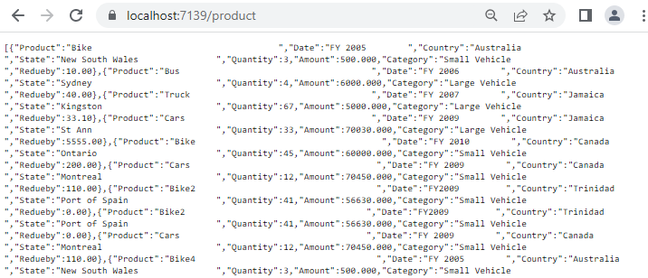
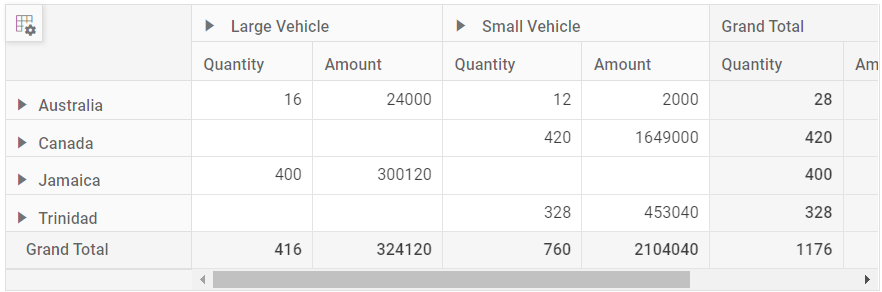

# Microsoft SQL Server in EJ2 React Pivot Table Component

This section describes how to retrieve data from SQL Server database using [System.Data.SqlClient](https://learn.microsoft.com/en-us/dotnet/api/system.data.sqlclient?view=windowsdesktop-10.0) and bind it to the Pivot Table via a Web API controller.

## Steps to Connect the SQL Server Database via Web API Application

### Step 1: Download the Sample Application
Download the ASP.NET Core Web Application from this [GitHub](https://github.com/SyncfusionExamples/how-to-bind-SQL-database-to-pivot-table) repository.

### Step 2: Understand the Application Structure
The GitHub repository contains a backend controller responsible for managing the database connection. The following overview describes its structure and purpose:

- **Backend Location**: The backend code is located in the **ASP.NET Core API** folder.
- **Application Project**: The **MyWebService** folder contains the controller code.
- **Controller File**: The **PivotController.cs** file is located in the **Controllers** folder (path: `ASP.NET Core API/MyWebService/Controllers/PivotController.cs`).
- **Purpose**: This controller connects to the SQL Server database and provides data to the React Pivot Table.

### Step 3: Connect to SQL Server and Retrieve Data
In the **PivotController.cs** file, the [System.Data.SqlClient](https://learn.microsoft.com/en-us/dotnet/api/system.data.sqlclient?view=windowsdesktop-10.0) library is used to connect to a Microsoft SQL Server database and retrieve data for the Pivot Table.

1. **Establish Connection**: Use **SqlConnection** with a valid connection string to connect to the SQL Server database (e.g., **Database1.mdf**).
2. **Query and Fetch Data**: Execute a SQL query (e.g., `SELECT * FROM table1`) using **SqlCommand** to retrieve data for the Pivot Table.
3. **Structure the Data**: Use the **Fill** method of **SqlDataAdapter** to populate query results into a **DataTable** for JSON serialization.

```csharp
using Microsoft.AspNetCore.Mvc;
using System.Data;
using System.Data.SqlClient;

namespace PivotController.Controllers
{
     [ApiController]
     [Route("[controller]")]
     public class PivotController : ControllerBase
     {
          private static DataTable FetchSQLResult()
          {
               string conSTR = @"<Enter your valid connection string here>";
               string xquery = "SELECT * FROM table1";
               SqlConnection sqlConnection = new(conSTR);
               sqlConnection.Open();
               SqlCommand cmd = new(xquery, sqlConnection);
               SqlDataAdapter dataAdapter = new(cmd);
               DataTable dataTable = new();
               dataAdapter.Fill(dataTable);
               return dataTable;
          }
     }
}
```

> Replace `<Enter your valid connection string here>` with the actual connection string for your SQL Server database.

### Step 4: Serialize Data to JSON
In the **PivotController.cs** file, define a **Get** method that calls **FetchSQLResult** to retrieve data from the SQL Server database as a **DataTable**. Then, use **JsonConvert.SerializeObject** from the **Newtonsoft.Json** library to convert the **DataTable** into JSON format. This JSON data will be consumed by the Pivot Table component.

> Ensure the **Newtonsoft.Json** NuGet package is installed in your project to use **JsonConvert**.

```csharp
using Microsoft.AspNetCore.Mvc;
using Newtonsoft.Json;
using System.Data;
using System.Data.SqlClient;

namespace PivotController.Controllers
{
     [ApiController]
     [Route("[controller]")]
     public class PivotController : ControllerBase
     {
          [HttpGet(Name = "GetSQLResult")]
          public object Get()
          {
               return JsonConvert.SerializeObject(FetchSQLResult());
          }

          private static DataTable FetchSQLResult()
          {
               string conSTR = @"<Enter your valid connection string here>";
               string xquery = "SELECT * FROM table1";
               SqlConnection sqlConnection = new(conSTR);
               sqlConnection.Open();
               SqlCommand cmd = new(xquery, sqlConnection);
               SqlDataAdapter dataAdapter = new(cmd);
               DataTable dataTable = new();
               dataAdapter.Fill(dataTable);
               return dataTable;
          }
     }
}
```

### Step 5: Run the Controller Application
1. Build and run the **PivotController** application.
2. The application will be hosted at `https://localhost:7284/` (the port number may vary depending on your configuration).

### Step 6: Access the JSON Data
1. Access the Web API endpoint at `https://localhost:7284/pivot` to view the JSON data retrieved from the SQL Server database.
2. The browser will display the JSON data, as shown below, ready to be used by the Pivot Table.



## Connecting the Pivot Table to the Hosted Web API URL

This section explains how to connect the Pivot Table component to a Microsoft SQL Server database by retrieving data from the Web API service created in the previous section.

### Step 1: Set Up the React Pivot Table
1. Download the React Pivot Table sample from the [GitHub](https://github.com/SyncfusionExamples/how-to-bind-SQL-database-to-pivot-table) repository.
2. Ensure your React project is configured with the necessary EJ2 Pivot Table dependencies by following the [Getting Started](https://ej2.syncfusion.com/react/documentation/pivotview/getting-started) documentation.

### Step 2: Configure the Web API URL in the Pivot Table
1. In the **App.tsx** or **App.jsx** file, configure the Pivot Table to use the hosted Web API URL (`https://localhost:7284/pivot`) by setting the [url](https://ej2.syncfusion.com/react/documentation/api/pivotview/datasourcesettings#url) property within the [dataSourceSettings](https://ej2.syncfusion.com/react/documentation/api/pivotview/datasourcesettings) object.
2. Below is the sample code to configure the Pivot Table to fetch data from the Web API:

```typescript
import { PivotViewComponent, FieldList, Inject } from '@syncfusion/ej2-react-pivotview';
import * as React from 'react';
import './App.css';

function App() {
     let dataSourceSettings = {
          url: 'https://localhost:7284/pivot'
          //Other codes here...
     };

     return (<PivotViewComponent id='PivotView' height={350} dataSourceSettings={dataSourceSettings} showFieldList={true}>
     <Inject services={[FieldList]}/></PivotViewComponent>);
};
export default App;
```

### Step 3: Define the Pivot Table Report
1. Configure the Pivot Table report in the **App.tsx** or **App.jsx** file to structure the data retrieved from the SQL Server database.
2. Add fields to the [rows](https://ej2.syncfusion.com/react/documentation/api/pivotview/datasourcesettings#rows), [columns](https://ej2.syncfusion.com/react/documentation/api/pivotview/datasourcesettings#columns), [values](https://ej2.syncfusion.com/react/documentation/api/pivotview/datasourcesettings#values), and [filters](https://ej2.syncfusion.com/react/documentation/api/pivotview/datasourcesettings#filters) properties of [dataSourceSettings](https://ej2.syncfusion.com/react/documentation/api/pivotview/datasourcesettings) to define how data fields are organized and aggregated in the Pivot Table.
3. Enable the field list by setting the [showFieldList](https://ej2.syncfusion.com/react/documentation/api/pivotview/index-default#showfieldlist) property to **true** and including the `FieldList` module in the services section. This allows users to dynamically add or rearrange fields across the columns, rows, and values axes using an interactive user interface.

Here’s the updated sample code for **App.jsx** with the report configuration and field list support:

```typescript
import { PivotViewComponent, FieldList, Inject } from '@syncfusion/ej2-react-pivotview';
import * as React from 'react';
import './App.css';

function App() {
     let dataSourceSettings = {
          url: 'https://localhost:7284/pivot',
          enableSorting: true,
          expandAll: false,
          columns: [{ name: 'Product' }],
          values: [{ name: 'Quantity' }, { name: 'Amount', caption: 'Sold Amount' }],
          rows: [{ name: 'Country' }, { name: 'State' }],
          formatSettings: [{ name: 'Amount', format: 'C0' }],
          filters: []
     };

     return (<PivotViewComponent id='PivotView' height={350} dataSourceSettings={dataSourceSettings} showFieldList={true}>
     <Inject services={[FieldList]}/></PivotViewComponent>);
};
export default App;
```

### Step 4: Run and Verify the Pivot Table
1. Run the React application.
2. The Pivot Table will display the data fetched from the SQL Server database via the Web API, structured according to the defined report.
3. The resulting Pivot Table will look like this:



### Additional Resources
Explore a complete example of the React Pivot Table integrated with an ASP.NET Core Web Application to fetch data from a SQL Server database in the [GitHub](https://github.com/SyncfusionExamples/how-to-bind-SQL-database-to-pivot-table) repository.