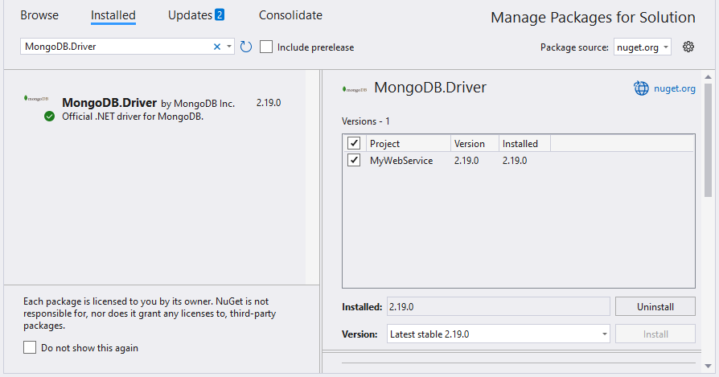
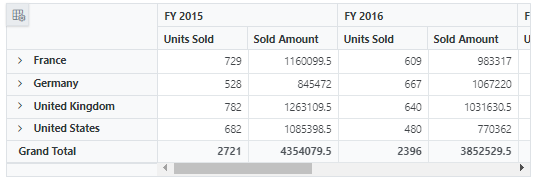

# MongoDB in EJ2 React Pivot Table Component

This guide explains how to retrieve data from a MongoDB database using the [MongoDB.Driver](https://www.nuget.org/packages/MongoDB.Driver) and [MongoDB.Bson](https://www.nuget.org/packages/MongoDB.Bson) libraries and bind it to the Pivot Table through a Web API controller.

## Creating a Web API Service to Fetch MongoDB Data

Follow these steps to create a Web API service that retrieves data from a MongoDB database and prepares it for the Pivot Table.

### Step 1: Create an ASP.NET Core Web Application
1. Open Visual Studio and create a new **ASP.NET Core Web App** project named **MyWebService**.
2. Follow the official [Microsoft documentation](https://learn.microsoft.com/en-us/visualstudio/get-started/csharp/tutorial-aspnet-core?view=vs-2022) for detailed instructions on creating an ASP.NET Core Web application.


### Step 2: Install the MongoDB NuGet Packages
To enable MongoDB database connectivity:
1. Open the **NuGet Package Manager** in your project solution and search for the packages [MongoDB.Driver](https://www.nuget.org/packages/MongoDB.Driver/) and [MongoDB.Bson](https://www.nuget.org/packages/MongoDB.Bson).
2. Install both packages to add MongoDB support.



### Step 3: Create a Web API Controller
1. Under the **Controllers** folder, create a new Web API controller named **PivotController.cs**.
2. This controller facilitates data communication between the MongoDB database and the Pivot Table.

### Step 4: Connect to MongoDB and Retrieve Data
In the **PivotController.cs** file, use the [MongoDB.Driver](https://www.nuget.org/packages/MongoDB.Driver/) and [MongoDB.Bson](https://www.nuget.org/packages/MongoDB.Bson) libraries to connect to a MongoDB database and retrieve data for the Pivot Table.

1. **Establish Connection**: Use **MongoClient** with a valid connection string (e.g., `<Enter your valid connection string here>`) to connect to the MongoDB database.
2. **Access the Database and Collection**: Use the **GetDatabase** method to access the specified database (e.g., `sample_training`) and the **GetCollection** method to target the desired collection (e.g., `ProductDetails`).
3. **Retrieve and Structure Data**: Use the **Find** method of the **IMongoCollection** interface with an empty **BsonDocument** to retrieve data from the collection. The **ToList** method then converts the retrieved data into a **List** for JSON serialization.

```csharp
using Microsoft.AspNetCore.Mvc;
using Newtonsoft.Json;
using MongoDB.Driver;
using MongoDB.Bson;

namespace MyWebService.Controllers
{
    [ApiController]
    [Route("[controller]")]
    public class PivotController : ControllerBase
    {
        private static List<ProductDetails> FetchMongoDbResult()
        {
            // Replace with your own connection string.
            string connectionString = "<Enter your valid connection string here>";
            MongoClient client = new MongoClient(connectionString);
            IMongoDatabase database = client.GetDatabase("sample_training");
            var collection = database.GetCollection<ProductDetails>("ProductDetails");
            return collection.Find(new BsonDocument()).ToList();
        }
        public class ProductDetails
        {
            public ObjectId Id { get; set; }
            public int Sold { get; set; }
            public double Amount { get; set; }
            public string? Country { get; set; }
            public string? Products { get; set; }
            public string? Year { get; set; }
            public string? Quarter { get; set; }
        }
    }
}
```

### Step 5: Serialize Data to JSON
In the **PivotController.cs** file, define a **Get** method that calls **FetchMongoDbResult** to retrieve data from the MongoDB database as a **List**. Then, use **JsonConvert.SerializeObject** from the **Newtonsoft.Json** library to convert the **List** into JSON format. This JSON data will be used by the Pivot Table component.

> Ensure the **Newtonsoft.Json** NuGet package is installed in your project to use **JsonConvert**.

```csharp
using Microsoft.AspNetCore.Mvc;
using Newtonsoft.Json;
using MongoDB.Bson;
using MongoDB.Driver;

namespace MyWebService.Controllers
{
    [ApiController]
    [Route("[controller]")]
    public class PivotController : ControllerBase
    {
        [HttpGet(Name = "GetMongoDbResult")]
        public object Get()
        {
            return JsonConvert.SerializeObject(FetchMongoDbResult());
        }

        private static List<ProductDetails> FetchMongoDbResult()
        {
            // Replace with your own connection string.
            string connectionString = "<Enter your valid connection string here>";
            MongoClient client = new MongoClient(connectionString);
            IMongoDatabase database = client.GetDatabase("sample_training");
            var collection = database.GetCollection<ProductDetails>("ProductDetails");
            return collection.Find(new BsonDocument()).ToList();
        }
        public class ProductDetails
        {
            public ObjectId Id { get; set; }
            public int Sold { get; set; }
            public double Amount { get; set; }
            public string? Country { get; set; }
            public string? Products { get; set; }
            public string? Year { get; set; }
            public string? Quarter { get; set; }
        }
    }
}
```

### Step 6: Run the Web API Service
1. Build and run the application.
2. The application will be hosted at `https://localhost:44346/` (the port number may vary based on your configuration).

### Step 7: Access the JSON Data
1. Access the Web API endpoint at `https://localhost:44346/Pivot` to view the JSON data retrieved from the MongoDB database.
2. The browser will display the JSON data, as shown below.


## Connecting the Pivot Table to a MongoDB Database Using the Web API Service

This section explains how to connect the Pivot Table component to a MongoDB database by retrieving data from the Web API service created in the previous section.

### Step 1: Create a Pivot Table in React
1. Set up a basic React Pivot Table by following the [Getting Started](../getting-started) documentation.
2. Ensure your React project is configured with the necessary EJ2 Pivot Table dependencies.

### Step 2: Configure the Web API URL in the Pivot Table
1. In the **App.tsx** (or **App.jsx**) file, map the Web API URL (`https://localhost:44346/Pivot`) to the Pivot Table using the [url](https://ej2.syncfusion.com/react/documentation/api/pivotview/dataSourceSettings/#url) property within the [dataSourceSettings](https://ej2.syncfusion.com/react/documentation/api/pivotview/dataSourceSettings/).
2. Below is the sample code to configure the Pivot Table to fetch data from the Web API:

```typescript
import { PivotViewComponent, FieldList, Inject } from '@syncfusion/ej2-react-pivotview';
import * as React from 'react';
import './App.css';

function App() {
    let dataSourceSettings = {
        url: 'https://localhost:44346/Pivot'
        // Additional configuration will be added in the next step
    };

    return (<PivotViewComponent id='PivotView' height={350} dataSourceSettings={dataSourceSettings} showFieldList={true}>
        <Inject services={[FieldList]}/>
    </PivotViewComponent>);
};

export default App;
```

### Step 3: Define the Pivot Table Report
1. Configure the Pivot Table report in the **App.tsx** (or **App.jsx**) file to structure the data retrieved from the MongoDB database.
2. Add fields to the [rows](https://ej2.syncfusion.com/react/documentation/api/pivotview/dataSourceSettings/#rows), [columns](https://ej2.syncfusion.com/react/documentation/api/pivotview/dataSourceSettings/#columns), [values](https://ej2.syncfusion.com/react/documentation/api/pivotview/dataSourceSettings/#values), and [filters](https://ej2.syncfusion.com/react/documentation/api/pivotview/dataSourceSettings/#filters) properties of [dataSourceSettings](https://ej2.syncfusion.com/react/documentation/api/pivotview/dataSourceSettings/) to define the report structure, specifying how data fields are organized and aggregated in the Pivot Table.
3. Enable the field list by setting the [showFieldList](https://ej2.syncfusion.com/react/documentation/api/pivotview/#showfieldlist) property to **true** and including the `FieldList` module in the services section. This allows users to dynamically add or rearrange fields across the columns, rows, and values axes using an interactive user interface.

Here’s the updated sample code for **App.jsx** with the report configuration and field list support:

```typescript
import { PivotViewComponent, FieldList, Inject } from '@syncfusion/ej2-react-pivotview';
import * as React from 'react';
import './App.css';

function App() {
    let dataSourceSettings = {
        url: 'https://localhost:44346/Pivot',
        enableSorting: true,
        columns: [
            { name: 'Year' }
        ],
        values: [
            { name: 'Sold', caption: "Units Sold"},
            { name: 'Amount', caption: "Sold Amount"}
        ],
        rows: [
            { name: 'Country' },
            { name: 'Products' }
        ]
    };

    return (<PivotViewComponent id='PivotView' height={350} dataSourceSettings={dataSourceSettings} showFieldList={true}>
        <Inject services={[FieldList]}/>
    </PivotViewComponent>);
};

export default App;
```

### Step 4: Run and Verify the Pivot Table
1. Run the React application.
2. The Pivot Table will display the data fetched from the MongoDB database via the Web API, structured according to the defined report.
3. The resulting Pivot Table will look like this:



### Additional Resources
Explore a complete example of the React Pivot Table integrated with an ASP.NET Core Web Application to fetch data from a MongoDB database in this [GitHub](https://github.com/SyncfusionExamples/how-to-bind-MongoDB-to-pivot-table) repository.