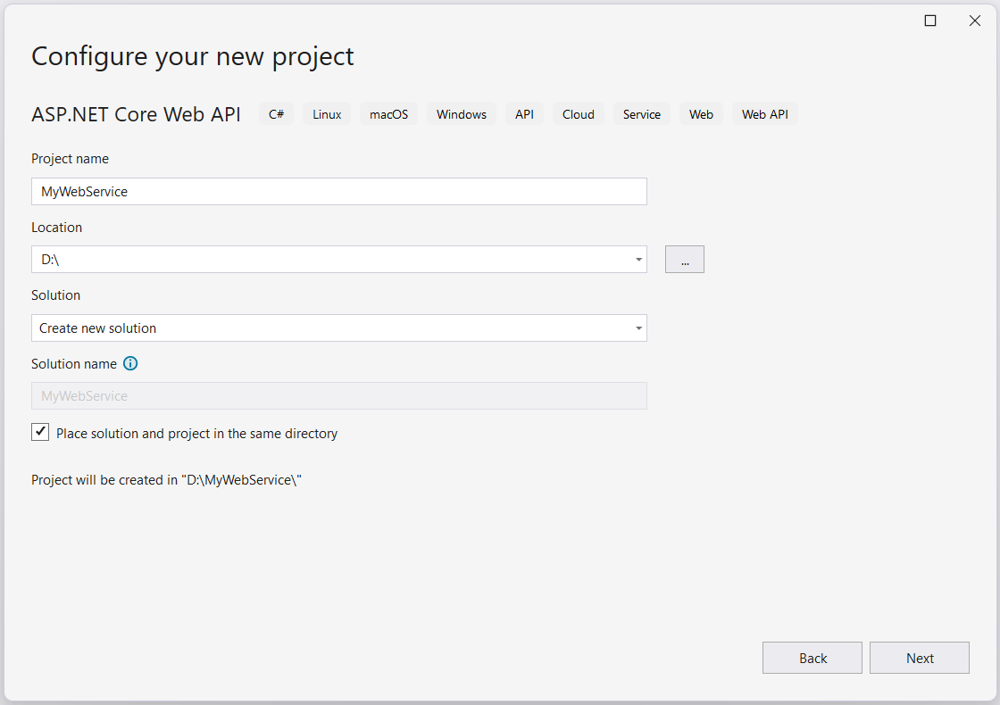
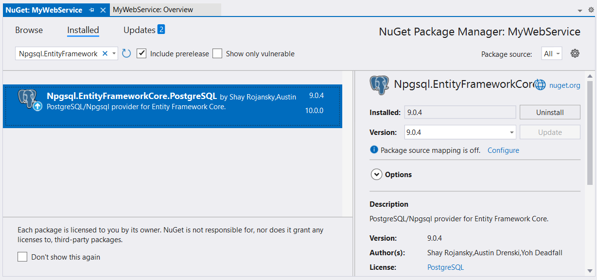
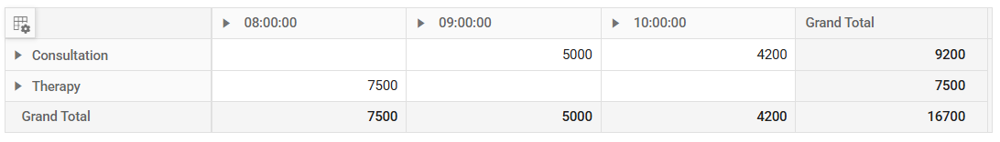

# PostgreSQL in EJ2 React Pivotview Component

This section describes how to consume data from PostgreSQL database using [Microsoft Npgsql](https://www.npgsql.org/doc/index.html) and bind it to the Pivot Table via a Web API controller.

## Create a Web API service to fetch PostgreSQL data

**1.** Open Visual Studio and create an ASP.NET Core Web App project type, naming it **MyWebService**. To create an ASP.NET Core Web application, follow the document [link](https://learn.microsoft.com/en-us/visualstudio/get-started/csharp/tutorial-aspnet-core?view=vs-2022).



**2.** To connect a PostgreSQL Server using the **Npgsql** in our application, we need to install the [Npgsql.EntityFrameworkCore.PostgreSQL](https://www.nuget.org/packages/Npgsql.EntityFrameworkCore.PostgreSQL/) NuGet package. To do so, open the NuGet package manager of the project solution, search for the package **Npgsql.EntityFrameworkCore.PostgreSQL** and install it.



**3.** Create a Web API controller (aka, PivotController.cs) file under **Controllers** folder that helps to establish data communication with the Pivot Table.

**4.** In the Web API controller (aka, PivotController), **NpgsqlConnection** helps to connect the PostgreSQL database. Next, using **NpgsqlCommand** and **NpgsqlDataAdapter** you can process the desired PostgreSQL query string and retrieve data from the database. The **Fill** method of the **NpgsqlDataAdapter** is used to populate the retrieved data into a **DataTable** as shown in the following code snippet.

```csharp
    using Microsoft.AspNetCore.Mvc;
    using Newtonsoft.Json;
    using System.Data;
    using Npgsql;

    namespace MyWebService.Controllers
    {
        [ApiController]
        [Route("[controller]")]
        public class PivotController : ControllerBase
        {
            public dynamic GetPostgreSQLResult()
            {
                // Replace with your own connection string.
                NpgsqlConnection connection = new NpgsqlConnection("<Enter your valid connection string here>");
                connection.Open();
                NpgsqlCommand cmd = new NpgsqlCommand("SELECT * FROM tablename", connection);
                NpgsqlDataAdapter da = new NpgsqlDataAdapter(cmd);
                DataTable dt = new DataTable();
                da.Fill(dt);
                connection.Close();
                return dt;
            }
        }
    }

```

**5.** In the **Get()** method of the **PivotController.cs** file, the **GetPostgreSQLResult** method is used to retrieve the PostgreSQL data as a **DataTable**, which is then serialized into JSON using **JsonConvert.SerializeObject()**.

```csharp
    using Microsoft.AspNetCore.Mvc;
    using Newtonsoft.Json;
    using System.Data;
    using Npgsql;

    namespace MyWebService.Controllers
    {
        [ApiController]
        [Route("[controller]")]
        public class PivotController : ControllerBase
        {
            [HttpGet(Name = "GetPostgreSQLResult")]
            public object Get()
            {
                return JsonConvert.SerializeObject(GetPostgreSQLResult());
            }

            public dynamic GetPostgreSQLResult()
            {
                // Replace with your own connection string.
                NpgsqlConnection connection = new NpgsqlConnection("<Enter your valid connection string here>");
                connection.Open();
                NpgsqlCommand cmd = new NpgsqlCommand("SELECT * FROM tablename", connection);
                NpgsqlDataAdapter da = new NpgsqlDataAdapter(cmd);
                DataTable dt = new DataTable();
                da.Fill(dt);
                connection.Close();
                return dt;
            }
        }
    }

```

**6.** Run the application and it will be hosted within the URL `https://localhost:44378/`.

**7.** Finally, the retrieved data from PostgreSQL database which is in the form of JSON can be found in the Web API controller available in the URL link `https://localhost:44378/Pivot`, as shown in the browser page below.


## Connecting the Pivot Table to a PostgreSQL database using the Web API service

**1.** Create a simple React Pivot Table by following the **"Getting Started"** documentation [link](../getting-started).

**2.** Map the hosted Web API's URL link `https://localhost:44378/Pivot` to the Pivot Table component in **app.ts** by using the [url](https://ej2.syncfusion.com/react/documentation/api/pivotview/dataSourceSettings/#url) property under [`dataSourceSettings`](https://ej2.syncfusion.com/react/documentation/api/pivotview/dataSourceSettings/).

```typescript
     import { PivotViewComponent, FieldList, Inject } from '@syncfusion/ej2-react-pivotview';
     import * as React from 'react';
     import './App.css';

     function App() {
     let dataSourceSettings = {
          url: 'https://localhost:44378/pivot',
          //Other codes here...
     };

     return (<PivotViewComponent id='PivotView' height={350} dataSourceSettings={dataSourceSettings} showFieldList={true}>
     <Inject services={[FieldList]}/></PivotViewComponent>);
     };
     export default App;

```

**3.** Frame and set the report based on the data retrieved from the PostgreSQL database.

```typescript
     import { PivotViewComponent, FieldList, Inject } from '@syncfusion/ej2-react-pivotview';
     import * as React from 'react';
     import './App.css';

     function App() {
     let dataSourceSettings = {
        url: 'https://localhost:44378/Pivot',
        enableSorting: true,
        columns: [{ name: 'openinghours_practice' }, { name: 'closinghours_practice' }],
        values: [{ name: 'revenue' }],
        rows: [{ name: 'servicetype' }, { name: 'servicecategory' }]
     };

     return (<PivotViewComponent id='PivotView' height={350} dataSourceSettings={dataSourceSettings} showFieldList={true}>
     <Inject services={[FieldList]}/></PivotViewComponent>);
     };
     export default App;
```

When you run the sample, the resulting pivot table will look like this:



> Explore our React Pivot Table sample and ASP.NET Core Web Application to extract data from a PostgreSQL database and bind to the Pivot Table in [this](https://github.com/SyncfusionExamples/how-to-bind-PostgreSQL-database-to-pivot-table) GitHub repository.