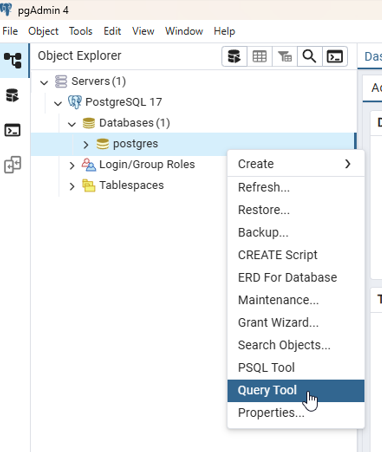
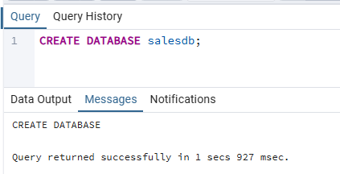
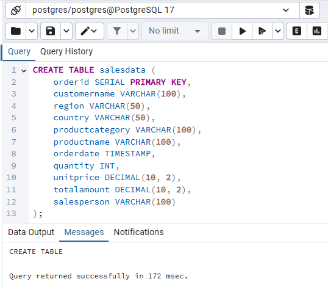
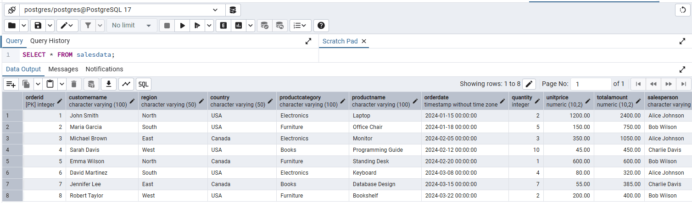
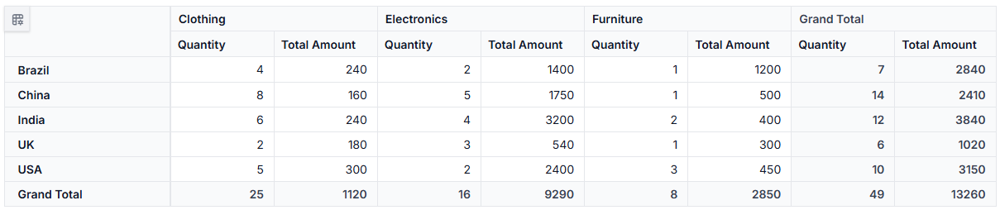
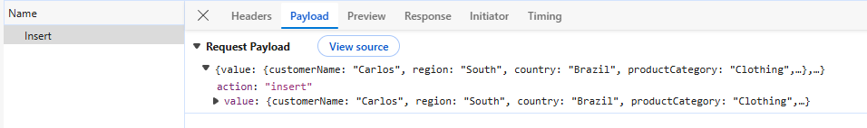
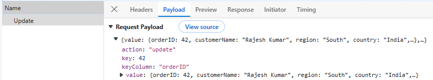
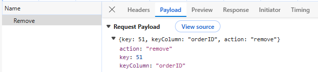

# Connecting PostgreSQL to React Pivot Table Using ASP.NET Core Web API

The Syncfusion<sup style="font-size:70%">&reg;</sup> React Pivot Table supports binding data from a PostgreSQL database through an ASP.NET Core Web API using [Npgsql](https://www.nuget.org/packages/Npgsql/). This modern architecture provides a secure and scalable way to access the database from a backend service while enabling efficient server‑side processing. By leveraging React for the UI and ASP.NET Core with Npgsql for data access, applications maintain a clear separation between presentation and data layers and retain full control over PostgreSQL interactions.

**What is Npgsql?**

[Npgsql](https://www.nuget.org/packages/Npgsql/) is the official .NET data provider used to connect ASP.NET Core applications to PostgreSQL databases. It enables applications to execute SQL queries, call stored procedures, and read or write data securely using strongly supported APIs. Npgsql is commonly used in Web APIs where precise control over database access, performance, and security is required.

**Key benefits of Npgsql:**

- **Secure by design**: Enforces parameterized queries to help prevent SQL injection attacks.
- **High performance**: Provides efficient, low‑level access to PostgreSQL with minimal overhead.
- **Asynchronous support**: Supports async database operations for better scalability in web APIs.
- **Full SQL control**: Allows precise control over SQL queries, stored procedures, and transactions.
- **Cross-platform compatibility**: Works seamlessly on Windows, Linux, and macOS.
- **Open-source**: Maintained by the community and actively supported for long‑term compatibility with PostgreSQL.

## Prerequisites

Ensure the following software and packages are installed before proceeding:

| Software/Package | Version | Purpose |
| ------------------ | -------- | --------- |
| Node.js | 18.x or later | React development runtime |
| React | 18.x or later | Create and run React apps |
| .NET SDK | 8.0 or later | Build and run ASP.NET Core Web API |
| PostgreSQL | 12 or later | Database server |
| Npgsql (NuGet) | Latest | PostgreSQL connectivity |
| Syncfusion.EJ2.AspNet.Core | 33.1.45 or later | Server helpers (DataManagerRequest, DataOperations) |
| @syncfusion/ej2-react-pivotview | 33.1.45 or later | React Pivot Table component |

## Setting up the PostgreSQL environment

First, create the **PostgreSQL database** structure required to store sales records for the Pivot Table.

**What is PostgreSQL?**

PostgreSQL is a powerful, open-source relational database management system (RDBMS) known for its reliability, flexibility, and support for advanced data types. It's an excellent choice for modern web applications because it's free, scalable, and supports complex queries.

### Step 1: Create the PostgreSQL Database

**Instructions:**

1. **Install PostgreSQL**: If not already installed, download PostgreSQL from [postgresql.org](https://www.postgresql.org/download/).
2. **Open pgAdmin**: pgAdmin is a graphical tool that comes with PostgreSQL to manage databases. After installation, open pgAdmin tool.

**Using pgAdmin Query Tool:**

1. **Connect to the Server**: In the pgAdmin left sidebar, expand **Servers** and locate your PostgreSQL server (usually named "PostgreSQL 17" or similar, depending on your version)
2. **Open Query Editor**: Expand the **Databases** node. Right‑click on the existing server name or **postgres** database(default maintenance DB). Choose **Query Tool** to open the SQL editor.



3. **Create the Database**: Paste the following SQL script into the query editor window and click the "Execute" button (or press F6):

```sql
-- Create Database
CREATE DATABASE salesdb;
```

After successful execution, you should see a message confirming the database creation.



### Step 2: Create the Sales Data Table

After creating the database, you need to create a table to store sales records. This table will hold all the data that the Pivot Table will display and analyze.

**Using pgAdmin Query Tool:**

1. **Select the salesdb Database**: In the left sidebar, expand **Databases** and click on **salesdb** to select it.
2. **Open Query Tool**: Right-click on the **salesdb** database and select "Query Tool"
3. **Create the Table**: Paste the following SQL script into the query editor and click "Execute":

```sql
-- Create SalesData Table
CREATE TABLE salesdata (
    orderid SERIAL PRIMARY KEY,
    customername VARCHAR(100),
    region VARCHAR(50),
    country VARCHAR(50),
    productcategory VARCHAR(100),
    productname VARCHAR(100),
    orderdate DATE,
    quantity INT,
    unitprice DECIMAL(10, 2),
    totalamount DECIMAL(10, 2),
    salesperson VARCHAR(100)
);
```

You should see a success message confirming the table creation.



**Table Structure Explanation:**

| Column | Data Type | Description |
|--------|-----------|-------------|
| orderid | SERIAL | Unique order identifier (auto-incremented primary key) |
| customername | VARCHAR(100) | Name of the customer who placed the order |
| region | VARCHAR(50) | Geographic region of the customer |
| country | VARCHAR(50) | Country where the order was placed |
| productcategory | VARCHAR(100) | Category of the product (e.g., Electronics, Furniture) |
| productname | VARCHAR(100) | Name of the product ordered |
| orderdate | DATE | Date when the order was placed |
| quantity | INT | Number of units ordered |
| unitprice | DECIMAL(10, 2) | Price per unit of the product |
| totalamount | DECIMAL(10, 2) | Total cost of the order (quantity × unitprice) |
| salesperson | VARCHAR(100) | Name of the sales representative handling the order |

### Step 3: Insert Sample Data

Insert sample sales data into the table. This data will be used to populate the Pivot Table.

**Using pgAdmin Query Tool:**

1. **Open Query Tool**: With **salesdb** still selected, open the Query Tool again (or use the existing one)
2. **Insert Sample Data**: Paste the following SQL script into the query editor and click "Execute":

```sql
-- Insert Sample Data
INSERT INTO salesdata (customername, region, country, productcategory, productname, orderdate, quantity, unitprice, totalamount, salesperson)
VALUES
('John Smith', 'North', 'USA', 'Electronics', 'Laptop', '2024-01-15', 2, 1200.00, 2400.00, 'Alice Johnson'),
('Maria Garcia', 'South', 'USA', 'Furniture', 'Office Chair', '2024-01-18', 5, 150.00, 750.00, 'Bob Wilson'),
('Michael Brown', 'East', 'Canada', 'Electronics', 'Monitor', '2024-02-05', 3, 350.00, 1050.00, 'Alice Johnson'),
('Sarah Davis', 'West', 'USA', 'Books', 'Programming Guide', '2024-02-12', 10, 45.00, 450.00, 'Charlie Davis'),
('Emma Wilson', 'North', 'Canada', 'Furniture', 'Standing Desk', '2024-02-20', 1, 600.00, 600.00, 'Bob Wilson'),
('David Martinez', 'South', 'USA', 'Electronics', 'Keyboard', '2024-03-08', 4, 80.00, 320.00, 'Alice Johnson'),
('Jennifer Lee', 'East', 'Canada', 'Books', 'Database Design', '2024-03-15', 7, 55.00, 385.00, 'Charlie Davis'),
('Robert Taylor', 'West', 'USA', 'Furniture', 'Bookshelf', '2024-03-22', 2, 200.00, 400.00, 'Bob Wilson');
```

You should see a success message showing "INSERT 0 8" or similar, indicating that 8 rows were successfully inserted.

**Verify the Data:**

To confirm the data was inserted correctly, run the following verification query in the Query Tool:

```sql
SELECT * FROM salesdata;
```

You should see all 8 sample records displayed in the results grid.



## Setting up the ASP.NET Core Web API

Now that the PostgreSQL database is configured, let's create the backend API that the React Pivot Table will communicate with.

### Step 1: Create the ASP.NET Core Web API project

To connect the Syncfusion<sup style="font-size:70%">&reg;</sup> React Pivot Table to PostgreSQL, the **ASP.NET Core Web API server** must be configured with the required NuGet packages. The server application is responsible for handling HTTP requests from the Pivot Table and accessing data from PostgreSQL.

**To create a new ASP.NET Core Web API project using the .NET CLI:**

Execute the following commands in your terminal:

```bash
dotnet new webapi -n PivotTable_PostgreSQL.Server
cd PivotTable_PostgreSQL.Server
```

**Install Required NuGet Packages:**

Add the PostgreSQL client library and Syncfusion<sup style="font-size:70%">&reg;</sup> server‑side helper packages:

```bash
dotnet add package Npgsql.EntityFrameworkCore.PostgreSQL
dotnet add package Syncfusion.EJ2.AspNet.Core
```

The Web API exposes HTTP endpoints that are used by the Pivot Table to perform read and data modification operations. The Syncfusion<sup style="font-size:70%">&reg;</sup> server helper package provides the required types for processing pivot requests and applying data operations on the server.

### Step 2: Configure the Connection String

The connection string contains the information needed to connect to your PostgreSQL database. Open the **appsettings.json** file in your project and update it with your PostgreSQL connection details:

```json
{
  "ConnectionStrings": {
    "SalesDb": "Host=localhost;Port=5432;Database=salesdb;Username=postgres;Password=your_password;"
  },
  "Logging": {
    "LogLevel": {
      "Default": "Information",
      "Microsoft.AspNetCore": "Warning"
    }
  },
  "AllowedHosts": "*"
}
```

**Connection String Components:**

| Component | Description | Example |
|-----------|-------------|----------|
| Host | PostgreSQL server address | `localhost` (for local) or `192.168.1.100` (for remote) |
| Port | PostgreSQL port number | `5432` (default) |
| Database | Database name | `salesdb` |
| Username | PostgreSQL user account | `postgres` (default admin user) |
| Password | User password | Your PostgreSQL password set during installation |

The database connection string has been configured successfully.

### Step 3: Configure Program.cs

Update the **Program.cs** file to register the PostgreSQL connection and enable CORS for communication between the React client and the API:

```csharp
using Npgsql;

var builder = WebApplication.CreateBuilder(args);

// Add services to the container
builder.Services.AddOpenApi();
builder.Services.AddControllers();

// Register PostgreSQL connection from configuration
builder.Services.AddSingleton<NpgsqlConnection>(sp =>
{
    var connString = builder.Configuration.GetConnectionString("SalesDb");
    return new NpgsqlConnection(connString);
});

// Enable CORS to allow requests from React client
builder.Services.AddCors(options =>
{
    options.AddPolicy("AllowAll",
        policy => policy
            .AllowAnyOrigin()
            .AllowAnyMethod()
            .AllowAnyHeader());
});

var app = builder.Build();

// Configure the HTTP request pipeline
if (app.Environment.IsDevelopment())
{
    app.MapOpenApi();
}

app.UseHttpsRedirection();
app.UseAuthorization();
app.UseCors("AllowAll");  // Apply CORS policy
app.MapControllers();

app.Run();
```

**What's Happening:**

1. **AddSingleton<NpgsqlConnection>**: Registers the PostgreSQL connection globally, making it available to all controllers
2. **AddCors**: Enables Cross-Origin Resource Sharing (CORS), allowing the React frontend to make API requests to this backend
3. **AllowAll policy**: Permits all origins, methods, and headers (suitable for development; restrict in production)

### Step 4: Create the Data Model and Controller

Create a new file named **SalesController.cs** in the **Controllers** folder. This file contains the data model and all the API endpoints for reading and modifying sales data.

```csharp
using Microsoft.AspNetCore.Mvc;
using System.ComponentModel.DataAnnotations;
using System.Data;
using Syncfusion.EJ2.Base;
using Npgsql;

namespace PivotTable_PostgreSQL.Server.Controllers
{
    [ApiController]
    public class SalesController : ControllerBase
    {
        private readonly string _connectionString;

        /// <summary>
        /// Constructor that injects the configuration to retrieve the connection string.
        /// </summary>
        public SalesController(IConfiguration configuration)
        {
            _connectionString = configuration.GetConnectionString("SalesDb");
        }

        /// <summary>
        /// Handles GET requests to retrieve all sales data for the Pivot Table.
        /// This endpoint is called when the Pivot Table first loads or refreshes data.
        /// </summary>
        /// <returns>Returns a list of all sales records from the database.</returns>
        [HttpGet]
        [Route("api/[controller]")]
        public List<SalesData> GetSalesData()
        {
            const string Query = @"SELECT * FROM salesdata ORDER BY orderid;";
            
            using var Connection = new NpgsqlConnection(_connectionString);
            Connection.Open();

            using var Command = new NpgsqlCommand(Query, Connection);
            using var DataAdapter = new NpgsqlDataAdapter(Command);
            var DataTable = new DataTable();
            DataAdapter.Fill(DataTable);

            // Convert database rows to SalesData objects
            var DataSource = (from DataRow Data in DataTable.Rows
                              select new SalesData
                              {
                                  OrderID = Data["orderid"] == DBNull.Value ? (int?)null : Convert.ToInt32(Data["orderid"]),
                                  CustomerName = Data["customername"] == DBNull.Value ? null : Data["customername"].ToString(),
                                  Region = Data["region"] == DBNull.Value ? null : Data["region"].ToString(),
                                  Country = Data["country"] == DBNull.Value ? null : Data["country"].ToString(),
                                  ProductCategory = Data["productcategory"] == DBNull.Value ? null : Data["productcategory"].ToString(),
                                  ProductName = Data["productname"] == DBNull.Value ? null : Data["productname"].ToString(),
                                  OrderDate = Data["orderdate"] == DBNull.Value ? (DateTime?)null : Convert.ToDateTime(Data["orderdate"]),
                                  Quantity = Data["quantity"] == DBNull.Value ? (int?)null : Convert.ToInt32(Data["quantity"]),
                                  UnitPrice = Data["unitprice"] == DBNull.Value ? 0m : Convert.ToDecimal(Data["unitprice"]),
                                  TotalAmount = Data["totalamount"] == DBNull.Value ? 0m : Convert.ToDecimal(Data["totalamount"]),
                                  SalesPerson = Data["salesperson"] == DBNull.Value ? null : Data["salesperson"].ToString()
                              }).ToList();
            
            return DataSource;
        }

        /// <summary>
        /// Handles POST requests from the Pivot Table DataManager.
        /// Processes the data request and returns formatted data for the component.
        /// </summary>
        /// <param name="DataManagerRequest">Contains the details of the data operation requested.</param>
        /// <returns>Returns the data records along with the total count.</returns>    
        [HttpPost]
        [Route("api/[controller]")]
        public object Post([FromBody] DataManagerRequest DataManagerRequest)
        {
            // Retrieve all sales data from the database
            IQueryable<SalesData> DataSource = GetSalesData().AsQueryable();
            
            // Get the total number of records
            int totalRecordsCount = DataSource.Count();
            
            // Return data and count to the client
            return new { result = DataSource, count = totalRecordsCount };
        }

        /// <summary>
        /// Data model that represents the structure of a sales record.
        /// This class maps to the columns in the 'salesdata' table in PostgreSQL.
        /// </summary>
        public class SalesData
        {
            /// <summary>
            /// Unique identifier for each order (Primary Key).
            /// The [Key] attribute marks this as the primary key for CRUD operations.
            /// </summary>
            [Key]
            public int? OrderID { get; set; }

            /// <summary>
            /// Name of the customer who placed the order.
            /// </summary>
            public string? CustomerName { get; set; }

            /// <summary>
            /// Geographic region where the customer is located.
            /// Useful for regional analysis in the pivot table.
            /// </summary>
            public string? Region { get; set; }

            /// <summary>
            /// Country where the order was placed.
            /// </summary>
            public string? Country { get; set; }

            /// <summary>
            /// Category of the product (e.g., Electronics, Furniture).
            /// Used as a dimension in the pivot table analysis.
            /// </summary>
            public string? ProductCategory { get; set; }

            /// <summary>
            /// Name of the specific product ordered.
            /// </summary>
            public string? ProductName { get; set; }

            /// <summary>
            /// Date when the order was placed.
            /// </summary>
            public DateTime? OrderDate { get; set; }

            /// <summary>
            /// Number of units ordered.
            /// </summary>
            public int? Quantity { get; set; }

            /// <summary>
            /// Price per unit of the product.
            /// </summary>
            public decimal UnitPrice { get; set; }

            /// <summary>
            /// Total cost of the order (typically quantity × unitprice).
            /// Used as a measure/aggregate value in pivot table analysis.
            /// </summary>
            public decimal TotalAmount { get; set; }

            /// <summary>
            /// Name of the sales representative who handled the order.
            /// </summary>
            public string? SalesPerson { get; set; }
        }
    }
}
```

**Explanation:**

- **GetSalesData()**: Connects to PostgreSQL, executes a SELECT query, and returns all sales records
- **Post()**: Handles requests from the React Pivot Table and returns data with a total count
- **SalesData class**: Represents the structure of each sales record with XML documentation for clarity

## Setting up the React Pivot Table Client

Now that the backend API is ready, let's create the React client application that displays the Pivot Table and connects to the PostgreSQL data.

### Step 1: Create the React Client Application

Open a Visual Studio Code terminal or Command Prompt and run the below command to create a React application:

```bash
npm create vite@latest pivottable_postgresql.client
cd pivottable_postgresql.client
```

### Step 2: Install Syncfusion Pivot Table Package

Install the Syncfusion React Pivot Table component and its dependencies:

```bash
npm install @syncfusion/ej2-react-pivotview --save
```

### Step 3: Import Syncfusion CSS Styles

Add the required Syncfusion CSS styles to the **src/App.css** file. These styles ensure the Pivot Table component displays correctly:

```css
@import '../node_modules/@syncfusion/ej2-base/styles/tailwind3.css';
@import '../node_modules/@syncfusion/ej2-buttons/styles/tailwind3.css';
@import '../node_modules/@syncfusion/ej2-dropdowns/styles/tailwind3.css';
@import '../node_modules/@syncfusion/ej2-grids/styles/tailwind3.css';
@import '../node_modules/@syncfusion/ej2-inputs/styles/tailwind3.css';
@import '../node_modules/@syncfusion/ej2-lists/styles/tailwind3.css';
@import '../node_modules/@syncfusion/ej2-navigations/styles/tailwind3.css';
@import '../node_modules/@syncfusion/ej2-popups/styles/tailwind3.css';
@import '../node_modules/@syncfusion/ej2-splitbuttons/styles/tailwind3.css';
@import '../node_modules/@syncfusion/ej2-calendars/styles/tailwind3.css';
@import '../node_modules/@syncfusion/ej2-react-pivotview/styles/tailwind3.css';
```

The "tailwind3" theme is applied for reference. For other theme options or customization, refer to the [Syncfusion<sup style="font-size:70%">&reg;</sup> React Appearance](https://ej2.syncfusion.com/react/documentation/appearance/theme-studio) documentation.

### Step 4: Add the Pivot Table Component - Display Data

The React Pivot Table component retrieves and displays data from the PostgreSQL database through the ASP.NET Core Web API. Update your **src/App.tsx** file with the following code:

```typescript
import { FieldList, Inject, PivotViewComponent } from '@syncfusion/ej2-react-pivotview';
import { DataManager, UrlAdaptor } from '@syncfusion/ej2-data';
import './App.css';

function App() {
  let pivotObj: PivotViewComponent;

  // Initialize DataManager with the Web API endpoint
  let oData: DataManager = new DataManager({
    url: 'https://localhost:7086/api/Sales',
    adaptor: new UrlAdaptor
  });
  
  // Configure the Pivot Table data structure
  const dataSourceSettings = {
    dataSource: oData,
    expandAll: true,
    rows: [{ name: 'country', caption: 'Country' }],
    columns: [{ name: 'region', caption: 'Region' }],
    values: [{ name: 'quantity', caption: 'Quantity' }, { name: 'totalAmount', caption: 'Total Amount' }],
    fieldMapping: [{ name: 'orderDate', caption: 'Order Date' }, { name: 'orderID', caption: 'Order ID' }, { name: 'customerName', caption: 'Customer Name' }, { name: 'region', caption: 'Region' }, { name: 'salesPerson', caption: 'Sales Person' }, { name: 'productName', caption: 'Product Name' }, { name: 'unitPrice', caption: 'Unit Price' }]
    filters: [],
  }
  
  return (
    <PivotViewComponent 
      id='PivotView' 
      ref={(scope: any) => { pivotObj = scope; }} 
      height={350} 
      dataSourceSettings={dataSourceSettings}
      showFieldList={true}>
      <Inject services={[FieldList]}/>
    </PivotViewComponent>
  );
}

export default App;
```

**Code Explanation:**

- [DataManager](https://ej2.syncfusion.com/react/documentation/data/getting-started): Connects to the ASP.NET Core Web API endpoint at `https://localhost:7086/api/Sales`. This URL must match your actual API server port and controller route.

- [UrlAdaptor](https://ej2.syncfusion.com/react/documentation/data/adaptors/url-adaptor): Uses the standard URL adaptor to automatically send requests to and receive responses from the backend API.

- [dataSourceSettings](https://ej2.syncfusion.com/react/documentation/api/pivotview/index-default#datasourcesettings): Defines the Pivot Table layout:
  - [rows](https://ej2.syncfusion.com/react/documentation/api/pivotview/datasourcesettingsmodel#rows): Displays country as row headers
  - [columns](https://ej2.syncfusion.com/react/documentation/api/pivotview/datasourcesettingsmodel#columns): Displays **region** as column headers
  - [values](https://ej2.syncfusion.com/react/documentation/api/pivotview/datasourcesettingsmodel#values): Aggregates **quantity** and **totalAmount** based on rows and columns
  - [fieldMapping](https://ej2.syncfusion.com/react/documentation/api/pivotview/datasourcesettingsmodel#fieldmapping):  Defines captions for fields that are not bound in pivot reports.
- [showFieldList](https://ej2.syncfusion.com/react/documentation/api/pivotview/index-default#showfieldlist): Displays the field list panel allowing users to rearrange fields

- [PivotViewComponent](https://ej2.syncfusion.com/react/documentation/api/pivotview/index-default): Renders the Pivot Table with the configured data and layout.

### Step 5: Run the Applications

**Start the ASP.NET Core API server:**

Open a terminal in the **PivotTable_PostgreSQL.Server** folder and run:

```bash
dotnet run
```

The server will start and listen on `https://localhost:7086` by default. The API endpoint will be available at `https://localhost:7086/api/Sales`.

**In a separate terminal, start the React development server:**

Open a terminal in the **pivottable_postgresql.client** folder and run:

```bash
npm run dev
```

The React application will start at `http://localhost:5173`. Open this URL in your browser to see the Pivot Table displaying PostgreSQL sales data. You can interact with the field list to rearrange and customize the Pivot Table layout.



## CRUD Operations with Pivot Table

This section describes how to enable Create, Read, Update, and Delete (CRUD) operations in the Pivot Table, allowing users to modify the underlying database records directly through the built-in editing pop-up.

### Understanding CRUD in Pivot Table

The Syncfusion React Pivot Table supports CRUD operations through [DataManager](https://ej2.syncfusion.com/react/documentation/data/getting-started) with [UrlAdaptor](https://ej2.syncfusion.com/react/documentation/data/adaptors/url-adaptor). This enables:

- **Create**: Add new sales records through the Pivot Table editing pop-up
- **Read**: Display data from the database (already implemented)
- **Update**: Edit existing records in place
- **Delete**: Remove records from the database

When a user performs any edit action (add, update, or delete), the Pivot Table sends an HTTP request using [DataManager](https://ej2.syncfusion.com/react/documentation/data/getting-started) to the corresponding server endpoint, which processes the operation and updates the PostgreSQL database.

### Implement Server-Side CRUD Methods

Extend your **SalesController.cs** with Insert, Update, and Remove methods. These methods will be called automatically when users edit data in the Pivot Table editing pop-up.

#### Insert

To add a new record, double-click a pivot cell to open the editing pop-up and click the **Add** button to create a new empty row. Enter the required data in the new row fields, then click the **Update** button to save the record to the **salesdata** table using the following POST method:

```csharp
/// <summary>
/// Inserts a new sales record into the database.
/// This method is called when a new row is added in the Pivot Table.
/// </summary>
/// <param name="value">Contains the new sales data to insert.</param>
/// <returns>Returns the inserted record with its new OrderID.</returns>
[HttpPost]
[Route("api/[controller]/Insert")]
public IActionResult Insert([FromBody] CRUDModel<SalesData> value)
{
    try
    {
        const string sql = @"
            INSERT INTO salesdata 
            (customername, region, country, productcategory, productname, orderdate, quantity, unitprice, totalamount, salesperson)
            VALUES (@CustomerName, @Region, @Country, @ProductCategory, @ProductName, @OrderDate, @Quantity, @UnitPrice, @TotalAmount, @SalesPerson)
            RETURNING orderid;
        ";

        using var conn = new NpgsqlConnection(_connectionString);
        conn.Open();

        using var cmd = new NpgsqlCommand(sql, conn);
        
        // Add parameters to prevent SQL injection
        cmd.Parameters.AddWithValue("@CustomerName", (object?)value.value?.CustomerName ?? DBNull.Value);
        cmd.Parameters.AddWithValue("@Region", (object?)value.value?.Region ?? DBNull.Value);
        cmd.Parameters.AddWithValue("@Country", (object?)value.value?.Country ?? DBNull.Value);
        cmd.Parameters.AddWithValue("@ProductCategory", (object?)value.value?.ProductCategory ?? DBNull.Value);
        cmd.Parameters.AddWithValue("@ProductName", (object?)value.value?.ProductName ?? DBNull.Value);
        cmd.Parameters.AddWithValue("@OrderDate", (object?)value.value?.OrderDate ?? DBNull.Value);
        cmd.Parameters.AddWithValue("@Quantity", (object?)value.value?.Quantity ?? DBNull.Value);
        cmd.Parameters.AddWithValue("@UnitPrice", (object?)value.value?.UnitPrice ?? DBNull.Value);
        cmd.Parameters.AddWithValue("@TotalAmount", (object?)value.value?.TotalAmount ?? DBNull.Value);
        cmd.Parameters.AddWithValue("@SalesPerson", (object?)value.value?.SalesPerson ?? DBNull.Value);

        // Execute the query and get the newly created OrderID
        var newId = Convert.ToInt32(cmd.ExecuteScalar());
        
        // Update the value object with the new ID
        if (value.value != null) value.value.OrderID = newId;

        return Ok(new { key = newId, value = value.value });
    }
    catch (Exception ex)
    {
        return StatusCode(500, new { error = "Insert failed", details = ex.Message });
    }
}
```

**How it works:**

- The method receives a `CRUDModel<SalesData>` object containing the new record data
- Parameterized queries prevent SQL injection attacks by separating SQL code from data
- `RETURNING orderid` retrieves the auto-generated primary key from PostgreSQL
- The new ID is returned to the client, allowing the Pivot Table to track the newly created record
- All operations are wrapped in try-catch for error handling



#### Update

To modify a record, double-click a pivot cell to open the editing pop-up, select the row you want to edit, and click the **Edit** button. The row becomes editable so you can modify the fields. Click the **Update** button to save the changes to the **salesdata** table using the following POST method:

```csharp
/// <summary>
/// Updates an existing sales record in the database.
/// This method is called when a row is edited in the Pivot Table.
/// </summary>
/// <param name="value">Contains the updated sales data.</param>
/// <returns>Returns the number of rows updated.</returns>
[HttpPost]
[Route("api/[controller]/Update")]
public IActionResult Update([FromBody] CRUDModel<SalesData> value)
{
    if (value?.value == null || value.value.OrderID == null)
        return BadRequest("OrderID and payload are required.");

    try
    {
        const string sql = @"
            UPDATE salesdata
            SET customername    = @CustomerName,
                region          = @Region,
                country         = @Country,
                productcategory = @ProductCategory,
                productname     = @ProductName,
                orderdate       = @OrderDate,
                quantity        = @Quantity,
                unitprice       = @UnitPrice,
                totalamount     = @TotalAmount,
                salesperson     = @SalesPerson
            WHERE orderid = @OrderID;
        ";

        using var conn = new NpgsqlConnection(_connectionString);
        conn.Open();

        using var cmd = new NpgsqlCommand(sql, conn);
        
        // Add parameters to prevent SQL injection
        cmd.Parameters.AddWithValue("@CustomerName", (object?)value.value?.CustomerName ?? DBNull.Value);
        cmd.Parameters.AddWithValue("@Region", (object?)value.value?.Region ?? DBNull.Value);
        cmd.Parameters.AddWithValue("@Country", (object?)value.value?.Country ?? DBNull.Value);
        cmd.Parameters.AddWithValue("@ProductCategory", (object?)value.value?.ProductCategory ?? DBNull.Value);
        cmd.Parameters.AddWithValue("@ProductName", (object?)value.value?.ProductName ?? DBNull.Value);
        cmd.Parameters.AddWithValue("@OrderDate", (object?)value.value?.OrderDate ?? DBNull.Value);
        cmd.Parameters.AddWithValue("@Quantity", (object?)value.value?.Quantity ?? DBNull.Value);
        cmd.Parameters.AddWithValue("@UnitPrice", (object?)value.value?.UnitPrice ?? DBNull.Value);
        cmd.Parameters.AddWithValue("@TotalAmount", (object?)value.value?.TotalAmount ?? DBNull.Value);
        cmd.Parameters.AddWithValue("@SalesPerson", (object?)value.value?.SalesPerson ?? DBNull.Value);
        cmd.Parameters.AddWithValue("@OrderID", value.value.OrderID);

        // Execute the update
        var rows = cmd.ExecuteNonQuery();
        return Ok(new { updated = rows });
    }
    catch (Exception ex)
    {
        return StatusCode(500, new { error = "Update failed", details = ex.Message });
    }
}
```

**How it works:**

- The method validates that both OrderID and the data object are provided
- The WHERE clause targets the specific record using the OrderID primary key
- All fields are updated using parameterized queries to prevent SQL injection
- `ExecuteNonQuery()` returns the number of affected rows
- Error handling ensures issues are properly reported to the client



#### Delete

To delete a record, double-click a pivot cell to open the editing pop-up, select the row you want to delete, and click the **Delete** button. This sends a DELETE request to the API with the primary key value. The corresponding record is then removed from the **salesdata** table:

```csharp
/// <summary>
/// Deletes a sales record from the database.
/// This method is called when a row is deleted in the Pivot Table.
/// </summary>
/// <param name="value">Contains the OrderID of the record to delete.</param>
/// <returns>Returns the number of rows deleted.</returns>
[HttpPost]
[Route("api/[controller]/Remove")]
public IActionResult Remove([FromBody] CRUDModel<SalesData> value)
{
    if (value?.key == null)
        return BadRequest("Missing key.");

    if (!int.TryParse(value.key.ToString(), out var id))
        return BadRequest("Invalid OrderID.");

    try
    {
        const string sql = @"DELETE FROM salesdata WHERE orderid = @OrderID;";

        using var conn = new NpgsqlConnection(_connectionString);
        conn.Open();

        using var cmd = new NpgsqlCommand(sql, conn);
        cmd.Parameters.AddWithValue("@OrderID", id);

        // Execute the delete
        var rows = cmd.ExecuteNonQuery();
        return Ok(new { deleted = rows, key = id });
    }
    catch (Exception ex)
    {
        return StatusCode(500, new { error = "Delete failed", details = ex.Message });
    }
}
```

**How it works:**

- The method extracts the OrderID (primary key) from the `key` property
- Input validation ensures the key is properly formatted as an integer
- The DELETE statement targets the specific record using the OrderID
- `ExecuteNonQuery()` returns the number of deleted rows
- Parameterized queries prevent SQL injection even for delete operations



#### CRUD Model Class

The `CRUDModel<T>` class encapsulates the data sent from the client to the server during CRUD operations. Add this to your controller after the SalesData class:

```csharp
/// <summary>
/// Generic model for handling CRUD operations from the Pivot Table.
/// The Pivot Table uses this structure to send data to Insert, Update, and Remove endpoints.
/// </summary>
/// <typeparam name="T">The data type (e.g., SalesData)</typeparam>
public class CRUDModel<T> where T : class
{
    /// <summary>
    /// Action being performed (e.g., 'Add', 'Edit', 'Delete').
    /// Indicates the type of operation requested by the client.
    /// </summary>
    public string? action { get; set; }

    /// <summary>
    /// Primary key column name (e.g., 'orderid').
    /// Identifies which column is used as the unique identifier.
    /// </summary>
    public string? keyColumn { get; set; }

    /// <summary>
    /// The primary key value (e.g., the OrderID).
    /// Used to identify the specific record being operated on.
    /// </summary>
    public object? key { get; set; }

    /// <summary>
    /// The single record being operated on (for Insert, Update operations).
    /// Contains all field values for the record.
    /// </summary>
    public T? value { get; set; }

    /// <summary>
    /// Additional parameters sent by the client.
    /// Can contain extra metadata or configuration options.
    /// </summary>
    public IDictionary<string, object>? @params { get; set; }
}
```

### Configure Client-Side CRUD Endpoints

Update your React **App.tsx** to configure the DataManager with CRUD endpoints and enable editing features in the Pivot Table. This step involves three main configurations: setting up the DataManager with CRUD URLs, enabling edit settings, and configuring the beginDrillThrough event to handle the primary key.

#### Configure DataManager with CRUD URLs

The [DataManager](https://ej2.syncfusion.com/react/documentation/data/getting-started) is a data source manager that communicates with your backend API. When CRUD operations are performed, it sends HTTP POST requests to the corresponding endpoints you specify. Here's how to set it up:

```typescript
import { PivotViewComponent } from '@syncfusion/ej2-react-pivotview';
import { DataManager, UrlAdaptor } from '@syncfusion/ej2-data';
import './App.css';

function App() {
  let pivotObj: PivotViewComponent;

  // Configure DataManager with CRUD URLs
  let oData: DataManager = new DataManager({
    url: 'https://localhost:7086/api/Sales',                    // Data retrieval endpoint
    insertUrl: 'https://localhost:7086/api/Sales/Insert',       // Called when user adds a new record
    updateUrl: 'https://localhost:7086/api/Sales/Update',       // Called when user edits an existing record
    removeUrl: 'https://localhost:7086/api/Sales/Remove',       // Called when user deletes a record
    adaptor: new UrlAdaptor                                    // Uses the standard URL adaptor for HTTP communication
  });
```

**How it works:**

- **`url`**: This is the main endpoint that retrieves data from the database. When the Pivot Table loads, it sends a POST request to this URL to fetch all records from the **salesdata** table.

- **`insertUrl`**: When a user clicks **Add** in the drill-through grid and submits a new record, the [DataManager](https://ej2.syncfusion.com/react/documentation/data/getting-started) automatically sends a POST request to this endpoint with the new record data. The server's Insert method (from Step 6.1) processes this request and adds the record to the database.

- **`updateUrl`**: When a user clicks **Edit** and modifies an existing record, the [DataManager](https://ej2.syncfusion.com/react/documentation/data/getting-started) sends a POST request to this endpoint with the updated data. The server's Update method (from Step 6.2) processes this request and updates the record in the database.

- **`removeUrl`**: When a user clicks **Delete** and confirms the deletion, the [DataManager](https://ej2.syncfusion.com/react/documentation/data/getting-started) sends a POST request to this endpoint with the record ID. The server's Remove method (from Step 6.3) processes this request and deletes the record from the database.

- **`adaptor: new UrlAdaptor`**: This tells the [DataManager](https://ej2.syncfusion.com/react/documentation/data/getting-started) to use the URL adaptor, which handles automatic HTTP communication with your REST API.

#### Enable Edit Settings

Configure the [editSettings](https://ej2.syncfusion.com/react/documentation/api/pivotview/index-default#editsettings) property to enable CRUD operations in the Pivot Table:

```typescript
  // Enable editing functionality
  const editSettings = { 
    allowEditing: true,    // Enables the Edit button and allows users to modify existing records
    allowAdding: true,     // Enables the Add button and allows users to create new records
    allowDeleting: true,   // Enables the Delete button and allows users to remove records
    mode: 'Normal'         // Uses Normal mode (popup dialog) for editing; other options: 'Dialog', 'Batch'
  };
```

The Pivot Table supports different editing modes (Normal, Dialog, Batch, and Command Column) that can be configured using the [mode](https://ej2.syncfusion.com/react/documentation/api/pivotview/celleditsettingsmodel#mode) property. For detailed information about each editing mode and their usage, refer to the [Editing documentation](https://ej2.syncfusion.com/react/documentation/pivotview/editing).

#### Configure Primary Key to perform editing

The [beginDrillThrough](https://ej2.syncfusion.com/react/documentation/pivotview/drill-through#begindrillthrough) event is triggered whenever a user double-clicks a pivot cell to open the editing pop-up. This event is crucial for CRUD operations because it's where you configure the primary key column.

**Why is the primary key important?**

The primary key (OrderID in our case) uniquely identifies each record in the database. When the [DataManager](https://ej2.syncfusion.com/react/documentation/data/getting-started) performs update or delete operations, it needs to know which record to modify or delete. It uses the primary key to identify the exact record. Without a properly configured primary key, the [DataManager](https://ej2.syncfusion.com/react/documentation/data/getting-started) won't know which record is being edited or deleted.

Here's how to configure it:

```typescript
  // Configure beginDrillThrough event to set the primary key for CRUD operations
  function beginDrillThrough(args: any) {
    // Iterate through all columns in the drill-through grid
    for (var i = 0; i < args.gridObj.columns.length; i++) {
      // Check if the current column is the primary key column
      if (args.gridObj.columns[i].field == "orderID") {
        // Mark this column as the primary key
        // This tells DataManager to use this column's value to uniquely identify records
        args.gridObj.columns[i].isPrimaryKey = true;
      } else {
        // Make all other columns visible so users can view and edit them
        args.gridObj.columns[i].visible = true;
        // Configure the edit type for date field to use a date picker for editing
        if (args.gridObj.columns[i].field === 'orderDate') {
          args.gridObj.columns[i].editType = 'datetimepickeredit';
        }
      }
    }
  }
```

### Using CRUD Operations

Once your Pivot Table is running with both server and client configured, you can perform CRUD operations directly through the Pivot Table's built-in editing pop-up. 

For detailed information about Pivot Table's built-in editing feature and their usage, refer to the [Editing documentation](https://ej2.syncfusion.com/react/documentation/pivotview/editing).

**Important Notes:**

- **Primary Key (OrderID)**: You cannot modify the OrderID field during editing because it's the primary key. The primary key uniquely identifies each record, and changing it would break the data relationship.
- **Validation**: The server validates all data before saving. If you enter invalid data (e.g., negative quantity), the server will reject it and show an error message.
- **Real-time Updates**: After each CRUD operation, the Pivot Table automatically refreshes to show the updated data from the database.
- **Confirmation**: The editing pop-up confirms successful operations, and you can see the results immediately.

## Best Practices for PostgreSQL Data Management

### 1. Security

- **Parameterized Queries**: Always use parameterized queries (as shown in the code) to prevent SQL injection attacks
- **Connection Strings**: Store connection strings in environment variables or secure configuration, never hardcode passwords
- **HTTPS Only**: Ensure all API communications use HTTPS in production

### 2. Performance

- **Connection Pooling**: Npgsql automatically manages connection pooling. Monitor connection limits based on your application's needs
- **Indexing**: Create database indexes on frequently queried columns (e.g., `CustomerId`, `OrderDate`) to improve query performance
- **Query Optimization**: Use appropriate SQL queries and avoid N+1 query problems

### 3. Error Handling

- **Try-Catch Blocks**: Always wrap database operations in try-catch blocks (as shown in the CRUD operations)
- **User-Friendly Messages**: Return helpful error messages to help users understand what went wrong
- **Logging**: Implement proper logging to track issues and monitor application health

### 4. Data Validation

- **Input Validation**: Validate all user inputs before sending to the database
- **Business Logic Validation**: Ensure data meets your business requirements (e.g., quantity > 0, prices are valid)
- **Constraint Violations**: Handle database constraint violations gracefully

## Troubleshooting

When working with the Pivot Table, Web API, and PostgreSQL integration, you may encounter various issues. This section covers common problems and their solutions to help you get your application running smoothly.

### Common Issues and Solutions

#### 1. CORS Error: "Access to XMLHttpRequest blocked by CORS policy"

**Issue**: React frontend (localhost:5173) cannot communicate with API backend (localhost:5088).

**Symptoms**: Browser console shows: `Access to XMLHttpRequest at 'https://localhost:7086/api/Sales' blocked by CORS policy`

**Solution**:
- Ensure CORS is enabled in `Program.cs` and the middleware is properly configured
- Verify the allowed origin matches your React app URL: `http://localhost:5173`
- Check that `UseCors()` is called **before** `MapControllers()` in the middleware pipeline (order matters!)
- Clear browser cache or use incognito mode

**Example - Correct Program.cs:**
```csharp
app.UseHttpsRedirection();
app.UseCors("AllowAll");        // CORS MUST be before MapControllers
app.UseAuthorization();
app.MapControllers();
```

#### 2. "Unable to connect to the server" or API returns 404

**Issue**: React app cannot reach the API endpoint.

**Symptoms**: Network tab shows 404 or connection refused errors

**Solutions**:
- Verify the API server is running: Open terminal in server folder and run `dotnet run`
- Check the endpoint URL in React matches the running server URL
  - By default: `https://localhost:7086/api/Sales`
- Verify the port number in your React code matches the actual server port
- Check if your firewall is blocking the port
- Ensure the controller route matches exactly (case-sensitive on Linux/Mac)

**Verify the API is running:**
Open your browser and navigate to: `https://localhost:7086/api/Sales`
You should see JSON data similar to:
```json
{"result":[{"orderID":1,"customerName":"John Smith",...}],"count":8}
```

#### 3. "Database does not exist" or "relation 'salesdata' does not exist"

**Issue**: The PostgreSQL database or table structure hasn't been created.

**Symptoms**: API returns error mentioning missing database or table

**Solution**:
- Follow the setup instructions to create the database and table
- Run the database creation SQL script in pgAdmin or psql:
  ```sql
  CREATE DATABASE salesdb;
  \c salesdb
  CREATE TABLE salesdata (
      orderid SERIAL PRIMARY KEY,
      customername VARCHAR(100),
      region VARCHAR(50),
      country VARCHAR(50),
      productcategory VARCHAR(100),
      productname VARCHAR(100),
      orderdate DATE,
      quantity INT,
      unitprice DECIMAL(10, 2),
      totalamount DECIMAL(10, 2),
      salesperson VARCHAR(100)
  );
  ```
- Verify the database exists: `\l` in psql
- Verify the table exists: `\dt` in psql

#### 4. "Column field not found" or "Invalid field name" Error

**Issue**: The field names in dataSourceSettings don't match the database column names.

**Symptoms**: Pivot table appears empty or shows errors

**Solution**:
- Ensure field names in React match database column names exactly (case-sensitive on Linux/Mac):
  ```typescript
  rows: [{ name: 'country', caption: 'Country' }],  // 'country' matches DB column
  columns: [{ name: 'region', caption: 'Region' }], // 'region' matches DB column
  values: [{ name: 'quantity', caption: 'Quantity' }] // 'quantity' matches DB column
  ```
- Verify column names are lowercase (PostgreSQL convention)
- Run this query to check actual column names:
  ```sql
  SELECT column_name FROM information_schema.columns 
  WHERE table_name = 'salesdata';
  ```

#### 5. Primary Key Not Recognized - CRUD Operations Fail

**Issue**: Update and Delete operations fail because the primary key isn't properly identified.

**Symptoms**: "Primary key not found" error or update/delete operations affect wrong records

**Solution**:
- Verify the `beginDrillThrough` event is configured correctly:
  ```typescript
  function beginDrillThrough(args: any) {
    for (var i = 0; i < args.gridObj.columns.length; i++) {
      if (args.gridObj.columns[i].field == "orderID") {
        args.gridObj.columns[i].isPrimaryKey = true;  // Mark as primary key
      }
    }
  }
  ```
- Ensure the field name matches the database primary key column name
- Verify the `SalesData` class has the `[Key]` attribute on the primary key:
  ```csharp
  [Key]
  public int? OrderID { get; set; }
  ```

## Sample Application - Sales Analytics Dashboard

We have provided a production‑ready sample application that demonstrates how to integrate the React Pivot Table with a PostgreSQL database, including support for data binding and full CRUD operations.

You can explore the complete implementation in this [GitHub repository](https://github.com/SyncfusionExamples/how-to-bind-PostgreSQL-database-to-pivot-table).

## See Also

- [**PivotTable Data Binding**](https://ej2.syncfusion.com/react/documentation/pivotview/data-binding)
- [**DataManager**](https://ej2.syncfusion.com/react/documentation/data/getting-started)
- [**UrlAdaptor**](https://ej2.syncfusion.com/react/documentation/data/adaptors/url-adaptor)
- [**Grid CRUD with UrlAdaptor**](https://ej2.syncfusion.com/documentation/grid/connecting-to-database/postgresql-server#handling-crud-operations)
- [**PivotTable Editing**](https://ej2.syncfusion.com/react/documentation/pivotview/editing)
