# Field list in React Pivotview component

To have a quick glance on how to enable field list in the React Pivot Table, watch this video:



The pivot table provides a built-in Field List similar to Microsoft Excel. It allows you to add or remove fields and also rearrange them between different axes, including column, row, value, and filter along with filter and sort options dynamically at runtime.

The field list can be displayed in three different formats to interact with pivot table. They are:

* **In-built Field List (Popup)**: To display the field list icon in pivot table UI to invoke the built-in dialog.
* **Stand-alone Field List (Fixed)**: To display the field list in a static position within a web page.
* **Invoking dynamic Field List (Customized)**: To display the field list by invoking the built-in dialog independently through other means, for example, on a button click.

## In-built Field List (Popup)

To enable the field list in pivot table UI, set the [`showFieldList`](https://ej2.syncfusion.com/react/documentation/api/pivotview#showfieldlist) property in [`PivotView`](https://ej2.syncfusion.com/react/documentation/api/pivotview) to **true**. A small icon will appear on the top left corner of the pivot table and clicking on this icon, field list dialog will appear.

> The field list icon will be displayed at the top right corner of the pivot table, when grouping bar is enabled.

To use field list, you need to inject the `FieldList` module in pivot table.










 

## Stand-alone Field List (Fixed)

The field list can be rendered in a static position, anywhere in web page layout, like a separate component. To do so, you need to set [`renderMode`](https://ej2.syncfusion.com/react/documentation/api/pivotfieldlist#rendermode) property to **Fixed**.

> To make field list interact with pivot table, you need to use the [`updateView`](https://ej2.syncfusion.com/react/documentation/api/pivotfieldlist#updateview) and [`update`](https://ej2.syncfusion.com/react/documentation/api/pivotfieldlist#update) methods for data source update in both field list and pivot table simultaneously.










 

## Invoking dynamic Field List (Customized)

Also, you can display the field list dialog independently through other means. For example, you can invoke the field list dialog on an external button click. To do so, set [`renderMode`](https://ej2.syncfusion.com/react/documentation/api/pivotfieldlist#rendermode) property to **Popup** and  since on button click, field list dialog will be invoked.

> * Meanwhile, you can display the field list dialog over specific target element within a web page using [`target`](https://ej2.syncfusion.com/react/documentation/api/pivotfieldlist#target) property. By default, the [`target`](https://ej2.syncfusion.com/react/documentation/api/pivotfieldlist#target) value is "null", which by default refers the `document.body` element.
> * To make field list interact with pivot table, you need to use the [`updateView`](https://ej2.syncfusion.com/react/documentation/api/pivotfieldlist#updateview) and [`update`](https://ej2.syncfusion.com/react/documentation/api/pivotfieldlist#update) methods for data source update in both field list and pivot table simultaneously.

The below sample code illustrates the field list dialog invoked on an external button click.










 

## Search desired field

End user can search for desired field in the field list UI by typing the field name into the search box at runtime. It can be enabled by setting the [`enableFieldSearching`](https://ej2.syncfusion.com/react/documentation/api/pivotfieldlist/#enablefieldsearching) property to **true** via code-behind.

> By default, field search option is disabled in the field list UI.

To enable search box in the static field list UI, set the [`enableFieldSearching`](https://ej2.syncfusion.com/react/documentation/api/pivotfieldlist/#enablefieldsearching) property  to **true** in [`PivotFieldListComponent`](https://ej2.syncfusion.com/react/documentation/api/pivotfieldlist/).










 

To enable search box in the pivot table's built-in popup field list UI, set the [`enableFieldSearching`](https://ej2.syncfusion.com/react/documentation/api/pivotview/#enablefieldsearching) property to **true** in [`PivotViewComponent`](https://ej2.syncfusion.com/react/documentation/api/pivotview/).










 

## Group fields under desired folder name

In the field list UI, you can display fields by grouping them under the desired folder name. It can only be configured via code-behind by setting the [`groupName`](https://ej2.syncfusion.com/react/documentation/api/pivotview/fieldOptionsModel/#groupname) property in [`fieldMapping`](https://ej2.syncfusion.com/react/documentation/api/pivotview/dataSourceSettings/#fieldmapping).

> You can only group fields to one level using the [`groupName`](https://ej2.syncfusion.com/react/documentation/api/pivotview/fieldOptionsModel/#groupname) property.










 

## Add or remove fields

Using check box besides each field, end user can select or unselect to add or remove fields respectively from the report at runtime.

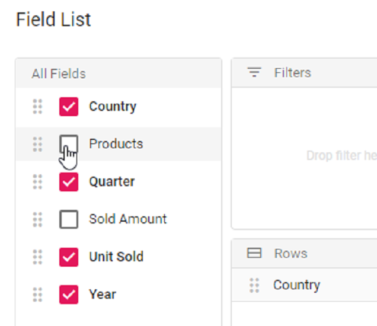

## Remove specific field(s) from displaying

When a data source is bound to the component, fields will be automatically populated inside the Field List. In such case, user can also restrict specific field(s) from displaying. To do so, set the appropriate field name(s) in [`excludeFields`](https://ej2.syncfusion.com/react/documentation/api/pivotview/dataSourceSettingsModel/#excludefields) property belonging to [`dataSourceSettings`](https://ej2.syncfusion.com/react/documentation/api/pivotview#datasourcesettings).










 

## Re-arranging fields

In-order to re-arrange, drag any field from the field list and drop it into the column, row, value, or filter axis using the drag-and-drop holder. It helps end user to alter the report at runtime.

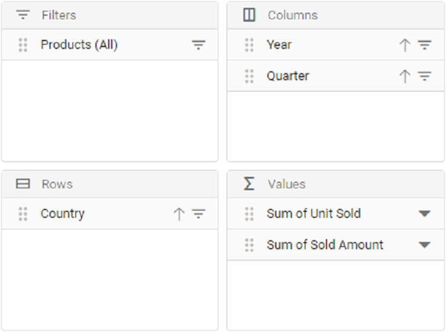

## Filtering members

Using the filter icon besides each field in row, column and filter axes, members can be either included or excluded at runtime. To know more about member filtering, [`refer`](./filtering) here.

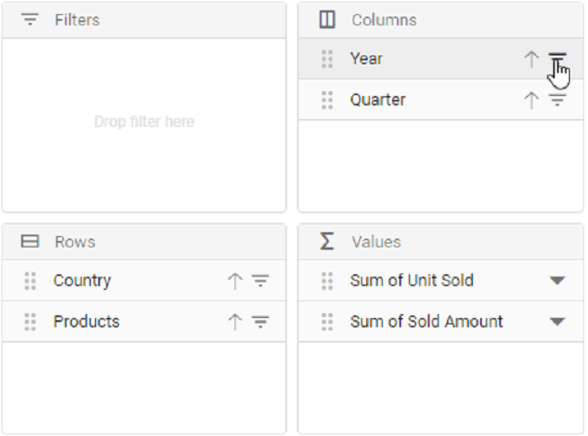
 
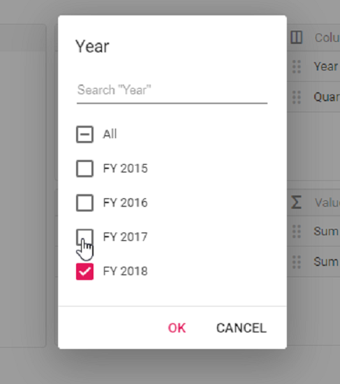
 
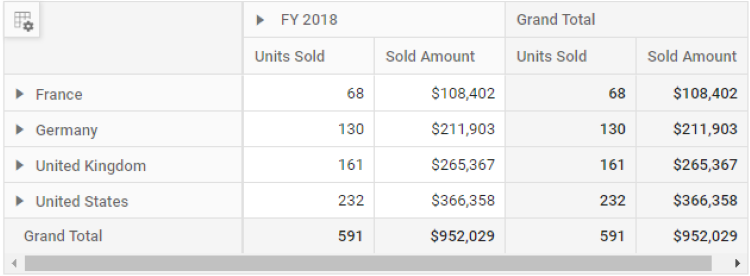

## Sorting members

Using the sort icon besides each field in row and column axes, members can be arranged either in ascending or descending order at runtime. To know more about member sorting, [`refer`](./sorting) here.

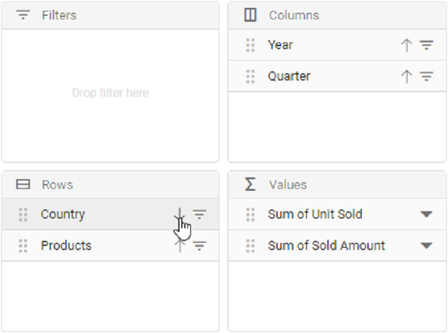
 
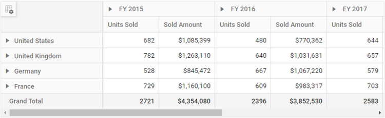

## Calculated fields

The calculated field support allows end user to add a new calculated field based on the available fields from the bound data source using basic arithmetic operators. To enable this support in Field List UI, set the [`allowCalculatedField`](https://ej2.syncfusion.com/react/documentation/api/pivotview#allowcalculatedfield) property in [`PivotView`](https://ej2.syncfusion.com/react/documentation/api/pivotview) to **true** in pivot table. Now a button will be seen automatically inside the field list UI which will invoke the calculated field dialog on click. To know more about calculated field, [`refer`](./calculated-field) here.

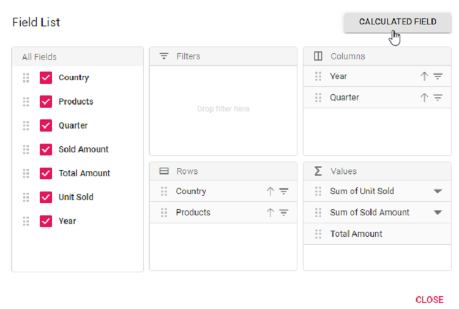
 

 
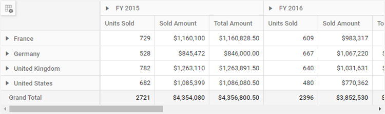

## Changing aggregation type of value fields at runtime

End user can perform calculations over a group of values using the aggregation option. The value fields bound to the field list, appears with a dropdown icon, helps to select an appropriate aggregation type at runtime. On selection, the values in the Pivot Table will be changed dynamically. To know more about aggregation, [`refer`](./aggregation) here.

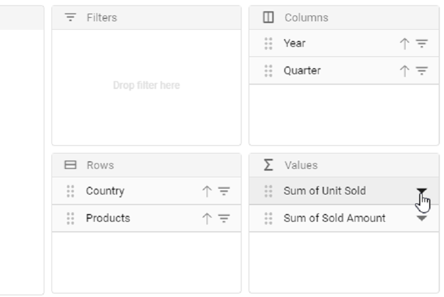
 
 
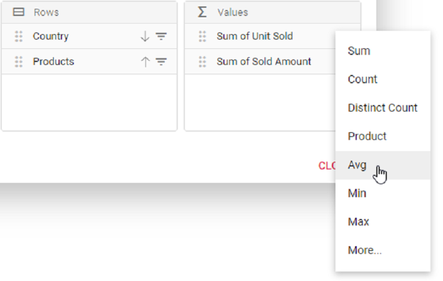
 
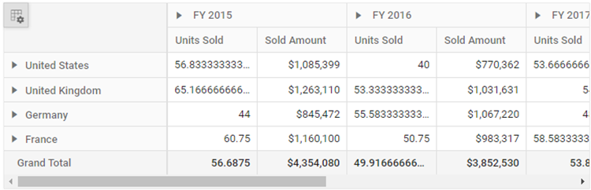

## Defer layout update

Defer layout update support to update the pivot table only on demand and not during every user action. To enable this support in Field List UI, set the [`allowDeferLayoutUpdate`](https://ej2.syncfusion.com/react/documentation/api/pivotview#allowdeferlayoutupdate) property in [`PivotView`](https://ej2.syncfusion.com/react/documentation/api/pivotview) to **true** in pivot table. Now a check box inside Field List UI will be seen in checked state, allowing pivot table to update only on demand. To know more about defer layout, [`refer`](./defer-update) here.

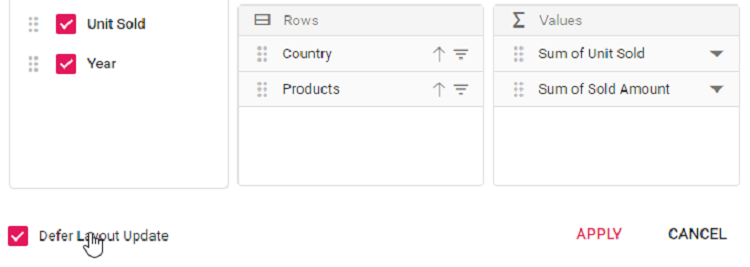

## Show built-in Field List (Popup) over specific target

By passing the target element to the built-in field list dialog module in the [`dataBound`](https://ej2.syncfusion.com/react/documentation/api/pivotview#databound) event, the field list dialog will be displayed over the appropriate target element on a web page. By default, the Pivot Table's parent element is used as the target element to display the built-in field list dialog.

The sample code below shows the built-in field list dialog using `document.body` as the target element.










 

## Show field list using toolbar

It can also be viewed in toolbar by setting [`showFieldList`](https://ej2.syncfusion.com/react/documentation/api/pivotview#showfieldlist) and [`showToolbar`](https://ej2.syncfusion.com/react/documentation/api/pivotview#showtoolbar) properties in [`PivotView`](https://ej2.syncfusion.com/react/documentation/api/pivotview) to **true**. Also, include the **FieldList** within the [`Toolbar`](https://ej2.syncfusion.com/react/documentation/api/pivotview#toolbar) property in [`PivotView`](https://ej2.syncfusion.com/react/documentation/api/pivotview). When toolbar is enabled, field list icon will be automatically added into the toolbar and the icon won't appear on top left corner in the pivot table component.










 

## Set caption to fields which isn’t bound to the report

One can set the caption to all fields from the data source even if it is not bound to the actual report. It can be achieved using the [`enginePopulated`](https://ej2.syncfusion.com/react/documentation/api/pivotfieldlist#enginepopulated) event. On doing so, caption of the respective field will be displayed in both grouping bar and field list.

In the sample, we have set caption to the fields `Year` and `Quarter` dynamically.










 

## Show values button

During runtime, the **Values** button in the field list can be moved to a different position (i.e., different index) among other fields in the column or row axis. To enable the **Values** button, set the [`showValuesButton`](https://ej2.syncfusion.com/react/documentation/api/pivotview/#showvaluesbutton) property to **true**.

> This support is only available for relational data sources.










 

## Events

### EnginePopulated

The [`enginePopulated`](https://ej2.syncfusion.com/react/documentation/api/pivotfieldlist#enginepopulated) event is available in both Pivot Table and Field List.

* The event [`enginePopulated`](https://ej2.syncfusion.com/react/documentation/api/pivotfieldlist#enginepopulated) is triggered in field list whenever the report gets modified. The updated report is passed to the pivot table via [`updateView`](https://ej2.syncfusion.com/react/documentation/api/pivotfieldlist#updateview) method written within this event to refresh the same.

* Likewise, [`enginePopulated`](https://ej2.syncfusion.com/react/documentation/api/pivotfieldlist#enginepopulated) event is triggered in pivot table whenever the report gets modified. The updated report is passed to the field list via [`update`](https://ej2.syncfusion.com/react/documentation/api/pivotfieldlist#update) method written within this event to refresh the same.

The event [`enginePopulated`](https://ej2.syncfusion.com/react/documentation/api/pivotfieldlist#enginepopulated) is triggered after engine is populated. It has following parameters - [`dataSourceSettings`](https://ej2.syncfusion.com/react/documentation/api/pivotfieldlist#datasourcesettings), [`PivotFieldList`](https://ej2.syncfusion.com/react/documentation/api/pivotfieldlist) and `pivotValues`.

>Note: This event is not required for Popup field list since it is a in built one.










 

### FieldDropped

The event [`onFieldDropped`](https://ej2.syncfusion.com/react/documentation/api/pivotview#onfielddropped) fires whenever a field is dropped in an axis. It has following parameters - `droppedAxis`, `droppedField` and `dataSourceSettings`. In this illustration, we have modified the `droppedField` caption through this event at runtime.










 

### FieldListRefreshed

The event [`fieldListRefreshed`](https://ej2.syncfusion.com/react/documentation/api/pivotview/#fieldlistrefreshed) is triggered whenever there is any change done in the field list UI. It has following parameter - dataSourceSettings and pivotValues. It allows user to identify each field list update. This event is applicable only for static field list.

For example, if we perform a sort operation within the field list, the field list will be refreshed. The [`fieldListRefreshed`](https://ej2.syncfusion.com/react/documentation/api/pivotview/#fieldlistrefreshed) event will be triggered at that time and the user can perform custom operation inside that event.










 

### ActionBegin

The event [`actionBegin`](https://ej2.syncfusion.com/react/documentation/api/pivotview/#actionbegin) triggers when the UI actions such as sorting, filtering, aggregation or edit calculated field, that are present in the field list UI begin. This allows user to identify the current action being performed at runtime. It has the following parameters:

* `dataSourceSettings`:  It holds the current data source settings such as input data source, rows, columns, values, filters, format settings and so on.

* `actionName`: It holds the name of the current action began. The following are the UI actions and their names:

| Action | Action Name|
|------|-------------|
| [`Sort icon`](./field-list/#Sorting-members)| Sort field|
| [`Filter icon`](./field-list/#Filtering-members)| Filter field|
| [`Aggregation`](./field-list/#Changing-aggregation-type-of-value-fields-at-runtime) (Value type drop down and menu)| Aggregate field|
| [`Edit icon`](./calculated-field/#Editing-through-the-field-list-and-the-grouping-bar)| Edit calculated field|
| [`Calculated field button`](./field-list/#calculated-fields)| Open calculated field dialog|
| [`Field list`](./field-list/#In-built-Field-List)| Open field list|
| [`Field list tree – Sort icon`](./field-list/#In-built-Field-List)| Sort field tree|

* `fieldInfo`: It holds the selected field information.

>Note: This option is applicable only when the field based UI actions are performed such as filtering, sorting, removing field from grouping bar, editing and aggregation type change.

* `cancel`: It allows user to restrict the current action.

In the below sample, opening pop-up field list can be restricted by setting the **args.cancel** option to **true** in the `actionBegin` event.










 

### ActionComplete

The event [`actionComplete`](https://ej2.syncfusion.com/react/documentation/api/pivotview/#actioncomplete) triggers when the UI actions such as sorting, filtering, aggregation or edit calculated field, that are present in the field list UI, is completed. This allows user to identify the current UI actions being completed at runtime. It has the following parameters:

* `dataSourceSettings`:  It holds the current data source settings such as input data source, rows, columns, values, filters, format settings and so on.

* `actionName`: It holds the name of the current action completed. The following are the UI actions and their names:

| Action | Action Name|
|------|-------------|
| [`Sort icon`](./field-list/#Sorting-members)| Field sorted|
| [`Filter icon`](./field-list/#Filtering-members)| Field filtered|
| [`Aggregation`](./field-list/#Changing-aggregation-type-of-value-fields-at-runtime)(Value type drop down and menu)| Field aggregated|
| [`Edit icon`](./calculated-field/#Editing-the-existing-calculated-field-formula)| Calculated field edited|
| [`Calculated field button`](./field-list/#calculated-fields)| Calculated field applied|
| [`Field list`](./field-list/#In-built-Field-List)| Field list closed|
| [`Field list tree – Sort icon`](./field-list/#In-built-Field-List)| Field tree sorted|

* `fieldInfo`: It holds the selected field information.

>Note: This option is applicable only when the field based UI actions are performed such as filtering, sorting, removing field from grouping bar, editing and aggregation type change.

* `actionInfo`: It holds the unique information about the current UI action. For example, if sorting is completed, the event argument contains information such as sort order and the field name.










 

### ActionFailure

The event [`actionFailure`](https://ej2.syncfusion.com/react/documentation/api/pivotview/#actionfailure) triggers when the current UI action fails to achieve the desired result. It has the following parameters:

* `actionName`: It holds the name of the current action failed. The following are the UI actions and their names:

| Action | Action Name|
|------|-------------|
| [`Sort icon`](./field-list/#Sorting-members)| Sort field|
| [`Filter icon`](./field-list/#Filtering-members)| Filter field|
| [`Aggregation`](./field-list/#Changing-aggregation-type-of-value-fields-at-runtime) (Value type drop down and menu)| Aggregate field|
| [`Edit icon`](./calculated-field/#Editing-the-existing-calculated-field-formula)| Edit calculated field|
| [`Calculated field button`](./field-list/#calculated-fields)| Open calculated field dialog|
| [`Field list`](./field-list/#In-built-Field-List)| Open field list|
| [`Field list tree – Sort icon`](./field-list/#In-built-Field-List)| Sort field tree|

* `errorInfo`: It holds the error information of the current UI action.










 

## See Also

* [Change load limited data in member editor](./how-to/change-load-limited-data-in-member-editor)
* [Customize the icons for pivot table](./how-to/customize-the-icons-for-pivot-table)