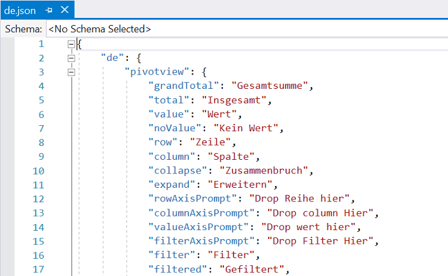

# Globalization and localization in React Pivotview component

Globalization is the combination of Internationalization and localization. You can adapt the component to various languages by parsing and formatting the date or number ([`Internationalization`](https://ej2.syncfusion.com/react/documentation/base/internationalization.html)) & adding culture specific customization and translation to the text ([`Localization`](https://ej2.syncfusion.com/react/documentation/base/localization.html)).

## Load CLDR-Data to the application

* Open command prompt in your machine.

* Run the following command in command prompt.

    ```
    cd /d 'Folder path of your react application'

    For example: cd /d  E:\react\WebApplication
    ```

* Make sure that you have installed `Node and NPM` in your machine before installing the `CLDR-Data`.

* To check if you have `Node`, run this command in command prompt.

    ```
    node -v
    ```

* If `Node` is not installed, then you can download and install the `Node` from this [location](https://nodejs.org/en/).

* To confirm if you have `NPM`, run this command in command prompt.

    ```
    npm -v
    ```

* Now, install the `CLDR-Data` package by using the following command (it installs the CLDR JSON data). To
learn more about CLDR-Data, refer to [CLDR-Data](http://cldr.unicode.org/index/cldr-spec/json).

    ```
    npm install cldr-data --save
    ```

* After installing the package, you can find the culture specific JSON data under the location `/node_modules/cldr-data`. Then, copy the `cldr-data` folder into your react application.

* Download the required locale packages to render the react Pivot Table component with specified locale. To download the locale definition of react components, use this [link](https://github.com/syncfusion/ej2-locale).

* After downloading the ej2-locale package, copy the ej2-locale folder with required local definition file into your react application. By default, the ej2-locale package contains the localized text for static text present in components like grid, chart, pivot table, tools, and more.

The locale JSON file will look like:



## Internationalization

The Internationalization library is used to globalize number, date, and time values in pivot table component using the `dataSourceSettings.formatSettings` option. In the below code sample, we set the culture and currency using the `load`, `setCulture` and `setCurrencyCode` methods. By default, pivot table component is displayed in english culture.

* Set the culture by using the `locale` property.

    
    
    
    
    
    
    
    

    

> * In the above sample, `Amount` field is formatted by [`NumberFormatOptions`](https://ej2.syncfusion.com/react/documentation/base/internationalization.html#number-formatter-and-parser). For date formats, the value strings are formatted by [`DateFormatOptions`](https://ej2.syncfusion.com/react/documentation/base/internationalization.html#date-formatter-and-parser).
> * By default, `locale` value is `en-US`. If you want to change the `en-US` culture to a different culture, you have to change  the `locale` accordingly.
> * Also, you will find more details about support format string for number formats and data formats [`here`](https://ej2.syncfusion.com/documentation/common/intl.html?lang=typescript#supported-format-string).

<!-- markdownlint-disable MD009 -->

### Decimal separators 

The decimal separators of pivot table values varies based on the culture applied to the component. The culture can be set by calling the method [`setCulture`](https://ej2.syncfusion.com/react/documentation/common/localization/#changing-current-locale) with appropriate culture string as its parameter.

The following example demonstrates the decimal separators in `Deutsch` culture.
















 

## Localization

The [`Localization`](https://ej2.syncfusion.com/documentation/common/api-l10n.html) library allows you to localize default text content of the pivot table. The pivot table component has static text on some features (like drop area text, pivot field list title, etc...) that can be changed to other cultures (Arabic, Deutsch, French, etc.) by defining the `locale` value and translation object.

The following list of properties and its values are used in the pivot table.

Locale keywords |Text
-----|-----
grandTotal | Grand Total
total | Total
value | Value
noValue | No value
row | Row
column | Column
collapse | Collapse
expand | Expand
rowAxisPrompt | Drop row here
columnAxisPrompt | Drop column here
valueAxisPrompt | Drop value here
filterAxisPrompt | Drop filter here
filter | Filter
filtered | Filtered
sort | Sort
filters | Filters
rows | Rows
columns | Columns
values | Values
close | Close
cancel | Cancel
delete | Delete
CalculatedField | Calculated Field
createCalculatedField | Create Calculated Field
fieldName | Enter the field name
error | Error
invalidFormula | Invalid formula.
dropText | Example: ('Sum(Order_Count)' + 'Sum(In_Stock)') * 250
dropTextMobile | Add fields and edit formula here.
dropAction | Calculated field cannot be place in any other region except value axis.
alert | Alert
warning | Warning
ok | OK
search | Search
drag | Drag
remove | Remove
Sum | Sum
Avg | Avg
Count | Count
Min | Min
Max | Max
allFields | All Fields
formula | Formula
addToRow | Add to Row
addToColumn | Add to Column
addToValue | Add to Value
addToFilter | Add to Filter
emptyData | No records to display
fieldExist | A field already exists in this name. Please enter a different name.
confirmText | A calculation field already exists in this name. Do you want to replace it?
noMatches | No matches
format | Summaries values by
edit | Edit
clear | Clear
formulaField | Drag and drop fields to formula
dragField | Drag field to formula
clearFilter | Clear
by | by
all | All
multipleItems | Multiple items
member | Member
label | Label
date | Date
enterValue | Enter value
chooseDate | Enter date
Before | Before
BeforeOrEqualTo | Before Or Equal To
After | After
AfterOrEqualTo | After Or Equal To
labelTextContent | Show the items for which the label
dateTextContent | Show the items for which the date
valueTextContent | Show the items for which
Equals | Equals
DoesNotEquals | Does Not Equal
BeginWith | Begins With
DoesNotBeginWith | Does Not Begin With
EndsWith | Ends With
DoesNotEndsWith | Does Not End With
Contains | Contains
DoesNotContains | Does Not Contain
GreaterThan | Greater Than
GreaterThanOrEqualTo | Greater Than Or Equal To
LessThan | Less Than
LessThanOrEqualTo | Less Than Or Equal To
Between | Between
NotBetween | Not Between
And | and
DistinctCount | Distinct Count
Product | Product
SampleVar | Sample Var
PopulationVar | Population Var
RunningTotals | Running Totals
Index | Index
SampleStDev | Sample StDev
PopulationStDev | Population StDev
PercentageOfRowTotal | % of Row Total
PercentageOfParentTotal | % of Parent Total
PercentageOfParentColumnTotal | % of Parent Column Total
PercentageOfParentRowTotal | % of Parent Row Total
DifferenceFrom | Difference From
PercentageOfDifferenceFrom | % of Difference From
PercentageOfGrandTotal | % of Grand Total
PercentageOfColumnTotal | % of Column Total
NotEquals | Not Equals
AllValues | All Values
conditionalFormatting | Conditional Formatting
apply | APPLY
condition | Add Condition
formatLabel | Format
valueFieldSettings | Value field settings
baseField | Base field :
baseItem | Base item :
summarizeValuesBy | Summarize values by :
sourceName | Field name :
sourceCaption | Field caption :
example | e.g:
editorDataLimitMsg |  more items. Search to refine further.
details | Details
manageRecords | Manage Records
Years | Years
Quarters | Quarters
Months | Months
Days | Days
Hours | Hours
Minutes | Minutes
Seconds | Seconds
save | Save a report
new | Create a new report
load | Load
saveAs | Save as current report
rename | Rename a current report
deleteReport | Delete a current report
export | Export
subTotals | Sub totals
grandTotals | Grand totals
reportName | Report Name :
pdf | PDF
excel | Excel
csv | CSV
png | PNG
jpeg | JPEG
svg | SVG
mdxQuery | MDX Query
showSubTotals | Show subtotals
doNotShowSubTotals | Do not show subtotals
showSubTotalsRowsOnly | Show subtotals rows only
showSubTotalsColumnsOnly | Show subtotals columns only
showGrandTotals | Show grand totals
doNotShowGrandTotals | Do not show grand totals
showGrandTotalsRowsOnly | Show grand totals rows only
showGrandTotalsColumnsOnly | Show grand totals columns only
fieldList | Show fieldlist
grid | Show table
toolbarFormatting | Conditional formatting
chart | Chart
reportMsg | Please enter valid report name!!!
reportList | Report list
removeConfirm | Are you sure want to delete this report?
emptyReport | No reports found!!
bar | Bar
line | Line
area | Area
scatter | Scatter
polar | Polar
of | of
emptyFormat | No format found!!!
emptyInput | Enter a value
newReportConfirm | Want to save changes to report?
emptyReportName | Enter a report name
qtr | Qtr
null | null
undefined | undefined
groupOutOfRange | Out of Range
fieldDropErrorAction | The field you are moving cannot be placed in that area of the report
MoreOption | More...
aggregate | Aggregate
drillThrough | Drill Through
ascending | Ascending
descending | Descending
number | Number
currency | Currency
percentage | Percentage
formatType | Format Type
customText | Currency Symbol
symbolPosition | Symbol Position
left | Left
right | Right
grouping | Grouping
true | True
false | False
decimalPlaces | Decimal Places
numberFormat | Number Formatting
memberType | Field Type
formatString | Format String
expressionField | Expression
customFormat | Enter custom format string
selectedHierarchy | Parent Hierarchy
olapDropText | Example: [Measures].[Order Quantity] + ([Measures].[Order Quantity] * 0.10)
Percent | Percent
Custom | Custom
Measure | Measure
Dimension | Dimension
Standard | Standard
blank | (Blank)
fieldTooltip | Drag and drop fields to create an expression. And, if you want to edit the existing the calculated fields! Then you can achieve it by simply selecting the field under 'Calculated Members'.
QuarterYear | Quarter Year
fieldTitle | Field Name
drillError | Cannot show the raw items of calculated fields.
caption | Field Caption
copy | Copy
defaultReport | Default report
customFormatString | Custom Format
invalidFormat | Invalid Format.
group | Group
unGroup | Ungroup
invalidSelection | Cannot group that selection.
groupName | Enter the caption to display in header
captionName | Enter the caption for group field
selectedItems | Selected items
groupFieldCaption | Field caption
groupTitle | Group name
startAt | Starting at
endAt | Ending at
groupBy | Interval by
selectGroup | Select groups
numberFormatString | Example: C, P, 0000 %, ###0.##0#, etc.
stackingcolumn | Stacked Column
stackingbar | Stacked Bar
stackingarea | Stacked Area
stepline | Step Line
steparea | Step Area
splinearea | Spline Area
spline | Spline
stackingcolumn100 | 100% Stacked Column
stackingbar100 | 100% Stacked Bar
stackingarea100 | 100% Stacked Area
bubble | bubble
pareto | Pareto
radar | Radar
chartTypeSettings | Chart type settings
multipleAxes | Multiple Axes
sortAscending | Sort ascending order
sortDescending | Sort descending order
sortNone | Sort data order
clearCalculatedField | Clear edited field info
editCalculatedField | Edit calculated field
ChartType | Chart Type
yes | Yes
no | No
numberFormatMenu | Number Formatting...
conditionalFormattingMenu | Conditional Formatting...
removeCalculatedField | Are you sure you want to delete this calculated field?
replaceConfirmBefore | A report named 
replaceConfirmAfter |  already exists. Do you want to replace it?
pie | Pie
funnel | Funnel
doughnut | Doughnut
pyramid | Pyramid
showLegend | Show Legend
exit | Exit
invalidJSON | Invalid JSON data
invalidCSV | Invalid CSV data
stacked | Stacked
single | Single
multipleAxisMode | Multiple Axis Mode
grandTotalPosition | Grand totals position
top | Top
bottom | Bottom
None | None
stackingline | Stacked Line
stackingline100 | 100% Stacked Line
rowPage | Row pager
rowPerPage | Rows per page
columnPage | Column pager
columnPerPage | Columns per page
goToFirstPage | Go to first page
goToPreviousPage | Go to previous page
goToNextPage | Go to next page
goToLastPage | Go to last page
combined | Combined
subTotalPosition | Subtotals position
auto | Auto

The following list of properties and its values are used in the pivot field list.

Locale keywords |Text
-----|-----
staticFieldList | Pivot Field List
fieldList | Field List
dropFilterPrompt | Drop filter here
dropColPrompt | Drop column here
dropRowPrompt | Drop row here
dropValPrompt | Drop value here
addPrompt | Add field here
adaptiveFieldHeader | Choose field
centerHeader | Drag fields between axes below:
add | add
drag | Drag
filter | Filter
filtered | Filtered
sort | Sort
remove | Remove
filters | Filters
rows | Rows
columns | Columns
values | Values
CalculatedField | Calculated Field
createCalculatedField | Create Calculated Field
fieldName | Enter the field name
error | Error
invalidFormula | Invalid formula.
dropText | Example: ('Sum(Order_Count)' + 'Sum(In_Stock)') * 250
dropTextMobile | Add fields and edit formula here.
dropAction | Calculated field cannot be place in any other region except value axis.
search | Search
close | Close
cancel | Cancel
delete | Delete
alert | Alert
warning | Warning
ok | OK
Sum | Sum
Avg | Avg
Count | Count
Min | Min
Max | Max
allFields | All Fields
formula | Formula
fieldExist | A field already exists in this name. Please enter a different name.
confirmText | A calculation field already exists in this name. Do you want to replace it?
noMatches | No matches
format | Summaries values by
edit | Edit
clear | Clear
formulaField | Drag and drop fields to formula
dragField | Drag field to formula
clearFilter | Clear
by | by
enterValue | Enter value
chooseDate | Enter date
all | All
multipleItems | Multiple items
Equals | Equals
DoesNotEquals | Does Not Equal
BeginWith | Begins With
DoesNotBeginWith | Does Not Begin With
EndsWith | Ends With
DoesNotEndsWith | Does Not End With
Contains | Contains
DoesNotContains | Does Not Contain
GreaterThan | Greater Than
GreaterThanOrEqualTo | Greater Than Or Equal To
LessThan | Less Than
LessThanOrEqualTo | Less Than Or Equal To
Between | Between
NotBetween | Not Between
Before | Before
BeforeOrEqualTo | Before Or Equal To
After | After
AfterOrEqualTo | After Or Equal To
member | Member
label | Label
date | Date
value | Value
labelTextContent | Show the items for which the label
dateTextContent | Show the items for which the date
valueTextContent | Show the items for which
And | and
DistinctCount | Distinct Count
Product | Product
Index | Index
SampleStDev | Sample StDev
PopulationStDev | Population StDev
SampleVar | Sample Var
PopulationVar | Population Var
RunningTotals | Running Totals
DifferenceFrom | Difference From
PercentageOfDifferenceFrom | % of Difference From
PercentageOfGrandTotal | % of Grand Total
PercentageOfColumnTotal | % of Column Total
PercentageOfRowTotal | % of Row Total
PercentageOfParentTotal | % of Parent Total
PercentageOfParentColumnTotal | % of Parent Column Total
PercentageOfParentRowTotal | % of Parent Row Total
Years | Years
Quarters | Quarters
Months | Months
Days | Days
Hours | Hours
Minutes | Minutes
Seconds | Seconds
apply | APPLY
valueFieldSettings | Value field settings
sourceName | Field name :
sourceCaption | Field caption :
summarizeValuesBy | Summarize values by :
baseField | Base field :
baseItem | Base item :
example | e.g:
editorDataLimitMsg |  more items. Search to refine further.
deferLayoutUpdate | Defer Layout Update
null | null
undefined | undefined
groupOutOfRange | Out of Range
fieldDropErrorAction | The field you are moving cannot be placed in that area of the report
MoreOption | More...
memberType | Field Type
selectedHierarchy | Parent Hierarchy
formatString | Format String
expressionField | Expression
olapDropText | Example: [Measures].[Order Quantity] + ([Measures].[Order Quantity] * 0.10)
customFormat | Enter custom format string
Measure | Measure
Dimension | Dimension
Standard | Standard
Currency | Currency
Percent | Percent
Custom | Custom
blank | (Blank)
fieldTooltip | Drag and drop fields to create an expression. And, if you want to edit the existing the calculated fields! You can achieve it by simply selecting the field under 'Calculated Members'.
fieldTitle | Field Name
QuarterYear | Quarter Year
caption | Field Caption
copy | Copy
group | Group
numberFormatString | Example: C, P, 0000 %, ###0.##0#, etc.
sortAscending | Sort ascending order
sortDescending | Sort descending order
sortNone | Sort data order
clearCalculatedField | Clear edited field info
editCalculatedField | Edit calculated field
selectGroup | Select groups
of | of
removeCalculatedField | Are you sure you want to delete this calculated field?
yes | Yes
no | No
None | None

N> To find the latest localization keywords of pivotview and pivotfieldlist for different languages, visit this [GitHub](https://github.com/syncfusion/ej2-locale) repository.

### Loading Translations

To load translation object in an application, use [`load`](https://ej2.syncfusion.com/documentation/common/api-l10n.html#load) function of the [`L10n`](https://ej2.syncfusion.com/documentation/common/api-l10n.html) class.

The following example demonstrates the pivot table in `Deutsch` culture.










 

## Right-to-left (RTL)

Right-to-left (RTL) provides an option to switch the text direction and layout of the pivot table component from right to left. It improves the user experiences and accessibility for users who use right-to-left languages (Arabic, Farsi, Urdu, etc...). To enable RTL pivot table, set the `enableRtl` property to **true**.
















 

## See Also

* [Internationalization](https://ej2.syncfusion.com/react/documentation/base/internationalization.html)
* [Localization](https://ej2.syncfusion.com/react/documentation/base/localization.html)