# OLAP in React Pivot Table component

## Getting Started

This section explains the steps to create a simple **Pivot Table** with an OLAP data source in a React environment.

### Dependencies

Understanding the dependency structure helps you identify the required packages for implementing the Pivot Table component with OLAP data in your React application. The Pivot Table component relies on a structured hierarchy of dependencies that provide essential functionality for data processing, user interface elements, and export capabilities.

The following dependency tree shows the required packages for the React Pivot Table component:

```javascript
|-- @syncfusion/ej2-react-pivotview
    |-- @syncfusion/ej2-pivotview
    |-- @syncfusion/ej2-base
    |-- @syncfusion/ej2-data
    |-- @syncfusion/ej2-excel-export
        |-- @syncfusion/ej2-file-utils
        |-- @syncfusion/ej2-compression
    |-- @syncfusion/ej2-pdf-export
        |-- @syncfusion/ej2-file-utils
        |-- @syncfusion/ej2-compression
    |-- @syncfusion/ej2-calendars
    |-- @syncfusion/ej2-charts
        |-- @syncfusion/ej2-svg-base
    |-- @syncfusion/ej2-inputs
    |-- @syncfusion/ej2-buttons
    |-- @syncfusion/ej2-dropdowns
    |-- @syncfusion/ej2-lists
    |-- @syncfusion/ej2-popups
    |-- @syncfusion/ej2-navigations
    |-- @syncfusion/ej2-grids
|-- @syncfusion/ej2-react-base
```

The main package `@syncfusion/ej2-react-pivotview` serves as the primary React wrapper for the Pivot Table component. This package automatically includes all the necessary sub-dependencies shown in the tree structure above. When you install the main package, npm will automatically resolve and install these dependencies, ensuring your Pivot Table component functions properly with OLAP data binding and supported operations.

### Setup for Local Development

To set up a React application for using the Pivot Table component with OLAP data, use `create-vite-app`. This tool provides a fast and efficient development environment with smaller bundle sizes and optimized builds. For detailed steps, refer to the Vite [installation guide](https://vitejs.dev/guide/).

> **Note:** To create a React application using `create-react-app`, refer to this [guide](https://ej2.syncfusion.com/react/documentation/getting-started/create-app) for more details.

To create a new React application, open your terminal and run the following command:

```bash
npm create vite@latest my-app
```

To set up a React application with TypeScript, use this command:

```bash
npm create vite@latest my-app -- --template react-ts
cd my-app
npm run dev
```

This command creates a TypeScript-based React application, navigates to the project folder, and starts the development server.

To set up a React application with JavaScript, use this command:

```bash
npm create vite@latest my-app -- --template react
cd my-app
npm run dev
```

This command creates a JavaScript-based React application, navigates to the project folder, and starts the development server.

### Adding Syncfusion<sup style="font-size:70%">&reg;</sup> Packages

To use the Pivot Table component with OLAP data in your React project, you need to install the required Syncfusion<sup style="font-size:70%">&reg;</sup> packages. These packages are available in the [npmjs.com](https://www.npmjs.com/~syncfusionorg) public registry. Run the following command to install the Pivot Table package:

```bash
npm install @syncfusion/ej2-react-pivotview --save
```

> The `--save` option ensures that the Pivot Table package is added to the `dependencies` section of your `package.json` file.

### Adding CSS Reference

To style the [Pivot Table](https://www.syncfusion.com/react-components/react-pivot-table), include the necessary CSS files for the Pivot Table and its [dependent](#dependencies) components in the **src/App.css** file. For this example, we use the **tailwind3** theme to ensure a consistent and modern appearance. Add the following code to import the required styles:

```css
@import '../node_modules/@syncfusion/ej2-base/styles/tailwind3.css';
@import '../node_modules/@syncfusion/ej2-buttons/styles/tailwind3.css';
@import '../node_modules/@syncfusion/ej2-dropdowns/styles/tailwind3.css';
@import '../node_modules/@syncfusion/ej2-grids/styles/tailwind3.css';
@import '../node_modules/@syncfusion/ej2-inputs/styles/tailwind3.css';
@import '../node_modules/@syncfusion/ej2-lists/styles/tailwind3.css';
@import '../node_modules/@syncfusion/ej2-navigations/styles/tailwind3.css';
@import '../node_modules/@syncfusion/ej2-popups/styles/tailwind3.css';
@import '../node_modules/@syncfusion/ej2-splitbuttons/styles/tailwind3.css';
@import '../node_modules/@syncfusion/ej2-calendars/styles/tailwind3.css';
@import '../node_modules/@syncfusion/ej2-react-pivotview/styles/tailwind3.css';
```

These styles ensure the [Pivot Table](https://www.syncfusion.com/react-components/react-pivot-table) and its related components, such as buttons and dropdowns, display correctly. You can also use other themes like **bootstrap**, **fabric**, or **high-contrast** to match your application's look. For details on individual component styles, refer to the [Syncfusion theme documentation](https://ej2.syncfusion.com/react/documentation/appearance/theme-studio).

Next, import the **App.css** file into your application by adding the following line in the **src/App.ts** (for TypeScript) or **src/App.js** (for JavaScript) file:

```js
import './App.css';
```

This import applies the CSS styles to your React application, enabling the [Pivot Table](https://www.syncfusion.com/react-components/react-pivot-table) to render with the **tailwind3** theme.

### Adding Pivot Table Component

To integrate the Pivot Table component with an OLAP data source into your React application, follow these steps to initialize it and configure it for OLAP data analysis.

#### 1. Import the Pivot Table Component
In your `App.ts` (or `App.js`) file, import the `PivotViewComponent` from the `@syncfusion/ej2-react-pivotview` package.

#### 2. Initialize the Component
Set up the `<PivotViewComponent/>` in your application using the following code:

```ts
import { PivotViewComponent } from '@syncfusion/ej2-react-pivotview';
import * as React from 'react';
import './App.css';

function App() {
    return (<PivotViewComponent/>);
}

export default App;
```

#### 3. Populate with OLAP Data
To enable users to perform meaningful analysis with OLAP data, the Pivot Table component requires a properly configured OLAP data source. This data source connects to an OLAP cube, such as Microsoft SQL Server Analysis Services (SSAS), to fetch multidimensional data for analysis.

For demonstration purposes, we'll use the **Adventure Works** cube. The OLAP data source is assigned to the Pivot Table component through the [`dataSourceSettings`](https://ej2.syncfusion.com/react/documentation/api/pivotview/dataSourceSettings/) configuration. For more details on OLAP data binding, refer [here](#data-binding).

Here's the complete code to initialize the Pivot Table with an OLAP data source:

```ts
import { PivotViewComponent } from '@syncfusion/ej2-react-pivotview';
import * as React from 'react';
import './App.css';

function App() {
    let dataSourceSettings = {
        catalog: 'Adventure Works DW 2008 SE',
        cube: 'Adventure Works',
        enableSorting: true,
        localeIdentifier: 1033,
        providerType: 'SSAS',
        url: 'https://bi.syncfusion.com/olap/msmdpump.dll',
    };
    let pivotObj;
    return (<PivotViewComponent ref={d => pivotObj = d} id='PivotView' height={350} dataSourceSettings={dataSourceSettings}/>);
}

export default App;
```

### Adding OLAP Cube Elements to Row, Column, Value, and Filter Axes

After initializing the Pivot Table and assigning a sample OLAP data source, you can organize the [OLAP cube elements](#olap-cube-elements) to define how your data is displayed using the [`rows`](https://ej2.syncfusion.com/react/documentation/api/pivotview/dataSourceSettings/#rows), [`columns`](https://ej2.syncfusion.com/react/documentation/api/pivotview/dataSourceSettings/#columns), [`values`](https://ej2.syncfusion.com/react/documentation/api/pivotview/dataSourceSettings/#values), and [`filters`](https://ej2.syncfusion.com/react/documentation/api/pivotview/dataSourceSettings/#filters) properties in the [`dataSourceSettings`](https://ej2.syncfusion.com/react/documentation/api/pivotview/dataSourceSettings/#datasourcesettings) option.

You can use these four main axes to arrange OLAP cube elements from your data source and control how the Pivot Table displays the information.

- [`rows`](https://ej2.syncfusion.com/react/documentation/api/pivotview/dataSourceSettings/#rows): Add OLAP cube elements such as hierarchies, named sets, or calculated members to show them as rows in the Pivot Table.
- [`columns`](https://ej2.syncfusion.com/react/documentation/api/pivotview/dataSourceSettings/#columns): Add OLAP cube elements like hierarchies, named sets, or calculated members to show them as columns in the Pivot Table.
- [`values`](https://ej2.syncfusion.com/react/documentation/api/pivotview/dataSourceSettings/#values): Add OLAP cube elements such as measures or calculated measures to display summarized numeric data in the Pivot Table.
- [`filters`](https://ej2.syncfusion.com/react/documentation/api/pivotview/dataSourceSettings/#filters): Add OLAP cube elements like hierarchies or calculated members here to filter the data shown in the row, column, and value axes.

To specify each [OLAP cube element](#olap-cube-elements) in the required axis, set the following options:

- [`name`](https://ej2.syncfusion.com/react/documentation/api/pivotview/fieldOptions/#name): Specifies the unique name of the hierarchy, named set, measure, or calculated member from the OLAP data source. The name must be entered exactly as it appears in the data source. If the name is not matched, the Pivot Table will be empty.
- [`caption`](https://ej2.syncfusion.com/react/documentation/api/pivotview/fieldOptions/#caption): Specifies a caption or display name for the item in the Pivot Table. If a caption is not set, the unique name appears by default.

For example, in the sample below, the element "Product Categories" is assigned to the columns axis, "Customer Geography" is assigned to the rows axis, and both "Customer Count" and "Internet Sales Amount" are set in the values axis.












### Applying Formatting to a Value Field

You can change how values in the Pivot Table are displayed by applying formatting. For example, you can display values as currency by using the **C** format string. To apply formatting, use the [`formatSettings`](https://ej2.syncfusion.com/react/documentation/api/pivotview/formatSettings/#formatsettings) property within [`dataSourceSettings`](https://ej2.syncfusion.com/react/documentation/api/pivotview/dataSourceSettings/), and define both the [`name`](https://ej2.syncfusion.com/react/documentation/api/pivotview/formatSettings/#name) (the value field to format) and the [`format`](https://ej2.syncfusion.com/react/documentation/api/pivotview/formatSettings/#format) (the format to apply).

In the following example, the [`formatSettings`](https://ej2.syncfusion.com/react/documentation/api/pivotview/formatSettings/) property is used to apply the **C0** format to the **[Measures].[Internet Sales Amount]** field. This causes its values to be displayed as currency, showing the currency symbol without any decimal places. You can add formatting for other value fields in a similar way by including them in the [`formatSettings`](https://ej2.syncfusion.com/react/documentation/api/pivotview/formatSettings/#formatsettings) array.

> Only fields from the value section containing numeric data can be formatted.












### Enable Grouping Bar

The grouping bar lets users easily organize [OLAP cube elements](#olap-cube-elements) from the connected data source. Users can drag these cube elements between different axes, such as [rows](https://ej2.syncfusion.com/react/documentation/api/pivotview/dataSourceSettings/#rows), [columns](https://ej2.syncfusion.com/react/documentation/api/pivotview/dataSourceSettings/#columns), [values](https://ej2.syncfusion.com/react/documentation/api/pivotview/dataSourceSettings/#values), and [filters](https://ej2.syncfusion.com/react/documentation/api/pivotview/dataSourceSettings/#filters), to quickly change how data is shown in the Pivot Table. It also allows sorting, filtering, and removing of elements directly from the grouping bar, making it simple to customize the Pivot Table layout at runtime.

To display the grouping bar, set the [`showGroupingBar`](https://ej2.syncfusion.com/react/documentation/api/pivotview/pivotViewModel/#showgroupingbar) property to **true** in the [Pivot Table](https://ej2.syncfusion.com/react/documentation/api/pivotview/) component, and make sure to inject the **GroupingBar** module as shown below.

> Note: If the **GroupingBar** module is not injected, the grouping bar will not appear in the Pivot Table component.












### Enable Pivot Field List

The Pivot Table control includes a built-in Field List, similar to the one in Microsoft Excel. This Field List allows users to add or remove [OLAP cube elements](#olap-cube-elements), and to move them between different axes: [rows](https://ej2.syncfusion.com/react/documentation/api/pivotview/dataSourceSettings/#rows), [columns](https://ej2.syncfusion.com/react/documentation/api/pivotview/dataSourceSettings/#columns), [values](https://ej2.syncfusion.com/react/documentation/api/pivotview/dataSourceSettings/#values), and [filters](https://ej2.syncfusion.com/react/documentation/api/pivotview/dataSourceSettings/#filters). Users can also filter and sort these elements as needed, all during runtime.

To display the Field List, set the [`showFieldList`](https://ej2.syncfusion.com/react/documentation/api/pivotview/pivotViewModel/#showfieldlist) property to **true** on the Pivot Table. It is also necessary to inject the [`FieldList`](https://ej2.syncfusion.com/react/documentation/api/pivotview/FieldList/) module.

> Note: If the **FieldList** module is not injected, the Field List will not appear in the Pivot Table.












### Exploring Filter Axis

The filter axis in the Pivot Table allows users to control which data is displayed in the [`rows`](https://ej2.syncfusion.com/react/documentation/api/pivotview/dataSourceSettings/#rows), [`columns`](https://ej2.syncfusion.com/react/documentation/api/pivotview/dataSourceSettings/#columns), and [`values`](https://ej2.syncfusion.com/react/documentation/api/pivotview/dataSourceSettings/#values) axes. It includes various [OLAP cube elements](#olap-cube-elements), such as hierarchies and calculated members. When elements are placed in the filter axis, they act as master filters that refine the data shown in the Pivot Table.

Users can add [OLAP cube elements](#olap-cube-elements) and filter members to the filter axis either by updating the report in code behind or by dragging items from other axes to the filter axis using the grouping bar or field list at runtime. This makes it easy to filter data according to specific requirements directly within the Pivot Table interface.












### Calculated Field

The calculated field option lets users create a new field in the Pivot Table by using expressions based on existing [OLAP cube elements](#olap-cube-elements) from the connected data source. These calculated fields are new custom dimensions or measures built from an expression defined by the user.

There are two types of calculated fields:

- **Calculated Measure** – Creates a new measure by using a custom expression.
- **Calculated Dimension** – Creates a new dimension by using a custom expression.

You can define calculated fields in your code by using the [`calculatedFieldsSettings`](https://ej2.syncfusion.com/react/documentation/api/pivotview/calculatedFieldSettings/#calculatedfieldsettings) property in the [dataSourceSettings](https://ej2.syncfusion.com/react/documentation/api/pivotview/dataSourceSettings/) configuration. The available options for calculated fields are:

- [`name`](https://ej2.syncfusion.com/react/documentation/api/pivotview/calculatedFieldSettings/#name): Sets a unique name for the new calculated field.
- [`formula`](https://ej2.syncfusion.com/react/documentation/api/pivotview/calculatedFieldSettings/#formula): Allows you to set the expression for the calculated field.
- [`hierarchyUniqueName`](https://ej2.syncfusion.com/react/documentation/api/pivotview/calculatedFieldSettings/#hierarchyuniquename): Specifies the dimension’s unique name, so that only hierarchies within that dimension are used in the expression. This option applies only to calculated dimensions.
- [`formatString`](https://ej2.syncfusion.com/react/documentation/api/pivotview/calculatedFieldSettings/#formatstring): Sets the format for the calculated field result.

When adding calculated fields to an axis in your code, set the [`isCalculatedField`](https://ej2.syncfusion.com/react/documentation/api/pivotview/fieldOptions/#iscalculatedfield) property to **true**.

You can also add calculated fields at runtime through the built-in dialog. To enable this dialog, set the [`allowCalculatedField`](https://ej2.syncfusion.com/react/documentation/api/pivotview/pivotViewModel/#allowcalculatedfield) property to **true** and add the **CalculatedField** module. This will display a button in the Field List UI, letting users open the calculated field dialog and create or edit calculated fields as needed.

> If the **CalculatedField** module is not added, the calculated field dialog will not be shown with the Pivot Table component. Also, calculated measures can be added only to the value axis.












Users can add a calculated field at runtime using the built-in dialog by following these steps:

**Step 1:** Click the **CALCULATED FIELD** button in the field list dialog, located at the top right corner. The calculated field dialog appears. Enter the name for the new calculated field in the dialog.

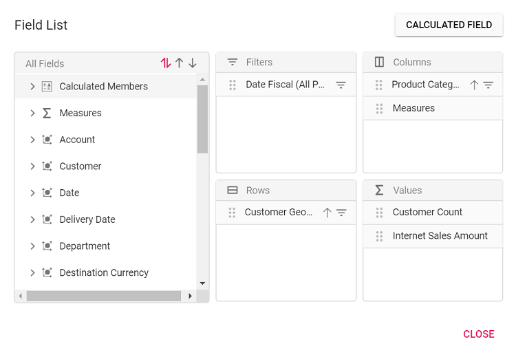

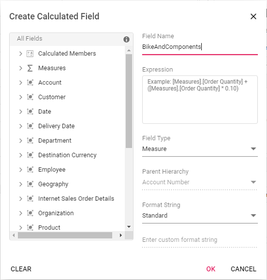

**Step 2:** Create the expression for your calculated field. To do this, drag and drop fields from the tree view on the left side of the dialog and use simple arithmetic operators.

**For example**: `IIF([Measures].[Internet Sales Amount]^0.5 > 100, [Measures].[Internet Sales Amount]*100, [Measures].[Internet Sales Amount]/100)`  
For more information about supported [`operators`](https://docs.microsoft.com/en-us/sql/mdx/operators-mdx-syntax?view=sql-server-ver15) and [`functions`](https://docs.microsoft.com/en-us/sql/mdx/functions-mdx-syntax?view=sql-server-ver15), see the Microsoft documentation.

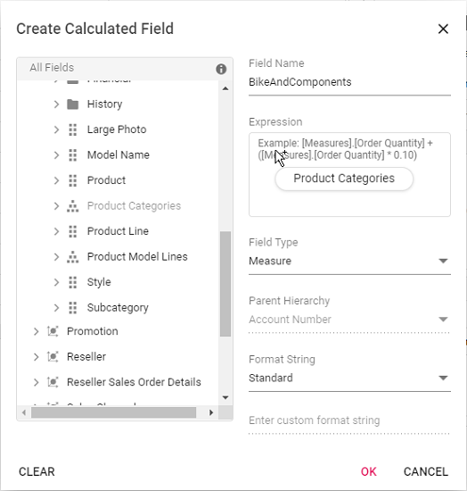

**Step 3:** Select the type for the new field, either calculated measure or calculated dimension.

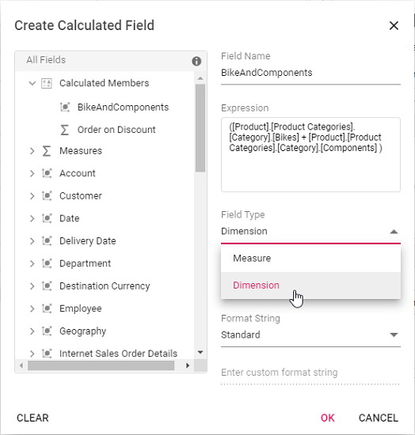

**Step 4:** If you are creating a calculated dimension, select its parent hierarchy from the drop-down list. This step is only required when adding a calculated dimension.


**Step 5:** Select a format string from the drop-down list and then click **OK** to finalize the calculated field.

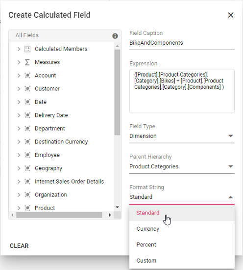

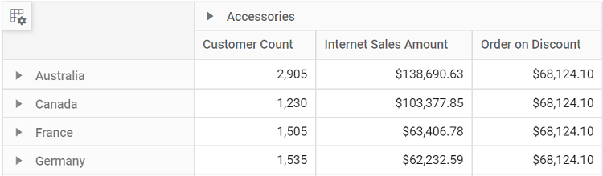

#### Format String

When creating a calculated field in the [Pivot Table](https://ej2.syncfusion.com/react/documentation/api/pivotview/), you can choose the format for displaying values by selecting a format string. The available options are:

* **Standard** – Displays values as standard numbers.
* **Currency** – Displays values in currency format.
* **Percent** – Displays values as a percentage.
* **Custom** – Allows you to define your own format string. For example, entering "###0.##0#" will show the value "9584.3" as "9584.300".

By default, the **Standard** option is selected in the drop-down list.

This option helps users present calculated field results in the most suitable format for their needs.

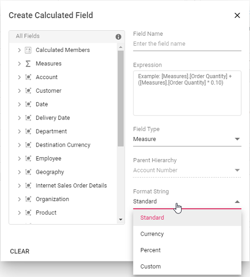

#### Renaming the Existing Calculated Field

You can rename any existing calculated field directly through the user interface at runtime. This option allows you to update calculated field names to keep them clear and meaningful as your analysis needs change.

To rename a calculated field:

1. Open the calculated field dialog in the Pivot Table.
2. Click the name of the field you want to rename. The current name will be shown in the text box at the top of the dialog.
3. Enter the new name in the text box.
4. Click **OK** to save the new name.

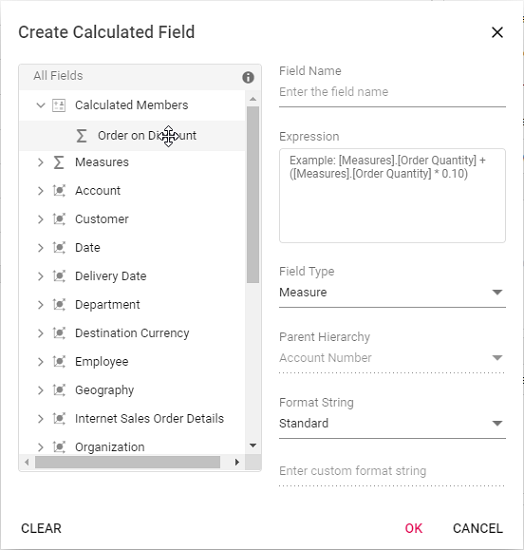

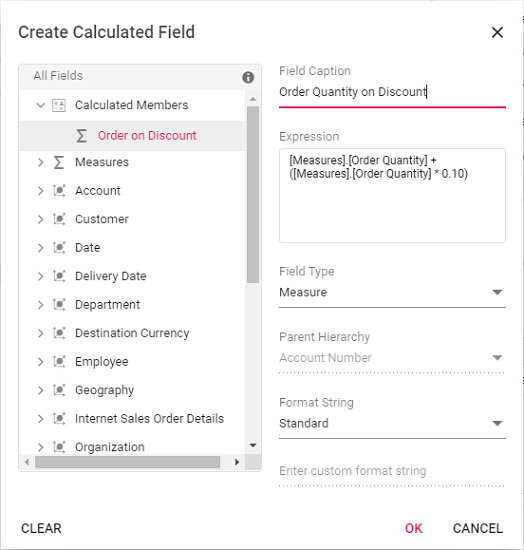

#### Editing an Existing Calculated Field Formula

You can edit an existing calculated field formula directly through the user interface at runtime. To do this:

1. Open the calculated field dialog in the Pivot Table.
2. From the list, select the calculated field you want to edit.
3. The current formula for the selected field will appear in the **Expression** section.
4. Modify the formula as needed based on your requirements.
5. Click **OK** to apply and save your changes.

The Pivot Table will automatically update to show the changes in the calculated values.


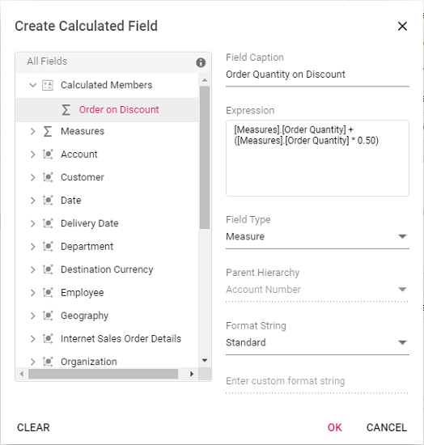

#### Reusing an Existing Formula in a New Calculated Field

This option allows you to easily create a new calculated field in the [Pivot Table](https://ej2.syncfusion.com/react/documentation/api/pivotview/) by reusing a formula from an existing calculated field. This saves time and helps keep your calculations consistent.

To reuse an existing formula when working with the OLAP data source:

1. Open the calculated field dialog in the Pivot Table.
2. Find the existing calculated field that contains the formula you want to use again.
3. Drag the existing calculated field from the field list treeview.
4. Drop it into the **Expression** section. The formula from the selected field is then added automatically.
5. If needed, you can adjust the formula further or use it without changes.
6. Click **OK** to add your new calculated field.


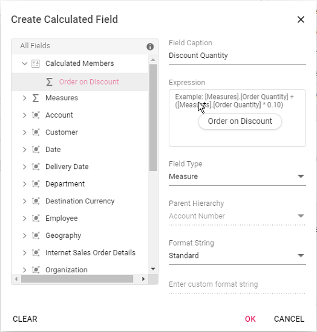

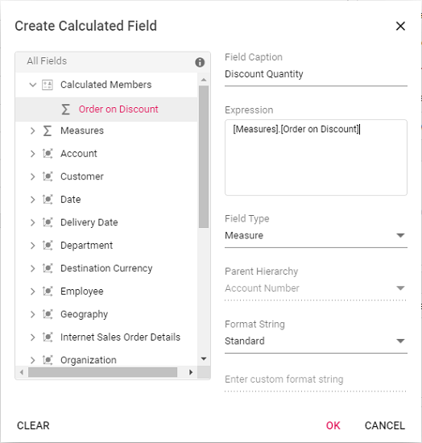

#### Modifying the Existing Format String

You can modify the format string of an existing calculated field at runtime through the user interface. To do this:

1. Open the calculated field dialog in the Pivot Table.
2. Click the name of the calculated field you want to edit.
3. The dialog will display the current format string in a drop-down list.
4. Select or enter a new format string based on your requirements.
5. Click **OK** to apply and save your changes.


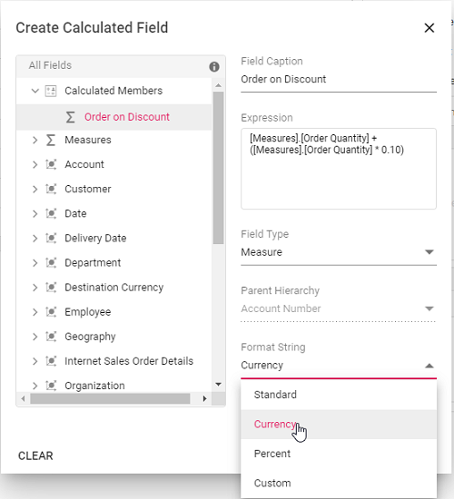

#### Clearing the Changes While Editing the Calculated Field

If you make edits while creating or modifying a calculated field, you can easily remove all the current changes by clicking the **Clear** button. This option is available in the bottom left corner of the calculated field dialog. Using the Clear button helps you start over without manually undoing each change, ensuring a smooth editing experience.

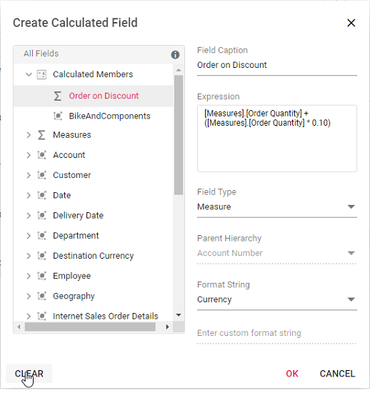

### Virtual Scrolling

Virtual scrolling helps you view large amounts of data smoothly in the Pivot Table. It loads and displays only the rows and columns currently visible in the viewport. As you scroll vertically or horizontally, new data is brought into view automatically, ensuring good performance even with a large data source.

To enable virtual scrolling, set the [`enableVirtualization`](https://ej2.syncfusion.com/react/documentation/api/pivotview/#enablevirtualization) option to **true**. Also, be sure to inject the [`VirtualScroll`](https://ej2.syncfusion.com/react/documentation/api/pivotview/#virtualscrollservice) module into the Pivot Table.












#### Limitations for Virtual Scrolling

- When using virtual scrolling, the [`columnWidth`](https://ej2.syncfusion.com/react/documentation/api/pivotview/gridSettings/#columnwidth) property under [`gridSettings`](https://ej2.syncfusion.com/react/documentation/api/pivotview/gridSettings/) must be set in pixels; percentage values are not supported.
- Resizing columns or setting width to individual columns affects the calculation used to pick the correct page on scrolling.
- With OLAP data, subtotals and grand totals are shown only when measures are placed at the end of the [`rows`](https://ej2.syncfusion.com/react/documentation/api/pivotview/dataSourceSettings/#rows) or [`columns`](https://ej2.syncfusion.com/react/documentation/api/pivotview/dataSourceSettings/#columns) axes within [`dataSourceSettings`](https://ej2.syncfusion.com/react/documentation/api/pivotview/dataSourceSettings/). If measures appear elsewhere, data will display without summary totals.
- If the width and height of the Pivot Table are set to large values, the amount of data loaded in the current, previous, and next pages increases. This may impact loading performance during scrolling.

### Run the Application

Running the Pivot Table application allows you to see your changes and data in real time directly in the browser, making it easy to check your results.

To start the application, open a command prompt in your project folder and run the following command. This will compile the project and automatically open it in your browser.

```sh
npm start
```












## Data Binding

To connect an OLAP data source to the Pivot Table, use the [`dataSourceSettings`](https://ej2.syncfusion.com/react/documentation/api/pivotview/dataSourceSettings/#datasourcesettings) property. Several options within `dataSourceSettings` must be specified to bind data correctly:

| Property | Description |
|----------|-------------|
| [`cube`](https://ej2.syncfusion.com/react/documentation/api/pivotview/dataSourceSettings/#cube "cube") | Specifies the name of the OLAP cube to use from the database. |
| [`providerType`](https://ej2.syncfusion.com/react/documentation/api/pivotview/dataSourceSettings/#providertype "providerType") | Indicates the type of provider, helping the Pivot Table determine how to connect to the data source. |
| [`url`](https://ej2.syncfusion.com/react/documentation/api/pivotview/dataSourceSettings/#url "url") | The URL of the OLAP service. Use this to establish an online connection to the cube. |
| [`catalog`](https://ej2.syncfusion.com/react/documentation/api/pivotview/dataSourceSettings/#catalog "catalog") | The database or catalog name containing the cube data. |

Below are sample code files showing how to bind an OLAP data source in React:












### Fields

#### Measures in the Row Axis

By default, measures are shown on the columns axis in the Pivot Table. If you would like to display measures on the rows axis instead, you can do this using the [grouping bar](https://ej2.syncfusion.com/react/documentation/api/pivotview/#showgroupingbar) or the [field list](https://ej2.syncfusion.com/react/documentation/api/pivotview/#showfieldlist) UI. Simply drag the "Measures" button and drop it onto the rows axis.

Alternatively, you can set up the measure directly in your code by configuring the [`dataSourceSettings`](https://ej2.syncfusion.com/react/documentation/api/pivotview/dataSourceSettings/) option, as shown in the code below:












#### Measures in Different Positions

You can choose where to place measures on either the row or column axis through code behind or the user interface. In this example, the **measures** are set before the dimension field on the column axis. To achieve this, specify the order of the fields within the [`dataSourceSettings`](https://ej2.syncfusion.com/react/documentation/api/pivotview/dataSourceSettings/#datasourcesettings) property.












### Named Set

A named set is a multidimensional expression (MDX) that provides a predefined group of members from a dimension. It is created by combining cube data with arithmetic operators, numbers, or functions.

To display a named set in the Pivot Table, set its unique name using the [`name`](https://ej2.syncfusion.com/react/documentation/api/pivotview/fieldOptions/#name) property within either the row or column axis in [`dataSourceSettings`](https://ej2.syncfusion.com/react/documentation/api/pivotview/dataSourceSettings/#datasourcesettings). Additionally, set the [`isNamedSet`](https://ej2.syncfusion.com/react/documentation/api/pivotview/fieldOptions/#isnamedset) property to **true**. In the example below, the "Core Product Group" named set is added to the column axis.












### Configuring Authentication

To connect to an OLAP data source that requires authentication, users can provide basic authentication details through the [`authentication`](https://ej2.syncfusion.com/react/documentation/api/pivotview/dataSourceSettings/#authentication) property within the [`dataSourceSettings`](https://ej2.syncfusion.com/react/documentation/api/pivotview/dataSourceSettings/#datasourcesettings) option of the Pivot Table. The authentication options include:

- [`userName`](https://ej2.syncfusion.com/react/documentation/api/pivotview/authenticationModel/#username): Enter the username required for access to the OLAP server.
- [`password`](https://ej2.syncfusion.com/react/documentation/api/pivotview/authenticationModel/#password): Enter the password associated with the username.

> If authentication details are not provided, the browser will display a default pop-up window prompting users to enter the required information.

Below is an example of how to configure authentication settings in the Pivot Table:

```ts
import * as React from 'react';
import * as ReactDOM from 'react-dom';
import { FieldList, PivotViewComponent } from '@syncfusion/ej2-react-pivotview';
import { DataSourceSettingsModel } from '@syncfusion/ej2-pivotview/src/model/datasourcesettings-model';

function App() {
    let dataSourceSettings: DataSourceSettingsModel = {
        catalog: 'Adventure Works DW 2008 SE',
        cube: 'Adventure Works',
        providerType: 'SSAS',
        enableSorting: true,
        url: 'https://bi.syncfusion.com/olap/msmdpump.dll',
        localeIdentifier: 1033,
        rows: [
            { name: '[Customer].[Customer Geography]', caption: 'Customer Geography' },
        ],
        columns: [
            { name: '[Product].[Product Categories]', caption: 'Product Categories' },
            { name: '[Measures]', caption: 'Measures' },
        ],
        values: [
            { name: '[Measures].[Customer Count]', caption: 'Customer Count' },
            { name: '[Measures].[Internet Sales Amount]', caption: 'Internet Sales Amount' }
        ],
        filters: [
            { name: '[Date].[Fiscal]', caption: 'Date Fiscal' },
        ],
        filterSettings: [
            {
                name: '[Date].[Fiscal]',
                items: ['[Date].[Fiscal].[Fiscal Quarter].&[2002]&[4]', '[Date].[Fiscal].[Fiscal Year].&[2005]'],
                levelCount: 3
            }
        ],
        authentication: {
            userName: 'username',
            password: 'password'
        }
    };
    let pivotObj: PivotViewComponent;
    return (
        <PivotViewComponent
            ref={d => (pivotObj = d)}
            id='PivotView'
            height={350}
            dataSourceSettings={dataSourceSettings}
            showFieldList={true}
        >
            <Inject services={[FieldList]} />
        </PivotViewComponent>
    );
}

export default App;
ReactDOM.render(<App />, document.getElementById('sample'));
```

### Roles

SQL Server Analysis Services (SSAS) uses [roles](https://learn.microsoft.com/en-us/analysis-services/multidimensional-models/roles-and-permissions-analysis-services?view=asallproducts-allversions) to control user access to the data inside an OLAP cube. Each role is defined with a set of permissions that can be assigned to individual users or groups. By assigning roles, you can restrict access to sensitive data and also determine who can view or modify information in the cube.

In the Syncfusion React Pivot Table, you can specify roles using the [`roles`](https://ej2.syncfusion.com/react/documentation/api/pivotview/dataSourceSettings/#roles) property within the [`dataSourceSettings`](https://ej2.syncfusion.com/react/documentation/api/pivotview/dataSourceSettings/#datasourcesettings) object. This allows you to provide one or more role names for connecting to an OLAP cube. If you want to use multiple roles, list them as a comma-separated string.

```ts
import * as React from 'react';
import * as ReactDOM from 'react-dom';
import { PivotViewComponent } from '@syncfusion/ej2-react-pivotview';
import { DataSourceSettingsModel } from '@syncfusion/ej2-pivotview/src/model/datasourcesettings-model';

function App() {
    let dataSourceSettings: DataSourceSettingsModel = {
        catalog: 'Adventure Works DW 2008 SE',
        cube: 'Adventure Works',
        roles: 'Role1',
        providerType: 'SSAS',
        url: 'https://bi.syncfusion.com/olap/msmdpump.dll',
        localeIdentifier: 1033,
        rows: [
            { name: '[Customer].[Customer Geography]', caption: 'Customer Geography' },
        ],
        columns: [
            { name: '[Product].[Product Categories]', caption: 'Product Categories' },
            { name: '[Measures]', caption: 'Measures' },
        ],
        values: [
            { name: '[Measures].[Customer Count]', caption: 'Customer Count' },
            { name: '[Measures].[Internet Sales Amount]', caption: 'Internet Sales Amount' }
        ]
    };
    let pivotObj: PivotViewComponent;
    return (
        <PivotViewComponent
            ref={d => (pivotObj = d)}
            id='PivotView'
            height={350}
            dataSourceSettings={dataSourceSettings}
        />
    );
}

export default App;
ReactDOM.render(<App />, document.getElementById('sample'));
```

## OLAP Cube: Elements

### Field List

The field list, also called the cube dimension browser, displays the cube elements from the selected OLAP cube in a tree view structure. It organizes elements such as dimensions, hierarchies, and measures into logical groups, making it easier for the user to explore and arrange data for analysis using the Pivot Table.

#### Types of Nodes in the Field List

- **Display folder**: Contains a set of similar cube elements grouped together.
- **Measure**: Represents the numeric values or quantities that users can analyze and summarize in the Pivot Table.
- **Dimension**: Groups related data and helps users to categorize and filter information in the cube.
- **Attribute hierarchy**: Shows data at different attribute levels within a dimension, allowing users to drill down for more specific analysis.
- **User-defined hierarchy**: Presents a custom arrangement of members within a dimension, structured in multiple levels for easier navigation and deeper data analysis.
- **Level**: Indicates a specific position or stage within a hierarchy for more focused data review.
- **Named set**: A saved collection of tuples or members that can be reused in analysis as part of the cube definition.

#### Measure

A measure in a cube refers to a numeric value that comes from a column in the cube’s fact table. Measures are the main values analyzed in the Pivot Table. They help users investigate metrics such as sales, costs, expenditures, or production counts. Users can select measures based on their analysis needs. In the field list, all available measures are grouped separately, making it easy to select or remove measures as required. When a user chooses a measure, it is displayed in the desired area of the [Pivot Table](https://ej2.syncfusion.com/react/documentation/api/pivotview/) and participates in calculations and summary values.

#### Dimension

A dimension is an essential part of the OLAP cube in the Pivot Table. It holds key information, such as its name, hierarchies, levels, and members. To use a dimension, you specify its name, along with the desired hierarchy and the corresponding level. Each dimension contains detailed information about its hierarchies, and each hierarchy is made up of one or more levels. Within each level, there are members, and each member can also have child members. This structure helps users organize and explore data easily in the Pivot Table.

#### Hierarchy

A hierarchy organizes elements within a dimension into a series of parent-child relationships. Each parent member groups its child members, summarizing their data. These parent members can also be grouped under another parent for further summarization. For example, in a time dimension, the month of May 2005 can be grouped under Second Quarter 2005, which is then summarized under the year 2005.

#### Level

A level is a child element of a hierarchy in the field list. It contains a group of members that share the same rank within that hierarchy. For example, in a hierarchy representing geographical data, a level might include members like cities or states, all at the same depth.

#### Attribute Hierarchy

An attribute hierarchy in the Pivot Table organizes data into levels for easier analysis. It includes:

- **Leaf level**: This level contains unique attribute members, known as leaf members. Each leaf member represents a distinct data point.
- **Intermediate levels**: These exist in a parent-child hierarchy, connecting the leaf level to higher levels for structured data exploration.
- **Optional (all) level**: This level shows the combined total of all leaf members' values. The member at this level is called the (all) member.

#### User-Defined Hierarchy

A user-defined hierarchy arranges the members of a dimension into a structured, hierarchical format, making it easier to navigate and analyze data in the cube. For example, consider a dimension table with attributes like year, quarter, and month. These attributes can be combined to create a user-defined hierarchy named Calendar within the time dimension. This hierarchy connects all levels—year, quarter, and month—allowing users to explore data across different time periods seamlessly.

#### Differentiating User-Defined Hierarchy and Attribute Hierarchy

In the field list of the Pivot Table, hierarchies help users organize and analyze data in different ways. There are two main types of hierarchies:

- **User-defined hierarchy**: This type of hierarchy consists of two or more levels. Each level is created by combining related fields, which allows users to drill down through the data step by step—for example, from "Year" to "Quarter" to "Month" within a "Date" dimension. User-defined hierarchies use fields from the same dimension to create a logical path for navigation.
- **Attribute hierarchy**: In this type, there is only a single level. Each field in the dimension automatically forms an attribute hierarchy. For example, if "Country" is a field, it will appear as an attribute hierarchy with just one level, letting the user view data for each country individually.

#### Named Set

A named set is a group of specific tuples or members that can be defined and stored within the OLAP cube. Named sets are saved inside the sets folder under a dimension element in the field list, making them easy to locate. Users can add these named sets to the [`rows`](https://ej2.syncfusion.com/react/documentation/api/pivotview/dataSourceSettings/#rows) or [`columns`](https://ej2.syncfusion.com/react/documentation/api/pivotview/dataSourceSettings/#columns) axes through the grouping bar or the field list when working with the Pivot Table at runtime. Named sets are useful for handling long, complex, or frequently used expressions. The cube supports defining named sets using Multidimensional Expressions (MDX), which helps users manage these expressions more efficiently.

#### Calculated Field

The calculated field option lets users create a new field in the Pivot Table using their own formula or expression, based on the existing OLAP cube elements in the connected data source. These fields act as custom dimensions or measures, allowing users to add calculations that are not originally available in the cube.

There are two types of calculated fields:

* **Calculated measure** – This allows users to create a new measure by defining a custom expression. The new measure is then available in the field list along with the other measures.
* **Calculated dimension** – This allows users to create a new dimension using a user-defined expression. The dimension is grouped together with other dimensions in the field list.

#### Symbolic Representation of the Nodes Inside Field List

In the field list, each node uses a specific icon to help users quickly identify its type and purpose. The following table describes each type of node, its symbol, and whether it can be dragged into the Axis Fields:

| Icon | Name | Node Type | Is Draggable? |
|------|------|-----------|--------------|
|  | Display folder | Display Folder | No |
|  | Measure | Measure | No |
|  | Dimension | Dimension | No |
|  | User-defined hierarchy | Hierarchy | Yes |
|  | Attribute hierarchy | Hierarchy | Yes |
| <br><br> | Levels (in order) | Level Element | Yes |
|  | Named set | Named Set | Yes |

## Events

### BeforeServiceInvoke

The [`beforeServiceInvoke`](https://ej2.syncfusion.com/react/documentation/api/pivotview/pivotViewModel/#beforeserviceinvoke) event is triggered before initiating any service communication with the OLAP server in the Pivot Table and Field List components.

* This event allows you to inject custom properties or additional parameters dynamically before a request is made to the OLAP server.

* It is particularly useful for passing contextual data such as user tokens, custom filters, or localization information along with the original server request.

When the [`beforeServiceInvoke`](https://ej2.syncfusion.com/react/documentation/api/pivotview/pivotViewModel/#beforeserviceinvoke) event is triggered, the event argument provides access to the request details and includes a [`customProperties`](https://ej2.syncfusion.com/react/documentation/api/pivotview/beforeServiceInvokeEventArgs/#customproperties) field.












### AfterServiceInvoke

The [`afterServiceInvoke`](https://ej2.syncfusion.com/react/documentation/api/pivotview/pivotViewModel/#afterserviceinvoke) event is triggered in the Pivot Table and Field List components during the onSuccess phase of every OLAP service request.

* This event is useful for performing post-processing, logging actions, or updating the UI after receiving a successful response from the OLAP server.

* You may use it to audit data, trigger notifications, or handle custom response-handling logic.

When the [`afterServiceInvoke`](https://ej2.syncfusion.com/react/documentation/api/pivotview/pivotViewModel/#afterserviceinvoke) event is triggered, the event argument provides access to the server response details, including properties such as the action performed and the result data returned from the OLAP server.










