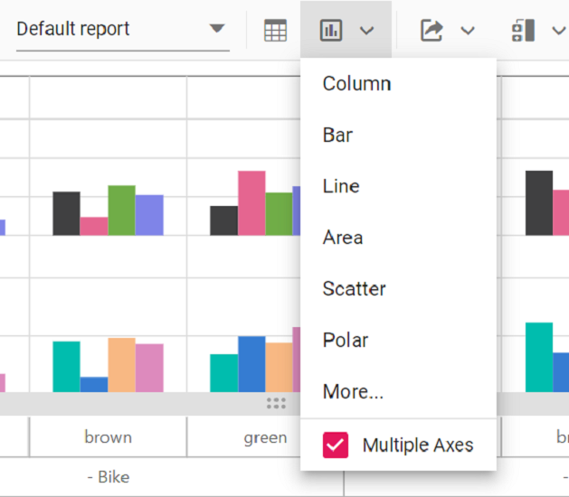
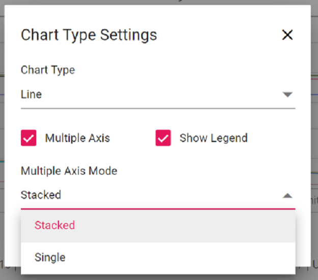
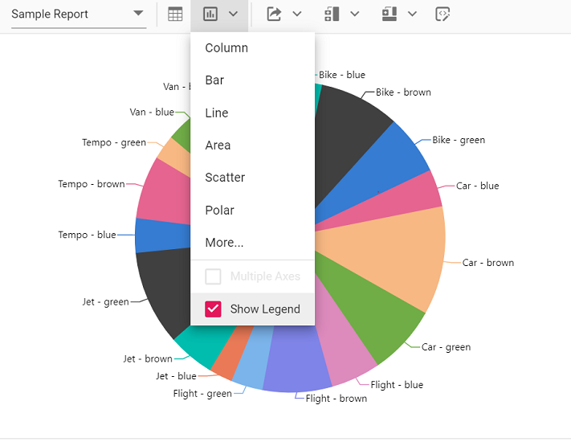
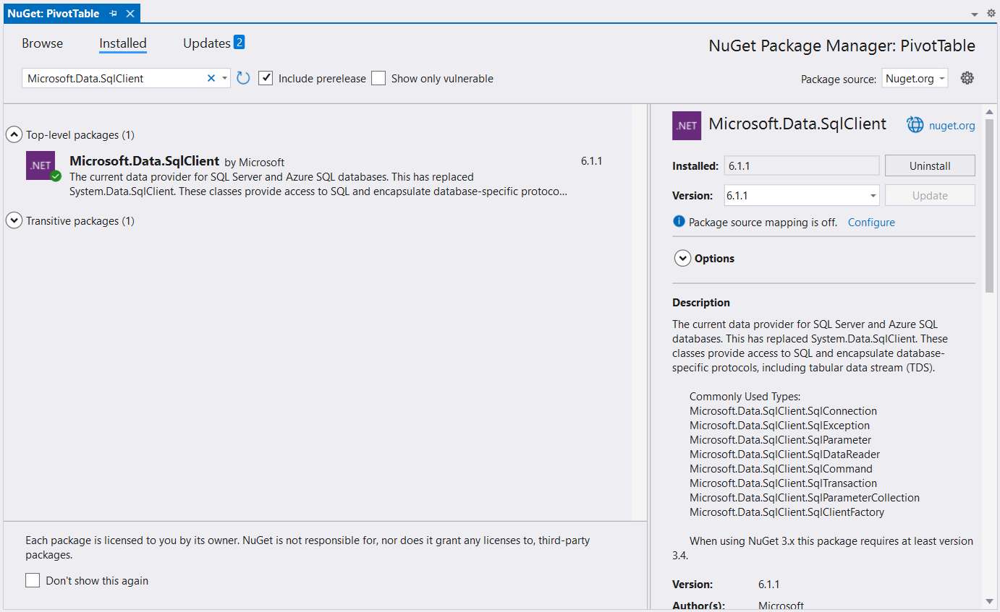
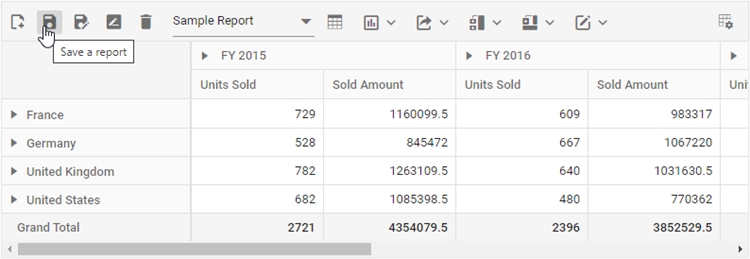
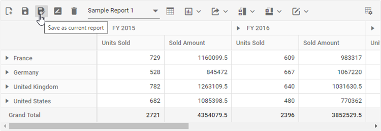
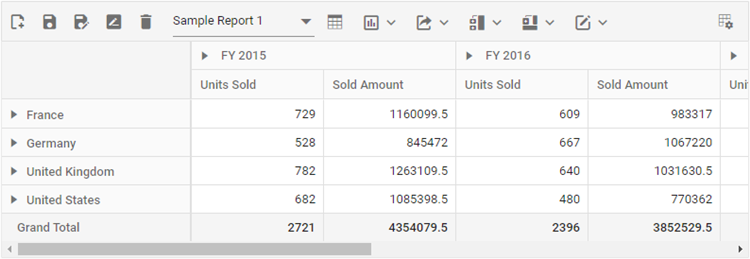
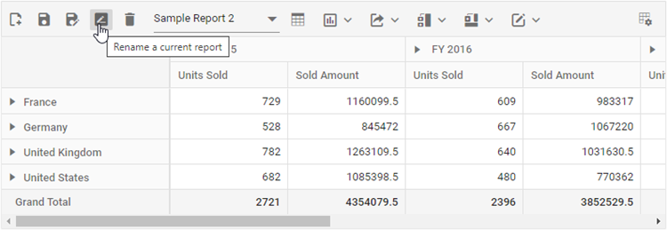
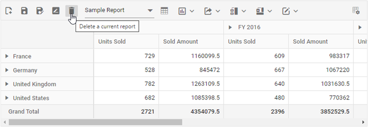
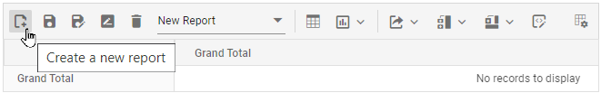

# Tool bar in React Pivotview component

A toolbar option has been provided to the pivot controls. It allows users access the frequently used features easily. Users also can save the state of the pivot table and load it back whenever required using this option. This option can be enabled by setting the `showToolbar` property to true. The [`toolbar`](https://ej2.syncfusion.com/react/documentation/api/pivotview/#toolbar) property accepts the collection of built-in toolbar options.

> To use the toolbar, inject the `Toolbar` module into the pivot table.

## Built-in toolbar options

Built-in toolbar options can be added by defining the [`toolbar`](https://ej2.syncfusion.com/react/documentation/api/pivotview/#toolbar) as a collection of built-in options.

The following table shows built-in toolbar options and its actions.

| Built-in Toolbar Options | Actions |
|------------------------|---------|
| New | Creates a new report |
| Save | Saves the current report |
| Save As | Save as current report |
| Rename | Renames the current report |
| Delete | Deletes the current report |
| Load | Loads any report from the report list |
| Grid | Shows pivot table |
| Chart | Shows a chart in any type from the built-in list and option to enable/disable multiple axes|
| Exporting | Exports the pivot table as PDF/Excel/CSV |
| Sub total | Shows or hides sub totals |
| Grand total | Shows or hides grand totals |
| Conditional Formatting | Shows the conditional formatting pop-up to apply formatting |
| Number Formatting | Shows the number formatting pop-up to apply number formatting |
| Fieldlist | Shows the fieldlist pop-up |
| MDX | Shows the MDX query that was run to retrieve data from the OLAP data source. **NOTE: This applies only to the OLAP data source.** |

> Report manipulation like save, load, rename, etc.., operations can be performed through events. In the following example, the localStorage (session storage) is used to manipulate the report operation.










 

## Show desired chart types in the dropdown menu

By default, all chart types are displayed in the dropdown menu included in the toolbar. However, based on the request for an application, we may need to show selective chart types on our own. This can be achieved using the [`chartTypes`](https://ej2.syncfusion.com/react/documentation/api/pivotview/#charttypes) property. To know more about supporting chart types, [`click here`](https://ej2.syncfusion.com/react/documentation/pivotview/pivot-chart/#chart-types).










 

## Switch the chart to multiple axes

In the chart, the user can switch from single axis to multiple axes with the help of the built-in checkbox available inside the chart type dropdown menu in the toolbar. For more information [`refer here`](https://ej2.syncfusion.com/react/documentation/pivotview/pivot-chart/#multiple-axis).




<!-- markdownlint-disable MD009 -->

There are two modes available in **Multiple Axis** option: `Stacked` and `Single`. The modes can be changed using “Multiple Axis Mode” drop-down list which appears while clicking the **More...** option.



## Show or hide legend

In the chart, legend can be shown or hidden dynamically with the help of the built-in option available in the chart type drop-down menu.
> By default, the legend is not be visible for the accumulation chart types like pie, doughnut, pyramid, and funnel. Users can enable or disable using the built-in checkbox option.



## Adding custom option to the toolbar

In addition to the existing built-in toolbar items, new toolbar item(s) may also be included. This can be achieved by using the [`toolbarRender`](https://ej2.syncfusion.com/react/documentation/api/pivotview/#toolbarrender) event. The action of the new toolbar item(s) can also be defined within this event. 

> The new toolbar item(s) can be added to the desired position in the toolbar using the `splice` option.










 

In the above topic, we have seen how to add an icon as one of the toolbar item in toolbar panel. In the next topic, we are going to see how to frame the entire toolbar panel and how to add a custom control in it.

### Toolbar Template

It allows to customize the toolbar panel by using template option. It allows any custom control to be used as one of the toolbar item inside the toolbar panel. It can be achieved by two ways,

Here, the entire toolbar panel can be framed in HTML elements that are appended at the top of the pivot table. The **id** of the HTML element needs to be set in the [`toolbarTemplate`](https://ej2.syncfusion.com/react/documentation/api/pivotview/#toolbartemplate) property in-order to map it to the pivot table.










 

Another option allows to frame a custom toolbar item using HTML elements and include in the toolbar panel at the desired position. The custom toolbar items can be declared as control **instance** or element **id** in the [`toolbar`](https://ej2.syncfusion.com/react/documentation/api/pivotview/#toolbar) property in pivot table. 










 

>Note: For both options, the actions for the toolbar template items can be defined in the event [`toolbarClick`](https://ej2.syncfusion.com/react/documentation/api/pivotview/#toolbarclick). Also, if the toolbar item is a custom control then its built-in events can also be accessed.

<!-- markdownlint-disable MD009 -->

## Save and load report as a JSON file

The current pivot report can be saved as a JSON file in the desired path and loaded back to the pivot table at any time. 










 

## Save and load reports to a SQL database

SQL Server is a relational database management system (RDBMS) that can be used to store and manage large amounts of data. In this topic, we will see how to save, save as, rename, load, delete, and add reports between a SQL Server database and a React Pivot Table at runtime.

### Create a Web API service to connect to a SQL Server database

**1.** Open Visual Studio and create an ASP.NET Core Web App project type, naming it **MyWebService**. To create an ASP.NET Core Web application, follow the document [link](https://learn.microsoft.com/en-us/visualstudio/get-started/csharp/tutorial-aspnet-core?view=vs-2022).


**2.** To connect a SQL Server database using the Microsoft SqlClient in our application, we need to install the [Microsoft.Data.SqlClient](https://www.nuget.org/packages/Microsoft.Data.SqlClient) NuGet package. To do so, open the NuGet package manager of the project solution, search for the package **Microsoft.Data.SqlClient** and install it.



**3.** Under the **Controllers** folder, create a Web API controller (aka, PivotController.cs) file that aids in data communication with the Pivot Table.

**4.** In the Web API Controller (aka, PivotController), the **OpenConnection** method is used to connect to the SQL database. The **GetDataTable** method then processes the specified SQL query string, retrieves data from the database, and converts it into a **DataTable** using **SqlCommand** and **SqlDataAdapter**. This **DataTable** can be used to retrieve saved reports and modify them further as shown in the code block below.

[PivotController.cs]

```csharp

using Microsoft.AspNetCore.Mvc;
using Microsoft.Data.SqlClient;
using System.Data;

namespace MyWebService.Controllers
{
    [ApiController]
    [Route("[controller]")]
    public class PivotController : ControllerBase
    {
        [HttpPost]
        [Route("Pivot/SaveReport")]
        public void SaveReport([FromBody] Dictionary<string, string> reportArgs)
        {
            SaveReportToDB(reportArgs["reportName"], reportArgs["report"]);
        }

        [HttpPost]
        [Route("Pivot/FetchReport")]
        public IActionResult FetchReport()
        {
            return Ok((FetchReportListFromDB()));
        }

        [HttpPost]
        [Route("Pivot/LoadReport")]
        public IActionResult LoadReport([FromBody] Dictionary<string, string> reportArgs)
        {
            return Ok((LoadReportFromDB(reportArgs["reportName"])));
        }

        [HttpPost]
        [Route("Pivot/RemoveReport")]
        public void RemoveReport([FromBody] Dictionary<string, string> reportArgs)
        {
            RemoveReportFromDB(reportArgs["reportName"]);
        }

        [HttpPost]
        [Route("Pivot/RenameReport")]
        public void RenameReport([FromBody] RenameReportDB reportArgs)
        {
            RenameReportInDB(reportArgs.ReportName, reportArgs.RenameReport, reportArgs.isReportExists);
        }

        public class RenameReportDB
        {
            public string ReportName { get; set; }
            public string RenameReport { get; set; }
            public bool isReportExists { get; set; }
        }

        private void SaveReportToDB(string reportName, string report)
        {
            SqlConnection sqlConn = OpenConnection();
            bool isDuplicate = true;
            SqlCommand cmd1 = null;
            foreach (DataRow row in GetDataTable(sqlConn).Rows)
            {
                if ((row["ReportName"] as string).Equals(reportName))
                {
                    isDuplicate = false;
                    cmd1 = new SqlCommand("update ReportTable set Report=@Report where ReportName like @ReportName", sqlConn);
                }
            }
            if (isDuplicate)
            {
                cmd1 = new SqlCommand("insert into ReportTable (ReportName,Report) Values(@ReportName,@Report)", sqlConn);
            }
            cmd1.Parameters.AddWithValue("@ReportName", reportName);
            cmd1.Parameters.AddWithValue("@Report", report.ToString());
            cmd1.ExecuteNonQuery();
            sqlConn.Close();
        }

        private string LoadReportFromDB(string reportName)
        {
            SqlConnection sqlConn = OpenConnection();
            string report = string.Empty;
            foreach (DataRow row in GetDataTable(sqlConn).Rows)
            {
                if ((row["ReportName"] as string).Equals(reportName))
                {
                    report = (string)row["Report"];
                    break;
                }
            }
            sqlConn.Close();
            return report;
        }

        private List<string> FetchReportListFromDB()
        {
            SqlConnection sqlConn = OpenConnection();
            List<string> reportNames = new List<string>();
            foreach (DataRow row in GetDataTable(sqlConn).Rows)
            {
                if (!string.IsNullOrEmpty(row["ReportName"] as string))
                {
                    reportNames.Add(row["ReportName"].ToString());
                }
            }
            sqlConn.Close();
            return reportNames;
        }

        private void RenameReportInDB(string reportName, string renameReport, bool isReportExists)
        {
            SqlConnection sqlConn = OpenConnection();
            SqlCommand cmd1 = null;
            if (isReportExists)
            {
                foreach (DataRow row in GetDataTable(sqlConn).Rows)
                {
                    if ((row["ReportName"] as string).Equals(reportName))
                    {
                        cmd1 = new SqlCommand("delete from ReportTable where ReportName like '%" + reportName + "%'", sqlConn);
                        break;
                    }
                }
                cmd1.ExecuteNonQuery();
            }
            foreach (DataRow row in GetDataTable(sqlConn).Rows)
            {
                if ((row["ReportName"] as string).Equals(reportName))
                {
                    cmd1 = new SqlCommand("update ReportTable set ReportName=@RenameReport where ReportName like '%" + reportName + "%'", sqlConn);
                    break;
                }
            }
            cmd1.Parameters.AddWithValue("@RenameReport", renameReport);
            cmd1.ExecuteNonQuery();
            sqlConn.Close();
        }

        private void RemoveReportFromDB(string reportName)
        {
            SqlConnection sqlConn = OpenConnection();
            SqlCommand cmd1 = null;
            foreach (DataRow row in GetDataTable(sqlConn).Rows)
            {
                if ((row["ReportName"] as string).Equals(reportName))
                {
                    cmd1 = new SqlCommand("delete from ReportTable where ReportName like '%" + reportName + "%'", sqlConn);
                    break;
                }
            }
            cmd1.ExecuteNonQuery();
            sqlConn.Close();
        }

        private SqlConnection OpenConnection()
        {
            // Replace with your own connection string.
            string connectionString = @"<Enter your valid connection string here>";
            SqlConnection sqlConn = new SqlConnection(connectionString);
            sqlConn.Open();
            return sqlConn;
        }

        private DataTable GetDataTable(SqlConnection sqlConn)
        {
            string xquery = "select * from ReportTable";
            SqlCommand cmd = new SqlCommand(xquery, sqlConn);
            SqlDataAdapter da = new SqlDataAdapter(cmd);
            DataTable dt = new DataTable();
            da.Fill(dt);
            return dt;
        }
    }
}

```

**5.** When you run the app, it will be hosted at `https://localhost:44313`. You can use the hosted URL to save and load reports in the SQL database from the Pivot Table.

Further, let us explore more on how to save, load, rename, delete, and add reports using the built-in toolbar options via Web API controller (aka, PivotController) one-by-one.

#### Saving a report

When you select the **"Save a report"** option from the toolbar, the [saveReport](#savereport) event is triggered. In this event, an AJAX request is made to the Web API controller's **SaveReport** method, passing the name of the current report and the current report, which you can use to check and save in the SQL database.

For example, the report shown in the following code snippet will be passed to the **SaveReport** method along with the report name **"Sample Report"** and saved in the SQL database.

[App.js]

```js

import React, { Component } from 'react';
import './index.css';
import './App.css';
import { PivotViewComponent, Inject, FieldList, CalculatedField, Toolbar, PDFExport, ExcelExport, ConditionalFormatting, NumberFormatting } from '@syncfusion/ej2-react-pivotview';

export default class App extends Component {
    static displayName = App.name;
    dataSourceSettings = {
        columns: [{ name: 'Year', caption: 'Production Year' }, { name: 'Quarter' }],
        dataSource: this.getPivotData(),
        expandAll: false,
        filters: [],
        formatSettings: [{ name: 'Amount', format: 'C0' }],
        rows: [{ name: 'Country' }, { name: 'Products' }],
        values: [{ name: 'Sold', caption: 'Units Sold' }, { name: 'Amount', caption: 'Sold Amount' }]
    };
    toolbarOptions = ['New', 'Save', 'SaveAs', 'Rename', 'Remove', 'Load',
        'Grid', 'Chart', 'Export', 'SubTotal', 'GrandTotal', 'Formatting', 'FieldList'];
    chartSettings = { title: 'Sales Analysis' };
    gridSettings = { columnWidth: 140 };
    displayOption = { view: 'Both' };
    saveReport(args) {
        var report = JSON.parse(args.report);
        report.dataSourceSettings.dataSource = [];
        fetch('https://localhost:44313/Pivot/SaveReport', {
            method: 'POST',
            headers: {
                'Accept': 'application/json',
                'Content-Type': 'application/json',
            },
            body: JSON.stringify({ reportName: args.reportName, report: JSON.stringify(report) })
        }).then(response => {
                this.fetchReport();
            });
    }
    render() {
        return (<PivotViewComponent id='PivotView' ref={(scope) => { this.pivotObj = scope; }} dataSourceSettings={this.dataSourceSettings} width={'100%'} height={'450'} showFieldList={true} gridSettings={this.gridSettings} allowExcelExport={true} allowNumberFormatting={true} allowConditionalFormatting={true} allowPdfExport={true} showToolbar={true} allowCalculatedField={true} displayOption={this.displayOption} toolbar={this.toolbarOptions} newReport={this.newReport.bind(this)} renameReport={this.renameReport.bind(this)} removeReport={this.removeReport.bind(this)} loadReport={this.loadReport.bind(this)} fetchReport={this.fetchReport.bind(this)} saveReport={this.saveReport.bind(this)} toolbarRender={this.beforeToolbarRender.bind(this)} chartSettings={this.chartSettings}>
                    <Inject services={[FieldList, CalculatedField, Toolbar, PDFExport, ExcelExport, ConditionalFormatting, NumberFormatting]} />
                </PivotViewComponent>);
    }
}

```

[PivotController.cs]

```csharp
namespace MyWebApp.Controllers
{
    [ApiController]
    [Route("[controller]")]
    public class PivotController : ControllerBase
    {
        [HttpPost]
        [Route("Pivot/SaveReport")]
        public void SaveReport([FromBody] Dictionary<string, string> reportArgs)
        {
            SaveReportToDB(reportArgs["reportName"], reportArgs["report"]);
        }

        private void SaveReportToDB(string reportName, string report)
        {
            SqlConnection sqlConn = OpenConnection();
            bool isDuplicate = true;
            SqlCommand cmd1 = null;
            foreach (DataRow row in GetDataTable(sqlConn).Rows)
            {
                if ((row["ReportName"] as string).Equals(reportName))
                {
                    isDuplicate = false;
                    cmd1 = new SqlCommand("update ReportTable set Report=@Report where ReportName like @ReportName", sqlConn);
                }
            }
            if (isDuplicate)
            {
                cmd1 = new SqlCommand("insert into ReportTable (ReportName,Report) Values(@ReportName,@Report)", sqlConn);
            }
            cmd1.Parameters.AddWithValue("@ReportName", reportName);
            cmd1.Parameters.AddWithValue("@Report", report.ToString());
            cmd1.ExecuteNonQuery();
            sqlConn.Close();
        }

        private SqlConnection OpenConnection()
        {
            // Replace with your own connection string.
            string connectionString = @"<Enter your valid connection string here>";
            SqlConnection sqlConn = new SqlConnection(connectionString);
            sqlConn.Open();
            return sqlConn;
        }

        private DataTable GetDataTable(SqlConnection sqlConn)
        {
            string xquery = "select * from ReportTable";
            SqlCommand cmd = new SqlCommand(xquery, sqlConn);
            SqlDataAdapter da = new SqlDataAdapter(cmd);
            DataTable dt = new DataTable();
            da.Fill(dt);
            return dt;
        }
    }
}

```



In the meantime, you can save a duplicate of the current report to the SQL Server database with a different name by selecting **"Save as current report"** from the toolbar. The [saveReport](#savereport) event will then be triggered with the new report name **"Sample Report 1"** and the current report. You can save them to the SQL Server database after passing them to the Web API service, as mentioned above.



#### Loading a report

When you select the dropdown menu item from the toolbar, the [loadReport](#loadreport) event is triggered. In this event, an AJAX request is made to the **LoadReport** method of the Web API controller, passing the name of the selected report. The method uses this information to search for the report in the SQL database, fetch it, and load it into the pivot table.

For example, if the report name **"Sample Report 1"** is selected from a dropdown menu and passed, the **LoadReport** method will use that name to search for the report in the SQL database, retrieve it, and then load it into the pivot table.

[App.js]

```js

import React, { Component } from 'react';
import './index.css';
import './App.css';
import { PivotViewComponent, Inject, FieldList, CalculatedField, Toolbar, PDFExport, ExcelExport, ConditionalFormatting, NumberFormatting } from '@syncfusion/ej2-react-pivotview';

export default class App extends Component {
    static displayName = App.name;
    dataSourceSettings = {
        columns: [{ name: 'Year', caption: 'Production Year' }, { name: 'Quarter' }],
        dataSource: this.getPivotData(),
        expandAll: false,
        filters: [],
        formatSettings: [{ name: 'Amount', format: 'C0' }],
        rows: [{ name: 'Country' }, { name: 'Products' }],
        values: [{ name: 'Sold', caption: 'Units Sold' }, { name: 'Amount', caption: 'Sold Amount' }]
    };
    toolbarOptions = ['New', 'Save', 'SaveAs', 'Rename', 'Remove', 'Load',
        'Grid', 'Chart', 'Export', 'SubTotal', 'GrandTotal', 'Formatting', 'FieldList'];
    chartSettings = { title: 'Sales Analysis' };
    gridSettings = { columnWidth: 140 };
    displayOption = { view: 'Both' };
    loadReport(args) {
        fetch('https://localhost:44313/Pivot/LoadReport', {
            method: 'POST',
            headers: {
                'Accept': 'application/json',
                'Content-Type': 'application/json',
            },
            body: JSON.stringify({ reportName: args.reportName })
        }).then(res => res.json())
            .then(response => {
                if (response) {
                    var report = JSON.parse(response);
                    report.dataSourceSettings.dataSource = this.pivotObj.dataSourceSettings.dataSource;
                    this.pivotObj.dataSourceSettings = report.dataSourceSettings;
                }
            });
    }
    render() {
        return (<PivotViewComponent id='PivotView' ref={(scope) => { this.pivotObj = scope; }} dataSourceSettings={this.dataSourceSettings} width={'100%'} height={'450'} showFieldList={true} gridSettings={this.gridSettings} allowExcelExport={true} allowNumberFormatting={true} allowConditionalFormatting={true} allowPdfExport={true} showToolbar={true} allowCalculatedField={true} displayOption={this.displayOption} toolbar={this.toolbarOptions} newReport={this.newReport.bind(this)} renameReport={this.renameReport.bind(this)} removeReport={this.removeReport.bind(this)} loadReport={this.loadReport.bind(this)} fetchReport={this.fetchReport.bind(this)} saveReport={this.saveReport.bind(this)} toolbarRender={this.beforeToolbarRender.bind(this)} chartSettings={this.chartSettings}>
                    <Inject services={[FieldList, CalculatedField, Toolbar, PDFExport, ExcelExport, ConditionalFormatting, NumberFormatting]} />
                </PivotViewComponent>);
    }
}

```

[PivotController.cs]

```csharp
using Microsoft.AspNetCore.Mvc;
using Microsoft.Data.SqlClient;
using System.Data;

namespace MyWebApp.Controllers
{
    [ApiController]
    [Route("[controller]")]
    public class PivotController : ControllerBase
    {
        [HttpPost]
        [Route("Pivot/LoadReport")]
        public IActionResult LoadReport([FromBody] Dictionary<string, string> reportArgs)
        {
            return Ok((LoadReportFromDB(reportArgs["reportName"])));
        }

        private string LoadReportFromDB(string reportName)
        {
            SqlConnection sqlConn = OpenConnection();
            string report = string.Empty;
            foreach (DataRow row in GetDataTable(sqlConn).Rows)
            {
                if ((row["ReportName"] as string).Equals(reportName))
                {
                    report = (string)row["Report"];
                    break;
                }
            }
            sqlConn.Close();
            return report;
        }

        private SqlConnection OpenConnection()
        {
            // Replace with your own connection string.
            string connectionString = @"<Enter your valid connection string here>";
            SqlConnection sqlConn = new SqlConnection(connectionString);
            sqlConn.Open();
            return sqlConn;
        }

        private DataTable GetDataTable(SqlConnection sqlConn)
        {
            string xquery = "select * from ReportTable";
            SqlCommand cmd = new SqlCommand(xquery, sqlConn);
            SqlDataAdapter da = new SqlDataAdapter(cmd);
            DataTable dt = new DataTable();
            da.Fill(dt);
            return dt;
        }
    }
}

```



#### Renaming a report

When you select the **"Rename a current report"** option from the toolbar, the [renameReport](#renamereport) event is triggered. In this event, an AJAX request is made to the **RenameReport** method of the Web API controller, passing the current and new report names, where you can use the current report name to identify the report and resave it with the new report name in the SQL database.

For example, if we rename the current report from **"Sample Report 1"** to **"Sample Report 2"**, both **"Sample Report 1"** and **"Sample Report 2"** will be passed to the **RenameReport** method, which will rename the current report with the new report name **"Sample Report 2"** in the SQL database.

[App.js]

```js

import React, { Component } from 'react';
import './index.css';
import './App.css';
import { PivotViewComponent, Inject, FieldList, CalculatedField, Toolbar, PDFExport, ExcelExport, ConditionalFormatting, NumberFormatting } from '@syncfusion/ej2-react-pivotview';

export default class App extends Component {
    static displayName = App.name;
    dataSourceSettings = {
        columns: [{ name: 'Year', caption: 'Production Year' }, { name: 'Quarter' }],
        dataSource: this.getPivotData(),
        expandAll: false,
        filters: [],
        formatSettings: [{ name: 'Amount', format: 'C0' }],
        rows: [{ name: 'Country' }, { name: 'Products' }],
        values: [{ name: 'Sold', caption: 'Units Sold' }, { name: 'Amount', caption: 'Sold Amount' }]
    };
    toolbarOptions = ['New', 'Save', 'SaveAs', 'Rename', 'Remove', 'Load',
        'Grid', 'Chart', 'Export', 'SubTotal', 'GrandTotal', 'Formatting', 'FieldList'];
    chartSettings = { title: 'Sales Analysis' };
    gridSettings = { columnWidth: 140 };
    displayOption = { view: 'Both' };
    renameReport(args) {
        fetch('https://localhost:44313/Pivot/RenameReport', {
            method: 'POST',
            headers: {
                'Accept': 'application/json',
                'Content-Type': 'application/json',
            },
            body: JSON.stringify({ reportName: args.reportName, renameReport: args.rename, isReportExists: args.isReportExists })
        }).then(response => {
                this.fetchReport();
            });
    }
    render() {
        return (<PivotViewComponent id='PivotView' ref={(scope) => { this.pivotObj = scope; }} dataSourceSettings={this.dataSourceSettings} width={'100%'} height={'450'} showFieldList={true} gridSettings={this.gridSettings} allowExcelExport={true} allowNumberFormatting={true} allowConditionalFormatting={true} allowPdfExport={true} showToolbar={true} allowCalculatedField={true} displayOption={this.displayOption} toolbar={this.toolbarOptions} newReport={this.newReport.bind(this)} renameReport={this.renameReport.bind(this)} removeReport={this.removeReport.bind(this)} loadReport={this.loadReport.bind(this)} fetchReport={this.fetchReport.bind(this)} saveReport={this.saveReport.bind(this)} toolbarRender={this.beforeToolbarRender.bind(this)} chartSettings={this.chartSettings}>
                    <Inject services={[FieldList, CalculatedField, Toolbar, PDFExport, ExcelExport, ConditionalFormatting, NumberFormatting]} />
                </PivotViewComponent>);
    }
}

```

[PivotController.cs]

```csharp
using Microsoft.AspNetCore.Mvc;
using Microsoft.Data.SqlClient;
using System.Data;

namespace MyWebApp.Controllers
{
    [ApiController]
    [Route("[controller]")]
    public class PivotController : ControllerBase
    {
        [HttpPost]
        [Route("Pivot/RenameReport")]
        public void RenameReport([FromBody] RenameReportDB reportArgs)
        {
            RenameReportInDB(reportArgs.ReportName, reportArgs.RenameReport, reportArgs.isReportExists);
        }

        public class RenameReportDB
        {
            public string ReportName { get; set; }
            public string RenameReport { get; set; }
            public bool isReportExists { get; set; }
        }

        private void RenameReportInDB(string reportName, string renameReport, bool isReportExists)
        {
            SqlConnection sqlConn = OpenConnection();
            SqlCommand cmd1 = null;
            if (isReportExists)
            {
                foreach (DataRow row in GetDataTable(sqlConn).Rows)
                {
                    if ((row["ReportName"] as string).Equals(reportName))
                    {
                        cmd1 = new SqlCommand("delete from ReportTable where ReportName like '%" + reportName + "%'", sqlConn);
                        break;
                    }
                }
                cmd1.ExecuteNonQuery();
            }
            foreach (DataRow row in GetDataTable(sqlConn).Rows)
            {
                if ((row["ReportName"] as string).Equals(reportName))
                {
                    cmd1 = new SqlCommand("update ReportTable set ReportName=@RenameReport where ReportName like '%" + reportName + "%'", sqlConn);
                    break;
                }
            }
            cmd1.Parameters.AddWithValue("@RenameReport", renameReport);
            cmd1.ExecuteNonQuery();
            sqlConn.Close();
        }

        private SqlConnection OpenConnection()
        {
            // Replace with your own connection string.
            string connectionString = @"<Enter your valid connection string here>";
            SqlConnection sqlConn = new SqlConnection(connectionString);
            sqlConn.Open();
            return sqlConn;
        }

        private DataTable GetDataTable(SqlConnection sqlConn)
        {
            string xquery = "select * from ReportTable";
            SqlCommand cmd = new SqlCommand(xquery, sqlConn);
            SqlDataAdapter da = new SqlDataAdapter(cmd);
            DataTable dt = new DataTable();
            da.Fill(dt);
            return dt;
        }
    }
}

```



#### Deleting a report

When you select the **"Delete a current report"** option from the toolbar, the [removeReport](#removereport) event is triggered. In this event, an AJAX request is made to the **RemoveReport** method of the Web API controller, passing the current report name to identify and delete the appropriate report from the SQL database.

N> * If the current report **n** from the pivot table is deleted, the pivot table will automatically load the last report from the report list.
N> * When a report is removed from a pivot table with only one report, the SQL database refreshes; however, the pivot table will continue to show the removed report until a new report is added to the pivot table.

For example, if we delete the current report **"Sample Report 2"** from the pivot table, the current report name **"Sample Report 2"** is passed to the **RemoveReport** method, which allows you to identify and delete the report from the SQL database.

[App.js]

```js

import React, { Component } from 'react';
import './index.css';
import './App.css';
import { PivotViewComponent, Inject, FieldList, CalculatedField, Toolbar, PDFExport, ExcelExport, ConditionalFormatting, NumberFormatting } from '@syncfusion/ej2-react-pivotview';

export default class App extends Component {
    static displayName = App.name;
    dataSourceSettings = {
        columns: [{ name: 'Year', caption: 'Production Year' }, { name: 'Quarter' }],
        dataSource: this.getPivotData(),
        expandAll: false,
        filters: [],
        formatSettings: [{ name: 'Amount', format: 'C0' }],
        rows: [{ name: 'Country' }, { name: 'Products' }],
        values: [{ name: 'Sold', caption: 'Units Sold' }, { name: 'Amount', caption: 'Sold Amount' }]
    };
    toolbarOptions = ['New', 'Save', 'SaveAs', 'Rename', 'Remove', 'Load',
        'Grid', 'Chart', 'Export', 'SubTotal', 'GrandTotal', 'Formatting', 'FieldList'];
    chartSettings = { title: 'Sales Analysis' };
    gridSettings = { columnWidth: 140 };
    displayOption = { view: 'Both' };
    removeReport(args) {
        fetch('https://localhost:44313/Pivot/RemoveReport', {
            method: 'POST',
            headers: {
                'Accept': 'application/json',
                'Content-Type': 'application/json',
            },
            body: JSON.stringify({ reportName: args.reportName })
        }).then(response => {
                this.fetchReport();
            });
    }
    render() {
        return (<PivotViewComponent id='PivotView' ref={(scope) => { this.pivotObj = scope; }} dataSourceSettings={this.dataSourceSettings} width={'100%'} height={'450'} showFieldList={true} gridSettings={this.gridSettings} allowExcelExport={true} allowNumberFormatting={true} allowConditionalFormatting={true} allowPdfExport={true} showToolbar={true} allowCalculatedField={true} displayOption={this.displayOption} toolbar={this.toolbarOptions} newReport={this.newReport.bind(this)} renameReport={this.renameReport.bind(this)} removeReport={this.removeReport.bind(this)} loadReport={this.loadReport.bind(this)} fetchReport={this.fetchReport.bind(this)} saveReport={this.saveReport.bind(this)} toolbarRender={this.beforeToolbarRender.bind(this)} chartSettings={this.chartSettings}>
                    <Inject services={[FieldList, CalculatedField, Toolbar, PDFExport, ExcelExport, ConditionalFormatting, NumberFormatting]} />
                </PivotViewComponent>);
    }
}

```

[PivotController.cs]

```csharp
using Microsoft.AspNetCore.Mvc;
using Microsoft.Data.SqlClient;
using System.Data;

namespace MyWebApp.Controllers
{
    [ApiController]
    [Route("[controller]")]
    public class PivotController : ControllerBase
    {
        [HttpPost]
        [Route("Pivot/RemoveReport")]
        public void RemoveReport([FromBody] Dictionary<string, string> reportArgs)
        {
            RemoveReportFromDB(reportArgs["reportName"]);
        }

        private void RemoveReportFromDB(string reportName)
        {
            SqlConnection sqlConn = OpenConnection();
            SqlCommand cmd1 = null;
            foreach (DataRow row in GetDataTable(sqlConn).Rows)
            {
                if ((row["ReportName"] as string).Equals(reportName))
                {
                    cmd1 = new SqlCommand("delete from ReportTable where ReportName like '%" + reportName + "%'", sqlConn);
                    break;
                }
            }
            cmd1.ExecuteNonQuery();
            sqlConn.Close();
        }
        
        private SqlConnection OpenConnection()
        {
            // Replace with your own connection string.
            string connectionString = @"<Enter your valid connection string here>";
            SqlConnection sqlConn = new SqlConnection(connectionString);
            sqlConn.Open();
            return sqlConn;
        }

        private DataTable GetDataTable(SqlConnection sqlConn)
        {
            string xquery = "select * from ReportTable";
            SqlCommand cmd = new SqlCommand(xquery, sqlConn);
            SqlDataAdapter da = new SqlDataAdapter(cmd);
            DataTable dt = new DataTable();
            da.Fill(dt);
            return dt;
        }
    }
}

```



#### Adding a report

When you select the **"Create a new report"** option from the toolbar, the [newReport](#newreport) event is triggered, followed by the [saveReport](#savereport) event. To save this new report to the SQL database, use the [saveReport](#savereport) event triggered later, and then follow the save report briefing in the preceding [topic](#saving-a-report).



### Limitations with respect to report manipulation

Below points need to be considered when saving the report to SQL Server database.

* **Data source**: Both raw data and aggregated data won't be saved and loaded from the database.
* **Hyperlinks**: Option to link external facts via pivot table cells won't be saved and loaded from the database.
* The pivot table should always load reports from the SQL database based on the data source that is currently bound to it.

> In [this](https://github.com/SyncfusionExamples/Save-and-load-report-from-SQL-database-to-pivot-table) GitHub repository, you can find our React Pivot Table sample and ASP.NET Core Web Application to save and load reports from SQL Server database.

## Events

### FetchReport

The event [`fetchReport`](https://ej2.syncfusion.com/react/documentation/api/pivotview/#fetchreport) is triggered when dropdown list is clicked in the toolbar in-order to retrieve and populate saved reports. It has following parameter - `reportName`. This event allows user to fetch the report names from local storage and populate the dropdown list.

### LoadReport

The event [`loadReport`](https://ej2.syncfusion.com/react/documentation/api/pivotview/#loadreport) is triggered when a report is selected from the dropdown list in the toolbar. It has following parameters - `report` and `reportName`. This event allows user to load the selected report to the pivot table.

### NewReport

The event [`newReport`](https://ej2.syncfusion.com/react/documentation/api/pivotview/#newreport) is triggered when the new report icon is clicked in the toolbar. It has following parameter - `report`. This event allows user to create new report and add to the report list.

### RenameReport

The event [`renameReport`](https://ej2.syncfusion.com/react/documentation/api/pivotview/#renamereport) is triggered when rename report icon is clicked in the toolbar. It has following parameters  - `rename`, `report` and `reportName`. This event allows user to rename the selected report from the report list.

### RemoveReport

The event [`removeReport`](https://ej2.syncfusion.com/react/documentation/api/pivotview/#removereport) is triggered when remove report icon is clicked in the toolbar. It has following parameters  - `report` and `reportName`. This event allows user to remove the selected report from the report list.

### SaveReport

The event [`saveReport`](https://ej2.syncfusion.com/react/documentation/api/pivotview/#savereport) is triggered when save report icon is clicked in the toolbar. It has following parameters  - `report` and `reportName`. This event allows user to save the altered report to the report list.

### ToolbarRender

The [`toolbarRender`](https://ej2.syncfusion.com/react/documentation/api/pivotview/#toolbarrender) event is triggered when the toolbar is rendered. It has the `customToolbar` parameter. This event helps to customize the built-in toolbar items and to [`include new toolbar item(s)`](https://ej2.syncfusion.com/react/documentation/pivotview/tool-bar/#adding-custom-option-to-the-toolbar).










 

### BeforeExport

The pivot table (or) pivot chart can be exported as a pdf, excel, csv etc.,  document using the toolbar options. And, you can customize the export settings for exporting document by using the [`beforeExport`](https://ej2.syncfusion.com/react/documentation/api/pivotview/#beforeexport) event in the toolbar.

For example, you can add the header and footer for the pdf document by setting the `header` and `footer` properties for the `pdfExportProperties` in the [`beforeExport`](https://ej2.syncfusion.com/react/documentation/api/pivotview/#beforeexport) event.










 

### ActionBegin

The event [`actionBegin`](https://ej2.syncfusion.com/react/documentation/api/pivotview/#actionbegin) triggers when the UI actions such as switching between pivot table and pivot chart, changing chart types, conditional formatting, exporting, etc. that are present in toolbar UI begin. This allows user to identify the current action being performed at runtime. It has the following parameters:

* `dataSourceSettings`: It holds the current data source settings such as input data source, rows, columns, values, filters, format settings and so on.

* `actionName`: It holds the name of the current action began. The following are the UI actions and their names:

    | Action | Action Name | 
    |------|-------------|
    | New report | Add new report |
    | Save report | Save current report |
    | Save as report | Save as current report |
    | Rename report | Rename current report |
    | Remove report | Remove current report |
    | Report change | Report change |
    | Conditional Formatting | Open conditional formatting dialog |
    | Number Formatting | Open number formatting dialog |
    | Export menu | PDF export, Excel export, CSV export |
    | Show Fieldlist | Open field list |
    | Show Table | Show table view |
    | Chart menu | Show chart view |
    | Sub-totals menu | Hide sub-totals, Show row sub-totals, Show column sub-totals, Show sub-totals |
    | Grand totals menu | Hide grand totals, Show row grand totals, Show column grand totals, Show grand totals |

* `cancel`: It allows user to restrict the current action.

    In the below sample, toolbar UI actions such as add new report and save current report can be restricted by setting the **args.cancel** option to **true** in the `actionBegin` event.

    
    
    
    
    
    
    
    

    

### ActionComplete

The event [`actionComplete`](https://ej2.syncfusion.com/react/documentation/api/pivotview/#actioncomplete) triggers when the UI actions such as as switching between pivot table and pivot chart, changing chart types, conditional formatting, exporting, etc. that are present in toolbar UI, is completed. This allows user to identify the current UI actions being completed at runtime. It has the following parameters:

* `dataSourceSettings`: It holds the current data source settings such as input data source, rows, columns, values, filters, format settings and so on.

* `actionName`: It holds the name of the current action completed. The following are the UI actions and their names:

    | Action | Action Name | 
    |------|-------------|
    | New report | New report added |
    | Save report | Report saved |
    | Save as report | Report re-saved |
    | Rename report | Report renamed |
    | Remove report | Report removed |
    | Report change | Report changed |
    | Conditional Formatting | Conditionally formatted |
    | Number Formatting | Number formatted |
    | Export menu | PDF exported, Excel exported, CSV exported  |
    | Show Fieldlist | Field list closed |
    | Show Table | Table view shown |
    | Sub-totals menu | Sub-totals hidden, Row sub-totals shown, Column sub-totals shown, Sub-totals shown |
    | Grand totals menu | Grant totals hidden, Row grand totals shown, Column grand totals shown, Grand totals shown |

* `actionInfo`: It holds the unique information about the current UI action. For example, while adding new report, the event argument contains information such as report name and the action name.

    
    
    
    
    
    
    
    

    

### ActionFailure

The event [`actionFailure`](https://ej2.syncfusion.com/react/documentation/api/pivotview/#actionfailure) triggers when the current UI action fails to achieve the desired result. It has the following parameters:

* `actionName`: It holds the name of the current action failed. The following are the UI actions and their names:

    | Action | Action Name | 
    |------|-------------|
    | New report | Add new report |
    | Save report | Save current report |
    | Save as report | Save as current report |
    | Rename report | Rename current report |
    | Remove report | Remove current report |
    | Report change | Report change |
    | Conditional Formatting | Open conditional formatting dialog |
    | Number Formatting | Open number formatting dialog |
    | Export menu | PDF export, Excel export, CSV export |
    | Show Fieldlist | Open field list |
    | Show Table | Show table view |
    | Chart menu | Show chart view |
    | Sub-totals menu | Hide sub-totals, Show row sub-totals, Show column sub-totals, Show sub-totals |
    | Grand totals menu | Hide grand totals, Show row grand totals, Show column grand totals, Show grand totals |

* `errorInfo`: It holds the error information of the current UI action.

    
    
    
    
    
    
    
    

    

## See Also

* [Toolbar Component](https://ej2.syncfusion.com/react/documentation/toolbar/getting-started)