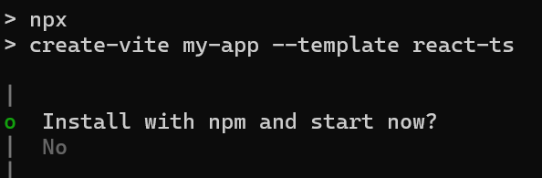

# Getting Started with React Rich Text Editor

The [React Rich Text Editor](https://www.syncfusion.com/react-components/react-rich-text-editor) is a WYSIWYG (What You See Is What You Get) editor that enables users to create, edit, and format rich text content with features like multimedia insertion, lists, and links. This section explains the steps to create a simple React Rich Text Editor and demonstrates the basic usage of the Rich Text Editor control using a Vite-based React project scaffolded with latest vite version.

> **Ready to streamline your Syncfusion<sup style="font-size:70%">&reg;</sup> React development?** Discover the full potential of Syncfusion<sup style="font-size:70%">&reg;</sup> React components with Syncfusion<sup style="font-size:70%">&reg;</sup> AI Coding Assistant. Effortlessly integrate, configure, and enhance your projects with intelligent, context-aware code suggestions, streamlined setups, and real-time insights—all seamlessly integrated into your preferred AI-powered IDEs like VS Code, Cursor, Syncfusion<sup style="font-size:70%">&reg;</sup> CodeStudio and more. [Explore Syncfusion<sup style="font-size:70%">&reg;</sup> AI Coding Assistant](https://ej2.syncfusion.com/react/documentation/ai-coding-assistant/overview)

To get started quickly with the React Rich Text Editor, refer to this video tutorial:



## Prerequisites

This guide uses Vite as the bundler and development environment. Install Node.js 24.13.0 or higher before proceeding. For detailed information about Vite’s capabilities and configuration options, refer to the [Vite documentation](https://vitejs.dev/).

## Create a React Application

Run the following commands to set up a React application:

```bash
npm create vite@latest my-app -- --template react-ts
```

This command will prompt you to install the required packages and start the application. Select the options as shown below.



As Syncfusion packages are not installed yet, currently, the `No` option will be selected. Then, navigate to the project directory and install the dependencies using the following commands:

```
cd my-app
npm install
```

> **Note:** To set up a React application with Nextjs or Remix, refer to this [documentation](https://ej2.syncfusion.com/react/documentation/getting-started/quick-start) for more details.

## Adding Syncfusion<sup style="font-size:70%">&reg;</sup> Rich Text Editor packages

All the available Essential<sup style="font-size:70%">&reg;</sup> JS 2 packages are published in [`npmjs.com`](https://www.npmjs.com/~syncfusionorg) public registry.
To install Rich Text Editor component, use the following command

```
npm install @syncfusion/ej2-react-richtexteditor
```

## Adding CSS reference

Syncfusion provides multiple themes for the Rich Text Editor component. For a complete list of available themes, refer to the [themes packages](https://ej2.syncfusion.com/react/documentation/appearance/theme#theme-packages). 

To apply the [Tailwind 3](https://www.npmjs.com/package/@syncfusion/ej2-tailwind3-theme) theme, install the corresponding theme package by using the following command:

```bash
npm install @syncfusion/ej2-tailwind3-theme
```

The installed theme package includes an `index.css` file that automatically imports all the required dependency styles. Import the following stylesheet into **src/App.css**:


```css
@import '../node_modules/@syncfusion/ej2-tailwind3-theme/styles/rich-text-editor/index.css';
```

I> To apply the application-specific styles correctly, import **App.css** into **src/App.tsx** and remove all the default styles from **src/index.css**.

## Module injection

The following modules provide the basic features of the Rich Text Editor.

* **HtmlEditor** - Inject this module to use Rich Text Editor as html editor.
* **Image** - Inject this module to use image feature in Rich Text Editor.
* **Link** - Inject this module to use link feature in Rich Text Editor.
* **QuickToolbar** - Inject this module to use quick toolbar feature for the target element.
* **Toolbar** - Inject this module to use Toolbar feature.

These modules should be injected into the `services` section of the component.

> Additional feature modules are available [here](https://ej2.syncfusion.com/react/documentation/rich-text-editor/module).

## Adding Rich Text Editor component

Now, you can start adding React Rich Text Editor component in the application. For getting started, add the Rich Text Editor component in **src/App.tsx** file using following sample.










@import '../node_modules/@syncfusion/ej2-tailwind3-theme/styles/rich-text-editor/index.css';




## Run the application

Now run the `npm run dev` command in the console to start the development server. This command compiles your code and serves the application locally, opening it in the browser.

```bash
npm run dev
```

## See also

* [Accessibility in Rich text editor](https://ej2.syncfusion.com/react/documentation/rich-text-editor/accessibility)
* [Keyboard support in Rich text editor](https://ej2.syncfusion.com/react/documentation/rich-text-editor/keyboard-support)
* [Globalization in Rich text editor](https://ej2.syncfusion.com/react/documentation/rich-text-editor/globalization)

N> Looking for the full React Rich Text Editor component overview, features, pricing, and documentation? Visit the [React Rich Text Editor](https://www.syncfusion.com/react-components/react-rich-text-editor) page.