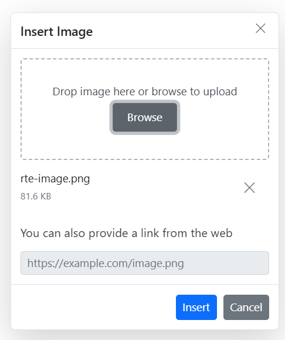
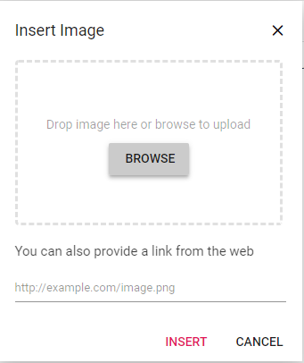

# Image in React Rich text editor component

Rich Text Editor allows to insert images from online sources as well as local computer where you want to insert the image in your content. For inserting the image to the Rich Text Editor, the following list of options have been provided in the [insertImageSettings](/rich-text-editor/api-imageSettingsModel.html).

| **Options** | **Description** |
| --- | --- |
| allowedTypes | Specifies the extensions of the image types allowed to insert on bowering and passing the extensions with comma separators. <br /> <br /> For example, pass allowedTypes as .jpg and .png. |
| display | Sets the default display for an image when it is inserted into the Rich Text Editor. <br /><br /> Possible options are: 'inline' and 'block'. |
| width | Sets the default width of the image when it is inserted in the Rich Text Editor. |
| height | Sets the default height of the image when it is inserted in the Rich Text Editor. |
| saveUrl | Provides URL to map the action result method to save the image. |
| path | Specifies the location to store the image. |

> Rich Text Editor features are segregated into individual feature-wise modules. To use image and link tool, inject image module using the `RichTextEditor.Inject(image)`.

## Upload options

Through the ‘browse’ option, select the image from the local machine and insert into the Rich Text Editor content.

If the path field is not specified in the [insertImageSettings](/rich-text-editor/api-imageSettingsModel.html), the image will be transferred into base 64 and blob url for the image will be created and the generated url will be set to the src property of img tag.

```javascript
    
```

> If you want to insert a lot of tiny images in the editor and don't want a specific physical location for saving images, you can opt to save format as Base64.

In the following sample, the image has been loaded from the local machine and it will be saved in the given location.

`[Class-component]`










 

`[Functional-component]`










 

## Image delete

To remove an image from the Rich Text Editor content, select the image and click **Remove** tool from the quick toolbar. It will delete the image from the RTE content as well as from the service location if the saveUrl is given.

Once you select the image from the local machine, the URL for the image will be generate. From there, you can remove the image from the service location by clicking the cross icon.



The following sample explains, how to configure `removeUrl` to remove a saved image from the remote service location, when the following image remove actions are performed:

* `delete` key action.
* `backspace` key action.
* Removing uploaded image file from the insert image dialog.
* Deleting image using the quick toolbar `remove` option.

`[Class-component]`










 

`[Functional-component]`










 

## Insert from web

To insert an image from the online source like Google, Ping, etc., you should enable the image tool on the editor’s toolbar. By default, the image tool opens a simple dialog which allows you to insert an image from online source.



## Dimension

Sets the default width and height of the image when it is inserted in the Rich Text Editor using [width](/rich-text-editor/api-imageSettingsModel.html#width) and [height](/rich-text-editor/api-imageSettingsModel.html#height)  of the insertImageSettings.
Through the quick toolbar, change the width and height using `Change Size` option. Once you click, the Image Size dialog box will open as follows. In that, you can specify the width and height of the image in pixel.


## Caption and Alt Text

Image caption and alternative text can be specified for the inserted image in the Rich Text Editor through the quick toolbar options such as, Image Caption and Alternative Text.

Through the Alternative Text option, set the alternative text for the image, when the image is not upload successfully into the Rich Text Editor.

By clicking the Image Caption, the image will get wrapped in an image element with a caption. Then, you can type caption content inside the Rich Text Editor.

## Display position

Sets the default display for an image when it is inserted in the Rich Text Editor using [display](/rich-text-editor/api-imageSettingsModel.html#display) field in [insertImageSettings](/rich-text-editor/api-imageSettingsModel.html). It has two possible options: 'inline' and 'block'.

```ts
let defaultRTE: RichTextEditor = new RichTextEditor({
    insertImageSettings: {
      display: 'inline'
    }
});
defaultRTE.appendTo('#defaultRTE');
```

## Image with link

The hyperlink itself can be an image in Rich Text Editor. If the image given as hyperlink, the remove, edit, and open link will be added to the quick toolbar of image. For further details about link, see the [link](/rich-text-editor/link.html) documentation.


## Resize

Rich Text Editor has a built-in image inserting support.  The resize points will be appearing on each corner of image when focus. So, users can resize the image using mouse points or thumb through the resize points easily. Also, the resize calculation will be done based on aspect ratio.


## Drag and Drop

By default, the Rich Text Editor allows you to insert images by drag-and-drop from the local file system such as Windows Explorer into the content editor area. And, you can upload the images to the server before inserting into the editor by configuring the saveUrl property. The images can be repositioned anywhere within the editor area by dragging and dropping the image.

In the following sample, you can see feature demo.

`[Class-component]`










 

`[Functional-component]`










 

### Drag and drop with specific extension images

You can allow the specific images alone to be uploaded using the the allowedTypes property. By default, the Rich Text Editor allows the JPG, JPEG, and PNG formats. You can configure this formats as follows.

``` typescript
    insertImageSettings: {
      allowedTypes: ['.jpg']
    }

```

### Prevent drag and drop action

You can prevent drag-and-drop action by setting the actionBegin argument cancel value to true. The following code shows how to prevent the drag-and-drop.

``` typescript
    actionBegin: function (args: any): void {
        if(args.type === 'drop' || args.type === 'dragstart') {
            args.cancel =true;
        }
    }

```