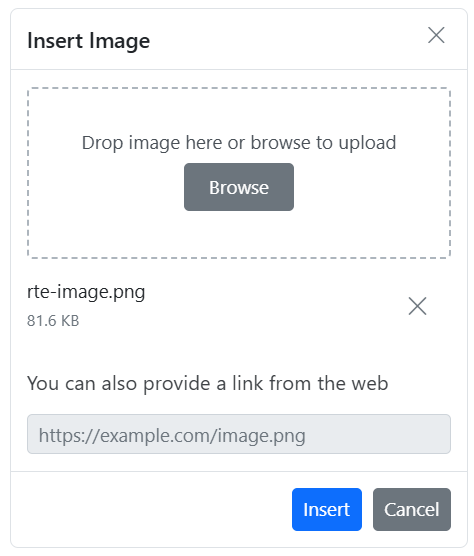
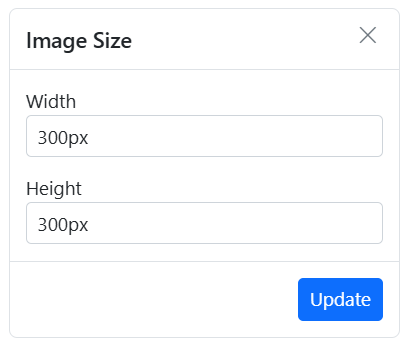

#  Insert Images in the React Rich Text Editor Component

The Rich Text Editor allows to insert images in your content from online sources as well as local computer. For inserting an image to the Rich Text Editor, the following list of options have been provided in the [insertImageSettings](https://ej2.syncfusion.com/react/documentation/api/rich-text-editor/imageSettingsModel/)

## Configuring the image toolbar item

The image feature is enabled by adding the `Image` item to the toolbar using the [toolbarSettings.items](https://ej2.syncfusion.com/react/documentation/api/rich-text-editor/toolbarSettings/#items) property.

> To use Image feature, inject image module using the `<Inject services={[Image]} />`.

The following example demonstrates configuring the `Image` toolbar item:

`[Class-component]`










 

`[Functional-component]`










 

## Supported image save formats

The images can be saved as `Blob` or `Base64` URL by using the [insertImageSettings.saveFormat](https://ej2.syncfusion.com/react/documentation/api/rich-text-editor/imageSettingsModel/#saveformat) property, which is of enum type, and the generated URL will be set to the `src` attribute of the `<source>` tag.

```html
    

    
```

The code snippet below illustrates the configuration of the [insertImageSettings.saveFormat](https://ej2.syncfusion.com/react/documentation/api/rich-text-editor/imageSettingsModel/#saveformat) property in the Rich Text Editor.

`[Class-component]`










 

`[Functional-component]`










 


> The default `saveFormat` property is set to `Blob` format.

## Inserting images from web URLs

The `Image` toolbar item opens a dialog with an input field for inserting images from a web URL. The provided URL is set as the `src` attribute of the `` tag.

## Uploading images from local machine

The image dialog includes a `browse` option to select images from a local machine, which are then inserted into the editor's content.

## File manager integration for image insertion

To insert images from a file manager, enable the `FileManager` tool on the editor's toolbar. This tool initiates a dialog where you can upload new images and choose from existing ones, facilitating smooth image insertion into your content.

To integrate the file manager into the Rich Text Editor, follow these steps:

* Configure the `FileManager` toolbar item in the `toolbarSettings` API `items` property.
* Set the [enable](https://ej2.syncfusion.com/react/documentation/api/rich-text-editor/fileManagerSettings/#enable) property to `true` in the [fileManagerSettings](https://ej2.syncfusion.com/react/documentation/api/rich-text-editor/#fileManagerSettings) property to ensure the file browser appears upon clicking the `FileManager` toolbar item.

> To use File Manager feature, inject file manager module using the `<Inject services={[FileManager]} />`.

## Maximum file size restriction

You can restrict the image uploaded from the local machine when the uploaded image file size is greater than the allowed size by using the [maxFileSize](https://helpej2.syncfusion.com/documentation/api/rich-text-editor/imageSettingsModel/#maxfilesize) property. By default, the maximum file size is 30000000 bytes.

In the following example, the image size has been validated before uploading and determined whether the image has been uploaded or not.

`[Class-component]`

```ts

import {HtmlEditor, Image, Inject, Link, QuickToolbar, RichTextEditorComponent, Toolbar, Table, PasteCleanup } from '@syncfusion/ej2-react-richtexteditor';
import * as React from 'react';

class App extends React.Component<{},{}> {
  private toolbarSettings: object = {
    items: ['Image', 'Bold', 'Italic', 'Underline', '|', 'Formats', 'Alignments', 'Blockquote', 'OrderedList', 'UnorderedList', '|', 'CreateLink', 'CreateTable', '|', 'SourceCode', '|', 'Undo', 'Redo']
  }
  private insertImageSettings: object = {
    maxFileSize: 30000000
  }
  public render() {
    return (
      <RichTextEditorComponent height={450} toolbarSettings={this.toolbarSettings} insertImageSettings={
        this.insertImageSettings}>

        <Inject services={[HtmlEditor, Toolbar, Image, Link, QuickToolbar, Table, PasteCleanup]} />
      </RichTextEditorComponent>
    );
  }
}

export default App;

```

`[Functional-component]`

```ts

import { HtmlEditor, Image, Inject, Link, QuickToolbar, RichTextEditorComponent, Toolbar, Table, PasteCleanup } from '@syncfusion/ej2-react-richtexteditor';
import * as React from 'react';

function App() {
    let toolbarSettings: object = {
      items: ['Image', 'Bold', 'Italic', 'Underline', '|', 'Formats', 'Alignments', 'Blockquote', 'OrderedList', 'UnorderedList', '|', 'CreateLink', 'CreateTable', '|', 'SourceCode', '|', 'Undo', 'Redo']
    }
    let insertImageSettings: object = {
      maxFileSize: 30000000
    }

    return (
      <RichTextEditorComponent height={450} toolbarSettings={toolbarSettings} insertImageSettings={insertImageSettings}>

        <Inject services={[HtmlEditor, Toolbar, Image, Link, QuickToolbar, Table, Video, PasteCleanups]} />
      </RichTextEditorComponent>
    );

}

export default App;

```

## Saving images to the server

Upload the selected image to a specified destination using the controller action specified in [insertImageSettings.saveUrl](https://ej2.syncfusion.com/react/documentation/api/rich-text-editor/imageSettingsModel/#saveurl). Ensure to map this method name appropriately and provide the required destination path through the [insertImageSettings.path](https://ej2.syncfusion.com/react/documentation/api/rich-text-editor/imageSettingsModel/#path) properties.

Configure [insertImageSettings.removeUrl](https://ej2.syncfusion.com/react/documentation/api/rich-text-editor/imageSettingsModel/#removeurl) to point to the endpoint responsible for deleting image files.

Set the [insertImageSettings.saveFormat](https://ej2.syncfusion.com/react/documentation/api/rich-text-editor/imageSettingsModel/#saveformat) property to determine whether the image should be saved as Blob or Base64, aligning with your application's requirements.

`[Class-component]`










`[Functional-component]`










```csharp

public class HomeController : Controller
    {
        private IHostingEnvironment hostingEnv;

        public HomeController(IHostingEnvironment env)
        {
            hostingEnv = env;
        }

        public IActionResult Index()
        {
            return View();
        }

        [AcceptVerbs("Post")]
        public void SaveImage(IList<IFormFile> UploadFiles)
        {
            try
            {
                foreach (IFormFile file in UploadFiles)
                {
                    if (UploadFiles != null)
                    {
                        string filename = ContentDispositionHeaderValue.Parse(file.ContentDisposition).FileName.Trim('"');
                        filename = hostingEnv.WebRootPath + "\\Uploads" + $@"\{filename}";

                        // Create a new directory, if it does not exists
                        if (!Directory.Exists(hostingEnv.WebRootPath + "\\Uploads"))
                        {
                            Directory.CreateDirectory(hostingEnv.WebRootPath + "\\Uploads");
                        }

                        if (!System.IO.File.Exists(filename))
                        {
                            using (FileStream fs = System.IO.File.Create(filename))
                            {
                                file.CopyTo(fs);
                                fs.Flush();
                            }
                            Response.StatusCode = 200;
                        }
                    }
                }
            }
            catch (Exception)
            {
                Response.StatusCode = 204;
            }
        }

        [ResponseCache(Duration = 0, Location = ResponseCacheLocation.None, NoStore = true)]
        public IActionResult Error()
        {
            return View(new ErrorViewModel { RequestId = Activity.Current?.Id ?? HttpContext.TraceIdentifier });
        }
    }

```

### Rename images before inserting

You can use the [insertImageSettings](https://ej2.syncfusion.com/react/documentation/api/rich-text-editor/#insertimagesettings) property, to specify the server handler to upload the selected image. Then by binding the [imageUploadSuccess](https://ej2.syncfusion.com/react/documentation/api/rich-text-editor/#imageuploadsuccessss) event, you can receive the modified file name from the server and update it in the Rich Text Editor's insert image dialog.

Refer the section [Rename images before inserting it in Rich Text Editor](../how-to/rename-images-in-server) for code snippets and examples.

### Secure image upload with authentication

You can add additional data with the image uploaded from the Rich Text Editor on the client side, which can even be received on the server side. By using the [imageUploading](https://ej2.syncfusion.com/react/documentation/api/rich-text-editor/#imageuploading) event and its `customFormData` argument, you can pass parameters to the controller action. On the server side, you can fetch the custom headers by accessing the form collection from the current request, which retrieves the values sent using the POST method.

> By default, it doesn't support the `UseDefaultCredentials` property, you can manually append the default credentials with the upload request.


`[Class-component]`










`[Functional-component]`










```csharp

public void SaveFiles(IList<IFormFile> UploadFiles)
{
    string currentPath = Request.Form["Authorization"].ToString();
}

```

## Image replacement functionality

The [quickToolbarSettings.imageReplace](https://ej2.syncfusion.com/react/documentation/api/rich-text-editor/quickToolbarSettings/#quicktoolbarsettings) option allows replacing an inserted image using the quick toolbar, using a web URL or the browse option in the image dialog.

## Deleting image

To delete an image, select it and click the `Remove` button in the quick toolbar. This removes the image from the editor and, if configured, from the server using [`insertImageSettings.removeUrl`](https://ej2.syncfusion.com/react/documentation/api/rich-text-editor/imageSettingsModel/#removeurl).

Once you select the image from the local machine, the URL for the image will be generated. You can remove the image from the service location by clicking the cross icon in the audio dialog.



The following sample explains, how to configure the `removeUrl` to remove a saved image from the remote service location, when the image is removed using the Insert Image dialog.

`[Class-component]`










 

`[Functional-component]`










 

## Deleting images from server using keyboard and quick toolbar actions

In the Rich Text Editor, deleting images using the `Delete` or `Backspace` keys, or the Quick Toolbar's `Remove` button, removes the image from the editor content not from the server.

This behavior is intentional, allowing undo/redo operations to function properly without breaking references to previously uploaded images.

To explicitly remove images from the server, use the [afterImageDelete](https://ej2.syncfusion.com/react/documentation/api/rich-text-editor/#afterimagedelete) event. This event is triggered after an image is removed from the content and provides the src URL of the image, which can be used to initiate a request to your server for deleting the corresponding file.

The following sample demonstrates how to use the `afterImageDelete` event in Rich Text Editor to delete images from the server after they are removed from the editor content:

`[Class-component]`

```ts

import { HtmlEditor, Image, Inject, Link, QuickToolbar, RichTextEditorComponent, Toolbar,} from '@syncfusion/ej2-react-richtexteditor';
import * as React from 'react';

class App extends React.Component {
  
  toolbarSettings = {
    items: ['Image'],
  };

  insertImageSettings = {
    saveUrl: '[SERVICE_HOSTED_PATH]/api/RichTextEditor/SaveFile',
    removeUrl: '[SERVICE_HOSTED_PATH]/api/RichTextEditor/DeleteFile',
    path: '[SERVICE_HOSTED_PATH]/RichTextEditor/',
  };

  afterImageDelete = (args) => {
    if (args && args.src) {
      const src = args.src;
      const fileName = src.split('/').pop();
      const dummyFile = new File([''], fileName);
      const formData = new FormData();
      formData.append('UploadFiles', dummyFile);
      fetch(this.insertImageSettings.removeUrl, {
        method: 'POST',
        body: formData,
      })
        .then((response) => {
          if (!response.ok) throw new Error('Server responded with an error');
          console.log('Image deleted successfully:', fileName);
        })
        .catch((error) => {
          console.error('Image deletion failed:', error);
        });
    }
  };
  render() {
    return (
      <RichTextEditorComponent
        height={450}
        toolbarSettings={this.toolbarSettings}
        afterImageDelete={this.afterImageDelete.bind(this)}
        insertImageSettings={this.insertImageSettings}
      >
        <Inject services={[Toolbar, Image, Link, HtmlEditor, QuickToolbar]} />
      </RichTextEditorComponent>
    );
  }
}

```

`[Functional-component]`

```ts

import { HtmlEditor, Image, Inject, Link, QuickToolbar, RichTextEditorComponent, Toolbar,} from '@syncfusion/ej2-react-richtexteditor';
import * as React from 'react';

function App() {
  const toolbarSettings = {
    items: ['Image'],
  };

  const insertImageSettings = {
    saveUrl: '[SERVICE_HOSTED_PATH]/api/RichTextEditor/SaveFile',
    removeUrl: '[SERVICE_HOSTED_PATH]/api/RichTextEditor/DeleteFile',
    path: '[SERVICE_HOSTED_PATH]/RichTextEditor/',
  };

  const afterImageDelete = (args: any) => {
    if (args?.src) {
      const src = args.src;
      const fileName = src.split('/').pop();
      const dummyFile = new File([''], fileName || '');
      const formData = new FormData();
      formData.append('UploadFiles', dummyFile);
      fetch(insertImageSettings.removeUrl, {
        method: 'POST',
        body: formData,
      })
        .then((response) => {
          if (!response.ok) {
            throw new Error('Server responded with an error');
          }
          console.log('Image deleted successfully:', fileName);
        })
        .catch((error) => {
          console.error('Image deletion failed:', error);
        });
    }
  };

  return (
    <RichTextEditorComponent
      height={450}
      toolbarSettings={toolbarSettings}
      insertImageSettings={insertImageSettings}
      afterImageDelete={afterImageDelete}
    >
      <Inject services={[Toolbar, Image, Link, HtmlEditor, QuickToolbar]} />
    </RichTextEditorComponent>
  );
}

```

## Adjusting image dimensions

The [insertImageSettings.width](https://ej2.syncfusion.com/react/documentation/api/rich-text-editor/imageSettingsModel/#width) and [insertImageSettings.height](https://ej2.syncfusion.com/react/documentation/api/rich-text-editor/imageSettingsModel/#height) of the [insertImageSettings](https://ej2.syncfusion.com/react/documentation/api/rich-text-editor/imageSettingsModel/) properties set default dimensions for inserted images.

The quick toolbar's `Change Size` option opens a dialog to adjust width and height in pixels.



## Adding captions and Alt text

The [quickToolbarSettings](https://ej2.syncfusion.com/react/documentation/api/rich-text-editor/#quickToolbarSettings) property enables adding captions and alt text:

* Image Caption
* Alternative Text

Through the Alternative Text option, set the alternative text for the image, when the image is not upload successfully into the Rich Text Editor.

By clicking the Image Caption, the image will get wrapped in an image element with a caption. Then, you can type caption content inside the Rich Text Editor.

## Configuring image display position

Sets the default display for an image when it is inserted in the Rich Text Editor using [display](https://ej2.syncfusion.com/react/documentation/api/rich-text-editor/imageSettingsModel/#display) field in [insertImageSettings](https://ej2.syncfusion.com/react/documentation/api/rich-text-editor/imageSettingsModel/). It has two possible options: 'inline' and 'block'.

`[Class-component]`









 

`[Functional-component]`










 

## Hyperlinking images

Images can serve as hyperlinks. The quick toolbar provides options to edit, remove, or open the link. For further details about link, see the [link documentation](../link) documentation.


## Image resizing

Rich Text Editor has a built-in image inserting support. The resize points will be appearing on each corner of image when focus. So, users can resize the image using mouse points or thumb through the resize points easily. Also, the resize calculation will be done based on aspect ratio for consistent scaling.


## Configuring allowed image types

The [insertImageSettings.allowedTypes](https://ej2.syncfusion.com/react/documentation/api/rich-text-editor/imageSettingsModel/#allowedtypes) property restricts uploaded image formats. By default, the Rich Text Editor allows the JPG, JPEG, and PNG formats. You can configure this formats as follows.

```ts
    insertImageSettings: {
      allowedTypes: ['.jpg', '.png', '.jpeg']
    }

```

## Drag and drop image insertion

By default, the Rich Text Editor allows you to insert images by drag-and-drop from the local file system such as Windows Explorer into the content editor area. And, you can upload the images to the server before inserting into the editor by configuring the saveUrl property. The images can be repositioned anywhere within the editor area by dragging and dropping the image.

In the following sample, you can see feature demo.

`[Class-component]`










 

`[Functional-component]`










 

### Disabling image drag and drop

You can prevent drag-and-drop action by setting the actionBegin argument cancel value to true. The following code shows how to prevent the drag-and-drop.

```ts
    actionBegin: function (args: any): void {
        if(args.type === 'drop' || args.type === 'dragstart') {
            args.cancel =true;
        }
    }

```

## See also

* [Image Quick Toolbar](../toolbar/quick-toolbar)
* [Hyperlink Management](https://ej2.syncfusion.com/react/documentation/rich-text-editor/link)