# Toolbar in React Rich text editor component

The Rich Text Editor toolbar contains a collection of tools such as bold, italic, and text alignment buttons that are used to format the content. However, in most integrations, you can customize the toolbar configurations easily to suit your needs.

To create Rich Text Editor with Markdown editing feature, inject the toolbar module to the RTE using the `RichTextEditor.Inject(Toolbar)` method.

The Rich Text Editor allows you to configure the different types of toolbar using the toolbarSettings.type property. The types of toolbar are:

* Expand
* MultiRow

## Expand Toolbar

The default mode of [toolbarSettings.type](/rich-text-editor/api-toolbarSettings.html#type) is Expand to hide the overflowing items in the next row. By clicking the expand arrow, view the overflowing toolbar items.

`[Class-component]`










 

`[Functional-component]`










 

## MultiRow toolbar

Set the [`toolbarSettings.type`](/rich-text-editor/api-toolbarSettings.html#type) as MultiRow to hide the overflowing items in the next row. All toolbar items are visible.

`[Class-component]`










 

`[Functional-component]`










 

## Floating toolbar

By default, the toolbar is floating at the top of the Rich Text Editor on scrolling. It can be customized by specifying the offset of the floating toolbar from documents top position using [floatingToolbarOffset](https://ej2.syncfusion.com/react/documentation/api/rich-text-editor/#floatingtoolbaroffset).

Enable or disable the floating toolbar using [enableFloating](/rich-text-editor/api-toolbarSettings.html#enablefloating) of the toolbarSetting property.

`[Class-component]`










 

`[functional-component]`










 

## Toolbar items

The following table lists the tools available in the toolbar.

| **Name** | **Icons** | **Summary** | **Initialization** |
| --- | --- | --- | --- |
| Undo | 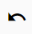 | Allows to undo the actions. | toolbarSettings: { <br /> items: ['Undo'] <br /> } |
| Redo | 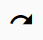 | Allows to redo the actions. | toolbarSettings: { <br /> items: ['Redo'] <br /> } |
| Alignment | 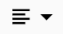 | Align the content with left, center, and right margin. | toolbarSettings: { <br /> items: ['Alignments'] <br /> } |
| OrderedList | 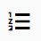 | Create a new list item (numbered). | toolbarSettings: { <br /> items: ['OrderedList'] <br /> } |
| UnorderedList | 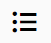 | Create a new list item (bulleted). | toolbarSettings: { <br /> items: ['UnorderedList'] <br /> } |
| Indent | 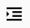 | Allows to increase the indent level of the content. | toolbarSettings: { <br /> items: ['Indent'] <br /> } |
| Outdent | 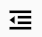 | Allows to decrease the indent level of the content. | toolbarSettings: { <br /> items: ['Outdent'] <br /> } |
| Hyperlink | 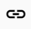 | Creates a hyperlink to a text or image to a specific location in the content. | toolbarSettings: { <br /> items: ['CreateLink'] <br /> } |
| Images | 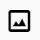 | Inserts an image from an online source or local computer. | toolbarSettings: { <br /> items: ['Image'] <br /> } |
| LowerCase | 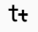 | Change the case of selected text to lower in the content. | toolbarSettings: { <br /> items: ['LowerCase'] <br /> } |
| UpperCase | 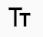 | Change the case of selected text to upper in the content. | toolbarSettings: { <br /> items: ['UpperCase'] <br /> } |
| SubScript | 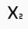 | Makes the selected text as subscript (lower). | toolbarSettings: { <br /> items: ['SubScript'] <br /> } |
| SuperScript | 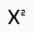 | Makes the selected text as superscript (higher). | toolbarSettings: { <br /> items: ['SuperScript'] <br /> } |
| Print  | 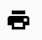 | Allows to print the editor content. | toolbarSettings: { <br /> items: ['Print'] <br /> } |
| FontName | 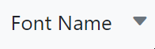 | Defines the fonts that appear under the Font Family DropDownList from the Rich Text Editor's toolbar. | toolbarSettings: { <br /> items: ['FontName'] <br /> } |
| FontSize | 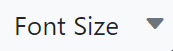 | Defines the font sizes that appear under the Font Size DropDownList from the Rich Text Editor's toolbar. | toolbarSettings: { <br /> items: ['FontSize'] <br /> } |
| FontColor | 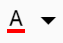 | Specifies an array of colors can be used in the colors pop-up for font color. | toolbarSettings: { <br /> items: ['FontColor'] <br /> } |
| BackgroundColor | 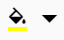 | Specifies an array of colors can be used in the colors pop-up for background color. | toolbarSettings: { <br /> items: ['BackgroundColor'] <br /> } |
| Format | 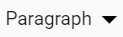 | An object with the options that will appear in the paragraph format drop-down from the toolbar. | toolbarSettings: { <br /> items: ['Formats'] <br /> } |
| StrikeThrough | 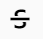 | Apply double line strike through formatting for the selected text. | toolbarSettings: { <br /> items: ['StrikeThrough'] <br /> } |
| ClearFormat | 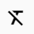 | The clear format tool is used to remove all formatting styles (such as bold, italic, underline, color, superscript, subscript, and more) from currently selected text. As a result, all the formatting text will be cleared and return to its default formatting styles. | toolbarSettings: { <br /> items: ['ClearFormat'] <br /> } |
| FullScreen | 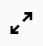 | Stretches the editor to the maximum width and height of the browser window. | toolbarSettings: { <br /> items: ['FullScreen'] <br /> } |
| SourceCode | 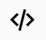  | The RichTextBox includes the ability for users to directly edit the HTML code via Source View. If you made any modification in source view directly, synchronize with design view. | toolbarSettings: { <br /> items: ['SourceCode'] <br /> } |
| NumberFormatList | 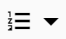 | Allows to create list items with various list style types(numbered).|toolbarSettings: { <br /> items: ['NumberFormatList'] <br /> } |
| BulletFormatList | 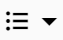 | Allows to create list items with various list style types(bulleted).|toolbarSettings: { <br /> items: ['BulletFormatList'] <br /> } |
| JustifyLeft | 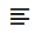 | Allows each line to begin at the same distance from the editor’s left-hand side. | toolbarSettings: { <br /> items: ['JustifyLeft'] <br /> } |
| JustifyCenter | 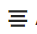 | There is an even space on each side of each line since the text is not aligned to the left or right margins. | toolbarSettings: { <br /> items: ['JustifyCenter'] <br /> } |
| JustifyRight | 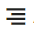 | Allows each line to end at the same distance from the editor’s right-hand side. | toolbarSettings: { <br /> items: ['JustifyRight'] <br /> } |
| JustifyFull | 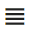 | The text is aligned with both right and left margins. | toolbarSettings: { <br /> items: ['JustifyFull'] <br /> } |
| Bold  | 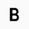 | Text that is thicker and darker than usual. | toolbarSettings: { <br /> items: ['Bold'] <br /> } |
| Italic | 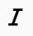 | Shows a text that is leaned to the right. | toolbarSettings: { <br /> items: ['Italic'] <br /> } |
| Underline | 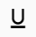 | The underline is added to the selected text. | toolbarSettings: { <br /> items: ['Underline'] <br /> } |
| ClearAll | 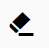 | Removes all styles that have been applied to the selected text.| toolbarSettings: { <br /> items: ['ClearAll'] <br /> } |
| Cut | 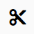 | Removes the text from its current location and places it into the clipboard. | toolbarSettings: { <br /> items: ['Cut'] <br /> } |
| Copy | 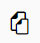 | The selected item is copied and pasted into the clipboard. | toolbarSettings: { <br /> items: ['Copy'] <br /> } |
| Paste | 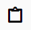 | Allows you to insert a clipboard item into a specific location. | toolbarSettings: { <br /> items: ['Paste'] <br /> } |
| OpenLink | 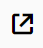 | To open the URL link that is  attached to the selected text. | toolbarSettings: { <br /> items: ['OpenLink'] <br /> } |
| EditLink | 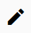 | Allows you to change the URL that has been attached to a specific item. | toolbarSettings: { <br /> items: ['EditLink'] <br /> } |
| CreateTable | 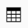 | Create a table with defined columns and rows. | toolbarSettings: { <br /> items: ['CreateTable'] <br /> } |
| RemoveTable | 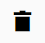 | Removes the selected table and its contents. | toolbarSettings: { <br /> items: ['TableRemove'] <br /> } |
| Replace | 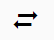 | Replace the selected image with another image. | toolbarSettings: { <br /> items: ['Replace'] <br /> } |
| Align |  | The image can be aligned to the right, left, or center. | toolbarSettings: { <br /> items: ['Align'] <br /> } |
| Remove |  | Allows to remove the selected image from the editor. | toolbarSettings: { <br /> items: ['Remove'] <br /> } |
| OpenImageLink |  | Opens the link that is attached to the selected image. | toolbarSettings: { <br /> items: ['OpenImageLink'] <br /> } |
| EditImageLink |  | Allows to edit the link that is attached to the selected image. | toolbarSettings: { <br /> items: ['EditImageLink'] <br /> } |
| RemoveImageLink | 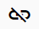 | Removes the link that is attached to the selected image. | toolbarSettings: { <br /> items: ['RemoveImageLink'] <br /> } |
| InsertLink |  |Allows users to add a link to a particular item. | toolbarSettings: { <br /> items: ['InsertLink'] <br /> } |
| Display | 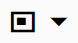 | Allows you to choose whether an image should be shown inline or as a block. | toolbarSettings: { <br /> items: ['Display'] <br /> } |
| AltText | 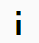 | To display image description when an image on a Web page cannot be displayed. | toolbarSettings: { <br /> items: ['AltText'] <br /> } |
| Dimension | 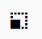 | Allows you to customize the image’s height and width. | toolbarSettings: { <br /> items: ['Dimension'] <br /> } |
| Maximize |  | Stretches the editor to the maximum width and height of the browser window. | toolbarSettings: { <br /> items: ['Maximize'] <br /> } |
| Minimize | 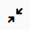 | Shrinks the editor to the default width and height. | toolbarSettings: { <br /> items: ['Minimize'] <br /> } |
| Preview | 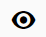 | Allows to see how the editor’s content looks in a browser. | toolbarSettings: { <br /> items: ['Preview'] <br /> } |
| InsertCode | 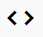 | Represents preformatted text which is to be presented exactly as written in the HTML file. | toolbarSettings: { <br /> items: ['InsertCode'] <br /> } |
| RemoveLink |  | Allows you to remove the applied link from the selected item. | toolbarSettings: { <br /> items: ['RemoveLink'] <br /> } |
| TableHeader | 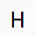 | Allows you to add a table header. | toolbarSettings: { <br /> items: ['TableHeader'] <br /> } |
| TableColumns | 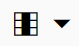 | Shows the dropdown to insert a column or delete the selected column. | toolbarSettings: { <br /> items: ['TableColumns'] <br /> } |
| TableRows |  | Shows the dropdown to insert a row ors delete the selected row. | toolbarSettings: { <br /> items: ['TableRows'] <br /> } |
| TableCellHorizontalAlign |  | Allows the table cell content to be aligned horizontally. | toolbarSettings: { <br /> items: ['TableCellHorizontalAlign'] <br /> } |
| TableCellVerticalAlign |  | Allows the table cell content to be aligned vertically. | toolbarSettings: { <br /> items: ['TableCellVerticalAlign'] <br /> } |
| TableEditProperties |  | Allows you to change the table width, padding, and cell spacing styles. | toolbarSettings: { <br /> items: ['TableEditProperties'] <br /> } |

By default, tools will be arranged in the following order.

``` javascript
  items: ['Bold', 'Italic', 'Underline', '|', 'Formats', 'Alignments', 'OrderedList', 'UnorderedList', '|', 'CreateLink', 'Image', '|', 'SourceCode', 'Undo', 'Redo']
```

The tools order can be customized as our application requirement. If you are not specifying any tools order, the editor will create the toolbar with default items.

## Custom tool

The Rich Text Editor allows you to configure your own commands to its toolbar using the [toolbarSettings](/rich-text-editor/api-toolbarSettings.html) property. The command can be plain text, icon, or HTML template. The order and the group can also be defined where the command should be included. Bind the action to the command by getting its instance.

This sample shows how to add your own commands to the toolbar of the Rich Text Editor. The **Ω** command is added to insert special characters in the editor. By clicking the **Ω** command, it will show the special characters list, and then choose the character to be inserted in the editor.

The following code snippet illustrates custom tool with tooltip text which will be included in [items](/rich-text-editor/api-toolbarSettings.html#items) field of the toolbarSettings property.

In the following sample, once Rich Text Editor control is [created](https://ej2.syncfusion.com/react/documentation/api/rich-text-editor/#created), the concern event will be created; the Dialog component can be rendered and target as RTE content.

```javascript
    {
      template: '<button class="e-tbar-btn e-btn" tabindex="-1" id="custom_tbar"  style="width:100%"><div class="e-tbar-btn-text" style="font-weight: 500;"> &#937;</div></button>',
      undo: true,
      click: this.onClick.bind(this),
      tooltipText: 'Insert Symbol'
    }

```

`[Class-component]`










 

`[Functional-component]`










 

## Quick inline toolbar

Quick commands are opened as context-menu on clicking the corresponding element. The commands must be passed as string collection to image, text, and link attributes of the [quickToolbarSettings](/rich-text-editor/api-quickToolbarSettings.html) property.

| **Target element** | **Default quick toolbar items** |
| --- | --- |
| Image | 'Replace', 'Align', 'Caption', 'Remove', 'InsertLink', 'Display', 'AltText', and 'Dimension' |
| Link | 'Open', 'Edit', and 'UnLink' |
| Text (`Deprecated`) | 'Cut', 'Copy', and 'Paste' |
| Table | 'TableHeader', 'TableRows', 'TableColumns', 'BackgroundColor', 'TableRemove', 'Alignments', 'TableCellVerticalAlign' and 'Styles' |

Custom tool can be added to the corresponding quick toolbar, using the [quickToolbarSettings](/rich-text-editor/api-quickToolbarSettings.html)  property.

The following sample demonstrates the option to insert the image to the Rich Text Editor content as well as option to rotate the image through the quick toolbar. The image rotation functionalities have been achieved through the [toolbarClick](https://ej2.syncfusion.com/react/documentation/api/rich-text-editor/#toolbarclick) event.

`[Class-component]`










 

`[Functional-component]`










 

> Rich Text Editor features are segregated into individual feature-wise modules. To use quick toolbar, inject the quick toolbar module using the `RichTextEditor.Inject(image, link)`.