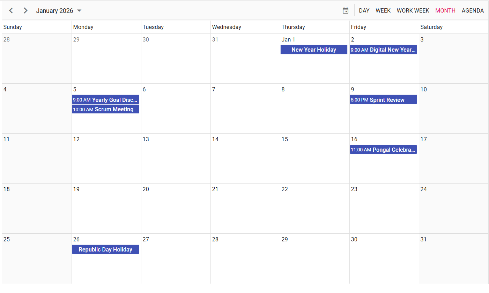
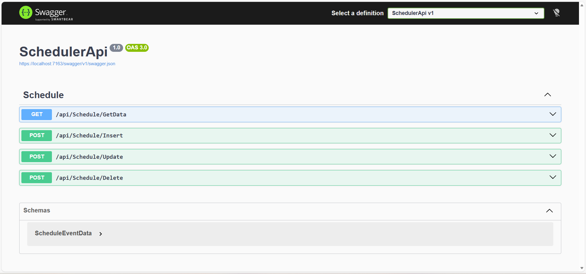
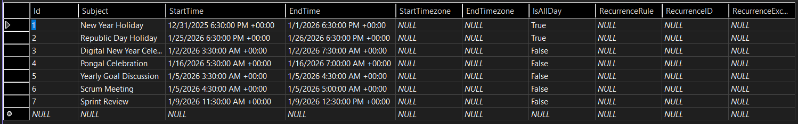

# Syncfusion React Scheduler integration with .NET Web API using Axios

This section provides a step-by-step guide for setting up a React application and integrating the Syncfusion<sup style="font-size:70%">&reg;</sup> React Scheduler component with a ASP.NET MVC ( .NET Framework 4.8 ) backend using Axios.

## What is Axios?

Axios is a lightweight JavaScript library used to make HTTP requests from React to a backend API. It simplifies sending and receiving JSON data, handles errors cleanly, and makes it easy to connect the Syncfusion® React Scheduler with a .NET Framework 4.8 REST API.

## Overview

This integration enables full CRUD (Create, Read, Update, Delete) operations for calendar events using:

* Frontend: React + Syncfusion React Scheduler
* Backend: .NET Framework 4.8 Web API
* Database: SQL Server 
* Communication: REST APIs via Axios

Users can create, edit, and delete appointments in the Scheduler UI, with all changes persisted in the database through the .NET 4.8 backend.

## Prerequisites

Before getting started with the application, ensure the following prerequisites are met:

* **Node.js ≥ 18.x (LTS Recommended)**   
Required for running and managing the React application, providing stable support for modern JavaScript tooling.

* **.NET Framework 4.8 Developer Pack**  
Required to build and run the backend API that integrates with the Syncfusion® React Scheduler.

* **SQL Server 2022 / SQL Server LocalDB (MSSQLLocalDB)**  
Required for storing and retrieving event data. LocalDB is recommended during development for lightweight, file‑based database access.

* **Axios ≥ 1.x (Installed in React)**  
Required for making REST API calls between the React front end and the .NET Framework 4.8 backend.

## Architecture Overview

Below is the architecture that explains how all parts communicate with each other:

```
                ┌─────────────────────────┐
                │      React Frontend     │
                │  (Syncfusion Scheduler) │
                └─────────────┬──────────┘
                              │
                              ▼
                   Axios HTTP Requests
                              │
                              ▼
                ┌─────────────────────────┐
                │    .NET Web API Server  │
                │  (SchedulerController)  │
                └─────────────┬──────────┘
                              │
                              ▼
                In-Memory List / Database
```

## Architecture Flow

1. User interacts with the **Syncfusion React Scheduler**.
2. Scheduler triggers CRUD operations.
3. **Axios** sends API requests.
4. **.NET Web API** processes the data and returns updated event data.
5. React refreshes the view.

## Create Backend (.NET)

1. **Create the Visual Studio project**

    - Open Visual Studio → Create a new project → choose **ASP.NET Web Application (.NET Framework)** → Next.
    - Name: `ScheduleSample`
    - In the next screen choose **MVC** (or Empty + Web API if you prefer), and ensure **.NET Framework 4.8** is selected.

2. **Create the database and table (LocalDB)**

    - In Visual Studio, open **View → SQL Server Object Explorer**.
    - Right-click `(localdb)\MSSQLLocalDB` → Add New Database → name it `ScheduleData`.
    - Expand the new database → Right-click Tables → Add New Table and create a `ScheduleEventData` table with columns that match the repository model. Minimum recommended columns:

        ```
            `Id` INT PRIMARY KEY NOT NULL
            `Subject` NVARCHAR(MAX)
            `StartTime` DATETIME NULL
            `EndTime` DATETIME NULL
            `StartTimezone` NVARCHAR(MAX) NULL
            `EndTimezone` NVARCHAR(MAX) NULL
            `IsAllDay` BIT NULL
            `RecurrenceRule` NVARCHAR(MAX) NULL
            `RecurrenceID` INT NULL
            `RecurrenceException` NVARCHAR(MAX) NULL
            `AirlineId` NVARCHAR(50) NULL
            `PilotId` NVARCHAR(50) NULL
        ```

    - Save the table.   
    Optionally, you can create a file-based MDF by right-clicking the project → Add → New Item → Service-based Database and naming it `ScheduleData.mdf` inside `App_Data`.

3. **Generate LINQ-to-SQL DBML (ScheduleData.dbml)**

    - In the project, right-click → Add → New Item → choose **LINQ to SQL Classes** and name it `ScheduleData.dbml`.
    - Drag the `ScheduleEventData` table from Server Explorer / SQL Server Object Explorer onto the DBML designer. Save — Visual Studio generates `ScheduleData.designer.cs` with the `ScheduleEventData` class and `ScheduleDataDataContext`.

4. **Add helper models**

    - Add `Models/EditParams.cs`:

        
        

        using System.Collections.Generic;

        namespace ScheduleSample.Models
        {
            public class EditParams
            {
                public string key { get; set; }
                public string action { get; set; }
                public List<ScheduleEventData> added { get; set; }
                public List<ScheduleEventData> changed { get; set; }
                public List<ScheduleEventData> deleted { get; set; }
                public ScheduleEventData value { get; set; }
            }
        }

        
        

5. **Implement HomeController (controller actions)**

    - Add `Controllers/HomeController.cs` and implement the same behavior as the sample. You can copy/adapt the following code:

        
        

        using System;
        using System.Linq;
        using System.Web.Mvc;
        using ScheduleSample.Models;

        namespace ScheduleSample.Controllers
        {
            public class HomeController : Controller
            {
                ScheduleDataDataContext db = new ScheduleDataDataContext();
                public ActionResult Index() { return View(); }
                public JsonResult GetData()
                {
                    var data = db.ScheduleEventDatas.ToList();
                    return Json(data, JsonRequestBehavior.AllowGet);
                }
                [HttpPost]
                public JsonResult Insert(ScheduleEventData insertData)
                {
                    var value = insertData;
                    int intMax = db.ScheduleEventDatas.ToList().Count > 0 ? db.ScheduleEventDatas.ToList().Max(p => p.Id) : 1;
                    DateTime startTime = Convert.ToDateTime(value.StartTime);
                    DateTime endTime = Convert.ToDateTime(value.EndTime);
                    ScheduleEventData appointment = new ScheduleEventData()
                    {
                        Id = intMax + 1,
                        StartTime = startTime.ToLocalTime(),
                        EndTime = endTime.ToLocalTime(),
                        Subject = value.Subject,
                        IsAllDay = value.IsAllDay,
                        StartTimezone = value.StartTimezone,
                        AirlineId = value.AirlineId,
                        PilotId = value.PilotId,
                        EndTimezone = value.EndTimezone,
                        RecurrenceRule = value.RecurrenceRule,
                        RecurrenceID = value.RecurrenceID,
                        RecurrenceException = value.RecurrenceException,
                    };
                    db.ScheduleEventDatas.InsertOnSubmit(appointment);
                    db.SubmitChanges();
                    var data = GetData();
                    return data;
                }
                [HttpPost]
                public JsonResult Update(ScheduleEventData updateData)
                {
                    var value = updateData;
                    var filterData = db.ScheduleEventDatas.Where(c => c.Id == Convert.ToInt32(value.Id));
                    if (filterData.Count() > 0)
                    {
                        DateTime startTime = Convert.ToDateTime(value.StartTime);
                        DateTime endTime = Convert.ToDateTime(value.EndTime);
                        ScheduleEventData appointment = db.ScheduleEventDatas.Single(A => A.Id == Convert.ToInt32(value.Id));
                        appointment.StartTime = startTime.ToLocalTime();
                        appointment.EndTime = endTime.ToLocalTime();
                        appointment.StartTimezone = value.StartTimezone;
                        appointment.EndTimezone = value.EndTimezone;
                        appointment.Subject = value.Subject;
                        appointment.IsAllDay = value.IsAllDay;
                        appointment.AirlineId = value.AirlineId;
                        appointment.PilotId = value.PilotId;
                        appointment.RecurrenceRule = value.RecurrenceRule;
                        appointment.RecurrenceID = value.RecurrenceID;
                        appointment.RecurrenceException = value.RecurrenceException;
                    }
                    db.SubmitChanges();
                    var data = GetData();
                    return data;
                }
                [HttpPost]
                public JsonResult Delete(ScheduleEventData deleteData)
                {
                    var value = deleteData;
                    ScheduleEventData appointment = db.ScheduleEventDatas.Where(c => c.Id == value.Id).FirstOrDefault();
                    if (appointment != null) db.ScheduleEventDatas.DeleteOnSubmit(appointment);
                    db.SubmitChanges();
                    var data = GetData();
                    return data;
                }
            }
        }

        
        

6. **Configure connection string (if using `App_Data/ScheduleData.mdf`)**

    - In `Web.config` add or update the connection string, for example:

    ```xml
    <connectionStrings>
    <add name="ScheduleDataConnectionString" connectionString="Data Source=(LocalDB)\MSSQLLocalDB;AttachDbFilename=|DataDirectory|\ScheduleData.mdf;Integrated Security=True" providerName="System.Data.SqlClient" />
    </connectionStrings>
    ```

7. **Enable CORS for development (optional)**

    - If you run the React dev server on a different origin (for example `http://localhost:5173`), add a simple development-only header in `Global.asax` or an action filter to allow cross-origin requests:

    ```csharp
    protected void Application_BeginRequest(object sender, EventArgs e)
    {
        HttpContext.Current.Response.AddHeader("Access-Control-Allow-Origin", "http://localhost:5173");
        if (HttpContext.Current.Request.HttpMethod == "OPTIONS")
        {
            HttpContext.Current.Response.AddHeader("Access-Control-Allow-Methods", "GET, POST, OPTIONS");
            HttpContext.Current.Response.AddHeader("Access-Control-Allow-Headers", "Content-Type");
            HttpContext.Current.Response.End();
        }
    }
    ```

8. **Run the project**

    - Start the project in Visual Studio (F5) — it will typically run on an IIS Express port such as `http://localhost:54738/`.
    - Test the endpoints with a browser `http://localhost:54738/Home/GetData`.

## Create Frontend (React)

To create a new `React` application, use the Vite build tool, which provides faster startup, hot reload, and better performance for modern React applications.




npm create vite@latest 




yarn create vite 




Running one of the above commands will prompt you to configure the project as shown below.

1. **Define the project name**     
    For example, let us name the project react-app.

    
    

    √ Project name: » **react-app**
    
    
    

2. **Select the required configurations**   

    Choose React as the framework and JavaScript as the variant for better type safety and maintainability.
    
    
    

    √ Select a framework: » **React**   
    √ Select a variant: » **JavaScript**   
    
    
    

    **Note:**  
    You can also create the React application with JavaScript directly using the Vite template, as shown below.

    
    

    npm create vite@latest react-app -- --template react-js

    
    

    yarn create vite react-app --template react-js

    
    

3. **Confirm Additional Vite Options**

    
    

    √ Use rolldown-vite (Experimental)?: » **No**   
    √ Install with npm and start now? » **Yes**  
    
    
    
   
After executing the above commands, the application will be available at: `http://localhost:5173`

The React application is now created and running with default settings.
Next, we will proceed with integrating Syncfusion® React Scheduler component.

4. **Navigate to the project directory**   
    Once the project is created successfully, move into the application folder using the following command:

    
    

    cd react-app

    
    

## Integrating Syncfusion React Scheduler to the Application
This section integrates [Syncfusion React Scheduler](https://www.syncfusion.com/react-components/react-scheduler) to the above created application.

1. **Clean Up Default React (Vite + JavaScript) Files**  
    Remove default assets and boilerplate of the react application.

2. **Install the required [Syncfusion React Scheduler Package](https://www.npmjs.com/package/@syncfusion/ej2-react-schedule)** 
    
    
    

    npm install @syncfusion/ej2-react-schedule
    
    
    

    yarn add @syncfusion/ej2-react-schedule

    
    

3. **Add CSS references for Schedule**   
Add CSS references needed for a Schedule in `src/index.css` from the `../node_modules/@syncfusion` package folder.
   
    
    

    @import "../node_modules/@syncfusion/ej2-base/styles/material.css";
    @import "../node_modules/@syncfusion/ej2-buttons/styles/material.css";
    @import "../node_modules/@syncfusion/ej2-calendars/styles/material.css";
    @import "../node_modules/@syncfusion/ej2-dropdowns/styles/material.css";
    @import "../node_modules/@syncfusion/ej2-inputs/styles/material.css";
    @import "../node_modules/@syncfusion/ej2-navigations/styles/material.css";
    @import "../node_modules/@syncfusion/ej2-popups/styles/material.css";
    @import "../node_modules/@syncfusion/ej2-react-schedule/styles/material.css";
    
    
    

4. **Add Schedule Component**   
In the `src/index.js` file, use the following code snippet to render the Syncfusion React Schedule control and import `index.css` to apply styles to the schedule:

    
     
    
    import { createRoot } from 'react-dom/client';
    import './index.css';

    import {
    ScheduleComponent,
    ViewsDirective,
    ViewDirective,
    Day,
    Week,
    WorkWeek,
    Month,
    Agenda,
    Inject,
    Resize,
    DragAndDrop
    } from '@syncfusion/ej2-react-schedule';
    import { SampleBase } from './sample-base';
    import axios from 'axios';
    /**
    * Schedule Default sample
    */
    export class Default extends SampleBase {
    constructor() {
        super(...arguments);
        this.flag = true;
    }

    onBound(args) {
        if (this.flag) {
        axios.get('http://localhost:54738/Home/GetData').then(response => {
            var schObj = document.querySelector('.e-schedule').ej2_instances[0];
            schObj.eventSettings.dataSource = response.data;
        });
        this.flag = false;
        }
    }

    onBegin(args) {
        if (args.requestType === 'eventCreate') {
        axios
            .post('http://localhost:54738/Home/Insert', args.data[0])
            .then(response => {
            var schObj = document.querySelector('.e-schedule').ej2_instances[0];
            schObj.eventSettings.dataSource = response.data;
            });
        } else if (args.requestType === 'eventChange') {
        axios
            .post('http://localhost:54738/Home/Update', args.data)
            .then(response => {
            var schObj = document.querySelector('.e-schedule').ej2_instances[0];
            schObj.eventSettings.dataSource = response.data;
            });
        } else if (args.requestType === 'eventRemove') {
        axios
            .post('http://localhost:54738/Home/Delete', args.data[0])
            .then(response => {
            var schObj = document.querySelector('.e-schedule').ej2_instances[0];
            schObj.eventSettings.dataSource = response.data;
            });
        }
    }
    render() {
        return (
        <div className="schedule-control-section">
            <div className="col-lg-9 control-section">
            <div className="control-wrapper">
                <ScheduleComponent
                height="650px"
                ref={schedule => (this.scheduleObj = schedule)}
                currentView="Month"
                selectedDate={new Date(2020, 5, 10)}
                dataBound={this.onBound.bind(this)}
                actionBegin={this.onBegin.bind(this)}
                >
                <ViewsDirective>
                    <ViewDirective option="Day" />
                    <ViewDirective option="Week" />
                    <ViewDirective option="WorkWeek" />
                    <ViewDirective option="Month" />
                    <ViewDirective option="Agenda" />
                </ViewsDirective>
                <Inject
                    services={[
                    Day,
                    Week,
                    WorkWeek,
                    Month,
                    Agenda,
                    Resize,
                    DragAndDrop
                    ]}
                />
                </ScheduleComponent>
            </div>
            </div>
        </div>
        );
    }
    }
    const root = createRoot(document.getElementById('sample'));
    root.render(<Default />);

    
    

5. **Run the Frontend**

    
    

    npm run dev
    
    
    

    yarn run dev

    
    

    react application started running on http://localhost:5173/

6. **You can create, read, update and delete events in the React Scheduler and able to see the changes in DB as well.**

## Output Preview
**Syncfusion React Scheduler**

*Image illustrating the Syncfusion React Scheduler* 

**DotNet Application**

*Image illustrating the DotNet Application* 

**React Scheduler Events in Database**

*Image illustrating the Database Table*

## Syncfusion Sample Repository

1. Complete Sample Application – A Syncfusion reference implementation that integrates a .NET Framework 4.8 Web API with the React Scheduler component using Axios.
    
    GitHub: [SyncfusionExamples/ej2-react-scheduler-with-axios](https://github.com/SyncfusionExamples/React-Scheduler-CRUD-using-axios)