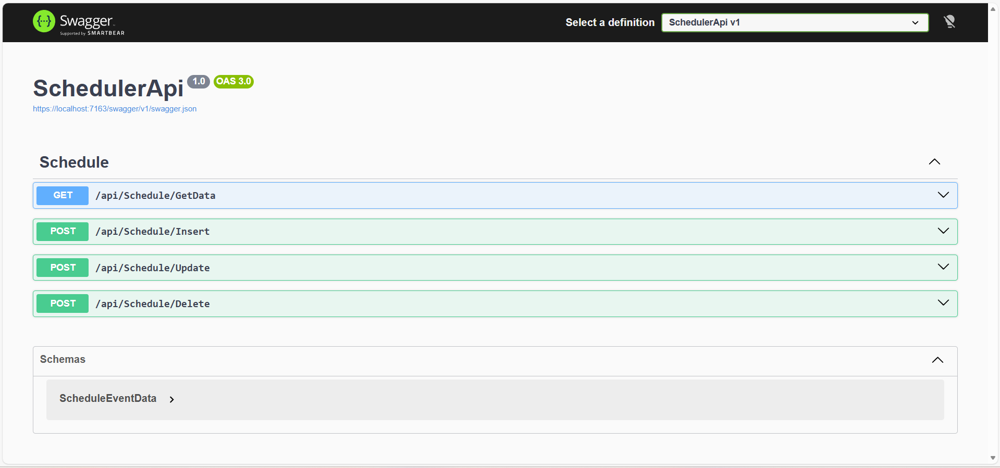
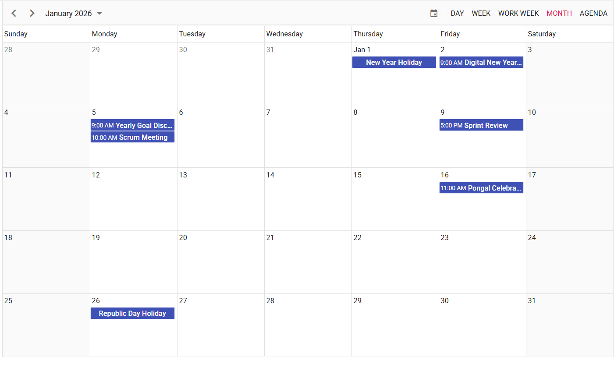
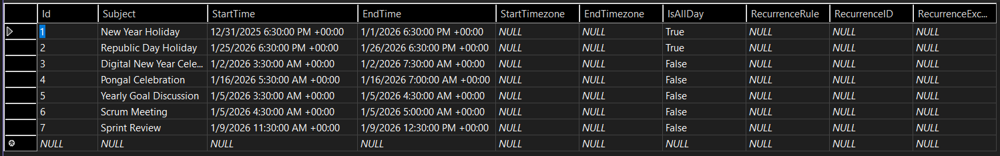

# Syncfusion React Scheduler with ASP.NET Core API using Axios

This section provides a step‑by‑step guide for setting up a React application and integrating the Syncfusion<sup style="font-size:70%">&reg;</sup> React Scheduler component with an ASP.NET Core Web API backend (using EF Core and SQL Server) through Axios.

## What is Axios?

Axios is a lightweight and popular JavaScript library used to make HTTP requests from React to a backend API. It simplifies sending and receiving JSON data, provides clean error handling, and offers a straightforward API for performing CRUD operations.

In this integration, Axios serves as the communication bridge between the Syncfusion® React Scheduler and the ASP.NET Core Web API (built with EF Core and SQL Server), ensuring smooth data transfer between the frontend and backend.

## Overview

This integration enables full CRUD (Create, Read, Update, Delete) operations for calendar events using:

* Frontend: **React + Syncfusion React Scheduler**
* Backend: **ASP.NET Core Web API (EF Core)**
* Database: **SQL Server LocalDB**
* Communication: **REST APIs via Axios**

With this setup, Axios sends all Scheduler actions to the ASP.NET Core backend, where appointments are created, updated, and stored in the SQL Server database.

## Prerequisites

Before getting started with the application, ensure the following prerequisites are met:

* **Node.js ≥ 18.x (LTS Recommended)**   
Required for running and managing the React application, providing stable support for modern JavaScript tooling.

* **.NET 10 SDK (ASP.NET Core 10 Web API)**
Required to build and run the ASP.NET Core 10 backend that integrates with the Syncfusion® React Scheduler.

* **SQL Server 2022 / SQL Server LocalDB (MSSQLLocalDB)**  
Required for storing and retrieving event data. LocalDB is recommended during development for lightweight, file‑based database access.

* **Axios ≥ 1.x (Installed in React)**  
Required for making REST API calls between the React front end and the ASP.NET Core 10 Web API backend.

## Architecture Overview

Below is the architecture that explains how all parts communicate with each other:

```
                    ┌─────────────────────────┐
                    │      React Frontend     │
                    │  (Syncfusion Scheduler) │
                    └───────────┬───────────┘
                                │
                                ▼
                        Axios HTTP Requests
                                │
                                ▼
                ┌─────────────────────────────────┐
                │   ASP.NET Core Web API Server   │
                │       (SchedulerController)     │        
                └───────────────┬───────────────┘
                                │
                                ▼
                    In-Memory List / Database
```

## 1. Backend – ASP.NET Core Web API
Provides the backend service that exposes the REST endpoints used by the Syncfusion React Scheduler to load, create, update, and delete event data through Axios requests.

### 1.1 Create project & install required packages

Creates an ASP.NET Core Web API project and adds the required packages for Swagger and Entity Framework Core.




dotnet new webapi -n ScheduleApi   
cd ScheduleApi   
//Swagger UI (needed explicitly for .NET 9+)   
dotnet add package Swashbuckle.AspNetCore   
//EF Core SQL Server provider (if not present)   
dotnet add package Microsoft.EntityFrameworkCore.SqlServer   
//EF Core tools are used from CLI (install globally if needed)   
dotnet add package Microsoft.EntityFrameworkCore.Tools   




### 1.2 Add the connection string in `appsettings.json`

Defines the database connection string used by Entity Framework Core for accessing the SQL Server database.




{
  "ConnectionStrings": {
    "DefaultConnection": "Server=(localdb)\\MSSQLLocalDB;Database=SchedulerRecords;Trusted_Connection=True;MultipleActiveResultSets=true"
  },
  "Logging": { "LogLevel": { "Default": "Information", "Microsoft.AspNetCore": "Warning" } },
  "AllowedHosts": "*"
}




### 1.3 Add the model and configure the DbContext

Defines the data model and configures the Entity Framework Core DbContext for mapping schedule events to the database.




// Models/ScheduleEventData.cs
using System.ComponentModel.DataAnnotations.Schema;

namespace SchedulerApi.Models;

[Table("ScheduleEventDatas")]
public class ScheduleEventData
{
    public int Id { get; set; }
    public string? Subject { get; set; }
    public DateTimeOffset StartTime { get; set; }
    public DateTimeOffset EndTime { get; set; }
    public string? StartTimezone { get; set; }
    public string? EndTimezone { get; set; }
    public bool IsAllDay { get; set; }
    public string? RecurrenceRule { get; set; }
    public int? RecurrenceID { get; set; }
    public string? RecurrenceException { get; set; }
}







// Data/AppDbContext.cs
using Microsoft.EntityFrameworkCore;
using SchedulerApi.Models;

namespace SchedulerApi.Data;

public class AppDbContext(DbContextOptions<AppDbContext> options) : DbContext(options)
{
    public DbSet<ScheduleEventData> ScheduleEventDatas => Set<ScheduleEventData>();

    protected override void OnModelCreating(ModelBuilder modelBuilder)
    {
        var e = modelBuilder.Entity<ScheduleEventData>();
        e.ToTable("ScheduleEventDatas");
        e.Property(x => x.Id).ValueGeneratedNever(); // client supplies Id
        e.Property(x => x.StartTime).HasColumnType("datetimeoffset");
        e.Property(x => x.EndTime).HasColumnType("datetimeoffset");
    }
}




### 1.4 Configure CORS, Swagger, and controllers in `Program.cs`

Configures the application pipeline by enabling CORS, registering Swagger for development, and mapping controllers.




// Program.cs
using Microsoft.EntityFrameworkCore;
using SchedulerApi.Data;

var builder = WebApplication.CreateBuilder(args);

builder.Services.AddDbContext<AppDbContext>(opt =>
    opt.UseSqlServer(builder.Configuration.GetConnectionString("DefaultConnection")));

builder.Services.AddControllers();
builder.Services.AddEndpointsApiExplorer();
builder.Services.AddSwaggerGen();

// CORS: allow‑list exact dev origins (Vite: 5173)
builder.Services.AddCors(options =>
{
    options.AddPolicy("SpaDev", p => p
        .WithOrigins("http://localhost:5173", "https://localhost:5173")
        .AllowAnyHeader()
        .AllowAnyMethod());
});

var app = builder.Build();

if (app.Environment.IsDevelopment())
{
    app.UseSwagger();
    app.UseSwaggerUI();
}

app.UseHttpsRedirection();
app.UseCors("SpaDev"); // place before MapControllers (CORS order matters)
app.MapControllers();
app.Run();




### 1.5 Add the controller with REST‑style endpoints

Implements CRUD endpoints for managing schedule event data through a REST‑based controller.




// Controllers/ScheduleController.cs
using Microsoft.AspNetCore.Mvc;
using Microsoft.EntityFrameworkCore;
using SchedulerApi.Data;
using SchedulerApi.Models;

namespace SchedulerApi.Controllers;

[ApiController]
[Route("api/[controller]")]
public class ScheduleController(AppDbContext db) : ControllerBase
{
    [HttpGet]
    public async Task<ActionResult<IEnumerable<ScheduleEventData>>> Get()
        => await db.ScheduleEventDatas.AsNoTracking().ToListAsync();

    [HttpPost]
    public async Task<ActionResult<ScheduleEventData>> Create([FromBody] ScheduleEventData item)
    {
        db.ScheduleEventDatas.Add(item);
        await db.SaveChangesAsync();
        return Ok(item);
    }

    [HttpPut("{id:int}")]
    public async Task<IActionResult> Update(int id, [FromBody] ScheduleEventData item)
    {
        if (id != item.Id) return BadRequest();
        db.Entry(item).State = EntityState.Modified;
        await db.SaveChangesAsync();
        return NoContent();
    }

    [HttpDelete("{id:int}")]
    public async Task<IActionResult> Delete(int id)
    {
        var found = await db.ScheduleEventDatas.FindAsync(id);
        if (found is null) return NotFound();
        db.ScheduleEventDatas.Remove(found);
        await db.SaveChangesAsync();
        return NoContent();
    }
}




### 1.6 Apply database migrations

Creates and applies Entity Framework Core migrations to generate the database schema and supports producing an idempotent SQL script for production deployment.




//from ScheduleApi folder   
dotnet ef migrations add InitialCreate   
dotnet ef database update   




For **production**, generate an **idempotent SQL script** and apply via deployment (don’t auto‑migrate on startup):




dotnet ef migrations script --idempotent -o migrate.sql




## 2. Frontend – React + Syncfusion React Scheduler + Axios

Implements the React frontend that uses the Syncfusion Scheduler component and Axios to communicate with the ASP.NET Core Web API for managing event data.

### 2.1 Create the app and install required Syncfusion packages

Creates a React application using Vite and installs the Syncfusion Scheduler and Axios packages needed for the integration.




npm create vite@latest react-scheduler-axios -- --template react   
cd react-scheduler-axios   
npm i   
npm i @syncfusion/ej2-react-schedule axios   




### 2.2 Add the required Syncfusion styles

Imports the Syncfusion Material 3 theme styles needed for rendering the Scheduler and its dependent UI modules.




/* src/index.css */
@import "../node_modules/@syncfusion/ej2-base/styles/material3.css";
@import "../node_modules/@syncfusion/ej2-buttons/styles/material3.css";
@import "../node_modules/@syncfusion/ej2-calendars/styles/material3.css";
@import "../node_modules/@syncfusion/ej2-dropdowns/styles/material3.css";
@import "../node_modules/@syncfusion/ej2-inputs/styles/material3.css";
@import "../node_modules/@syncfusion/ej2-navigations/styles/material3.css";
@import "../node_modules/@syncfusion/ej2-popups/styles/material3.css";
@import "../node_modules/@syncfusion/ej2-react-schedule/styles/material3.css";




### 2.3 Set up the React entry file

Initializes the React application using the React 18 createRoot API and loads the root component along with global styles.


 

// src/main.jsx
import { createRoot } from 'react-dom/client';
import React from 'react';
import App from './App.jsx';
import './index.css';

createRoot(document.getElementById('root')).render(
  <React.StrictMode>
    <App />
  </React.StrictMode>
);




`createRoot` is the React 18 API for mounting.

### 2.4 Connect the Syncfusion React Scheduler to the API using Axios

Hooks the Scheduler’s eventCreate, eventChange, and eventRemove via actionBegin to send Axios POST/PUT/DELETE requests and refresh the local event data from the API.


 

// src/App.jsx
import React, { useEffect, useRef, useState, useCallback } from 'react';
import axios from 'axios';
import {
  ScheduleComponent,
  ViewsDirective,
  ViewDirective,
  Day, Week, WorkWeek, Month, Agenda,
  Inject, Resize, DragAndDrop
} from '@syncfusion/ej2-react-schedule';

const api = axios.create({
  baseURL: 'https://localhost:7163/api',
  timeout: 10000
});

export default function App() {
  const scheduleRef = useRef(null);
  const [events, setEvents] = useState([]);
  const [loading, setLoading] = useState(true);

  // Load initial data
  useEffect(() => {
    let active = true;
    (async () => {
      try {
        const { data } = await api.get('/Schedule');
        if (active) setEvents(data);
      } catch (err) {
        console.error('Failed to load events', err);
      } finally {
        if (active) setLoading(false);
      }
    })();
    return () => { active = false; };
  }, []);

  // Helper to refresh from server
  const refresh = useCallback(async () => {
    const { data } = await api.get('/Schedule');
    setEvents(data);
  }, []);

  // Intercept Scheduler actions
  const onActionBegin = useCallback(async (args) => {
    try {
      if (args.requestType === 'eventCreate') {
        const payload = Array.isArray(args.data) ? args.data[0] : args.data;
        await api.post('/Schedule', payload);
        await refresh();
      }
      else if (args.requestType === 'eventChange') {
        const payload = args.data; // single edited object
        await api.put(`/Schedule/${payload.Id}`, payload);
        await refresh();
      }
      else if (args.requestType === 'eventRemove') {
        const payload = Array.isArray(args.data) ? args.data[0] : args.data;
        await api.delete(`/Schedule/${payload.Id}`);
        await refresh();
      }
    } catch (err) {
      console.error('Scheduler action failed', err);
      // Cancel UI action if needed
      if (args && typeof args.cancel !== 'undefined') args.cancel = true;
    }
  }, [refresh]);

  const eventSettings = {
    dataSource: events,
    fields: {
      id: 'id',
      subject: { name: 'subject' },
      startTime: { name: 'startTime' },
      endTime: { name: 'endTime' },
      isAllDay: { name: 'isAllDay' },
      recurrenceRule: { name: 'recurrenceRule' },
      recurrenceID: { name: 'recurrenceID' },
      recurrenceException: { name: 'recurrenceException' },
      startTimezone: { name: 'startTimezone' },
      endTimezone: { name: 'endTimezone' }
    }
  };

  if (loading) return <div>Loading…</div>;

  return (
    <div>
      <ScheduleComponent
        height="650px"
        ref={scheduleRef}
        currentView="Month"
        selectedDate={new Date()}
        eventSettings={eventSettings}
        actionBegin={onActionBegin}
        allowDragAndDrop={true}
        allowResizing={true}
      >
        <ViewsDirective>
          <ViewDirective option="Day" />
          <ViewDirective option="Week" />
          <ViewDirective option="WorkWeek" />
          <ViewDirective option="Month" />
          <ViewDirective option="Agenda" />
        </ViewsDirective>
        <Inject services={[Day, Week, WorkWeek, Month, Agenda, Resize, DragAndDrop]} />
      </ScheduleComponent>
    </div>
  );
}




## 3. Run the Application

Starts the ASP.NET Core backend and the React application so the Syncfusion Scheduler can communicate with the API in real time.

### 3.1 Start the API (Swagger UI will be at `/swagger` in Development):




cd ScheduleApi   
dotnet run




Keep Swagger UI enabled only in Development; this is the recommended pattern.

### 3.2 Start the React application




cd react-scheduler-axios   
npm run dev




React application started running on `http://localhost:5173/`

## Output Preview

**DotNet Application**

*Image illustrating the DotNet Application* 

**Syncfusion React Scheduler**

*Image illustrating the Syncfusion React Scheduler* 

**React Scheduler Events in Database**

*Image illustrating the Database Table*

<br>

> Please find the sample in this [GitHub location](https://github.com/SyncfusionExamples/React-Scheduler-CRUD-using-axios)