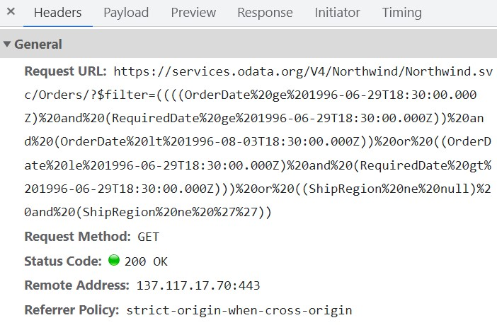

# Data binding in React Schedule component

The Scheduler utilizes the `DataManager`, which supports both RESTful data service binding and JavaScript object array binding. The [`dataSource`](https://ej2.syncfusion.com/react/documentation/api/schedule/eventSettings#datasource) property of Scheduler can be assigned either an instance of `DataManager` or a JavaScript object array collection. Scheduler supports the following data binding methods:

* Local data
* Remote data

## Binding local data

o bind local JSON data to the Scheduler, assign a JavaScript object array to the [`dataSource`](https://ej2.syncfusion.com/react/documentation/api/schedule/eventSettings#datasource) option of the Scheduler within the [`eventSettings`](https://ej2.syncfusion.com/react/documentation/api/schedule/eventSettings) property. The JSON object dataSource can also be provided as an instance of `DataManager` and assigned to the Scheduler `dataSource` property.












        


> By default, `DataManager` uses the `JsonAdaptor` for binding local data.

> You can also map different field names to the default event fields, as well as include additional `custom fields` in the event object collection. For details, refer to [event fields](./appointments#event-fields).

## Binding remote data

The Scheduler supports binding to various remote data services. To configure this, create an instance of `DataManager`, supply the remote service URL to the `url` option, and assign it to the[`dataSource`](https://ej2.syncfusion.com/react/documentation/api/schedule/eventSettings#datasource) property within  [`eventSettings`](https://ej2.syncfusion.com/react/documentation/api/schedule/eventSettings).

### Using ODataV4Adaptor

[ODataV4](https://www.odata.org/documentation/) is a standardized protocol for creating and consuming data. The following example demonstrates how to retrieve data from an ODataV4 service using DataManager. To connect with ODataV4 service endpoints, utilize the `ODataV4Adaptor` within `DataManager`.












        


### Filter events using the in-built query

To enable server-side filtering operations based on specific conditions, set the [`includeFiltersInQuery`](https://ej2.syncfusion.com/react/documentation/api/schedule/eventSettingsModel#includefiltersinquery) API to true. This allows the filter query to include the start date, end date, and recurrence rule, enabling the request to retrieve only the relevant data from the server.

This method greatly improves the component's performance by reducing the data that needs to be transferred to the client side. As a result, the component's efficiency and responsiveness are significantly enhanced, resulting in a better user experience. However, it is important to consider the possibility of longer query strings, which may cause issues with the maximum URL length or server limitations on query string length.












        


The image below illustrates how parameters are passed using an ODataV4 filter for remote data binding.



### Using custom adaptor

You can create a custom adaptor by extending one of the built-in adaptors. The following example demonstrates how to use a custom adaptor and add a custom field, such as `EventID`, to the appointments by overriding the response processing using the `processResponse` method of the `ODataV4Adaptor`.












        


## Loading data via AJAX post

You can bind the event data through external ajax request and assign it to the `dataSource`property of Scheduler. In the following code example, we have retrieved the data from server with the help of ajax request and assigned the resultant data to the `dataSource` property of Scheduler within the `onSuccess` event of Ajax.

`[src/app/app.tsx]`


```ts

import * as React from 'react';
import { useState, useEffect } from 'react';
import ReactDOM from 'react-dom';
import { Ajax } from '@syncfusion/ej2-base';
import {
  ScheduleComponent, Day, Week, WorkWeek, Month, Agenda, Inject, EventSettingsModel
} from '@syncfusion/ej2-react-schedule';
import { DataManager } from '@syncfusion/ej2-data';

const App = () => {
  const [dataManager, setDataManager] = useState<DataManager | null>(null);

  useEffect(() => {
    const ajax = new Ajax('Home/GetData', 'GET', false);
    ajax.send();
    ajax.onSuccess = function (value: DataManager) {
      setDataManager(value);
    };
  }, []);

  const eventSettings: EventSettingsModel = { dataSource: dataManager };

  return (
    <ScheduleComponent height='550px' selectedDate={new Date(2017, 5, 11)} eventSettings={eventSettings}>
      <Inject services={[Day, Week, WorkWeek, Month, Agenda]} />
    </ScheduleComponent>
  );
}

const root = ReactDOM.createRoot(document.getElementById('schedule'));
root.render(<App />);

```


`[src/app/app.ts]`

> Definition for the controller method `GetData` can be referred [here](#scheduler-crud-actions).

## Passing additional parameters to the server

To send additional custom parameters in the server-side request, use the `addParams` method of `Query`. Assign this `Query` object with the custom parameters to the [`query`](https://ej2.syncfusion.com/react/documentation/api/schedule/eventSettings#query) property of Scheduler.












        


> Parameters added using the [`query`](https://ej2.syncfusion.com/react/documentation/api/schedule/eventSettings#query) property are sent with the data request to the server on every Scheduler action.

## Handling failure actions

When Scheduler interacts with the server, server-side exceptions may occur. These error messages or exception details can be accessed client-side using the [`actionFailure`](https://ej2.syncfusion.com/react/documentation/api/schedule#actionfailure) event of Scheduler.

The argument passed to the [`actionFailure`](https://ej2.syncfusion.com/react/documentation/api/schedule#actionfailure) event contains all error details returned from the server.












        


> The [`actionFailure`](https://ej2.syncfusion.com/react/documentation/api/schedule#actionfailure) event is triggered not only when the server returns errors, but also when an exception occurs during Scheduler CRUD operations.

## Scheduler CRUD actions

The CRUD (Create, Read, Update, and Delete) actions can be performed on Scheduler appointments using the adaptors available within the `DataManager`. Typically, the `UrlAdaptor` is used for CRUD operations on scheduler appointments.

```ts
import { Schedule, Day, Week, WorkWeek, Month, Agenda } from '@syncfusion/ej2-schedule';
import { DataManager, UrlAdaptor } from '@syncfusion/ej2-data';

Schedule.Inject(Day, Week, WorkWeek, Month, Agenda);
let dataManager: DataManager = new DataManager({
       url: 'Home/GetData', // 'controller/actions'
       crudUrl: 'Home/UpdateData',
       adaptor: new UrlAdaptor
   });

let scheduleObj: Schedule = new Schedule({
    height: '550px',
    selectedDate: new Date(2017, 5, 5),
    eventSettings: { dataSource: dataManager }
});
scheduleObj.appendTo('#Schedule');
```

The server-side controller code to handle the CRUD operations are as follows.

```c#
using System;
using System.Collections.Generic;
using System.Linq;
using System.Web;
using System.Web.Mvc;
using ScheduleSample.Models;

namespace ScheduleSample.Controllers
{
    public class HomeController : Controller
    {
        ScheduleDataDataContext db = new ScheduleDataDataContext();
        public ActionResult Index()
        {
            return View();
        }
        public JsonResult LoadData()  // Here we get the Start and End Date and based on that can filter the data and return to Scheduler
        {
            var data = db.ScheduleEventDatas.ToList();
            return Json(data, JsonRequestBehavior.AllowGet);
        }

        [HttpPost]
        public JsonResult UpdateData(EditParams param)
        {
            if (param.action == "insert" || (param.action == "batch" && param.added != null)) // this block of code will execute while inserting the appointments
            {
                var value = (param.action == "insert") ? param.value : param.added[0];
                int intMax = db.ScheduleEventDatas.ToList().Count > 0 ? db.ScheduleEventDatas.ToList().Max(p => p.Id) : 1;
                DateTime startTime = Convert.ToDateTime(value.StartTime);
                DateTime endTime = Convert.ToDateTime(value.EndTime);
                ScheduleEventData appointment = new ScheduleEventData()
                {
                    Id = intMax + 1,
                    StartTime = startTime.ToLocalTime(),
                    EndTime = endTime.ToLocalTime(),
                    Subject = value.Subject,
                    IsAllDay = value.IsAllDay,
                    StartTimezone = value.StartTimezone,
                    EndTimezone = value.EndTimezone,
                    RecurrenceRule = value.RecurrenceRule,
                    RecurrenceID = value.RecurrenceID,
                    RecurrenceException = value.RecurrenceException
                };
                db.ScheduleEventDatas.InsertOnSubmit(appointment);
                db.SubmitChanges();
            }
            if (param.action == "update" || (param.action == "batch" && param.changed != null)) // this block of code will execute while updating the appointment
            {
                var value = (param.action == "update") ? param.value : param.changed[0];
                var filterData = db.ScheduleEventDatas.Where(c => c.Id == Convert.ToInt32(value.Id));
                if (filterData.Count() > 0)
                {
                    DateTime startTime = Convert.ToDateTime(value.StartTime);
                    DateTime endTime = Convert.ToDateTime(value.EndTime);
                    ScheduleEventData appointment = db.ScheduleEventDatas.Single(A => A.Id == Convert.ToInt32(value.Id));
                    appointment.StartTime = startTime.ToLocalTime();
                    appointment.EndTime = endTime.ToLocalTime();
                    appointment.StartTimezone = value.StartTimezone;
                    appointment.EndTimezone = value.EndTimezone;
                    appointment.Subject = value.Subject;
                    appointment.IsAllDay = value.IsAllDay;
                    appointment.RecurrenceRule = value.RecurrenceRule;
                    appointment.RecurrenceID = value.RecurrenceID;
                    appointment.RecurrenceException = value.RecurrenceException;
                }
                db.SubmitChanges();
            }
            if (param.action == "remove" || (param.action == "batch" && param.deleted != null)) // this block of code will execute while removing the appointment
            {
                if (param.action == "remove")
                {
                    int key = Convert.ToInt32(param.key);
                    ScheduleEventData appointment = db.ScheduleEventDatas.Where(c => c.Id == key).FirstOrDefault();
                    if (appointment != null) db.ScheduleEventDatas.DeleteOnSubmit(appointment);
                }
                else
                {
                    foreach (var apps in param.deleted)
                    {
                        ScheduleEventData appointment = db.ScheduleEventDatas.Where(c => c.Id == apps.Id).FirstOrDefault();
                        if (appointment != null) db.ScheduleEventDatas.DeleteOnSubmit(appointment);
                    }
                }
                db.SubmitChanges();
            }
            var data = db.ScheduleEventDatas.ToList();
            return Json(data, JsonRequestBehavior.AllowGet);
        }

        public class EditParams
        {
            public string key { get; set; }
            public string action { get; set; }
            public List<ScheduleEventData> added { get; set; }
            public List<ScheduleEventData> changed { get; set; }
            public List<ScheduleEventData> deleted { get; set; }
            public ScheduleEventData value { get; set; }
        }
    }
}
```

## Configuring Scheduler with Google API service

We have assigned our custom created Google Calendar url to the DataManager and assigned the same to the Scheduler `dataSource`. Since the events data retrieved from the Google Calendar will be in its own object format, therefore it needs to be resolved manually within the Scheduler’s [`dataBinding`](https://ej2.syncfusion.com/react/documentation/api/schedule#databinding) event. Within this event, the event fields needs to be mapped properly and then assigned to the result.












        


> You can refer to our [React Scheduler](https://www.syncfusion.com/react-components/react-scheduler) feature tour page for its groundbreaking feature representations. You can also explore our [React Scheduler example](https://ej2.syncfusion.com/react/demos/#/tailwind3/schedule/overview) to knows how to present and manipulate data.
