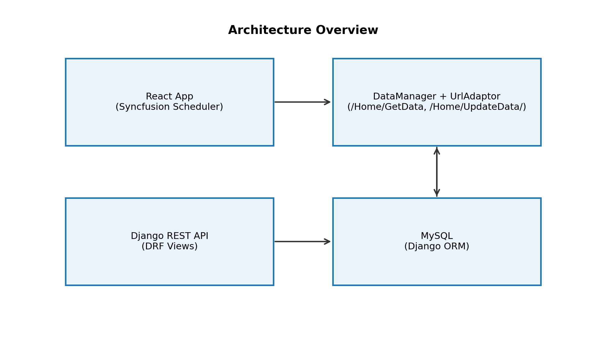
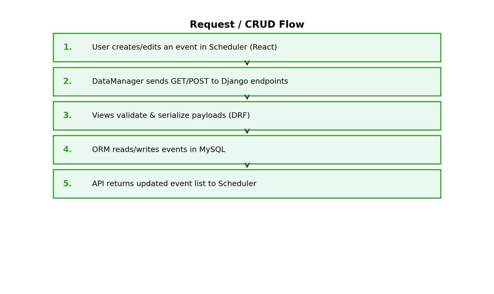
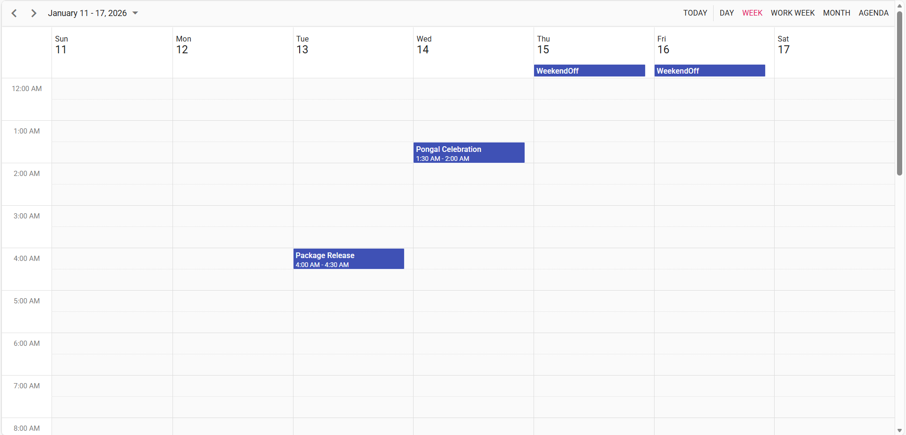
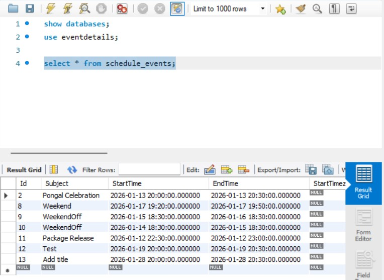

# Getting started with Syncfusion React Scheduler with Django

## 1. Introduction
This integration enables full CRUD (Create, Read, Update, Delete) operations for scheduling events using a web‑based application. It connects a React‑based Scheduler interface with a Django backend and a MySQL database to efficiently manage appointment and event data.
* Frontend: React JS for building an interactive Syncfusion Scheduler user interface
* Backend: Django application server providing APIs for data processing
* Data Access: MySQL database for storing scheduler and user information

Users can create, view, update, and delete scheduler appointments directly through the Scheduler user interface, ensuring efficient and reliable event management.

## 2. System Architecture 

```
React (Syncfusion Scheduler)
         │
         │  (DataManager + UrlAdaptor: /Home/GetData, /Home/UpdateData)
         ▼
Django REST API (DRF Views)
         │
         ▼
      MySQL (ORM)
```
### 2.1. CRUD / Request Flow



## 3. Prerequisites
Before getting started with the React application with Django and MySQL, ensure the following prerequisites are met:
* **Node.js ≥ 20.19.0**  
Required for optimal performance and full compatibility with MongoDB Node.js Driver v7.0 and modern ES features.
* **Python ≥ 3.10** 
Required for developing the Django backend and ensuring compatibility with modern Python features and libraries.
* **MySQL Server ≥ 8.0** 
MySQL is used as the relational database for storing scheduler and user‑related data with high efficiency and reliability.


## 4. Backend Setup (Django)

### 4.1. **Install Dependencies**




pip install django-cors-headers
pip install djangorestframework
pip install pymysql
pip install dj-database-url
pip install mysqlclient

#If mysqlclient fails to build, you can use PyMySQL as a fallback

pip install pymysql




> **Note:** On Linux, you may need MySQL dev headers:  
> Ubuntu/Debian: `sudo apt-get install default-libmysqlclient-dev`

### 4.2. **Create Project & App**
* Create a folder named `backend` and navigate into it.
     
     

     mkdir backend
     cd backend

     
     
 * Create a Django project named `scheduler` inside the `backend` folder.
     
     

     python -m django startproject scheduler .

     
     
 * Create a Django application named `schedulerCrud` used to implement CRUD operations.
     
     

     python manage.py startapp schedulerCrud

     
     

### 4.3. Database Configuration
Connect database with scheduler by edit `settings.py` inside `scheduler` folder and replace your `NAME` `USER` and `PASSWORD`  with your MySQL credentials


        
    
from pathlib import Path
    
    
BASE_DIR = Path(__file__).resolve().parent.parent
    
    
   
SECRET_KEY = 'django-insecure-^c3q05432&h%ugyf+z(p+51@q(v)y4eytfqw-z0iv8^hm6%=g+'
    
    
DEBUG = True
    
ALLOWED_HOSTS = []
    
    
    
INSTALLED_APPS = [
    'django.contrib.admin',
    'django.contrib.auth',
    'django.contrib.contenttypes',
    'django.contrib.sessions',
    'django.contrib.messages',
    'django.contrib.staticfiles',
    'corsheaders',
    'rest_framework',
    'schedulerCrud.apps.SchedulercrudConfig'
]
    
MIDDLEWARE = [
    'django.middleware.security.SecurityMiddleware',
    'django.contrib.sessions.middleware.SessionMiddleware',
    'django.middleware.common.CommonMiddleware',
    'django.middleware.csrf.CsrfViewMiddleware',
    'django.contrib.auth.middleware.AuthenticationMiddleware',
    'django.contrib.messages.middleware.MessageMiddleware',
    'django.middleware.clickjacking.XFrameOptionsMiddleware',
    'corsheaders.middleware.CorsMiddleware',
]
    
ROOT_URLCONF = 'scheduler.urls'
import os
    
TEMPLATES = [
    {
        'BACKEND': 'django.template.backends.django.DjangoTemplates',
        'DIRS': [os.path.join(BASE_DIR,'syncfusion-scheduler','build')],
        'APP_DIRS': True,
        'OPTIONS': {
            'context_processors': [
                'django.template.context_processors.debug',
                'django.template.context_processors.request',
                'django.contrib.auth.context_processors.auth',
                'django.contrib.messages.context_processors.messages',
            ],
        },
    },
]
    
WSGI_APPLICATION = 'scheduler.wsgi.application'
    
    
    
DATABASES = {
    'default': {
        'ENGINE': 'django.db.backends.mysql',
        'NAME': 'DatabaseName',
        'USER': 'UserName',
        'PASSWORD': 'Password',
        'HOST': 'localhost',   
        'PORT': '3306',
    }
}
    
    
    
AUTH_PASSWORD_VALIDATORS = [
    {
        'NAME': 'django.contrib.auth.password_validation.UserAttributeSimilarityValidator',
    },
    {
        'NAME': 'django.contrib.auth.password_validation.MinimumLengthValidator',
    },
    {
        'NAME': 'django.contrib.auth.password_validation.CommonPasswordValidator',
    },
    {
        'NAME': 'django.contrib.auth.password_validation.NumericPasswordValidator',
    },
]

    
LANGUAGE_CODE = 'en-us'

TIME_ZONE = 'UTC'

USE_I18N = True

USE_TZ = True
    
    
    
STATIC_URL = 'static/'
STATICFILES_URL = [BASE_DIR,'syncfusion-scheduler/build/static']

    
DEFAULT_AUTO_FIELD = 'django.db.models.BigAutoField'
CORS_ORIGIN_ALLOW_ALL = True
CORS_ALLOW_ALL_HEADERS=True




### 4.4 Define the Model
Add this code in `models.py` in `schedulerCrud` folder to create a table in database




from django.db import models

from django.db import models

class ScheduleEvents(models.Model):
    Id = models.IntegerField(primary_key=True)
    Subject = models.CharField(max_length=200, null=True, blank=True)
    StartTime = models.DateTimeField()
    EndTime = models.DateTimeField()
    StartTimezone = models.CharField(max_length=200, null=True, blank=True)
    EndTimezone = models.CharField(max_length=200, null=True, blank=True)
    Location = models.CharField(max_length=200, null=True, blank=True)
    Description = models.CharField(max_length=200, null=True, blank=True)
    IsAllDay = models.BooleanField()
    RecurrenceID = models.IntegerField(null=True, blank=True)
    FollowingID = models.IntegerField(null=True, blank=True)
    RecurrenceRule = models.CharField(max_length=200, null=True, blank=True)
    RecurrenceException = models.CharField(max_length=200, null=True, blank=True)
    IsReadonly = models.BooleanField(null=True, blank=True)
    IsBlock = models.BooleanField(null=True, blank=True)
    RoomID = models.IntegerField(null=True, blank=True)
    class Meta:
        db_table = 'schedule_events'
            



### 4.5 Create the Serializer

Create a `serializers.py` in `schedulerCrud` folder to converts the ScheduleEvents model data to JSON and validates incoming API data, allowing the Django REST Framework to handle create, read, update, and delete operations




from rest_framework import serializers
from schedulerCrud.models import ScheduleEvents
    
class ScheduleEventsSerializer(serializers.ModelSerializer):
    class Meta:
        model = ScheduleEvents
        fields = "__all__"




### 4.6 Build the Views (CRUD)

**Add this code in `views.py` in `schedulerCrud` folder in `backend` to processes Scheduler CRUD requests by creating, updating, or deleting events**




from django.views.decorators.csrf import csrf_exempt
from rest_framework.parsers import JSONParser
from django.http.response import JsonResponse
from schedulerCrud.serializers import ScheduleEventsSerializer
from schedulerCrud.models import ScheduleEvents

@csrf_exempt
def GetData(request):

schedule_events = ScheduleEvents.objects.all()
schedule_events_serializer=ScheduleEventsSerializer(schedule_events,many=True)
return JsonResponse(schedule_events_serializer.data,safe=False)

@csrf_exempt
def UpdateData(request):
if request.method == 'POST':
    data = JSONParser().parse(request)
    if 'added' in data and len(data['added']) > 0:
        schedule_events_data = data['added'][0]  # Get the first event from the 'added' list
        schedule_events_serializer = ScheduleEventsSerializer(data=schedule_events_data)
        if schedule_events_serializer.is_valid():
            schedule_events_serializer.save()
            return GetData(request)            
        else:
                    return JsonResponse(schedule_events_serializer.errors, safe=False, status=400)
    elif 'changed' in data and len(data['changed']) > 0:
        for item in data['changed']:
            event = ScheduleEvents.objects.get(pk=item['Id'])
            schedule_events_serializer = ScheduleEventsSerializer(event, data=item)
            if schedule_events_serializer.is_valid():
                schedule_events_serializer.save()
                return GetData(request)
            else:
                return JsonResponse(schedule_events_serializer.errors, safe=False, status=400)
                return JsonResponse("Updated Successfully", safe=False)
    elif 'deleted' in data and len(data['deleted']) > 0:
        for item in data['deleted']:
            event = ScheduleEvents.objects.get(pk=item['Id'])
            event.delete()
        return GetData(request)
    else:
        return JsonResponse({"error": "No events to add, update or delete"}, status=400)
else:
    return JsonResponse({"error": "Invalid method"}, status=405)
        
    




### 4.7 URL Routing
URL routing is responsible for mapping incoming HTTP requests to their corresponding view functions.

Edit `urls.py` file inside `scheduler` folder



from django.urls import path, re_path
from schedulerCrud import views
from django.contrib import admin

urlpatterns = [
    path('Home/GetData', views.GetData),
    path('Home/UpdateData/', views.UpdateData),
    path('admin/', admin.site.urls),
]




Create a `urls.py` in `schedulerCrud` folder 




from django.urls import path
from . import views

urlpatterns = [
    path('', views.index, name='index'),
]





### 4.8. App Configuration
Add this code in top of `SchedulercrudConfig` class in `apps.py` in `schedulerCrud` folder to overflow in large datasets. 




  
from django.apps import AppConfig
class SchedulercrudConfig(AppConfig):
    default_auto_field = 'django.db.models.BigAutoField'
    name = 'schedulerCrud'        
    



### 4.9 Migrating & Running Server
Run the following commands to generate database migration files and create tables in the configured database.




  
python manage.py makemigrations
python manage.py migrate        
    

   

Start the Backend Server by 




python manage.py runserver       
    



Server started running on `http://localhost:8000` 

### 4.10 **Backend Folder Structure**

```
    ├── backend                             
    |   ├── scheduler   
    |   │    ├── _init_.py
    |   │    ├── asgi.py
    |   │    ├── settings.py                
    |   │    ├── urls.py
    |   │    ├── wsgi.py
    |   ├── schedulerCrud  
    |   │    ├── migrations
    |   │    │    ├──  _init_.py 
    |   │    ├── _init_.py
    |   │    ├── admin.py
    |   │    ├── apps.py
    |   │    ├── models.py                 
    |   │    ├── serializers.py
    |   │    ├── tests.py
    |   │    ├── urls.py
    |   │    ├── views.py                  
    |   ├── manage.py 
```


## 5.Frontend Setup(React + Syncfusion Scheduler)

### 5.1. Create react application
create a new react application, use one of the commands that are specific to either NPM or Yarn.




npm create vite@latest ej2-react-schedule -- --template react-ts




yarn create vite ej2-react-schedule --template react-ts




Using one of the above commands will lead you to create a react app name `ej2-react-schedule`

Confirm Additional Vite Options




√ Use rolldown-vite (Experimental)?: » **No**   
√ Install with npm and start now? » **No**  
    




### 5.2. Install Syncfusion<sup style="font-size:70%">&reg;</sup> React packages

To install the React Schedule component, use the following command:




cd ej2-react-schedule
npm install @syncfusion/ej2-react-schedule --save




cd ej2-react-schedule
yarn add @syncfusion/ej2-react-schedule




### 5.3. **Adding CSS reference**

Add scheduler component's styles as given below in `src/App.css`:



@import "../node_modules/@syncfusion/ej2-base/styles/tailwind3.css";
@import "../node_modules/@syncfusion/ej2-buttons/styles/tailwind3.css";
@import "../node_modules/@syncfusion/ej2-calendars/styles/tailwind3.css";
@import "../node_modules/@syncfusion/ej2-dropdowns/styles/tailwind3.css";
@import "../node_modules/@syncfusion/ej2-inputs/styles/tailwind3.css";
@import "../node_modules/@syncfusion/ej2-lists/styles/tailwind3.css";
@import "../node_modules/@syncfusion/ej2-navigations/styles/tailwind3.css";
@import "../node_modules/@syncfusion/ej2-popups/styles/tailwind3.css";
@import "../node_modules/@syncfusion/ej2-splitbuttons/styles/tailwind3.css";
@import "../node_modules/@syncfusion/ej2-react-schedule/styles/tailwind3.css";




> To refer `App.css` in the application then import it in the `src/App.tsx` file.

### 5.4. Add Scheduler Component in the React Application.

Replace code in `App.tsx` file in `src` folder to define schedule component:




import React from 'react';
import './App.css';
import { ScheduleComponent, Day, Week, WorkWeek, Month, Agenda, Inject, DragAndDrop, Resize } from '@syncfusion/ej2-react-schedule';
import { DataManager, UrlAdaptor } from '@syncfusion/ej2-data';

function App() {
    return (
      <ScheduleComponent eventSettings={{ dataSource: dataManager }}>
        <Inject services={[Day, Week, WorkWeek, Month, Agenda, DragAndDrop, Resize]}/>
      </ScheduleComponent>
    );
}

export default App;




### 5.6. Connecting to Backend
Add this code in function `App` in `App.tsx` file in `src` connects the Syncfusion React Scheduler with the backend to perform data fetch and CRUD operations




import React from 'react';
import './App.css';
import { ScheduleComponent, Day, Week, WorkWeek, Month, Agenda, Inject, DragAndDrop, Resize } from '@syncfusion/ej2-react-schedule';
import { DataManager, UrlAdaptor } from '@syncfusion/ej2-data';

function App() {
    let dataManager: DataManager = new DataManager({
    url: 'http://127.0.0.1:8000/Home/GetData',
    crudUrl: 'http://127.0.0.1:8000/Home/UpdateData/',
    adaptor: new UrlAdaptor(),
    crossDomain: true
    });
    return (
      <ScheduleComponent eventSettings={{ dataSource: dataManager }}>
        <Inject services={[Day, Week, WorkWeek, Month, Agenda, DragAndDrop, Resize]}/>
      </ScheduleComponent>
    );
}

export default App;




 **Note**: If anything is already running on port 8000, change Url and CrudURL to another available port.Make sure your backend actually listens on the port you choose.

### 5.7 Install the dependencies and Run the Frontend
Install the required dependencies and launch the React server.




npm install
npm run dev




yarn install
yarn dev




Server started running on `http://localhost:5173` 

> Update CORS (`CORS_ALLOWED_ORIGINS`) if you use a different port.


## 6. Output

*Image illustrating the Syncfusion React Scheduler*


*Image illustrating the events of Syncfusion React Scheduler in MySQL*

## 7.Troubleshooting
**MySQL connection errors**
- Verify credentials & port in `settings.py`.
- Confirm DB exists: `CREATE DATABASE scheduler_db;`.

**CORS errors**
- Add your frontend origin to `CORS_ALLOWED_ORIGINS`.
- Restart Django server after changes.

**Migrations didn't create table**
- Ensure `schedulerCrud` in `INSTALLED_APPS`.
- Run `makemigrations` then `migrate`.
- Check model's `db_table` name.

**DataManager 500 errors**
- Inspect Django console for stack traces.
- Ensure `UpdateData` handles `added/changed/deleted` lists.
- Validate `Id` uniqueness when adding events.

To learn more about the functionality of the Schedule component, refer to the [documentation](https://ej2.syncfusion.com/react/documentation/schedule/getting-started#module-injection).

> [View the Django with Schedule sample in the GitHub repository](https://github.com/SyncfusionExamples/react-scheduler-crud-django-mysql).