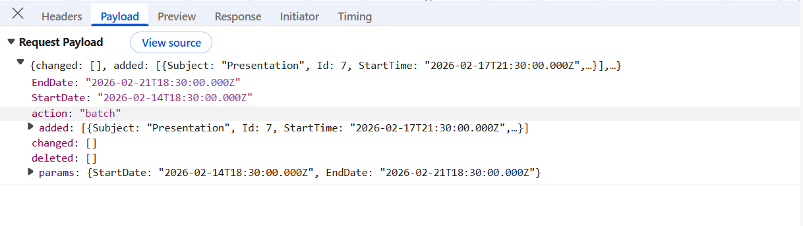
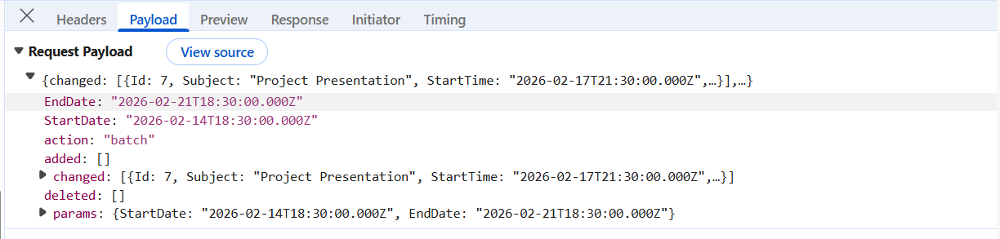
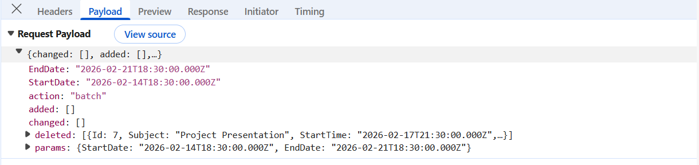

# Syncfusion React Scheduler with Django REST Framework (DRF)

The Syncfusion [React Scheduler](https://ej2.syncfusion.com/react/documentation/schedule/getting-started) combined with Django REST Framework and MySQL provides a robust, scalable data‑driven application architecture. The Syncfusion React Scheduler delivers a rich, high‑performance client‑side experience.

**What is Django REST Framework?**

[Django](https://docs.djangoproject.com/en/6.0) is a high‑level Python web framework used to build secure and scalable backend applications quickly. It includes built‑in features such as database ORM, URL routing, authentication, and security, allowing developers to focus on application logic instead of repetitive setup.

[Django REST Framework (DRF)](https://www.django-rest-framework.org/) extends Django to build RESTful APIs that return data in JSON format. It simplifies creating APIs with support for serializers, authentication, and CRUD operations, making it well suited for frontend applications like React.

**What is MySQL?**

MySQL is an open‑source relational database management system (RDBMS) used to store and manage structured data efficiently. It enables applications to perform core database operations such as creating, reading, updating, and deleting data using SQL, making it a popular choice for web applications, enterprise systems, and backend services. MySQL is known for its reliability, performance, scalability, and ease of integration with modern programming languages and frameworks.

## Prerequisites

- **Node.js** LTS (v20.19.6+), npm/yarn.
- **React** 18+ (Vite).
- **Python** 3.11+.
- **Django** 5.2+, **Django REST Framework**.
- **MySQL** 5.7+.

## Setting up the Django REST Framework for MySQL

The Django REST Framework backend serves as the core data service, managing API requests that provide the data powering the Syncfusion React Scheduler.

### Step 1: Set up the Django REST Framework server and install required packages

**Instructions:**
1. Open a terminal (for example, an integrated terminal in Visual Studio Code or Windows Command prompt opened with <kbd>Win+R</kbd>, or macOS Terminal launched with <kbd>Cmd+Space</kbd> ).

2. Before creating the `Django` project, Create a folder named `backend` and set up a virtual environment. A virtual environment keeps project dependencies isolated, ensuring that package installations do not affect other projects.

    The following commands create and activate the environment:

    ```bash
    mkdir backend
    cd backend
    python -m venv .venv
    .venv\Scripts\activate   # Mac/Linux: source .venv/bin/activate
    ```
3. Once the virtual environment is active, install the required packages for Django REST Framework and MySQL support:

    ```bash
    pip install django-cors-headers djangorestframework pymysql dj-database-url mysqlclient
    ```
    - `mysqlclient` enables `Django` to connect to MySQL using `native C` extensions.
    - For `Django` settings reference, see [databases](https://docs.djangoproject.com/en/6.0/ref/settings/#databases).

4. Initialize the `Django` project and Application:

    For this guide, a `Django` project named **scheduler** is created, along with a new application module, using the following commands:

    ```bash
    python -m django startproject scheduler .
    python manage.py startapp schedulerCrud
    ```
The **schedulerCrud** folder is now created. This initializes the project structure and creates the scheduler app, which will contain the models, views, and API logic for the Django REST Framework backend.

### Step 2: Configure Django settings

The file **scheduler/settings.py** is automatically generated when a Django project is created.

This step updates the file to establish the MySQL connection and enable essential Django REST Framework features such as CORS and REST APIs.

**Instructions:**

1. Open the **scheduler/settings.py** file.
2. Define the MySQL database connection: 

    The **DATABASES** section configure Django to connect to MySQL.

    [settings.py]

    ```python
    DATABASES = {
        "default": {
            "ENGINE": "django.db.backends.mysql",
            "NAME": "eventsdb",
            "USER": "django_user",
            "PASSWORD": "Django@123",
            'HOST': 'localhost',   # Or an IP Address that your DB is hosted on
            'PORT': '3306',
            },
        }
    ```
    **Line breakdown:**
    - **ENGINE**: Database backend; for MySQL in Django, set to `"django.db.backends.mysql"`. This tells Django to use the MySQL database engine.
    - **NAME**: Name of the MySQL database to connect to (e.g., **eventsdb**).
    - **USER**: MySQL database user that Django will use to authenticate (e.g., **django_user**).
    - **PASSWORD**: Password for the specified MySQL user.
    - **HOST**: Hostname or IP address where the MySQL server is running (commonly **localhost** for local development).
    - **PORT**: Port number on which the MySQL server listens (default is **3306**).


3. Add required applications:

    Add the required packages to the **INSTALLED_APPS** list to enable REST APIs, CORS, and the schedulerCrud application:

    [settings.py]

    ```python
    INSTALLED_APPS = [
        'django.contrib.admin',
        'django.contrib.auth',
        'django.contrib.contenttypes',
        'django.contrib.sessions',
        'django.contrib.messages',
        'django.contrib.staticfiles',
        'corsheaders',
        'rest_framework',
        'schedulerCrud.apps.SchedulercrudConfig'
    ]
    ```
    **Purpose of key apps:**
    - **rest_framework** - Core Django REST Framework functionality support.
    - **corsheaders** - Cross‑origin access for frontend frameworks.
    - **schedulerCrud** - Handles the backend logic for creating, reading, updating, and deleting scheduler-related data (events) and exposes these operations through REST APIs.


4. Configure middleware:

    Middleware processes incoming requests.

    [settings.py]

    ```python
    MIDDLEWARE = [
        'corsheaders.middleware.CorsMiddleware',
        'django.middleware.security.SecurityMiddleware',
        'django.contrib.sessions.middleware.SessionMiddleware',
        'django.middleware.common.CommonMiddleware',
        'django.contrib.auth.middleware.AuthenticationMiddleware',
        'django.contrib.messages.middleware.MessageMiddleware',
        'django.middleware.clickjacking.XFrameOptionsMiddleware',
    ]
    ```
    > Place "CORS" middleware near the top so preflight requests are handled correctly.

5. Enable "CORS" for the React development server:

    Add the React dev origin so the browser can call the API during development.

    [settings.py]

    ```python
    CORS_ALLOWED_ORIGINS = [
        "http://localhost:5173",
    ]
    ```
    This prevents cross‑origin access errors while the frontend calls backend APIs during development.

### Step 3: Define models

A Django model defines the way data is stored and accessed in the database. Each model maps to a database table and exposes its fields as structured records that can be queried, created, updated, and deleted by the application and API.

**Instructions:**
1. Open the (**schedulerCrud/models.py**) file. This file contains the model definitions for the scheduler app.

2. Add the "ScheduleEvents" model.

    The model describes the table structure, including fields for Id, Subject, StartTime, EndTime and Description.

    [schedulerCrud/models.py]

    ```python

    from django.db import models

    class ScheduleEvents(models.Model):
        Id = models.IntegerField(primary_key=True)
        Subject = models.CharField(max_length=200, null=True, blank=True)
        StartTime = models.DateTimeField()
        EndTime = models.DateTimeField()
        StartTimezone = models.CharField(max_length=200, null=True, blank=True)
        EndTimezone = models.CharField(max_length=200, null=True, blank=True)
        Location = models.CharField(max_length=200, null=True, blank=True)
        Description = models.CharField(max_length=200, null=True, blank=True)
        IsAllDay = models.BooleanField()
        RecurrenceID = models.IntegerField(null=True, blank=True)
        FollowingID = models.IntegerField(null=True, blank=True)
        RecurrenceRule = models.CharField(max_length=200, null=True, blank=True)
        RecurrenceException = models.CharField(max_length=200, null=True, blank=True)
        IsReadonly = models.BooleanField(null=True, blank=True)
        IsBlock = models.BooleanField(null=True, blank=True)
        
        class Meta:
            db_table = 'schedule_events'
    ```

3. Create database migrations:

    Django migrations are the mechanism that convert model definitions into real MySQL tables and columns. Whenever a model is created or modified, migrations ensure the database structure stays updated.

    - **Generate a new migration**

        Open the Visual Studio Code Terminal, navigate to the `backend` folder and run the following command:

        ```bash
            python manage.py makemigrations
        ```
        **Explanation:**
        - Scans the **models.py** file for any new or updated models.
        - Creates a migration file inside the (**schedulerCrud/migrations**) folder.
        - This migration file acts as a blueprint describing the required database changes.

    - **Apply the migration to the database**

        After the migration file is created, run the next command:

        ```bash
            python manage.py migrate
        ```
        **Explanation:**
        - Reads the migration blueprint created earlier.
        - Creates the required MySQL tables.
        - Adds all fields defined in the model.
        - Updates or modifies existing tables if the model structure changed.

        This step updates the actual database and ensures the structure matches the "ScheduleEvents" model.

    - **Purpose of migrations:**
        
        Migrations act as a bridge between the `Python` models and the MySQL database.
        - Every change in a model (new field, renamed field, removed field, new model) is recorded as a migration.
        - These changes are applied safely without writing SQL manually.
        - The database structure remains consistent across all environments (development, staging, production).
        - Whenever a model is modified in the future:
            ```bash
                makemigrations → migrate
            ```
    This sequence updates the database schema automatically.

### Step 4: Configure API routing

API routing defines the URLs through which the application exposes CRUD operations for schedule-events records.

A Django REST Framework router automatically generates RESTful routes for the scheduler application, allowing the API to handle retrieving, creating, updating, and deleting records under a single endpoint.

**Instructions:**
1. Open the following auto generated file named (**scheduler/urls.py**). This file controls all top‑level routes in the Django project.

2. Register the "GetData" and "UpdateData" with a Django REST Framework router:

    [scheduler/urls.py]

    ```python

    from django.urls import path, re_path
    from schedulerCrud import views
    from django.contrib import admin

    # urls.py
    urlpatterns = [
        path('Home/GetData', views.GetData),
        path('Home/UpdateData', views.UpdateData),
        path('admin/', admin.site.urls),
    ]
    ```

### Step 5: Serializer implementation

1. Create the serializer that converts ScheduleEvents model instances to/from JSON and validates incoming API data. This enables Django REST Framework to reliably handle create, read, update, and delete operations.

2. Create a following file named **serializers.py** in **schedulerCrud** folder.

    [schedulerCrud/serializers.py]

    ```python
    from rest_framework import serializers
    from schedulerCrud.models import ScheduleEvents

    class ScheduleEventsSerializer(serializers.ModelSerializer):
        class Meta:
            model = ScheduleEvents
            fields = '__all__'
    ```
### Step 6: View implementation

The final part is the Views, which receives all incoming requests and routes them to the appropriate custom services. Update (**schedulerCrud/views.py**) with the following code to properly wire all services to the views:

[schedulerCrud/views.py]
```python
from rest_framework.parsers import JSONParser
from django.http.response import JsonResponse
from schedulerCrud.serializers import ScheduleEventsSerializer
from schedulerCrud.models import ScheduleEvents

def GetData(request):
    
        schedule_events = ScheduleEvents.objects.all()
        schedule_events_serializer=ScheduleEventsSerializer(schedule_events,many=True)
        return JsonResponse(schedule_events_serializer.data,safe=False)

def UpdateData(request):
    if request.method == 'POST':
        data = JSONParser().parse(request)
        if 'added' in data and len(data['added']) > 0:
            for item in data['added']:
                schedule_events_serializer = ScheduleEventsSerializer(data=item)
                if schedule_events_serializer.is_valid():
                    schedule_events_serializer.save()
                else:
                    return JsonResponse(schedule_events_serializer.errors, safe=False, status=400)

        if 'changed' in data and len(data['changed']) > 0:
            for item in data['changed']:
                event = ScheduleEvents.objects.get(pk=item['Id'])
                schedule_events_serializer = ScheduleEventsSerializer(event, data=item)
                if schedule_events_serializer.is_valid():
                    schedule_events_serializer.save()
                else:
                    return JsonResponse(schedule_events_serializer.errors, safe=False, status=400)

        if 'deleted' in data and len(data['deleted']) > 0:
            for item in data['deleted']:
                event = ScheduleEvents.objects.get(pk=item['Id'])
                event.delete()
        
        return GetData(request)

    else:
        return JsonResponse({"error": "Invalid method"}, status=405)
    

```

## Integrate Syncfusion React Scheduler with Django REST Framework

The Syncfusion React Scheduler is a powerful, high‑performance component designed to display and manage time‑based data such as appointments, meetings, and events. It provides rich scheduling capabilities, including multiple calendar views, event editing, recurring events, drag‑and‑drop interactions, and date‑based navigation. Follow these steps to render the Scheduler and integrate it with a Django backend for seamless event management.

### Step 1 : Creating the React Schedule application

Create a new React application using `create vite@latest`, which provides a faster development environment, smaller bundle sizes, and optimized builds.

Open a Visual Studio Code terminal or Command prompt and run the below command:

```bash
npm create vite@latest Schedule -- --template react-ts
cd Schedule
```
This command creates a React application named **Schedule** with the essential folder structure and files required to begin development immediately.

The integration process begins by installing the required Syncfusion React Scheduler packages before establishing the DRF API.

### Step 2: Install Syncfusion Scheduler packages

Install the necessary Syncfusion packages using the below command in Visual Studio Code terminal or Command prompt:

```bash
npm install @syncfusion/ej2-react-schedule --save
```
- **@syncfusion/ej2-react-schedule** – Required package for integrating the Syncfusion Scheduler component in React.

### Step 3: Including required Syncfusion stylesheets

Once the dependencies are installed, the required CSS files are made available in the (**../node_modules/@syncfusion**) package directory, and the corresponding CSS references are included in the **App.css** file.

[src/App.css]

```css

@import "../node_modules/@syncfusion/ej2-base/styles/tailwind3.css";
@import "../node_modules/@syncfusion/ej2-buttons/styles/tailwind3.css";
@import "../node_modules/@syncfusion/ej2-calendars/styles/tailwind3.css";
@import "../node_modules/@syncfusion/ej2-dropdowns/styles/tailwind3.css";
@import "../node_modules/@syncfusion/ej2-inputs/styles/tailwind3.css";
@import "../node_modules/@syncfusion/ej2-lists/styles/tailwind3.css";
@import "../node_modules/@syncfusion/ej2-navigations/styles/tailwind3.css";
@import "../node_modules/@syncfusion/ej2-popups/styles/tailwind3.css";
@import "../node_modules/@syncfusion/ej2-splitbuttons/styles/tailwind3.css";
@import "../node_modules/@syncfusion/ej2-react-schedule/styles/tailwind3.css";
```

For this project, the `tailwind3` theme is used. A different theme can be selected or the existing theme can be customized based on project requirements. Refer to the [Syncfusion React Components Appearance](https://ej2.syncfusion.com/react/documentation/appearance/theme) documentation to learn more about theming and customization options.

### Step 4: Configure DataManager with Django REST Framework (DRF)

The Syncfusion [DataManager](https://ej2.syncfusion.com/react/documentation/data/getting-started) acts as a communication layer between the React Scheduler and backend services. It sends all Scheduler operations—such as reading data and performing CRUD actions to the server in a standardized format.

The [UrlAdaptor](https://ej2.syncfusion.com/react/documentation/data/adaptors/url-adaptor) is a built‑in adaptor that formats requests for REST-style endpoints, like the Django REST Framework API. It serializes all Scheduler actions and posts them to the DRF API endpoint, then processes the JSON responses returned by the server.

When using `DataManager` with `UrlAdaptor`, the server is expected to return a specific response structure:

- **result**: The list of data displayed in the current view, supporting on‑demand loading for large datasets.

This response format ensures seamless interaction between the React Scheduler and backend services, enabling all data operations to work consistently.

**Instructions:**
1. Open the **App.tsx** file.
2. Create a `DataManager` instance with the `UrlAdaptor` inside the React component and point it to the DRF endpoint. This `DataManager` will serialize all Scheduler interactions (data and CRUD) and post them to the DRF server.

    [App.tsx]

    ```ts
    import { DataManager, UrlAdaptor } from '@syncfusion/ej2-data';

    let dataManager: DataManager = new DataManager({
      url: 'http://127.0.0.1:8000/Home/GetData',
      crudUrl: 'http://127.0.0.1:8000/Home/UpdateData',
      adaptor: new UrlAdaptor(),
      crossDomain: true
    });

    ```
    **Explanation:**
    - **url** – Base API endpoint used to **fetch data**. This endpoint returns the initial dataset displayed in the component (e.g., a `GET` request to retrieve records).
    - **crudUrl** – API endpoint used to perform **Create, Update, and Delete** operations. Insert, update, and delete requests are sent to this URL (often via `POST` with action-specific payloads).
    - **adaptor** – Specifies how component operations are translated into HTTP requests.
      - `UrlAdaptor` converts scheduler operations into **standard REST-like requests** compatible with typical backends (e.g., Django/ASP.NET/Node).
    - **crossDomain** – Enables communication with a backend running on a different port.

3. Configure the Scheduler Component.

    [App.tsx]

    ```ts

    import React from 'react';
    import './App.css';
    import { ScheduleComponent, Day, Week, WorkWeek, Month, Agenda, Inject, DragAndDrop, Resize, type EventSettingsModel } from '@syncfusion/ej2-react-schedule';


    function App() {
      const eventSettings: EventSettingsModel= { dataSource: dataManager };
      return (
        <ScheduleComponent eventSettings={eventSettings} height="650px">
          <Inject services={[Day, Week, WorkWeek, Month, Agenda, DragAndDrop, Resize]}/>
        </ScheduleComponent>
      );
    }

    export default App;
    ```
## Performing CRUD operations

The Scheduler Application provides full CRUD (Create, Read, Update, Delete) capabilities for managing scheduling data. Users can create new schedule entries, modify existing records, or remove events. All operations are processed through the application’s interface and are reliably persisted to the backend database via Django REST Framework (DRF), ensuring accurate and up‑to‑date scheduling information across the system.

### Insert

**Insert** creates a new **schedule event** in the database using the values provided from the Scheduler.

```python

def UpdateData(request):
    if request.method == 'POST':
        data = JSONParser().parse(request)
        
        if 'added' in data and len(data['added']) > 0:
            for item in data['added']:
                schedule_events_serializer = ScheduleEventsSerializer(data=item)
                if schedule_events_serializer.is_valid():
                    schedule_events_serializer.save()
                else:
                    return JsonResponse(schedule_events_serializer.errors, safe=False, status=400)

        return GetData(request)

    else:
        return JsonResponse({"error": "Invalid method"}, status=405)
``` 
**Explanation:**
- When a user creates a new event in the Scheduler, it posts a payload that includes an added array with one or more new event objects.
- On the server, each object in added is validated by ScheduleEventsSerializer and saved inside a transaction to ensure consistency.
- After creation, the endpoint returns the latest event list, allowing the Scheduler to immediately show the server‑authoritative data (including any database defaults).

**Below image shows the inserted data passed to the DRF:**




### Update

**Update** modifies an existing **schedule event** using the edited values sent from the Scheduler.

```python

def UpdateData(request):
    if request.method == 'POST':
        data = JSONParser().parse(request)

        if 'changed' in data and len(data['changed']) > 0:
            for item in data['changed']:
                event = ScheduleEvents.objects.get(pk=item['Id'])
                schedule_events_serializer = ScheduleEventsSerializer(event, data=item)
                if schedule_events_serializer.is_valid():
                    schedule_events_serializer.save()
                else:
                    return JsonResponse(schedule_events_serializer.errors, safe=False, status=400)

        return GetData(request)

    else:
        return JsonResponse({"error": "Invalid method"}, status=405)
``` 

**Explanation:**

- The endpoint locates the target event by its primary key Id.
- The serializer validates the new values and writes changes atomically within the same transaction as inserts.
- The endpoint returns the refreshed dataset so the Scheduler remains synchronized with server data.

**Below image shows the updated data passed to the DRF:**



### Delete:

**Delete** removes an existing **schedule event** identified by its primary key sent by the Scheduler.

```python

def UpdateData(request):
    if request.method == 'POST':
        data = JSONParser().parse(request)

        if 'deleted' in data and len(data['deleted']) > 0:
            for item in data['deleted']:
                event = ScheduleEvents.objects.get(pk=item['Id'])
                event.delete()
        
        return GetData(request)

    else:
        return JsonResponse({"error": "Invalid method"}, status=405)
``` 

**Explanation**:

- The Scheduler posts a deleted array with one or more items containing the identifier Id.
- The endpoint deletes each matching event inside the same transaction, ensuring the operation is consistent with any other changes posted together.
- After deletion, the endpoint returns the updated event list for immediate UI refresh.

**Below image shows the deleted key passed to the DRF:**



## Running the application

Open a terminal or Command prompt. Start the backend server first, and then run the React Schedule.

### Run the backend

Run the following commands to start the server:

```bash
python manage.py makemigrations
python manage.py migrate
python manage.py runserver 8000
```

### Run the schedule

Execute the below commands to run the Scheduler application:

```bash
npm run dev
```

> Please find the sample in this [GitHub location](https://github.com/SyncfusionExamples/react-scheduler-crud-django-mysql).


## Summary

This guide walks through the following key areas:

1. Prerequisites. [🔗](#prerequisites)  
2. Setting up the Django REST Framework for MySQL. [🔗](#setting-up-the-django-rest-framework-for-mysql)
3. Create and configure the React application with the Syncfusion React Scheduler. [🔗](#integrate-syncfusion-react-scheduler-with-django-rest-framework)
4. Performing CRUD operations. [🔗](#performing-crud-operations)
5. Run the Django and React applications locally for development. [🔗](#running-the-application) 

The application now offers a reliable, scalable solution for managing scheduler events with a robust Django REST API on MySQL and a Syncfusion React Scheduler front end.
