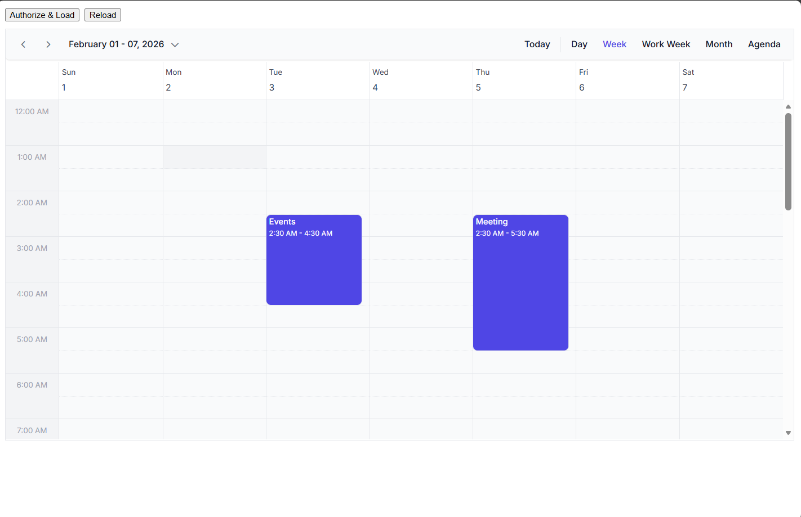

# Integrating Syncfusion React Scheduler with Google Calendar — CRUD

This section shows how to connect Syncfusion’s React Scheduler to Google Calendar (Google Calendar API + Google Identity Services) and implement full CRUD (create, read, update, delete) for events.


What you’ll get:

Google Cloud + React setup (Vite example)
A small client-side Google Calendar service using GIS token flow
Mapping helpers between Google events ⇄ Syncfusion Scheduler events
A React Scheduler component wired to read + persist CRUD
Practical notes: all-day events, time zones, pagination, error handling, token expiry

---

## Prerequisites

- Node.js >= 14 and npm (or Yarn)
- A Google account and access to Google Cloud Console

---

## High-level flow

1. Scheduler displays events using data from Google Calendar.
2. The app uses Google Identity Services (GIS) to obtain short-lived access tokens.
3. CRUD operations from Scheduler are converted into Google Calendar API calls.
4. After each successful operation, reload (or reconcile) events from Google.

---

## 1) Create Google Cloud credentials

1. Open https://console.cloud.google.com and select/create a project.
2. Enable the **Google Calendar API**: APIs & Services → Library → search "Calendar" → Enable.
3. Configure OAuth consent screen (External or Internal depending on your audience).
4. Create OAuth 2.0 credentials: APIs & Services → Credentials → Create Credentials → OAuth client ID → Web application.
   - Add Authorized JavaScript origins such as `http://localhost:3000`.
   - Save the `client_id` value.

---

## 2) Create React project and install Syncfusion Scheduler

```bash
npx create-react-app sf-react-gcal
cd sf-react-gcal
npm install @syncfusion/ej2-react-schedule
```

(If you use Yarn, replace `npm install` with `yarn add`.)

---

## 3) Add Google Identity script

 Add the GIS script in the `<head>` section of `src/index.html` file:

```html
<script src="https://accounts.google.com/gsi/client" async defer></script>
```

---

## 4)Add the Syncfusion CSS References

Edit `src/index.js` file.

```css
import '@syncfusion/ej2-base/styles/tailwind3.css';
import '@syncfusion/ej2-buttons/styles/tailwind3.css';
import '@syncfusion/ej2-calendars/styles/tailwind3.css';
import '@syncfusion/ej2-dropdowns/styles/tailwind3.css';
import '@syncfusion/ej2-inputs/styles/tailwind3.css';
import '@syncfusion/ej2-lists/styles/tailwind3.css';
import '@syncfusion/ej2-popups/styles/tailwind3.css';
import '@syncfusion/ej2-navigations/styles/tailwind3.css';
import '@syncfusion/ej2-react-schedule/styles/tailwind3.css';
```

## 5) Add .env file

Create a `.env` file to configure the google calendar credentials:

```env
REACT_APP_GOOGLE_CLIENT_ID=YOUR_CLIENT_ID.apps.googleusercontent.com
REACT_APP_CALENDAR_ID=YOUR_CALENDAR_ID
```

---

## 6) Build a Google Calendar service
A utility service that authenticates with Google (GIS OAuth) and performs CRUD operations on Google Calendar events via the Calendar v3 REST API.

Create `src/services/googleCalendarService.js`.

```js
const CLIENT_ID = process.env.REACT_APP_GOOGLE_CLIENT_ID;
const CALENDAR_ID = process.env.REACT_APP_CALENDAR_ID || 'primary';

console.log('CLIENT_ID from env:', CLIENT_ID);


export class GoogleCalendarService {
  constructor() {
    this.token = null;
    this.tokenClient = null;
  }

  async ensureGisReady() {
    const ready = () => !!window.google?.accounts?.oauth2;
    if (ready()) return;

    await new Promise((resolve) => {
      const poll = setInterval(() => {
        if (ready()) {
          clearInterval(poll);
          resolve();
        }
      }, 100);
    });
  }

  initTokenClient(onToken) {
    if (this.tokenClient) return this.tokenClient;

    this.tokenClient = window.google.accounts.oauth2.initTokenClient({
      client_id: CLIENT_ID,
      scope: 'openid email profile https://www.googleapis.com/auth/calendar',
      callback: (resp) => {
        if (resp?.access_token) {
          this.token = resp.access_token;
          onToken(this.token);
        }
      }
    });

    return this.tokenClient;
  }

  async requestAccessToken() {
    await this.ensureGisReady();

    return new Promise((resolve) => {
      const client = this.initTokenClient((t) => resolve(t));
      client.requestAccessToken();
    });
  }

  requireToken() {
    if (!this.token) throw new Error('No token. Call requestAccessToken() first.');
    return this.token;
  }

  async listEvents() {
    const token = this.requireToken();

    const url = new URL(
      `https://www.googleapis.com/calendar/v3/calendars/${encodeURIComponent(CALENDAR_ID)}/events`
    );
    url.searchParams.set('singleEvents', 'true');
    url.searchParams.set('orderBy', 'startTime');
    url.searchParams.set('maxResults', '2500');

    const res = await fetch(url.toString(), {
      headers: { Authorization: `Bearer ${token}` }
    });

    if (!res.ok) throw new Error(`List failed: ${res.status}`);
    const data = await res.json();
    return data.items || [];
  }

  async createEvent(resource) {
    const token = this.requireToken();

    const url = `https://www.googleapis.com/calendar/v3/calendars/${encodeURIComponent(CALENDAR_ID)}/events`;

    const res = await fetch(url, {
      method: 'POST',
      headers: {
        Authorization: `Bearer ${token}`,
        'Content-Type': 'application/json'
      },
      body: JSON.stringify(resource)
    });

    if (!res.ok) throw new Error(`Create failed: ${res.status}`);
    return res.json();
  }

  async updateEvent(eventId, resource) {
    const token = this.requireToken();

    const url = `https://www.googleapis.com/calendar/v3/calendars/${encodeURIComponent(CALENDAR_ID)}/events/${encodeURIComponent(eventId)}`;

    const res = await fetch(url, {
      method: 'PATCH',
      headers: {
        Authorization: `Bearer ${token}`,
        'Content-Type': 'application/json'
      },
      body: JSON.stringify(resource)
    });

    if (!res.ok) throw new Error(`Update failed: ${res.status}`);
    return res.json();
  }

  async deleteEvent(eventId) {
    const token = this.requireToken();

    const url = `https://www.googleapis.com/calendar/v3/calendars/${encodeURIComponent(CALENDAR_ID)}/events/${encodeURIComponent(eventId)}`;

    const res = await fetch(url, {
      method: 'DELETE',
      headers: { Authorization: `Bearer ${token}` }
    });

    if (!res.ok) throw new Error(`Delete failed: ${res.status}`);
    return true;
  }
}
```

Notes:
- This service performs the client-side token flow; for more control use a server backend.
- All methods check `this.token`; you'll call `requestAccessToken()` from the UI first.

---

## 7) Create helper file 
Create a mapping helper file (`src/utils/eventMapper.js`) between google calendar events and Syncfusion Scheduler events

```js

function stripRRulePrefix(rule) {
  return (rule || '').replace(/^RRULE:/i, '');
}

function pad(n) {
  return String(n).padStart(2, '0');
}


function toLocalDateTimeNoOffset(date) {
  const d = new Date(date);
  return `${d.getFullYear()}-${pad(d.getMonth() + 1)}-${pad(d.getDate())}T${pad(d.getHours())}:${pad(d.getMinutes())}:${pad(d.getSeconds())}`;
}


function googleAllDayEndToScheduler(endDateStr) {
  const d = new Date(endDateStr);
  d.setDate(d.getDate() - 1);
  return d;
}

export function mapGoogleToScheduler(items) {
  return (items || [])
    .map((evt) => {
      const isAllDay = !!evt.start?.date && !evt.start?.dateTime;
      const startStr = evt.start?.dateTime || evt.start?.date;
      const endStr = evt.end?.dateTime || evt.end?.date;

      if (!startStr || !endStr) return null;

      const start = new Date(startStr);
      const end = isAllDay ? googleAllDayEndToScheduler(endStr) : new Date(endStr);

      const record = {
        Id: evt.id, 
        Subject: evt.summary || '(No title)',
        StartTime: start,
        EndTime: end,
        IsAllDay: isAllDay,
        Location: evt.location,
        Description: evt.description,

        // recurrence helpers
        SeriesMasterId: evt.recurringEventId || null
      };

      // series master
      if (Array.isArray(evt.recurrence) && evt.recurrence.length) {
        const rruleLine =
          evt.recurrence.find((r) => /^RRULE:/i.test(r)) || evt.recurrence[0];
        record.RecurrenceRule = stripRRulePrefix(rruleLine);
      }

      // instance points to master
      if (evt.recurringEventId) record.RecurrenceID = evt.recurringEventId;

      return record;
    })
    .filter(Boolean);
}

export function toGoogleEventResource(app) {
  const resource = {
    summary: app.Subject,
    location: app.Location,
    description: app.Description
  };

  if (app.RecurrenceRule && !app.RecurrenceID) {
    resource.recurrence = [`RRULE:${app.RecurrenceRule}`];
  }


  if (app.IsAllDay) {
    const sd = new Date(app.StartTime.getFullYear(), app.StartTime.getMonth(), app.StartTime.getDate());
    const ed = new Date(app.EndTime.getFullYear(), app.EndTime.getMonth(), app.EndTime.getDate());
    ed.setDate(ed.getDate() + 1);

    resource.start = { date: sd.toISOString().slice(0, 10) };
    resource.end = { date: ed.toISOString().slice(0, 10) };
    return resource;
  }

  // TIMED:
  const tz = Intl.DateTimeFormat().resolvedOptions().timeZone;

  resource.start = {
    dateTime: toLocalDateTimeNoOffset(app.StartTime),
    timeZone: tz
  };

  resource.end = {
    dateTime: toLocalDateTimeNoOffset(app.EndTime),
    timeZone: tz
  };

  return resource;
}
```

---

## 8) Scheduler component (CRUD wiring)

Create `src/components/Scheduler.jsx` and template file. Example JavsScript component below shows how to request token, load events and handle `actionComplete` to intercept create/update/delete.

```js
import React, { useEffect, useMemo, useRef, useState } from 'react';

import {
  ScheduleComponent,
  ViewsDirective,
  ViewDirective,
  Inject,
  Day,
  Week,
  WorkWeek,
  Month,
  Agenda,
  DragAndDrop,
  Resize
} from '@syncfusion/ej2-react-schedule';

import { GoogleCalendarService } from '../services/googleCalendarService';
import { mapGoogleToScheduler, toGoogleEventResource } from '../utils/eventMapper';

export default function Scheduler() {
  const scheduleRef = useRef(null);

  const gcal = useMemo(() => new GoogleCalendarService(), []);
  const [gisReady, setGisReady] = useState(false);
  const [events, setEvents] = useState([]);
  const [loading, setLoading] = useState(false);

  useEffect(() => {
    (async () => {
      await gcal.ensureGisReady();
      setGisReady(true);
    })();
  }, [gcal]);

  const eventSettings = useMemo(
    () => ({
      dataSource: events,
      fields: {
        id: 'Id',
        subject: { name: 'Subject' },
        startTime: { name: 'StartTime' },
        endTime: { name: 'EndTime' },
        isAllDay: { name: 'IsAllDay' },
        location: { name: 'Location' },
        description: { name: 'Description' },
        recurrenceRule: { name: 'RecurrenceRule' },
        recurrenceID: { name: 'RecurrenceID' },
        recurrenceException: { name: 'RecurrenceException' }
      }
    }),
    [events]
  );

  async function loadEvents() {
    setLoading(true);
    try {
      const items = await gcal.listEvents();
      setEvents(mapGoogleToScheduler(items));
      scheduleRef.current?.refreshEvents();
    } finally {
      setLoading(false);
    }
  }

  async function authorizeAndLoad() {
    setLoading(true);
    try {
      await gcal.requestAccessToken();
      await loadEvents();
    } finally {
      setLoading(false);
    }
  }

  async function onActionComplete(args) {
    if (!['eventCreated', 'eventChanged', 'eventRemoved'].includes(args.requestType)) return;

    try {
      const app = Array.isArray(args.data) ? args.data[0] : args.data;

      if (args.requestType === 'eventCreated') {
        // Optimistic add
        setEvents((prev) => [...prev, app]);

        const resource = toGoogleEventResource(app);
        const created = await gcal.createEvent(resource);

        // If you want to ensure the Google ID is stored:
        setEvents((prev) => prev.map((e) => (e === app ? { ...e, Id: created.id } : e)));
        return;
      }

      if (args.requestType === 'eventChanged') {
        setEvents((prev) => prev.map((e) => (e.Id === app.Id ? { ...e, ...app } : e)));

        const resource = toGoogleEventResource(app);
        await gcal.updateEvent(app.Id, resource);
        return;
      }

      if (args.requestType === 'eventRemoved') {
        setEvents((prev) => prev.filter((e) => e.Id !== app.Id));
        await gcal.deleteEvent(app.Id);
        return;
      }
    } catch (err) {
      console.error(err);
      alert('An error occurred while syncing with Google Calendar.');
      await loadEvents(); // reconcile
    }
  }

  return (
    <div style={{ padding: 12 }}>
      <div style={{ display: 'flex', gap: 8, marginBottom: 12 }}>
        <button onClick={authorizeAndLoad} disabled={!gisReady || loading}>
          Authorize & Load
        </button>
        <button onClick={loadEvents} disabled={loading}>
          Reload
        </button>
        {loading && <span>Loading…</span>}
      </div>

      <ScheduleComponent
        ref={scheduleRef}
        height="650px"
        eventSettings={eventSettings}
        allowDragAndDrop={true}
        allowResizing={true}
        actionComplete={onActionComplete}
      >
        <ViewsDirective>
          <ViewDirective option="Day" />
          <ViewDirective option="Week" />
          <ViewDirective option="WorkWeek" />
          <ViewDirective option="Month" />
          <ViewDirective option="Agenda" />
        </ViewsDirective>
        <Inject services={[Day, Week, WorkWeek, Month, Agenda, DragAndDrop, Resize]} />
      </ScheduleComponent>
    </div>
  );
}
```
---

## 9) Rendering the Scheduler in the App Component
Render the Scheduler in the Main App `app.ts`
```ts
import './App.css';
import Scheduler from './components/Scheduler';

function App() {
  return (
    <div className="App">
      <Scheduler />
    </div>
  );
}

export default App;
```

## Running the Application
```bash
npm start
```

## Output



## 11) Important considerations

- All-day events: Google uses exclusive end dates for all-day events. Adjust end date if start===end.
- Pagination: for very large calendars paginate using `pageToken` and limit results.
- Token expiry: handle `401` responses by re-requesting tokens and retrying operations.
- Security: client-side token flows are suitable for single-page apps; use server-side flows when you need refresh tokens or private credentials.

---

## 12) Testing and verification

- Use `npm start` to run locally: `http://localhost:3000`.
- Verify OAuth consent and that `http://localhost:3000` appears in Authorized JavaScript origins.
- Create, edit, and delete an event in the Scheduler and confirm it appears/updates/deletes in Google Calendar UI.

---


