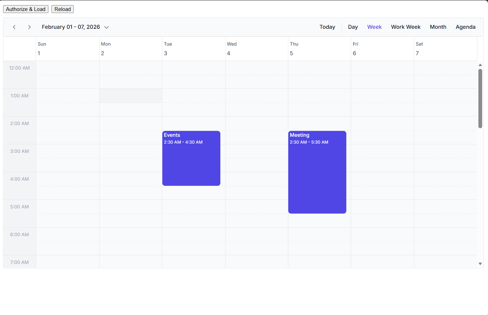

# Google Calendar API Integration with Syncfusion React Scheduler

This integration allows users to manage their Google Calendar events directly within the Syncfusion React Scheduler. Changes made in the Scheduler are synced to Google Calendar, and existing Google events are displayed in the Scheduler interface.

## Prerequisites
- **Node.js & React tool:** Must be installed on your local machine to create, manage, and run the React application.
- **Google Account:** Required to access the Google Cloud Console to enable APIs and generate OAuth 2.0 credentials.

## High-level flow

1. Scheduler displays events using data from Google Calendar.
2. The app uses Google Identity Services (GIS) to obtain short-lived access tokens.
3. CRUD operations from Scheduler are converted into Google Calendar API calls.
4. After each successful operation, reload events from Google.


## Create Google Cloud credentials

### Step 1: Setup Google Calendar API
- Open https://console.cloud.google.com.
- Click the **Project Dropdown** > **New Project**.
- Name it (e.g., Scheduler-Integration) and click **Create**.

### Step 2: Enable the Google Calendar API
- Navigate to **APIs & Services** → **Library** → search **"Calendar"** → Click **Enable**.

### Step 3: Configure OAuth consent screen (External or Internal depending on your audience).
- Navigate to **APIs & Services** → **OAuth consent screen** → select **External** → Click **Create**.
- Provide the **App name** and **Support email**

### Step 4: Add Test Users
- Navigate to **APIs & Services** → **Audience** → Add mail in **Test User** → Click **Save**.

### Step 5: Generate Credentials
- Navigate to **APIs & Services** → **Credentials** → Click **Create Credentials** → **OAuth client ID**.
- Set Application Type to **Web application**.
- Add `http://localhost:4200` to **Authorized JavaScript origins**.
- **Note**: Copy the generated **Client ID** for your configuration.


## Create React project and install required packages

```bash
npx create-react-app sf-react-gcal
cd sf-react-gcal
npm install @syncfusion/ej2-react-schedule
```

> If you use Yarn, replace `npm install` with `yarn add`.

## Add Google Identity script

 Add the GIS script in the `<head>` section of `public/index.html` file:

```html
<script src="https://accounts.google.com/gsi/client" async defer></script>
```

## Add the Syncfusion CSS References

Edit `src/App.js` file.

```css
import '@syncfusion/ej2-base/styles/tailwind3.css';
import '@syncfusion/ej2-buttons/styles/tailwind3.css';
import '@syncfusion/ej2-calendars/styles/tailwind3.css';
import '@syncfusion/ej2-dropdowns/styles/tailwind3.css';
import '@syncfusion/ej2-inputs/styles/tailwind3.css';
import '@syncfusion/ej2-lists/styles/tailwind3.css';
import '@syncfusion/ej2-popups/styles/tailwind3.css';
import '@syncfusion/ej2-navigations/styles/tailwind3.css';
import '@syncfusion/ej2-react-schedule/styles/tailwind3.css';
```

## Configuring the Syncfusion React Scheduler Component
1. Adding the **Syncfusion React Scheduler** in `src/Scheduler/schedule.js` and replace your **Client-id** and **Calendar-id**.
    ```js
    import React from 'react';
    import {
      ScheduleComponent,
      ViewsDirective,
      ViewDirective,
      Day,
      Week,
      WorkWeek,
      Month,
      Agenda,
      Inject,
      Resize,
      DragAndDrop
    } from '@syncfusion/ej2-react-schedule';

    class Schedule extends React.Component {
      constructor(props) {
        super(props);
        this.state = {
          gisReady: false,
          token: null,
          events: []
        };
        this.calendarId = 'primary'; // USE YOUR CALENDAR_ID OR 'primary'
        this.clientId =
          'YOUR CLIENT_ID'; // USE YOUR CLIENT_ID
      }
      render() {
        const { gisReady, token, events } = this.state;

        return (
          <div className="schedule-control-section">
            <div className="col-lg-12 control-section">
              <div className="control-wrapper drag-sample-wrapper">
                <div style={{ marginBottom: 12 }}>
                  <button
                    onClick={this.signIn}
                    disabled={!gisReady}
                    style={{ marginRight: 8 }}
                  >
                    {gisReady ? 'Authorize & Load' : 'Loading Google…'}
                  </button>
                  <button onClick={this.loadEvents} disabled={!token}>
                    Reload Events
                  </button>
                </div>

                <div className="schedule-container">
                  <ScheduleComponent
                    allowDragAndDrop={true}
                    allowResizing={true}
                    width="100%"
                    height="650px"
                    selectedDate={new Date()}
                    eventSettings={{ dataSource: events }}
                    actionBegin={this.onActionBegin}
                  >
                    <ViewsDirective>
                      <ViewDirective option="Day" />
                      <ViewDirective option="Week" />
                      <ViewDirective option="WorkWeek" />
                      <ViewDirective option="Month" />
                      <ViewDirective option="Agenda" />
                    </ViewsDirective>
                    <Inject services={[Day, Week, WorkWeek, Month, Agenda, Resize, DragAndDrop]} />
                  </ScheduleComponent>
                </div>
              </div>
            </div>
          </div>
        );
      }
    }

    export default Schedule;
    ``` 
2. Authorization of your **Google Calendar** with the **Syncfusion React Scheduler** on the `src/Scheduler/schedule.js` file in **Schedule** class.
    ```js
    componentDidMount() {
        const ready = () =>
          !!(window.google && window.google.accounts && window.google.accounts.oauth2);

        if (ready()) {
          this.setState({ gisReady: true });
        } else {
          this._gisPoll = setInterval(() => {
            if (ready()) {
              clearInterval(this._gisPoll);
              this.setState({ gisReady: true });
            }
          }, 100);
        }
      }

      componentWillUnmount() {
        if (this._gisPoll) clearInterval(this._gisPoll);
      }

      signIn = () => {
        const tokenClient = window.google.accounts.oauth2.initTokenClient({
          client_id: this.clientId,
          scope: 'https://www.googleapis.com/auth/calendar',
          callback: async (resp) => {
            if (resp?.access_token) {
              this.setState({ token: resp.access_token }, async () => {
                await this.loadEvents();
              });
            }
          }
        });

        tokenClient.requestAccessToken();
      };
    ```

3. Performing **CRUD** operations and mapping it with the **Google Calendar** in the `src/Schedule/schedule.js` file inside the **Schedule** class.
    ```js
    onActionBegin = async (args) => {
        const { token } = this.state;

        if (['eventCreate', 'eventChange', 'eventRemove'].includes(args.requestType)) {
          args.cancel = true; 
        } else {
          return;
        }

        if (!token) return;

        const headers = {
          Authorization: `Bearer ${token}`,
          'Content-Type': 'application/json'
        };

        const pickApp = () => {
          if (Array.isArray(args.data)) return args.data[0];
          if (args.data) return args.data;
          if (Array.isArray(args.changedRecords) && args.changedRecords.length)
            return args.changedRecords[0];
          return null;
        };

        if (args.requestType === 'eventCreate') {
          const app = pickApp();
          if (!app) return;

          const resource = toGoogleEventResource(app);
          const res = await fetch(
            `https://www.googleapis.com/calendar/v3/calendars/${encodeURIComponent(
              this.calendarId
            )}/events`,
            { method: 'POST', headers, body: JSON.stringify(resource) }
          );
          if (!res.ok) return;
          await this.loadEvents();
        }

        if (args.requestType === 'eventChange') {
          const app = pickApp();
          if (!app) return;

          const resource = toGoogleEventResource(app);
          const res = await fetch(
            `https://www.googleapis.com/calendar/v3/calendars/${encodeURIComponent(
              this.calendarId
            )}/events/${encodeURIComponent(app.Id)}`,
            { method: 'PATCH', headers, body: JSON.stringify(resource) }
          );
          if (!res.ok) return;
          await this.loadEvents();
        }

        if (args.requestType === 'eventRemove') {
          const app = pickApp();
          if (!app) return;

          const res = await fetch(
            `https://www.googleapis.com/calendar/v3/calendars/${encodeURIComponent(
              this.calendarId
            )}/events/${encodeURIComponent(app.Id)}`,
            { method: 'DELETE', headers }
          );
          if (!res.ok) return;
          await this.loadEvents();
        }
      };
      ```
4. **All-Day Event** Conversions for **Syncfusion React Scheduler** to **Google Calendar**.
    ```js
    function parseDateOnlyToLocal(dateStr) {
      const [y, m, d] = (dateStr || '').split('-').map(Number);
      return new Date(y, m - 1, d);
    }
    function formatDateOnlyFromLocal(d) {
      const y = d.getFullYear();
      const m = String(d.getMonth() + 1).padStart(2, '0');
      const day = String(d.getDate()).padStart(2, '0');
      return `${y}-${m}-${day}`;
    }
    ```

## Mapping the Google Calendar and Syncfusion React Scheduler
1. Mapping the data from **Google Calendar** to **Syncfusion React Scheduler** in the `src/Schedule/schedule.js` file.
    ```js
    function mapGoogleToScheduler(items) {
      return (items || [])
        .map((evt) => {
          const isAllDay = Boolean(evt.start?.date && !evt.start?.dateTime);

          if (isAllDay) {
            const start = parseDateOnlyToLocal(evt.start.date);
            const end = parseDateOnlyToLocal(evt.end.date); 
            return {
              Id: evt.id,
              Subject: evt.summary || '(No title)',
              StartTime: start,
              EndTime: end,
              IsAllDay: true,
              Location: evt.location,
              Description: evt.description
            };
          }

          const start = evt.start?.dateTime;
          const end = evt.end?.dateTime;
          if (!start || !end) return null;

          return {
            Id: evt.id,
            Subject: evt.summary || '(No title)',
            StartTime: new Date(start),
            EndTime: new Date(end),
            IsAllDay: false,
            Location: evt.location,
            Description: evt.description
          };
        })
        .filter(Boolean);
    }
    ```
2. Mapping the data from **Syncfusion React Scheduler** to **Google Calendar** in the `src/Schedule/schedule.js` file.
    ```js
    function toGoogleEventResource(app) {
      if (app.IsAllDay) {
        const startDate = new Date(
          app.StartTime.getFullYear(),
          app.StartTime.getMonth(),
          app.StartTime.getDate()
        );
        let endDate = new Date(
          app.EndTime.getFullYear(),
          app.EndTime.getMonth(),
          app.EndTime.getDate()
        );
        if (+endDate <= +startDate) {
          endDate = new Date(startDate);
          endDate.setDate(endDate.getDate() + 1);
        }
        const resource = {
          summary: app.Subject,
          location: app.Location,
          description: app.Description,
          start: { date: formatDateOnlyFromLocal(startDate) },
          end: { date: formatDateOnlyFromLocal(endDate) }
        };
        if (app.RecurrenceRule) resource.recurrence = [`RRULE:${app.RecurrenceRule}`];
        return resource;
      }

      const tz = Intl.DateTimeFormat().resolvedOptions().timeZone;
      const resource = {
        summary: app.Subject,
        location: app.Location,
        description: app.Description,
        start: { dateTime: new Date(app.StartTime).toISOString() },
        end: { dateTime: new Date(app.EndTime).toISOString() }
      };
      if (app.RecurrenceRule) {
        resource.start.timeZone = tz;
        resource.end.timeZone = tz;
        resource.recurrence = [`RRULE:${app.RecurrenceRule}`];
      }
      return resource;
    }
    ```

3. Loading the events to the **Syncfusion Scheduler** from the **Google Calendar** in the `src/Schedule/schedule.js` file using **Schedule** class.
    ```js
    loadEvents = async () => {
        const { token } = this.state;
        if (!token) return;

        const url = new URL(
          `https://www.googleapis.com/calendar/v3/calendars/${encodeURIComponent(
            this.calendarId
          )}/events`
        );
        url.searchParams.set('singleEvents', 'true');
        url.searchParams.set('orderBy', 'startTime');
        url.searchParams.set('maxResults', '2500');
        url.searchParams.set('timeMin', new Date(2020, 0, 1).toISOString());

        const res = await fetch(url.toString(), {
          headers: { Authorization: `Bearer ${token}` }
        });
        if (!res.ok) throw new Error('Failed to load events');

        const data = await res.json();
        const mapped = mapGoogleToScheduler(data.items || []);
        this.setState({ events: mapped });
      };
    ```
## Rendering the Scheduler in the App Component
Render the Scheduler in the Main App `app.js`
```ts
import React from 'react';
import Schedule from './Schedule/schedule'

function App() {
  return (
    <Schedule></Schedule>
  );
}

export default App;
```

## Running the Application
```bash
npm start
```

## Output

> For additional help, see the [Google Calendar Integration sample on GitHub](https://github.com/SyncfusionExamples/react-scheduler-crud-google-calendar)

## Testing and verification

- Use `npm start` to run locally: `http://localhost:3000`.
- Verify OAuth consent and that `http://localhost:3000` appears in Authorized JavaScript origins.


