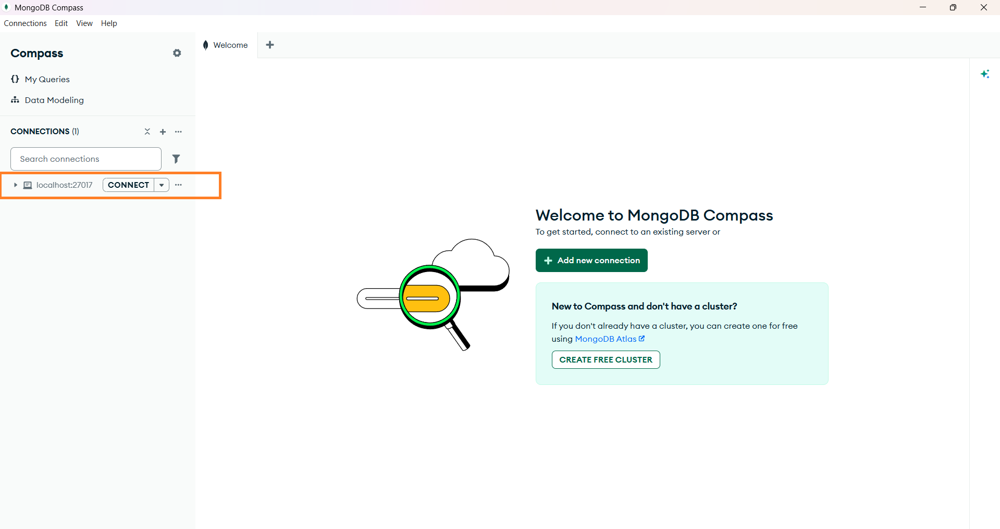
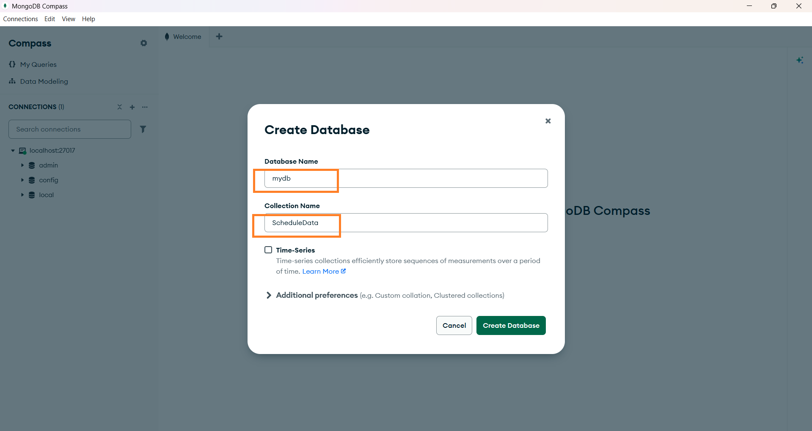
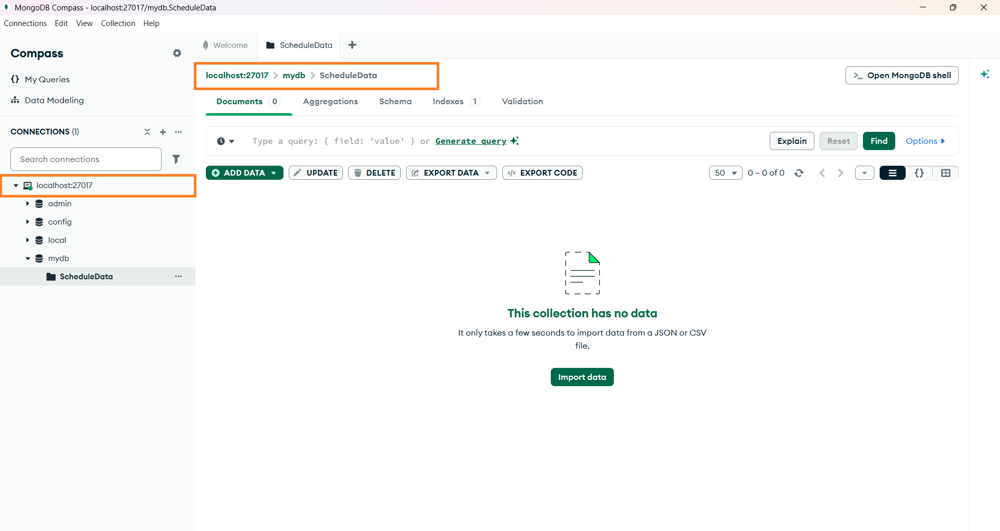
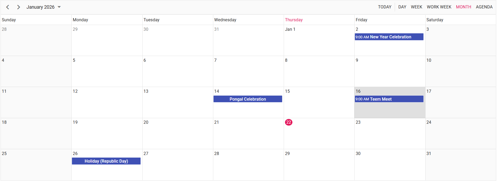
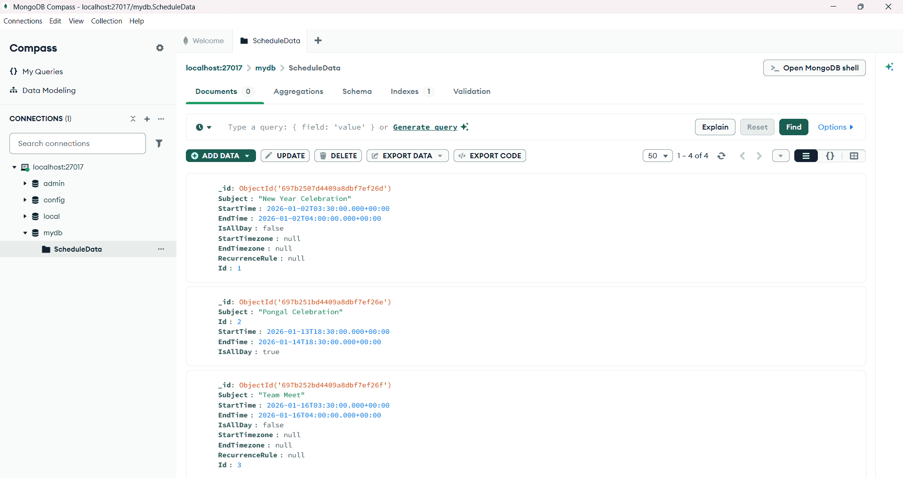

# Getting started with Syncfusion React Scheduler and MongoDB

The Syncfusion [React Scheduler](https://ej2.syncfusion.com/react/documentation/schedule/getting-started) combined with MongoDB provides a robust, scalable, and flexible data-driven application architecture suitable for modern event-management systems.

MongoDB's schema-less design seamlessly supports complex scheduling data, making it ideal for storing events, resources, recurrence rules, and user-specific calendar configurations.

## What is MongoDB?

[MongoDB](https://www.mongodb.com/) is a highly scalable, document-oriented NoSQL database designed to store and manage large volumes of flexible, JSON-like data. It enables developers to work with dynamic schemas, making it easy to model complex and evolving application data without rigid table structures.

## Overview
This integration enables full CRUD (Create, Read, Update, Delete) operations for calendar events using:

* Frontend: **React + Syncfusion React Scheduler**
* Backend: **Node.js + Express**
* Database: **MongoDB**
* Communication: **REST APIs via Syncfusion DataManager**

Users can create, edit, and delete appointments in the Scheduler UI, with all changes persisted in MongoDB.

## Prerequisites

Before getting started, ensure the following prerequisites are met:

* **Node.js ≥ 20.19.0**  
Required for optimal performance and full compatibility with MongoDB Node.js Driver v7.0 and modern ES features.

* **MongoDB (Latest Stable Version)**   
Required for storing and retrieving application data. Supports both local installation and MongoDB Atlas.

## Architecture Diagram

## Database Setup 
Follow the steps below to set up the MongoDB database for the application:

1. Download the MongoDB Community Edition from the official website: [MongoDB](https://www.mongodb.com/try/download/community)

2. Install MongoDB by following the platform‑specific installation instructions (Windows / macOS / Linux).

3. Launch MongoDB Compass after successful installation.

4. Open MongoDB Compass and connect the default connection string: `mongodb://localhost:27017`

*Image illustrating the MongoDB connection string*

5. Create a new Database `mydb` and a Collection `ScheduleData` in default connection string.

*Image illustrating the MongoDB database & collection*

6. Confirm that MongoDB Compass shows the database in the connected state, as illustrated in the screenshot.

*Image illustrating the MongoDB connectivity*

## Create a React Application
To create a new `React` application, use the Vite build tool, which provides faster startup, hot reload, and better performance for modern React applications.




npm create vite@latest 




yarn create vite 




Running one of the above commands will prompt you to configure the project as shown below.

### Step 1: Define the project name:
For example, let us name the project `react-app`.




√ Project name: » **react-app**




### Step 2: Select the required configurations:

Choose React as the framework and TypeScript as the variant for better type safety and maintainability.




√ Select a framework: » **React**   
√ Select a variant: » **TypeScript**   




**Note:**  
You can also create the React application with TypeScript directly using the Vite template, as shown below.




npm create vite@latest react-app -- --template react-ts




yarn create vite react-app --template react-ts




### Step 3: Confirm additional Vite options:




√ Use rolldown-vite (Experimental)?: » **No**   
√ Install with npm and start now? » **Yes**  



   
After executing the above commands, the application will be available at: `http://localhost:5173`

The React application is now created and running with default settings.
Next, we will proceed with integrating Syncfusion® React Scheduler component into the project after setting up the server.

### Step 4: Terminate & navigate to the project directory:
Once the project is created successfully, stop the running state of the application and move into the application folder using the following command.




ctrl + c   
cd react-app




## Create a Server Application

### Step 1: Install required libraries:
To set up the backend for the application, Install the required packages and make a new directory for server in the React project folder `react-app/` itself.




npm install express mongodb cors   




* Express – A minimal and flexible web framework used to build API endpoints
* MongoDB (Node.js Driver) – The official MongoDB driver that allows your server to communicate with the database
* CORS – A package that enables your application (running on a different port) to access the server’s API




mkdir server




### Step 2: Create a file **server.js**:
Create a new file named `server.js` inside the directory `server` created above and add the following code to set up the server. 




const { MongoClient } = require('mongodb');
const express = require('express');
const cors = require('cors');

const app = express();
const mongoUrl = 'mongodb://127.0.0.1:27017/';
const PORT = 5000;

app.use(express.json());
app.use(express.urlencoded({ extended: false }));

// CORS configuration
app.use(cors({
origin: 'http://localhost:5173',
methods: ['GET', 'POST', 'PUT', 'PATCH', 'DELETE'],
allowedHeaders: ['Content-Type'],
credentials: false
}));

app.listen(PORT, () => {
console.log(`✅ Server running on http://localhost:${PORT}`);
});

(async () => {
const client = new MongoClient(mongoUrl);
await client.connect();
const db = client.db('mydb');
const collection = db.collection('ScheduleData');

// Fetch all scheduler events
app.post('/GetData', async (req, res) => {
    try {
    const data = await collection.find({}).toArray();
    res.json(data);
    } catch (err) {
    res.status(500).json({ error: err.message });
    }
});

// Handle batch CRUD operations
app.post('/BatchData', async (req, res) => {
    try {
        const body = req.body;
        let events = [];

        // INSERT
        if (body.action === 'insert' || (body.added && body.added.length)) {
            events = body.added || [body.value];
            for (const e of events) {
            e.StartTime = new Date(e.StartTime);
            e.EndTime = new Date(e.EndTime);
            await collection.insertOne(e);
            }
        }

        // UPDATE
        if (body.action === 'update' || (body.changed && body.changed.length)) {
            events = body.changed || [body.value];
            for (const e of events) {
            delete e._id;  // Critical: remove _id to avoid immutable field error
            e.StartTime = new Date(e.StartTime);
            e.EndTime = new Date(e.EndTime);
            await collection.updateOne(
                { Id: e.Id },
                { $set: e }
            );
            }
        }

        // DELETE
        if (body.action === 'remove' || (body.deleted && body.deleted.length)) {
            events = body.deleted || [{ Id: body.key }];
            for (const e of events) {
            await collection.deleteOne({ Id: e.Id });
            }
        }

        res.json(body);
    } catch (err) {
        res.status(500).json({ error: err.message });
    }
});
})();




Here database name is `mydb` and collection name is `ScheduleData`, both were previously created during the database setup process 

### Step 3: Add **server script** to `package.json`:
To enable running the Node.js backend directly from the React project’s root, add the following script inside your root `package.json` under the "scripts" section.
    



"scripts": {
    "server": "node ./server/server.js"
}




## Integrating Syncfusion React Scheduler
This section integrates [Syncfusion React Scheduler](https://www.syncfusion.com/react-components/react-scheduler) to the above created application.

### Step 1: Install required libraries:
Install the required [Syncfusion React Scheduler package](https://www.npmjs.com/package/@syncfusion/ej2-react-schedule) by the following command.
    



npm install @syncfusion/ej2-react-schedule




yarn add @syncfusion/ej2-react-schedule




### Step 2: Add CSS references:
Add CSS references for the Scheduler in `src/App.css`.
   



@import "../node_modules/@syncfusion/ej2-base/styles/material.css";
@import "../node_modules/@syncfusion/ej2-buttons/styles/material.css";
@import "../node_modules/@syncfusion/ej2-calendars/styles/material.css";
@import "../node_modules/@syncfusion/ej2-dropdowns/styles/material.css";
@import "../node_modules/@syncfusion/ej2-inputs/styles/material.css";
@import "../node_modules/@syncfusion/ej2-navigations/styles/material.css";
@import "../node_modules/@syncfusion/ej2-popups/styles/material.css";
@import "../node_modules/@syncfusion/ej2-react-schedule/styles/material.css";




### Step 3: Add the Schedule component:
In the `src/App.tsx` file, use the following code snippet to render the Syncfusion React Schedule component and import `App.css` to apply styles to the scheduler.
    



import React from 'react';
import { ScheduleComponent, ViewsDirective, ViewDirective, Day, Week, WorkWeek, Month, Agenda, Inject } from '@syncfusion/ej2-react-schedule';
import './App.css';

export default class App extends React.Component<{}, {}> {
    public scheduleObj: ScheduleComponent = new ScheduleComponent({});
    
    public render() {
        return (
        
            

                

                    <ScheduleComponent 
                        id="schedule" 
                        ref={(schedule: ScheduleComponent | null) => { 
                                this.scheduleObj = schedule!;
                            }}
                        height="550px"
                        selectedDate={new Date(2026, 0, 1)} 
                        currentView="Month" >
            
                        <ViewsDirective>
                            <ViewDirective option="Day" />
                            <ViewDirective option="Week" />
                            <ViewDirective option="WorkWeek" />
                            <ViewDirective option="Month" />
                            <ViewDirective option="Agenda" />
                        </ViewsDirective>
                        <Inject services={[Day, Week, WorkWeek, Month, Agenda]} />
                    </ScheduleComponent>
                

            

        );
    }
}




### Step 4: Perform CRUD operations using Syncfusion's DataManager URL Adaptor:
This connects the scheduler to your backend through REST endpoints and enables create, read, update, and delete from the UI.




import React from 'react';
import { DataManager, UrlAdaptor } from '@syncfusion/ej2-data';
import { ScheduleComponent, ViewsDirective, ViewDirective, Day, Week, WorkWeek, Month, Agenda, Inject } from '@syncfusion/ej2-react-schedule';
import './App.css';

export default class App extends React.Component<{}, {}> {
    public scheduleObj: ScheduleComponent = new ScheduleComponent({});
    private dataManager: DataManager = new DataManager({
        url: 'http://localhost:5000/GetData',
        crudUrl: 'http://localhost:5000/BatchData',
        adaptor: new UrlAdaptor(),
        crossDomain: true
    });

    public render() {
        return (
        
        

            

            <ScheduleComponent 
                id="schedule" 
                ref={(schedule: ScheduleComponent | null) => { 
                        this.scheduleObj = schedule!;
                    }}
                height="550px"
                selectedDate={new Date(2026, 0, 1)} 
                currentView="Month" 
                eventSettings={ {dataSource: this.dataManager }}>
                <ViewsDirective>
                    <ViewDirective option="Day" />
                    <ViewDirective option="Week" />
                    <ViewDirective option="WorkWeek" />
                    <ViewDirective option="Month" />
                    <ViewDirective option="Agenda" />
                </ViewsDirective>
                <Inject services={[Day, Week, WorkWeek, Month, Agenda]} />
            </ScheduleComponent>
            

        

        );
    }
}




* The Scheduler is connected to a backend service using **Syncfusion’s DataManager**, a powerful data-handling component built to seamlessly manage remote data operations.
* DataManager is configured with two API endpoints:
    * url → to read event data
    * crudUrl → to handle create, update, and delete actions
* The UrlAdaptor ensures standard REST-style communication with your server.
* Once this is set, the Scheduler automatically sends requests when users add, edit, drag, resize, or delete events.
* The server processes these operations and returns updated event data, allowing the Scheduler to stay perfectly in sync with the backend.

## Run the Application

**Note**:  
If your project’s package.json contains **"type": "module"**, remove it before running the server.  
This project uses CommonJS (require), not ES modules—keeping "type": "module" will cause Node.js to throw a “require is not defined in ES module scope” error.

### Step 1: Start the Backend Server:
From the project directory `react-app/`, start the backend server.
    

 

npm run server




yarn server




Once started, the Node.js backend will be available at:
http://localhost:5000/

### Step 2: Start the React Application:
Open a new terminal window from the same `react-app/` directory and run the React application.
    



npm run dev




yarn run dev




After the build completes, the React application will run at:
http://localhost:4200/

You can now create, read, update, and delete events directly in the **Syncfusion React Scheduler**.
All changes will be reflected in the connected **MongoDB** database in real time.

## Output Preview
**Syncfusion React Scheduler**

*Image illustrating the Syncfusion React Scheduler* 

**Syncfusion React Scheduler Events in MongoDB**

*Image illustrating the Syncfusion React Scheduler Events in MongoDB* 

## Common Pitfalls & Solutions

1. **CORS issues (blocked by CORS):** Ensure app.use(cors(...)) is registered before routes and that origin matches your React dev URL. Set credentials: true only if you send cookies/Authorization and then also configure DataManager to send them. 

2. **Dates stored as strings:** Convert StartTime/EndTime to Date objects on the server before inserting/updating. Otherwise, Scheduler rendering/timezone math may be off.

3. **Immutable _id error on updates:** Delete _id from payload before calling updateOne. The MongoDB driver does not allow changing _id.

4. **Missing CSS → broken layout:** Import all required CSS bundles for EJ2 controls; otherwise the editor/pickers won’t render correctly.

 

> Please find the sample in this [GitHub location](https://github.com/SyncfusionExamples/ej2-react-scheduler-with-mongodb)