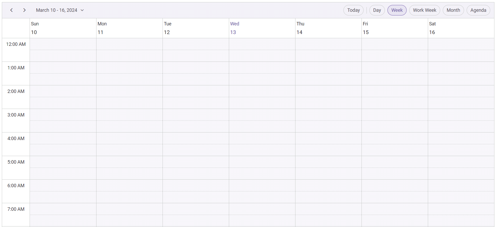

# Getting Started with React Schedule Component in Preact Framework

This article provides a step-by-step guide for setting up a [Preact](https://preactjs.com/) project and integrating the Syncfusion<sup style="font-size:70%">&reg;</sup> React Schedule component.

`Preact` is a fast and lightweight JavaScript library for building user interfaces. It's often used as an alternative to larger frameworks like React. The key difference is that Preact is designed to be smaller in size and faster in performance, making it a good choice for projects where file size and load times are critical factors. 

## Prerequisites

[System requirements for Syncfusion<sup style="font-size:70%">&reg;</sup> React UI components](../system-requirement)

## Set up the Preact project

Create a new Preact project using the initialization command:

```bash
npm init preact
```

or

```bash
yarn init preact
```

Using one of the above commands will lead you to set up additional configurations for the project, as below:

### Project name

Specify the project name as `my-project`.

```bash
T  Preact - Fast 3kB alternative to React with the same modern API
|
*  Project directory:
|  my-project
—      
```

### Project language

Choose `JavaScript` as the framework variant to build this Preact project using JavaScript and React.

```bash
T  Preact - Fast 3kB alternative to React with the same modern API
|
*  Project language:
|  > JavaScript
|    TypeScript
—
```

### Configuration options

Respond to the following prompts with the default selections:

```bash
T  Preact - Fast 3kB alternative to React with the same modern API
|
*  Use router?
|    Yes / > No
—
|
*  Prerender app (SSG)?
|    Yes / > No
—
|
*  Use ESLint?
|    Yes / > No
—
```

### Navigate to project

Once setup is complete, navigate to your project directory:

```bash
cd my-project
```

Now that `my-project` is ready to run with default settings, let's add Syncfusion<sup style="font-size:70%">&reg;</sup> components to the project.

## Add the Syncfusion<sup style="font-size:70%">&reg;</sup> React packages

Syncfusion<sup style="font-size:70%">&reg;</sup> React component packages are available at [npmjs.com](https://www.npmjs.com/search?q=ej2-react). 

This article uses the [React Schedule component](https://www.syncfusion.com/react-components/react-scheduler) as an example. To use the React Schedule component in the project, the `@syncfusion/ej2-react-schedule` package needs to be installed using the following command:

```bash
npm install @syncfusion/ej2-react-schedule --save
```

or

```bash
yarn add @syncfusion/ej2-react-schedule
```

## Import Syncfusion<sup style="font-size:70%">&reg;</sup> CSS styles

You can import themes for the Syncfusion<sup style="font-size:70%">&reg;</sup> React component in various ways, such as using CSS or SASS styles from npm packages, CDN, CRG and [Theme Studio](https://ej2.syncfusion.com/react/documentation/appearance/theme-studio). Refer to [themes topic](https://ej2.syncfusion.com/react/documentation/appearance/theme) to know more about built-in themes and different ways to refer to theme's in a React project.

In this article, the `Material 3` theme is applied using CSS styles, which are available in installed packages. The necessary `Material 3` CSS styles for the Schedule component and its dependents were imported into the **src/style.css** file.




@import "../node_modules/@syncfusion/ej2-base/styles/material3.css";
@import "../node_modules/@syncfusion/ej2-buttons/styles/material3.css";
@import "../node_modules/@syncfusion/ej2-calendars/styles/material3.css";
@import "../node_modules/@syncfusion/ej2-dropdowns/styles/material3.css";
@import "../node_modules/@syncfusion/ej2-inputs/styles/material3.css";
@import "../node_modules/@syncfusion/ej2-lists/styles/material3.css";
@import "../node_modules/@syncfusion/ej2-navigations/styles/material3.css";
@import "../node_modules/@syncfusion/ej2-popups/styles/material3.css";
@import "../node_modules/@syncfusion/ej2-splitbuttons/styles/material3.css";
@import "../node_modules/@syncfusion/ej2-react-schedule/styles/material3.css";





> The order of importing CSS styles should be in line with its dependency graph.

## Add the Syncfusion<sup style="font-size:70%">&reg;</sup> React component

Follow the below steps to add the React Schedule component to your Preact project:

### Step 1: Import Schedule components

In the src/index.jsx file, import the necessary Schedule components:




import { ScheduleComponent, Day, Week, WorkWeek, Month, Agenda, Inject } from '@syncfusion/ej2-react-schedule';




### Step 2: Define and render the Schedule

Create the Schedule component and inject the required view services.




import { render } from 'preact';
import { ScheduleComponent, Day, Week, WorkWeek, Month, Agenda, Inject } from '@syncfusion/ej2-react-schedule';
import './style.css';

export function App() {

  return (
    <ScheduleComponent>
      <Inject services={[Day, Week, WorkWeek, Month, Agenda]}/>
    </ScheduleComponent>
  );
}

render(<App />, document.getElementById('app'));




## Run the project

To run the project, use the following command:

```bash
npm run dev
```

or

```bash
yarn run dev
```

The output will appear as follows:



> Please find the sample in this [GitHub location](https://github.com/SyncfusionExamples/How-to-integrate-Syncfusion-React-Scheduler-with-Preact) 

## See also

[Getting Started with the Syncfusion<sup style="font-size:70%">&reg;</sup> React UI Component](../getting-started/quick-start)
