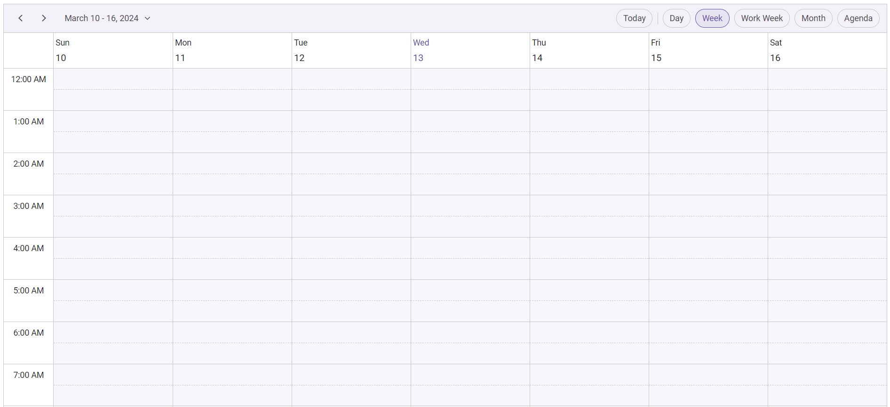

# Getting Started with React Schedule Component in Preact Framework

This article provides a step-by-step guide for setting up a [Preact](https://preactjs.com/) project and integrating the [React Scheduler](https://www.syncfusion.com/react-components/react-scheduler).

`Preact` is a fast and lightweight JavaScript library for building user interfaces. It's often used as an alternative to larger frameworks like React. The key difference is that Preact is designed to be smaller in size and faster in performance, making it a good choice for projects where file size and load times are critical factors. 

## Prerequisites

- [System requirements for Syncfusion<sup style="font-size:70%">&reg;</sup> React UI components](../system-requirement) — Node.js and npm are required
- An HTML file with an `id="app"` element where the Preact app will be rendered (this is typically created automatically by the Preact initialization)

## Set up the Preact project

Create a new Preact project using the initialization command:

```bash
npm init preact
```

or

```bash
yarn init preact
```

Using one of the above commands will lead you to set up additional configurations for the project, as below:

### Project name

Specify the project name as `my-project`.

```bash
T  Preact - Fast 3kB alternative to React with the same modern API
|
*  Project directory:
|  my-project
—      
```

### Project language

Choose `JavaScript` as the language variant to build this Preact project using JavaScript.

```bash
T  Preact - Fast 3kB alternative to React with the same modern API
|
*  Project language:
|  > JavaScript
|    TypeScript
—
```

### Configuration options

Respond to the following prompts with the default selections:

```bash
T  Preact - Fast 3kB alternative to React with the same modern API
|
*  Use router?
|    Yes / > No
—
|
*  Prerender app (SSG)?
|    Yes / > No
—
|
*  Use ESLint?
|    Yes / > No
—
```

### Navigate to project

Once setup is complete, navigate to your project directory:

```bash
cd my-project
```

Now that `my-project` is ready to run with default settings, let's add Syncfusion<sup style="font-size:70%">&reg;</sup> components to the project.

## Add the Syncfusion<sup style="font-size:70%">&reg;</sup> Schedule Package

Syncfusion<sup style="font-size:70%">&reg;</sup> React component packages are available at [npmjs.com](https://www.npmjs.com/search?q=ej2-react). 

This article uses the [React Schedule component](https://www.syncfusion.com/react-components/react-scheduler) as an example. Install the `@syncfusion/ej2-react-schedule` package using the following command:

```bash
npm install @syncfusion/ej2-react-schedule --save
```

or

```bash
yarn add @syncfusion/ej2-react-schedule
```

## Import Syncfusion<sup style="font-size:70%">&reg;</sup> CSS styles from a theme package

Themes for Syncfusion<sup style="font-size:70%">&reg;</sup> React Schedule component can be applied with CSS files provided through [npm theme packages](https://www.npmjs.com/package/@syncfusion/ej2-tailwind3-theme). For available themes, refer to the [Themes](https://ej2.syncfusion.com/react/documentation/appearance/theme) documentation.

This guide uses the **Tailwind 3** theme. Install the theme package using the following command:




npm install @syncfusion/ej2-tailwind3-theme --save




Then add the following CSS reference to the **src/index.css** file:




@import "../node_modules/@syncfusion/ej2-tailwind3-theme/styles/schedule/index.css";




> The order of importing CSS styles should be in line with its dependency graph. Ensure this import is added before your component styles.

## Add the Syncfusion<sup style="font-size:70%">&reg;</sup> Schedule Component

Follow the below steps to add the Schedule component to your Preact project:

### Import Schedule Components

In the src/index.jsx file, import the necessary Schedule components and create the Schedule component with sample data:




import { render } from 'preact';
import { ScheduleComponent, Day, Week, WorkWeek, Month, Agenda, Inject } from '@syncfusion/ej2-react-schedule';
import './style.css';

const eventData = [
  {
    Id: 1,
    Subject: 'Team Meeting',
    StartTime: new Date(2024, 0, 15, 10, 0),
    EndTime: new Date(2024, 0, 15, 11, 0)
  }
];

export function App() {
  return (
    <ScheduleComponent eventSettings={{ dataSource: eventData }}>
      <Inject services={[Day, Week, WorkWeek, Month, Agenda]}/>
    </ScheduleComponent>
  );
}

render(<App />, document.getElementById('app'));




For more available props and API documentation, refer to the [ScheduleComponent API documentation](https://ej2.syncfusion.com/react/documentation/api/schedule/index-default).

## Run the Project

To run the project, use the following command:

```bash
npm run dev
```

or

```bash
yarn run dev
```

The development server will start and the application will be accessible in your browser (typically at `http://localhost:8080` or `http://localhost:5173` depending on your Preact version). You should see the Schedule component rendering with the sample event as follows:



> Please find the sample in this [GitHub location](https://github.com/SyncfusionExamples/How-to-integrate-Syncfusion-React-Scheduler-with-Preact)

## See also

[Getting Started with the Syncfusion<sup style="font-size:70%">&reg;</sup> React UI Component](../getting-started/quick-start)