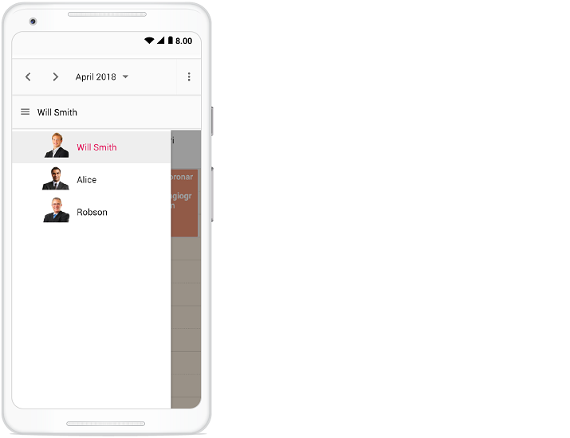
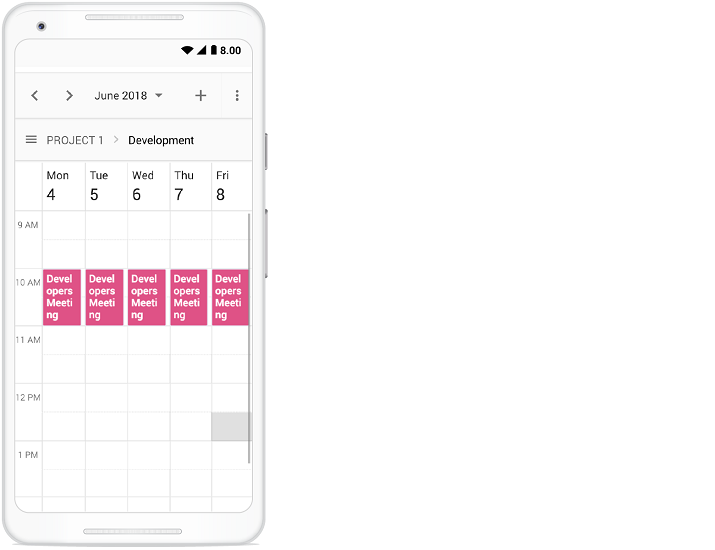
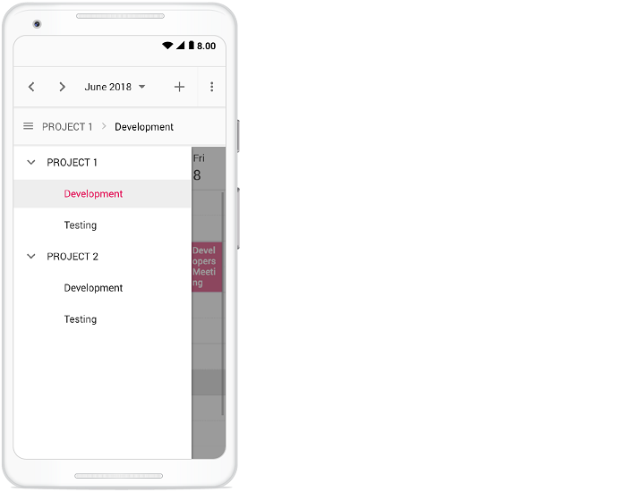

# Resources in React Scheduler component

Resources and grouping support allow the Scheduler to be shared across multiple resources. The appointments of each resource are displayed under the relevant resource. Each resource in the Scheduler is arranged in a column or row order, with dedicated spacing to display all its respective appointments on a single page. The Scheduler also supports multiple levels of resource grouping, enabling hierarchical categorization. Resources can be displayed either in expandable groups (Timeline views) or in vertical hierarchy (Calendar views).

It is possible to assign one or more resources to the same appointment by allowing multiple selection of resource options available in the event editor window.

The React Scheduler groups resources based on different criteria, including grouping appointments by resources, grouping resources by dates, and timeline scheduling. Resource data can be bound to the Scheduler either as a local JSON collection or via a remote service URL.

Learn how to add appointments for multiple resources in the React Scheduler from this video:



## Resource fields

The default options available within the [`resources`](https://ej2.syncfusion.com/react/documentation/api/schedule/resources) collection are:

| Field name | Type | Description |
|-------|---------| --------------- |
| `field` | String | Binds to the resource [`field`](https://ej2.syncfusion.com/react/documentation/api/schedule/resources#field) of the event object. |
| `title` | String | Displays the [`title`](https://ej2.syncfusion.com/react/documentation/api/schedule/resources#title) of the resource field in the event editor window. |
| `name` | String | A unique resource [`name`](https://ej2.syncfusion.com/react/documentation/api/schedule/resources#name) used to differentiate resource objects during grouping. |
| `allowMultiple` | Boolean | When set to `true`, the [`allowMultiple`](https://ej2.syncfusion.com/react/documentation/api/schedule/resources#allowmultiple) property allows the selection of multiple resource names, creating multiple instances of the same appointment for the selected resources. |
| `dataSource` | Object | Assigns the resource [`dataSource`](https://ej2.syncfusion.com/react/documentation/api/schedule/resources#datasource). Data can be passed as an array of JavaScript objects or via a [`DataManager`](https://ej2.syncfusion.com/documentation/data/api-datamanager) instance for remote data. Adaptors can be used to customize remote data processing. |
| `query` | Query | Defines the external [`query`](https://ej2.syncfusion.com/react/documentation/api/schedule/resources#query) executed during data processing. |
| `idField` | String | Binds the resource ID field name from the resource [`dataSource`](https://ej2.syncfusion.com/react/documentation/api/schedule/resources#datasource). |
| `expandedField` | String | Binds the [`expandedField`](https://ej2.syncfusion.com/react/documentation/api/schedule/resources#expandedfield) from the resource [`dataSource`](https://ej2.syncfusion.com/react/documentation/api/schedule/resources#datasource). A boolean value determines whether the resource in timeline views is collapsed or expanded on initial load. |
| `textField` | String | Binds the [`textField`](https://ej2.syncfusion.com/react/documentation/api/schedule/resources#textfield) name from the resource [`dataSource`](https://ej2.syncfusion.com/react/documentation/api/schedule/resources#datasource). Typically holds resource names. |
| `groupIDField` | String | Binds the [`groupIDField`](https://ej2.syncfusion.com/react/documentation/api/schedule/resources#groupidfield) name from the resource [`dataSource`](https://ej2.syncfusion.com/react/documentation/api/schedule/resources#datasource). Holds parent resource IDs for hierarchical grouping. |
| `colorField` | String | Binds the [`colorField`](https://ej2.syncfusion.com/react/documentation/api/schedule/resources#colorfield) name from the resource [`dataSource`](https://ej2.syncfusion.com/react/documentation/api/schedule/resources#datasource). The mapped color is applied to events of the resource. |
| `startHourField` | String | Binds the [`startHourField`](https://ej2.syncfusion.com/react/documentation/api/schedule/resources#starthourfield) name from the resource [`dataSource`](https://ej2.syncfusion.com/react/documentation/api/schedule/resources#datasource). Defines different work start hours for resources. |
| `endHourField` | String | Binds the [`endHourField`](https://ej2.syncfusion.com/react/documentation/api/schedule/resources#endhourfield) name from the resource [`dataSource`](https://ej2.syncfusion.com/react/documentation/api/schedule/resources#datasource). Defines different work end hours for resources. |
| `workDaysField` | String | Binds the [`workDaysField`](https://ej2.syncfusion.com/react/documentation/api/schedule/resources#workdaysfield) name from the resource [`dataSource`](https://ej2.syncfusion.com/react/documentation/api/schedule/resources#datasource). Defines different working days for resources. |
| `cssClassField` | String | Binds the custom [`cssClassField`](https://ej2.syncfusion.com/react/documentation/api/schedule/resources#cssclassfield) name from the resource [`dataSource`](https://ej2.syncfusion.com/react/documentation/api/schedule/resources#datasource). Applies mapped CSS classes to events of those resources. |

## Resource data binding

Resource data can be bound to the Scheduler either as a local JSON collection or via a remote service URL.

### Using local JSON data

The following example shows how to bind local JSON data to the [`dataSource`](https://ej2.syncfusion.com/react/documentation/api/schedule/resources#datasource) of the [`resources`](https://ej2.syncfusion.com/react/documentation/api/schedule/resources) collection.


```ts

import * as React from 'react';
import { useState } from 'react';
import * as ReactDOM from 'react-dom';
import { Day, Week, WorkWeek, Month, Agenda, ScheduleComponent, ResourcesDirective, ResourceDirective, Inject } from '@syncfusion/ej2-react-schedule';
import { resourceData } from './datasource';
const App = () => {
  const [ownerData] = useState([
    { OwnerText: 'Nancy', Id: 1, OwnerColor: '#ffaa00' },
    { OwnerText: 'Steven', Id: 2, OwnerColor: '#f8a398' },
    { OwnerText: 'Michael', Id: 3, OwnerColor: '#7499e1' }
  ]);
  const eventSettings: EventSettingsModel = { dataSource: resourceData };

  return (
    <ScheduleComponent width='100%' height='550px' selectedDate={new Date(2018, 3, 1)} eventSettings={eventSettings}>
      <ResourcesDirective>
        <ResourceDirective field='OwnerId' title='Owner' name='Owners' allowMultiple={true} dataSource={ownerData} textField='OwnerText' idField='Id' colorField='OwnerColor'>
        </ResourceDirective>
      </ResourcesDirective>
      <Inject services={[Day, Week, WorkWeek, Month, Agenda]} />
    </ScheduleComponent>
  );
}
;
const root = ReactDOM.createRoot(document.getElementById('schedule'));
root.render(<App />);

```

### Using remote service URL

The following example shows how to bind remote data to the [`dataSource`](https://ej2.syncfusion.com/react/documentation/api/schedule/resources#datasource).


```ts

import * as React from 'react';
import { useState } from 'react';
import * as ReactDOM from 'react-dom';
import { Week, Month, Agenda, ScheduleComponent, ResourcesDirective, ResourceDirective, Inject } from '@syncfusion/ej2-react-schedule';
import { resourceData } from './datasource';
import { DataManager, UrlAdaptor } from '@syncfusion/ej2-data';
const App = () => {
  const [ownerData] = useState(new DataManager({
    url: 'Home/GetResourceData',
    adaptor: new UrlAdaptor(),
    crossDomain: true
  }));
  const eventSettings: EventSettingsModel = { dataSource: resourceData };

  return <ScheduleComponent width='100%' height='550px' selectedDate={new Date(2018, 3, 1)} eventSettings={eventSettings}>
    <ResourcesDirective>
      <ResourceDirective field='OwnerId' title='Owner' name='Owners' allowMultiple={true} dataSource={ownerData} textField='OwnerText' idField='Id' colorField='OwnerColor'>
      </ResourceDirective>
    </ResourcesDirective>
    <Inject services={[Week, Month, Agenda]} />
  </ScheduleComponent>;
}
const root = ReactDOM.createRoot(document.getElementById('schedule'));
root.render(<App />);
```


## Scheduler with multiple resources

It is possible to display the Scheduler in default mode without visually showcasing all the resources in it, but allowing to assign the required resources to the appointments through the event editor resource options.

The appointments belonging to the different resources will be displayed altogether on the default Scheduler, which will be differentiated based on the resource color assigned in the **resources** (depicting to which resource that particular appointment belongs) collection.

**Example:** To display default Scheduler with multiple resource options in the event editor, ignore the group option and simply define the [`resources`](https://ej2.syncfusion.com/react/documentation/api/schedule/resources) property with all its internal options.












        


> Setting [`allowMultiple`](https://ej2.syncfusion.com/react/documentation/api/schedule/resources#allowmultiple)  to `true` in the above code example allows you to select multiple resources from the event editor and also creates multiple copies of the same appointment in the Scheduler for each resources while rendering.

## Resource grouping

Resource grouping allows the Scheduler to organize resources hierarchically, either as expandable groups (Timeline views) or as vertical hierarchy (Calendar views). Both single-level and multi-level grouping are supported.

Scheduler supports both single and multiple levels of resource grouping that can be customized both in timeline and vertical Scheduler views.

Explore advanced options for multiple resources and grouping in the React Scheduler by watching this video:



### Vertical resource view

The following code example displays how the multiple resources are grouped and its events are portrayed in the default calendar views.












        


### Timeline resource view

The following code example depicts how to group the multiple resources on Timeline Scheduler views and its relevant events are displayed accordingly under those resources.












        


### Grouping single-level resources

This kind of grouping allows the Scheduler to display all the resources at a single level simultaneously. The appointments mapped under resources will be displayed with the colors as per the [`colorField`](https://ej2.syncfusion.com/react/documentation/api/schedule/resources#colorfield) defined on the resources collection.

**Example:** To display the Scheduler with single level resource grouping,












        


> The [`name`](https://ej2.syncfusion.com/react/documentation/api/schedule/resources#name) field defined in the **resources** collection namely `Owners` will be mapped within the [`group`](https://ej2.syncfusion.com/react/documentation/api/schedule/group) property, in order to enable the grouping option with those resource levels on the Scheduler.

### Grouping multi-level resources

It is possible to group the resources of Scheduler in multiple levels, by mapping the child resources to each parent resource. In the following example, there are 2 levels of resources, on which the second level resources are defined with [`groupID`](https://ej2.syncfusion.com/react/documentation/api/schedule/resources#groupidfield) mapping to the first level resource's ID so as to establish the parent-child relationship between them.

**Example:** To display the Scheduler with multiple level resource grouping options,












        


### One-to-One grouping

In multi-level grouping, Scheduler usually groups the resources on the child level based on the `GroupID` that maps with the `Id` field of parent level resources (as [`byGroupID`](https://ej2.syncfusion.com/react/documentation/api/schedule/group#bygroupid) set to true by default). There are also option which allows you to group all the child resource(s) against each of its parent resource(s). To enable this kind of grouping, set `false` to the [`byGroupID`](https://ej2.syncfusion.com/react/documentation/api/schedule/group#bygroupid) option within the [`group`](https://ej2.syncfusion.com/react/documentation/api/schedule/group) property. In the following code example, there are two levels of resources, on which all the 3 resources at the child level is mapped one to one with each resource on the first level.












        


### Grouping resources by date

It groups the number of resources under each date and is applicable only on the calendar views such as Day, Week, Work Week, Month, Agenda and Month-Agenda. To enable such grouping, set [`byDate`](https://ej2.syncfusion.com/react/documentation/api/schedule/group#bydate) option to `true` within the [`group`](https://ej2.syncfusion.com/react/documentation/api/schedule/group) property.

**Example:** To display the Scheduler with resources grouped by date,












        


> Grouping by date is not applicable in timeline views.

---

## Working with shared events

Multiple resources can share the same events. CRUD actions performed on one shared event instance are reflected across all related instances. To enable such option, set [`allowGroupEdit`](https://ej2.syncfusion.com/react/documentation/api/schedule/group#allowgroupedit) option to `true` within the [`group`](https://ej2.syncfusion.com/react/documentation/api/schedule/group) property. With this property enabled, a single appointment
object will be maintained within the appointment collection, even if it is shared by more than one resource – whereas the resource fields of such appointment object will hold the IDs of the multiple resources.

> Any actions such as create, edit or delete held on any one of the shared event instances, will be reflected on all other related instances visible on the UI.

**Example:** To edit all the resource events simultaneously,












        


## Simple resource header customization

It is possible to customize the resource header cells using built-in template option and change the look and appearance of it in both the vertical and timeline view modes. All the resource related fields and other information can be accessed within the resource header template option.

**Example:** To customize the resource header and display it along with the designation [`resource field`](https://ej2.syncfusion.com/react/documentation/api/schedule/resources), refer the below code example.












        


> To customize the resource header in compact mode properly make use of the class `e-device` as in the code example.



## Customizing resource header with multiple columns

It is possible to customize the resource headers to display with multiple columns such as Room, Type and Capacity. The following code example depicts the way to achieve it and is applicable only on timeline views.












        


## Collapse/Expand child resources in timeline views

It is possible to expand and collapse the resources which have child resource in timeline views dynamically. By default, resources are in expanded state with their child resource. We can collapse and expand the child resources in UI by setting [`expandedField`](https://ej2.syncfusion.com/react/documentation/api/schedule/resources#expandedfield) option as `false` whereas its default value is `true`.












        


## Displaying tooltip for resource headers

Tooltips can be displayed over resource headers to show resource information. By default, tooltips are not displayed. To enable them, assign a customized template design to the [`headerTooltipTemplate`](https://ej2.syncfusion.com/react/documentation/api/schedule/group#headertooltiptemplate) option within the [`group`](https://ej2.syncfusion.com/react/documentation/api/schedule/group) property.












        


## Choosing between resource colors for appointments

By default, the colors defined on the top level resources collection will be applied for the events. In case, if you want to apply specific resource color to events irrespective of its top-level parent resource color, it can be achieved by defining [`resourceColorField`](https://ej2.syncfusion.com/react/documentation/api/schedule/eventSettings#resourcecolorfield) option within the [`eventSettings`](https://ej2.syncfusion.com/react/documentation/api/schedule/eventSettings) property.

In the following example, the colors mentioned in the second level will get applied over the events.












        


> The value of the [`resourceColorField`](https://ej2.syncfusion.com/react/documentation/api/schedule/eventSettings#resourcecolorfield) field should be mapped with the [`name`](https://ej2.syncfusion.com/react/documentation/api/schedule/resources#name) value given within the [`resources`](https://ej2.syncfusion.com/react/documentation/api/schedule/resources) property.

## Dynamically add and remove resources

It is possible to add or remove the resources dynamically to and from the Scheduler respectively. In the following example, when the checkboxes are checked and unchecked, the respective resources gets added up or removed from the Scheduler layout. To add new resource dynamically,  [`addResource`](https://ej2.syncfusion.com/react/documentation/api/schedule#addresource) method is used which accepts the arguments such as resource object, resource name (within which level, the resource object to be added) and index (position where the resource needs to be added).

To remove the resources dynamically, [`removeResource`](https://ej2.syncfusion.com/react/documentation/api/schedule#removeresource)  method is used which accepts the index (position from where the resource to be removed) and resource name (within which level, the resource object presents) as parameters.












        


## Setting different working days and hours for resources

Each resource in the Scheduler can have different working hours as well as different working days set to it. There are default options available within the [`resources`](https://ej2.syncfusion.com/react/documentation/api/schedule/resources)` collection, to customize the default working hours and days of the Scheduler.


* [Using the work day field for different work days](#Set-different-work-days)
* [Using the start hour and end hour fields for different work hours](#Set-different-work-hours)

### Set different work days

Different `working days` can be set for the resources of Scheduler using the [`workDaysField`](https://ej2.syncfusion.com/react/documentation/api/schedule/resources#workdaysfield) property which maps the working days field from the resource dataSource. This field accepts the collection of day indexes (from 0 to 6) of a week. By default, it is set to [1, 2, 3, 4, 5] and in the following example, each resource has been set with different values and therefore each of them will render only those working days. This option is applicable only on the calendar views and is not applicable on timeline views.












        


### Set different work hours

Different `working Hours` can be set for the resources of Scheduler using the [`startHourField`](https://ej2.syncfusion.com/react/documentation/api/schedule/resources#starthourfield) and [`endHourField`](https://ej2.syncfusion.com/react/documentation/api/schedule/resources#endhourfield) property which maps the `startHourField` and `endHourField` field from the resource dataSource.

* [`startHourField`](https://ej2.syncfusion.com/react/documentation/api/schedule/resources#starthourfield) - Denotes the start time of the working/business hour in a day.
* [`endHourField`](https://ej2.syncfusion.com/react/documentation/api/schedule/resources#endhourfield)  - Denotes the end time limit of the working/business hour in a day.

Working hours indicates the work hour duration of a day, which is highlighted visually with active color over the work cells. Each resource on the Scheduler can be defined with its own set of working hours as depicted in the following example.












        


In this example, a resource named `Will Smith` is depicted with working hours ranging from 7.00 AM to 3.00 PM and is visually illustrated with active colors, whereas the other two resources have different working hours set.

## Hide non-working days when grouped by date

In Scheduler, you can set custom work days for each resource and group the Scheduler by date to display these work days. By default, the Scheduler will show all days when it is grouped by date, even if they are not included in the custom work days for the resources. However, you can use the [`hideNonWorkingDays`](https://ej2.syncfusion.com/react/documentation/api/schedule/group#hidenonworkingdays) property to only display the custom work days in the Scheduler.

To use the [`hideNonWorkingDays`](https://ej2.syncfusion.com/react/documentation/api/schedule/group#hidenonworkingdays) property, you need to include it in the configuration options for your Scheduler component. Set the value of [`hideNonWorkingDays`](https://ej2.syncfusion.com/react/documentation/api/schedule/group#hidenonworkingdays) to `true` to enable this feature.

**Example:** To display the Scheduler with resources grouped by date for custom working days,












        


> The [`hideNonWorkingDays`](https://ej2.syncfusion.com/react/documentation/api/schedule/group#hidenonworkingdays) property only applies when the Scheduler is grouped [`byDate`](https://ej2.syncfusion.com/react/documentation/api/schedule/group#bydate).

## Compact view in mobile

Although the Scheduler views are designed keeping in mind the responsiveness of the control in mobile devices, however when using Scheduler with multiple resources - it is difficult to view all the resources and its relevant events at once on the mobile. Therefore, we have introduced a new compact mode specially for displaying multiple resources of Scheduler on mobile devices. By default, this mode is enabled while using Scheduler with multiple resources on mobile devices. If in case, you need to disable this compact mode, set `false` to the [`enableCompactView`](https://ej2.syncfusion.com/react/documentation/api/schedule/group#enablecompactview) option within the [`group`](https://ej2.syncfusion.com/react/documentation/api/schedule/group) property. Disabling this option will display the exact desktop mode of Scheduler view on mobile devices.

With this compact view enabled on mobile, you can view only single resource at a time and to switch to other resources, there is a tree view at the left listing out all other available resources - clicking on which will display that particular resource and its related appointments.



Clicking on the menu icon before the resource text will show the resources available in the Scheduler as following.



## Adaptive UI in desktop

By default, the Scheduler layout adapts automatically in the desktop and mobile devices with appropriate UI changes. In case, if the user wants to display the Adaptive scheduler in desktop mode with adaptive enhancements, then the property [`enableAdaptiveUI`](https://ej2.syncfusion.com/react/documentation/api/schedule#enableadaptiveui) can be set to `true`. Enabling this option will display the exact mobile mode of Scheduler view on desktop devices.

Some of the default changes made for compact Scheduler to render in desktop devices are as follows,
* View options displayed in the Navigation drawer.
* Plus icon is added to the header for new event creation.
* Today icon is added to the header instead of the Today button.
* With Multiple resources – only one resource has been shown to enhance the view experience of resource events details clearly. To switch to other resources, there is a TreeView on the left that lists all other available resources, clicking on which will display that particular resource and its related events.












        


> You can refer to our [React Scheduler](https://www.syncfusion.com/react-components/react-scheduler) feature tour page for its groundbreaking feature representations. You can also explore our [React Scheduler example](https://ej2.syncfusion.com/react/demos/#/material/schedule/overview) to knows how to present and manipulate data.