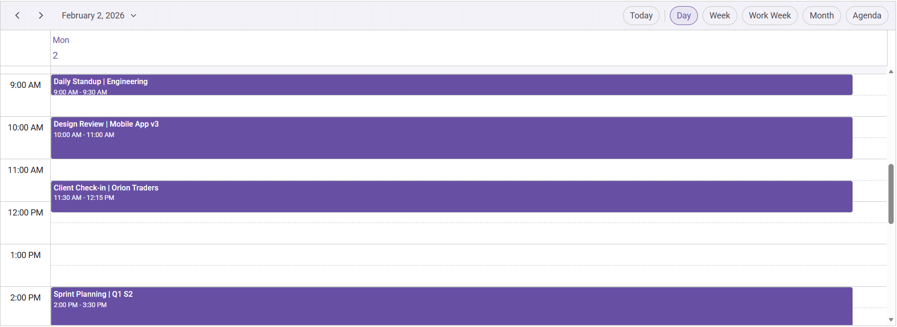

# Syncfusion® React Scheduler using Vite and JavaScript

This article provides a step-by-step guide for setting up a [Vite](https://vite.dev/guide/) project with JavaScript and integrating [Syncfusion® React Schedule component](https://www.syncfusion.com/react-components/react-scheduler). 

Vite is a fast, modern build tool and development server optimized for projects using technologies such as ES modules, TypeScript, JSX, and CSS modules. Its development server leverages native ES modules in modern browsers, providing rapid project startup and efficient feedback during development.

## Prerequisites
[System requirements for Syncfusion® React UI components](https://ej2.syncfusion.com/react/documentation/system-requirement)

## Set up the Vite project
To create a new `Vite` project, use one of the commands that are specific to either NPM or Yarn.




npm create vite@latest 




yarn create vite 




Using one of the above commands will lead you to set up additional configurations for the project as below:

**Step 1: Define the project name** - You can specify the name of the project directly. Let’s specify the name of the project as **react-app** for this article.




√ Project name: » **react-app**




**Step 2: Select the framework** - Select `React` as the framework. This will create a React project.




√ Select a framework: » **React**   




**Step 3: Choose the framework variant** - Select `JavaScript` as the framework variant to build this Vite project using JavaScript.




√ Select a variant: » **JavaScript**   




**Step 4:** If prompted for experimental options, choose according to your needs. In this guide, **No** option is selected.




√ Use rolldown-vite (Experimental)?: » **No**   




**Step 5:** When asked whether to install dependencies and start now, choose “Yes” to install and run immediately, or “No” to install later and run the dev server manually.




√ Install with npm and start now? » **Yes**  




After executing the above commands, the application will be available at: `http://localhost:5173`

## Add Syncfusion® React Scheduler packages

Syncfusion® React component packages are available at [npmjs.com](https://www.npmjs.com/search?q=ej2-react). To use Syncfusion® React Schedule component in the project, install the corresponding npm package [Syncfusion React Scheduler Package](https://www.npmjs.com/package/@syncfusion/ej2-react-schedule) by the command given below.




npm install @syncfusion/ej2-react-schedule




yarn add @syncfusion/ej2-react-schedule




## Import Syncfusion® CSS styles
In this example, the material theme styles for the Scheduler and its dependencies are imported in the `src/App.css`.




@import "../node_modules/@syncfusion/ej2-base/styles/material.css";
@import "../node_modules/@syncfusion/ej2-buttons/styles/material.css";
@import "../node_modules/@syncfusion/ej2-calendars/styles/material.css";
@import "../node_modules/@syncfusion/ej2-dropdowns/styles/material.css";
@import "../node_modules/@syncfusion/ej2-inputs/styles/material.css";
@import "../node_modules/@syncfusion/ej2-navigations/styles/material.css";
@import "../node_modules/@syncfusion/ej2-popups/styles/material.css";
@import "../node_modules/@syncfusion/ej2-react-schedule/styles/material.css";




> The order of importing CSS styles should be in line with its dependency graph.

## Add Syncfusion® React Schedule component
In the `src/App.jsx` file, use the following code snippet to render the Syncfusion React Schedule component and import `App.css` to apply styles to the Scheduler.




import './App.css';
import { ScheduleComponent, Day, Week, WorkWeek, Month, Agenda, Inject } from '@syncfusion/ej2-react-schedule';

const App = () => {

	return (<ScheduleComponent>
	  	<Inject services={[Day, Week, WorkWeek, Month, Agenda]} />
	</ScheduleComponent>);

};
export default App;



        
> Above demo will display the empty scheduler.

## Populating appointments

To populate the empty Scheduler with appointments, bind the event data to it by assigning the `dataSource` property either with valid JSON data or else with remote URL, from where the data will be fetched.

Here, the local JSON data is assigned to Scheduler's dataSource.




import './App.css';
import { ScheduleComponent, Day, Week, WorkWeek, Month, Agenda, Inject } from '@syncfusion/ej2-react-schedule';
const App = () => {

    const data = [
      {
        Id: '101',
        Subject: 'Daily Standup | Engineering',
        StartTime: new Date(2026, 1, 2, 9, 0),
        EndTime: new Date(2026, 1, 2, 9, 30),
      },
      {
        Id: '102',
        Subject: 'Design Review | Mobile App v3',
        StartTime: new Date(2026, 1, 2, 10, 0),
        EndTime: new Date(2026, 1, 2, 11, 0),
      },
      {
        Id: '103',
        Subject: 'Client Check-in | Orion Traders',
        StartTime: new Date(2026, 1, 2, 11, 30),
        EndTime: new Date(2026, 1, 2, 12, 15),
      },
      {
        Id: '104',
        Subject: 'Sprint Planning | Q1 S2',
        StartTime: new Date(2026, 1, 2, 14, 0),
        EndTime: new Date(2026, 1, 2, 15, 30),
      },
      {
        Id: '105',
        Subject: 'Vendor Call | Cloud Cost Optimization',
        StartTime: new Date(2026, 1, 2, 16, 0),
        EndTime: new Date(2026, 1, 2, 17, 0),
      },
    ];

    const eventSettings = { dataSource: data }

    return (<ScheduleComponent height='550px' selectedDate={new Date(2026, 1, 2)} currentView='Day' eventSettings={eventSettings} >
      	<Inject services={[Day, Week, WorkWeek, Month, Agenda]} />
    </ScheduleComponent>);

};
export default App;




## Run the project
To run the project, use the following command:




npm run dev




yarn run dev




## Output Preview
**Syncfusion React Scheduler**

*Image illustrating the Syncfusion React Scheduler* 

> Please find the sample in this [GitHub location](https://github.com/SyncfusionExamples/How-to-integrate-Syncfusion-React-Scheduler-with-Vite)