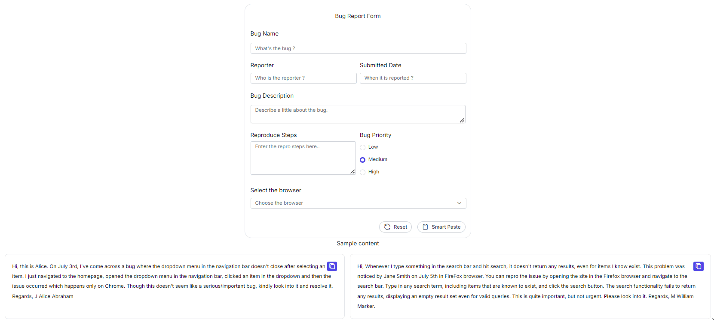

# Annotation in React Smart Paste Button

The `data-smartpaste-description` attribute allows you to customize the behavior of the React Smart Paste Button by providing contextual instructions for individual form fields. These instructions help the Smart Paste Button understand how pasted content should be interpreted, organized, and populated within the form. By defining field-specific expectations, you can improve the accuracy and consistency of AI-assisted form filling.

## Purpose of data-smartpaste-description

* This custom data attribute can be added to form elements to provide contextual information about the expected content.

* It helps the Smart Paste Button identify how pasted information should be processed and mapped to the corresponding form fields.

* You can use it to describe formatting requirements, content structure, naming conventions, and other field-specific instructions.

* It improves the accuracy of Smart Paste operations by providing additional context for interpreting pasted content.

* It helps maintain consistency and data quality across forms by ensuring that information is organized according to the specified guidelines.

## Use Annotations to Customize Paste Behavior

Add the **data-smartpaste-description** attribute to the form fields where Smart Paste should apply custom interpretation or formatting rules. Specify the instruction, expected format, or content requirement as the attribute value. During the paste operation, the Smart Paste Button uses this information to better understand the expected input and populate fields more accurately.


```html

<input type="text" id="reporter-name" name="reporter-name" class="form-input" data-smartpaste-description="Name must follow the format: Initial Firstname Lastname" />

```

## Example cases demonstrating the use of annotations to enhance user experience




import { useEffect } from 'react';
import { ButtonComponent, ChatOptions, SmartPasteButtonComponent } from "@syncfusion/ej2-react-buttons";
import { TextBoxComponent, TextAreaComponent } from "@syncfusion/ej2-react-inputs";
import { RadioButtonComponent } from "@syncfusion/ej2-react-buttons";
import { ComboBoxComponent } from "@syncfusion/ej2-react-dropdowns";
import { getAzureChatAIRequest } from './ai-models';
import { createSpinner, hideSpinner, showSpinner } from '@syncfusion/ej2-react-popups';

function SmartPaste() {
    useEffect(() => {
        createSpinner({
            target: document.getElementById('bug-form')!,
        });
        buttonInstance = {
            button1: copyButton1.element,
            button2: copyButton2.element,
        };
        (document.querySelector('#reproduce-steps') as HTMLElement).addEventListener('change', () => {
            hideSpinner(document.getElementById('bug-form') as HTMLElement);
        });
    }, []);
    let buttonInstance: { [key: string]: HTMLElement | null } = {};
    const idArray: string[] = ['1', '2'];
    let copyButton1: ButtonComponent;
    let copyButton2: ButtonComponent;

    const serverAIRequest = async (options: ChatOptions) => {
        let output: string = '';
        try {
            output = await getAzureChatAIRequest(options) as string;
        } catch (error) {
            console.error("Error:", error);
        }
        return output;
    };

    const smartPasteClickHandler = () => {
        showSpinner(document.getElementById('bug-form') as HTMLElement);
    }

    async function copyContent(id: string) {
        let text = document.getElementById('copy-content' + id)?.innerText;
        await navigator.clipboard.writeText(text as string);
        let inactive: string = idArray.filter((item) => item !== id)[0];
        buttonInstance['button' + inactive]?.querySelector('span')?.classList.replace('e-check', 'e-copy');
        buttonInstance['button' + id]?.querySelector('span')?.classList.replace('e-copy', 'e-check');
    }

    return (
        <>
            <div id="bug-form">
                <form className="form-container container bug-form-container" style={{
                    maxWidth: "900px",
                    lineHeight: "35px", backgroundColor: "#f3f4f6"
                }}>
                    <div className="single-row-group">
                        <label htmlFor="bug-name" className="e-form-label">Bug Name</label>
                        <TextBoxComponent id="bug-name" placeholder="What's the bug ?" floatLabelType="Never" />
                    </div>
                    <div className="row-group">
                        <div>
                            <label htmlFor="reporter-name" className="e-form-label">Reporter</label>
                            <TextBoxComponent id="reporter-name" placeholder="Who is the reporter ?" 
                             data-smartpaste-description="Name must follow the format: Initial Firstname Lastname"
                            floatLabelType="Never" />
                        </div>
                        <div>
                            <label htmlFor="submitted-date" className="e-form-label">Submitted Date</label>
                            <TextBoxComponent id="submitted-date" placeholder="When it is reported ?" 
                            data-smartpaste-description="Date must follow the format: Month Day. For ex: May 01"
                            floatLabelType="Never" />
                        </div>
                    </div>
                    <div className="form-group">
                        <label htmlFor="bug-description" className="e-form-label">Bug Description</label>
                        <TextAreaComponent id="bug-description" placeholder="Describe a little about the bug." rows={2} floatLabelType="Never" />
                    </div>
                    <div className="row-group">
                        <div style={{ display: "flex", flexDirection: "column" }}>
                            <label htmlFor="reproduce-steps" className="e-form-label">Reproduce Steps</label>
                            <TextAreaComponent id="reproduce-steps" placeholder="Enter the repro steps here.." 
                            data-smartpaste-description="Structure each steps in a Numbered format."
                            cols={30} rows={4} floatLabelType="Never" />
                        </div>
                        <div>
                            <label className="form-label">Bug Priority</label>
                            <div className="row">
                                <RadioButtonComponent id="radio1" label="Low" name="bug-priority" value="low" />
                            </div>
                            <div className="row">
                                <RadioButtonComponent id="radio2" label="Medium" name="bug-priority" value="medium" checked={true} />
                            </div>
                            <div className="row">
                                <RadioButtonComponent id="radio3" label="High" name="bug-priority" value="high" />
                            </div>
                        </div>
                    </div>
                    <div>
                        <label htmlFor="browser" className="form-label">Select the browser</label>
                        <ComboBoxComponent id="browser" popupHeight='230px' dataSource={['Chrome', 'Firefox', 'Safari']} placeholder='Choose the browser' />
                    </div>
                    <div className="form-footer">
                        <ButtonComponent type="reset" id="reset" content="Reset" iconCss="e-icons e-reset" className="form-button" />
                        <SmartPasteButtonComponent type="button" id="smart-paste" className="form-button"
                            isPrimary={true}
                            content={'Smart Paste'}
                            iconCss={"e-icons e-paste"}
                            onClick={smartPasteClickHandler}
                            aiAssistHandler={serverAIRequest} />
                    </div>
                </form>
            </div>

            <div className="col-lg-12 property-section" style={{ paddingTop: '5px' }}>
                <h4 style={{ textAlign: 'center', fontSize: '1.2rem' }}> Sample content </h4>
                <div className="content-flexed">
                    <div className="content-body" data-index="0">
                        <div className="copy-container" style={{ float: 'right' }}>
                            <ButtonComponent ref={btn => copyButton1 = btn as ButtonComponent} id="copy1" onClick={() => copyContent('1')} aria-label="content-copy-button" className="e-control e-btn e-lib custom-copy-icon e-primary e-icon-btn">
                                <span className="e-icons e-copy e-btn-icon"></span>
                            </ButtonComponent>
                        </div>
                        <div id="copy-content1">
                            Hi, this is Alice. On July 3rd, I've come across a bug where the dropdown menu in the navigation bar doesn't close after selecting an item. I just navigated to the homepage, opened the dropdown menu in the navigation bar, clicked an item in the dropdown and then the issue occurred which happens only on Chrome. Though this doesn't seem like a serious/important bug, kindly look into it and resolve it. Regards, J Alice Abraham
                        </div>
                    </div>
                    <div className="content-body" data-index="1">
                        <div className="copy-container" style={{ float: 'right' }}>
                            <ButtonComponent ref={btn => copyButton2 = btn as ButtonComponent} id="copy2" onClick={() => copyContent('2')} aria-label="content-copy-button" className="e-control e-btn e-lib custom-copy-icon e-primary e-icon-btn">
                                <span className="e-icons e-copy e-btn-icon"></span>
                            </ButtonComponent>
                        </div>
                        <div id="copy-content2">
                            Hi, Whenever I type something in the search bar and hit search, it doesn't return any results, even for items I know exist. This problem was noticed by Jane Smith on July 5th in FireFox browser. You can repro the issue by opening the site in the Firefox browser and navigate to the search bar. Type in any search term, including items that are known to exist, and click the search button. The search functionality fails to return any results, displaying an empty result set even for valid queries. This is quite important, but not urgent. Please look into it. Regards, M William Marker.
                        </div>
                    </div>
                </div>
            </div>
        </>
    );
}

export default SmartPaste;




import { generateText } from "ai"
import { createGoogleGenerativeAI } from '@ai-sdk/google';
import { createAzure } from '@ai-sdk/azure';
import { createOpenAI } from '@ai-sdk/openai';

//Warning: Do not expose your API key in the client-side code. This is only for demonstration purposes.

const google = createGoogleGenerativeAI({
    baseURL: "https://generativelanguage.googleapis.com/v1beta",
    apiKey: "API_KEY"
});
const azure = createAzure({
    resourceName: 'RESOURCE_NAME',
    apiKey: 'API_KEY',
});
const groq = createOpenAI({
    baseURL: 'https://api.groq.com/openai/v1',
    apiKey: 'API_KEY',
});

const aiModel = azure('MODEL_NAME'); // Update the model here

export async function getAzureChatAIRequest(options: any) {
    try {
        const result = await generateText({
            model: aiModel,
            messages: options.messages,
            topP: options.topP,
            temperature: options.temperature,
            maxTokens: options.maxTokens,
            frequencyPenalty: options.frequencyPenalty,
            presencePenalty: options.presencePenalty,
            stopSequences: options.stopSequences
        });
        return result.text;
    } catch (err) {
        console.error("Error occurred:", err);
        return null;
    }
}






These examples illustrate how using **data-smartpaste-description** attributes can provide fine-grained control over pasting behaviors, ensuring that the Smart Paste Button meets specific requirements and enhances the user experience.
