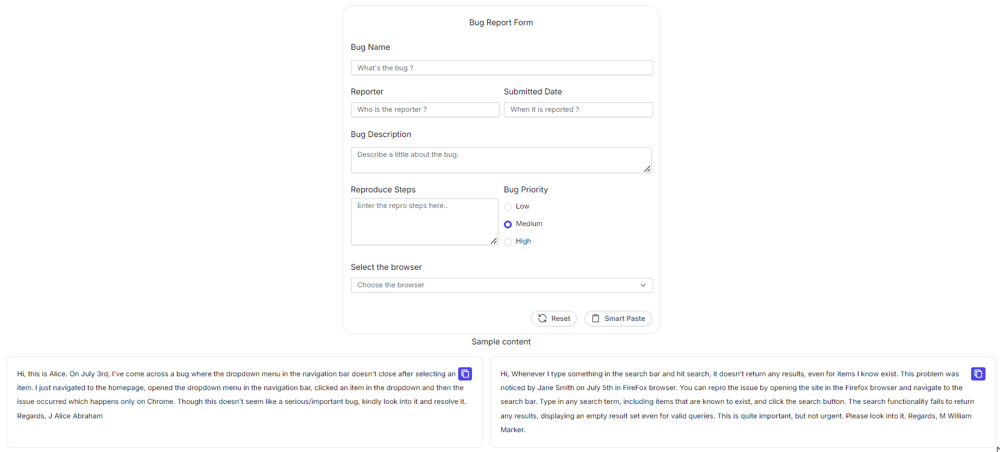

# Getting Started with React Smart Paste Button Component

The `Smart Paste Button` is a user interface component designed to simplify and improve the experience of pasting text into form fields. It comes with smart features such as automatic text formatting, validation, and integration with various form components. It is especially useful in applications where users frequently paste text from other sources and where data consistency is important.

This section explains how to create a simple Smart Paste Button, and configure its available functionalities in React, using React quickstart application.

## Prerequisites

* [System requirements for Syncfusion<sup style="font-size:70%">&reg;</sup> React UI components](https://ej2.syncfusion.com/react/documentation/system-requirement)
* [OpenAI](https://github.com/syncfusion/smart-ai-samples/blob/master/react/README.md#openai) or [Azure OpenAI Account](https://learn.microsoft.com/en-us/azure/ai-services/openai/how-to/create-resource)

## Dependencies

The following list of dependencies are required to use Smart Paste Button component in your application.

```javascript
|-- @syncfusion/ej2-react-buttons
    |-- @syncfusion/ej2-react-base
    |-- @syncfusion/ej2-base
    |-- @syncfusion/ej2-buttons
```

## Create the React application

To easily set up a React application, use `create-vite-app`, which provides a faster development environment, smaller bundle sizes, and optimized builds compared to traditional tools like `create-react-app`. For detailed steps, refer to the Vite [installation instructions](https://vitejs.dev/guide/). Vite sets up your environment using JavaScript and optimizes your application for production.

> **Note:**  To create a React application using `create-react-app`, refer to this [documentation](https://ej2.syncfusion.com/react/documentation/getting-started/create-app) for more details.

To create a new React application, run the following command.

```bash
npm create vite@latest my-app
```
To set-up a React application in TypeScript environment, run the following command.

```bash
npm create vite@latest my-app -- --template react-ts
cd my-app
npm run dev
```
To set-up a React application in JavaScript environment, run the following command.

```bash
npm create vite@latest my-app -- --template react
cd my-app
npm run dev
```

## Adding Syncfusion<sup style="font-size:70%">&reg;</sup> packages

All the available Essential<sup style="font-size:70%">&reg;</sup> JS 2 packages are published in [npmjs.com](https://www.npmjs.com/~syncfusionorg) public registry.
You can choose the component that you want to install. For this application, we are going to use Smart Paste Button component.

To install Smart Paste Button component, use the following command

```bash
npm install @syncfusion/ej2-react-buttons --save
```


## Adding CSS Reference

Import the Smart Paste Button component's required CSS references as follows in `src/App.css`.

```css
@import "../node_modules/@syncfusion/ej2-base/styles/fluent2.css";
@import "../node_modules/@syncfusion/ej2-react-buttons/styles/fluent2.css";
```

## Adding Smart Paste Button component to the Application

To include Smart Paste Button component in your application import the `SmartPasteButtonComponent` from `ej2-react-buttons` package in `App.tsx`. The component utilizes the [aiAssistHandler](https://ej2.syncfusion.com/react/documentation/api/smart-paste-button/smartPasteButtonModel/#aiassisthandler) property, a callback function that sends a request to the AI model and updates the form with the generated content based on the AI's response.

Add Smart Paste Button component in application as shown in below code example.

```
import { ChatOptions, SmartPasteButtonComponent } from "@syncfusion/ej2-react-buttons";

function SmartPaste() {
    const serverAIRequest = async (options: ChatOptions) => {
        let output: string = '';
        try {
            output = await getAzureChatAIRequest(options) as string;
        } catch (error) {
            console.error("Error:", error);
        }
        return output;
    };

    return ( <SmartPasteButtonComponent type="button" id="smart-paste" className="form-button"
            isPrimary={true} content={'Smart Paste'}
            iconCss={"e-icons e-paste"}
            aiAssistHandler={serverAIRequest} />
    );
}

export default SmartPaste;

```
## Run the application

Now run the `npm run dev` command in the console to start the development server. This command compiles your code and serves the application locally, opening it in the browser.

```bash
npm run dev
```


* The following example shows the Smart Paste Button component filling out a bug form, and users can integrate any text-generative AI of their choice.




import { useEffect } from 'react';
import { ButtonComponent, ChatOptions, SmartPasteButtonComponent } from "@syncfusion/ej2-react-buttons";
import { TextBoxComponent, TextAreaComponent } from "@syncfusion/ej2-react-inputs";
import { RadioButtonComponent } from "@syncfusion/ej2-react-buttons";
import { ComboBoxComponent } from "@syncfusion/ej2-react-dropdowns";
import { getAzureChatAIRequest } from './ai-models';
import { createSpinner, hideSpinner, showSpinner } from '@syncfusion/ej2-react-popups';

function SmartPaste() {
    useEffect(() => {
        createSpinner({
            target: document.getElementById('bug-form')!,
        });
        buttonInstance = {
            button1: copyButton1.element,
            button2: copyButton2.element,
        };
        (document.querySelector('#reproduce-steps') as HTMLElement).addEventListener('change', () => {
            hideSpinner(document.getElementById('bug-form') as HTMLElement);
        });
    }, []);
    let buttonInstance: { [key: string]: HTMLElement | null } = {};
    const idArray: string[] = ['1', '2'];
    let copyButton1: ButtonComponent;
    let copyButton2: ButtonComponent;

    const serverAIRequest = async (options: ChatOptions) => {
        let output: string = '';
        try {
            output = await getAzureChatAIRequest(options) as string;
        } catch (error) {
            console.error("Error:", error);
        }
        return output;
    };

    const smartPasteClickHandler = () => {
        showSpinner(document.getElementById('bug-form') as HTMLElement);
    }

    async function copyContent(id: string) {
        let text = document.getElementById('copy-content' + id)?.innerText;
        await navigator.clipboard.writeText(text as string);
        let inactive: string = idArray.filter((item) => item !== id)[0];
        buttonInstance['button' + inactive]?.querySelector('span')?.classList.replace('e-check', 'e-copy');
        buttonInstance['button' + id]?.querySelector('span')?.classList.replace('e-copy', 'e-check');
    }

    return (
        <>
            <div id="bug-form">
                <form className="form-container container bug-form-container" style={ {{
                    maxWidth: "900px",
                    lineHeight: "35px", backgroundColor: "#f3f4f6"
                }} }>
                    <div className="single-row-group">
                        <label htmlFor="bug-name" className="e-form-label">Bug Name</label>
                        <TextBoxComponent id="bug-name" placeholder="What's the bug ?" floatLabelType="Never" />
                    </div>
                    <div className="row-group">
                        <div>
                            <label htmlFor="reporter-name" className="e-form-label">Reporter</label>
                            <TextBoxComponent id="reporter-name" placeholder="Who is the reporter ?" floatLabelType="Never" />
                        </div>
                        <div>
                            <label htmlFor="submitted-date" className="e-form-label">Submitted Date</label>
                            <TextBoxComponent id="submitted-date" placeholder="When it is reported ?" floatLabelType="Never" />
                        </div>
                    </div>
                    <div className="form-group">
                        <label htmlFor="bug-description" className="e-form-label">Bug Description</label>
                        <TextAreaComponent id="bug-description" placeholder="Describe a little about the bug." rows={2} floatLabelType="Never" />
                    </div>
                    <div className="row-group">
                        <div style={ {{ display: "flex", flexDirection: "column" }} }>
                            <label htmlFor="reproduce-steps" className="e-form-label">Reproduce Steps</label>
                            <TextAreaComponent id="reproduce-steps" placeholder="Enter the repro steps here.." cols={30} rows={4} floatLabelType="Never" />
                        </div>
                        <div>
                            <label className="form-label">Bug Priority</label>
                            <div className="row">
                                <RadioButtonComponent id="radio1" label="Low" name="bug-priority" value="low" />
                            </div>
                            <div className="row">
                                <RadioButtonComponent id="radio2" label="Medium" name="bug-priority" value="medium" checked={true} />
                            </div>
                            <div className="row">
                                <RadioButtonComponent id="radio3" label="High" name="bug-priority" value="high" />
                            </div>
                        </div>
                    </div>
                    <div>
                        <label htmlFor="browser" className="form-label">Select the browser</label>
                        <ComboBoxComponent id="browser" popupHeight='230px' dataSource={['Chrome', 'Firefox', 'Safari']} placeholder='Choose the browser' />
                    </div>
                    <div className="form-footer">
                        <ButtonComponent type="reset" id="reset" content="Reset" iconCss="e-icons e-reset" className="form-button" />
                        <SmartPasteButtonComponent type="button" id="smart-paste" className="form-button"
                            isPrimary={true}
                            content={'Smart Paste'}
                            iconCss={"e-icons e-paste"}
                            onClick={smartPasteClickHandler}
                            aiAssistHandler={serverAIRequest} />
                    </div>
                </form>
            </div>

            <div className="col-lg-12 property-section" style={ {{ paddingTop: '5px' }} }>
                <h4 style={ {{ textAlign: 'center', fontSize: '1.2rem' }} }> Sample content </h4>
                <div className="content-flexed">
                    <div className="content-body" data-index="0">
                        <div className="copy-container" style={ {{ float: 'right' }} }>
                            <ButtonComponent ref={btn => copyButton1 = btn as ButtonComponent} id="copy1" onClick={() => copyContent('1')} aria-label="content-copy-button" className="e-control e-btn e-lib custom-copy-icon e-primary e-icon-btn">
                                <span className="e-icons e-copy e-btn-icon"></span>
                            </ButtonComponent>
                        </div>
                        <div id="copy-content1">
                            Hi, this is Alice. On July 3rd, I've come across a bug where the dropdown menu in the navigation bar doesn't close after selecting an item. I just navigated to the homepage, opened the dropdown menu in the navigation bar, clicked an item in the dropdown and then the issue occurred which happens only on Chrome. Though this doesn't seem like a serious/important bug, kindly look into it and resolve it. Regards, J Alice Abraham
                        </div>
                    </div>
                    <div className="content-body" data-index="1">
                        <div className="copy-container" style={ {{ float: 'right' }} }>
                            <ButtonComponent ref={btn => copyButton2 = btn as ButtonComponent} id="copy2" onClick={() => copyContent('2')} aria-label="content-copy-button" className="e-control e-btn e-lib custom-copy-icon e-primary e-icon-btn">
                                <span className="e-icons e-copy e-btn-icon"></span>
                            </ButtonComponent>
                        </div>
                        <div id="copy-content2">
                            Hi, Whenever I type something in the search bar and hit search, it doesn't return any results, even for items I know exist. This problem was noticed by Jane Smith on July 5th in FireFox browser. You can repro the issue by opening the site in the Firefox browser and navigate to the search bar. Type in any search term, including items that are known to exist, and click the search button. The search functionality fails to return any results, displaying an empty result set even for valid queries. This is quite important, but not urgent. Please look into it. Regards, M William Marker.
                        </div>
                    </div>
                </div>
            </div>
        </>
    );
}

export default SmartPaste;




import { generateText } from "ai"
import { createGoogleGenerativeAI } from '@ai-sdk/google';
import { createAzure } from '@ai-sdk/azure';
import { createOpenAI } from '@ai-sdk/openai';

//Warning: Do not expose your API key in the client-side code. This is only for demonstration purposes.

const google = createGoogleGenerativeAI({
    baseURL: "https://generativelanguage.googleapis.com/v1beta",
    apiKey: "API_KEY"
});
const azure = createAzure({
    resourceName: 'RESOURCE_NAME',
    apiKey: 'API_KEY',
});
const groq = createOpenAI({
    baseURL: 'https://api.groq.com/openai/v1',
    apiKey: 'API_KEY',
});

const aiModel = azure('MODEL_NAME'); // Update the model here

export async function getAzureChatAIRequest(options: any) {
    try {
        const result = await generateText({
            model: aiModel,
            messages: options.messages,
            topP: options.topP,
            temperature: options.temperature,
            maxTokens: options.maxTokens,
            frequencyPenalty: options.frequencyPenalty,
            presencePenalty: options.presencePenalty,
            stopSequences: options.stopSequences
        });
        return result.text;
    } catch (err) {
        console.error("Error occurred:", err);
        return null;
    }
}






> [View React Smart Paste Button Sample in GitHub](https://github.com/syncfusion/smart-ai-samples/tree/master/react/src/ai-components/smartpaste)