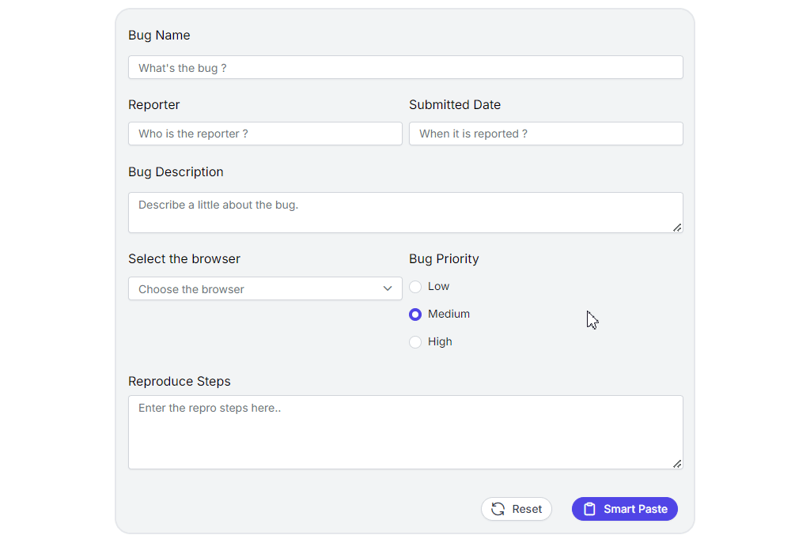

# Handling Validation in Smart Paste Button

The `Smart Paste Button` can be configured to validate that all required input form fields have been pasted with content. If any form fields are empty, validation will be triggered to ensure that all necessary information is provided before proceeding.




import { useEffect } from 'react';
import { ButtonComponent, ChatOptions, SmartPasteButtonComponent } from "@syncfusion/ej2-react-buttons";
import { TextBoxComponent, TextAreaComponent, FormValidator, FormValidatorModel } from "@syncfusion/ej2-react-inputs";
import { RadioButtonComponent } from "@syncfusion/ej2-react-buttons";
import { ComboBoxComponent } from "@syncfusion/ej2-react-dropdowns";
import { getAzureChatAIRequest } from './ai-models';
import { createSpinner, hideSpinner, showSpinner } from '@syncfusion/ej2-react-popups';
import './smart-paste.css';

function SmartPasteValidation() {
    let formObject: FormValidator;
    useEffect(() => {
        const options: FormValidatorModel = {
            // validation rules
            rules: {
                'bug-name': {
                    required: [true],
                },
                'reporter-name': {
                    required: [true],
                },
                'submitted-date': {
                    required: [true],
                },
                'bug-description': {
                    required: [true],
                },
                'reproduce-steps': {
                    required: [true]
                },
                'browser': {
                    required: [true]
                }

            },
        };
        // Initialize the form validator
        formObject = new FormValidator('#ai-bug-form', options);
        createSpinner({
            target: document.getElementById('bug-form')!,
        });
        buttonInstance = {
            button1: copyButton1.element,
            button2: copyButton2.element,
        };
        (document.querySelector('#reproduce-steps') as HTMLElement).addEventListener('change', () => {
            hideSpinner(document.getElementById('bug-form') as HTMLElement);
            formObject.validate();
        });
    }, []);
    let buttonInstance: { [key: string]: HTMLElement | null } = {};
    const idArray: string[] = ['1', '2'];
    let copyButton1: ButtonComponent;
    let copyButton2: ButtonComponent;

    const serverAIRequest = async (options: ChatOptions) => {
        let output: string = '';
        try {
            output = await getAzureChatAIRequest(options) as string;
        } catch (error) {
            console.error("Error:", error);
        }
        return output;
    };

    const smartPasteClickHandler = () => {
        showSpinner(document.getElementById('bug-form') as HTMLElement);
    }

    async function copyContent(id: string) {
        let text = document.getElementById('copy-content' + id)?.innerText;
        await navigator.clipboard.writeText(text as string);
        let inactive: string = idArray.filter((item) => item !== id)[0];
        buttonInstance['button' + inactive]?.querySelector('span')?.classList.replace('e-check', 'e-copy');
        buttonInstance['button' + id]?.querySelector('span')?.classList.replace('e-copy', 'e-check');
    }

    return (
        <>
            

                <form id="ai-bug-form" className="form-container container bug-form-container" style={ {{
                    maxWidth: "900px",
                    lineHeight: "35px", backgroundColor: "#f3f4f6"
                }} }>
                    

                        <label htmlFor="bug-name" className="e-form-label">Bug Name</label>
                        <TextBoxComponent id="bug-name" placeholder="What's the bug ?" floatLabelType="Never" />
                    

                    

                        

                            <label htmlFor="reporter-name" className="e-form-label">Reporter</label>
                            <TextBoxComponent id="reporter-name" placeholder="Who is the reporter ?" floatLabelType="Never" />
                        

                        

                            <label htmlFor="submitted-date" className="e-form-label">Submitted Date</label>
                            <TextBoxComponent id="submitted-date" placeholder="When it is reported ?" floatLabelType="Never" />
                        

                    

                    

                        <label htmlFor="bug-description" className="e-form-label">Bug Description</label>
                        <TextAreaComponent id="bug-description" placeholder="Describe a little about the bug." rows={2} floatLabelType="Never" />
                    

                    

                        

                            <label htmlFor="browser" className="form-label">Select the browser</label>
                            <ComboBoxComponent id="browser" popupHeight='230px' dataSource={['Chrome', 'Firefox', 'Safari']} placeholder='Choose the browser' />
                        

                        

                            <label className="form-label">Bug Priority</label>
                            

                                <RadioButtonComponent id="radio1" label="Low" name="bug-priority" value="low" />
                            

                            

                                <RadioButtonComponent id="radio2" label="Medium" name="bug-priority" value="medium" checked={true} />
                            

                            

                                <RadioButtonComponent id="radio3" label="High" name="bug-priority" value="high" />
                            

                        

                    

                    

                        <label htmlFor="reproduce-steps" className="e-form-label">Reproduce Steps</label>
                        <TextAreaComponent id="reproduce-steps" placeholder="Enter the repro steps here.." cols={30} rows={4} floatLabelType="Never" />
                    

                    

                        <ButtonComponent type="reset" id="reset" content="Reset" iconCss="e-icons e-reset" className="form-button" />
                        <SmartPasteButtonComponent type="button" id="smart-paste" className="form-button"
                            isPrimary={true}
                            content={'Smart Paste'}
                            iconCss={"e-icons e-paste"}
                            onClick={smartPasteClickHandler}
                            aiAssistHandler={serverAIRequest} />
                    

                </form>
            

            

                <h4 style={ {{ textAlign: 'center', fontSize: '1.2rem' }} }> Sample content </h4>
                

                    

                        

                            <ButtonComponent ref={btn => copyButton1 = btn as ButtonComponent} id="copy1" onClick={() => copyContent('1')} aria-label="content-copy-button" className="e-control e-btn e-lib custom-copy-icon e-primary e-icon-btn">
                                
                            </ButtonComponent>
                        

                        

                            Hi, this is Alice. On July 3rd, I've come across a bug where the dropdown menu in the navigation bar doesn't close after selecting an item. I just navigated to the homepage, opened the dropdown menu in the navigation bar, clicked an item in the dropdown and then the issue occurred which happens only on Chrome. Though this doesn't seem like a serious/important bug, kindly look into it and resolve it. Regards, J Alice Abraham
                        

                    

                    

                        

                            <ButtonComponent ref={btn => copyButton2 = btn as ButtonComponent} id="copy2" onClick={() => copyContent('2')} aria-label="content-copy-button" className="e-control e-btn e-lib custom-copy-icon e-primary e-icon-btn">
                                
                            </ButtonComponent>
                        

                        

                            Hi, Whenever I type something in the search bar and hit search, it doesn't return any results, even for items I know exist. This problem was noticed by Jane Smith on July 5th in FireFox browser. You can repro the issue by opening the site in the Firefox browser and navigate to the search bar. Type in any search term, including items that are known to exist, and click the search button. The search functionality fails to return any results, displaying an empty result set even for valid queries. This is quite important, but not urgent. Please look into it. Regards, M William Marker.
                        

                    

                

            

        </>
    )
}

export default SmartPasteValidation




import { generateText } from "ai"
import { createGoogleGenerativeAI } from '@ai-sdk/google';
import { createAzure } from '@ai-sdk/azure';
import { createOpenAI } from '@ai-sdk/openai';

//Warning: Do not expose your API key in the client-side code. This is only for demonstration purposes.

const google = createGoogleGenerativeAI({
    baseURL: "https://generativelanguage.googleapis.com/v1beta",
    apiKey: "API_KEY"
});
const azure = createAzure({
    resourceName: 'RESOURCE_NAME',
    apiKey: 'API_KEY',
});
const groq = createOpenAI({
    baseURL: 'https://api.groq.com/openai/v1',
    apiKey: 'API_KEY',
});

const aiModel = azure('MODEL_NAME'); // Update the model here

export async function getAzureChatAIRequest(options: any) {
    try {
        const result = await generateText({
            model: aiModel,
            messages: options.messages,
            topP: options.topP,
            temperature: options.temperature,
            maxTokens: options.maxTokens,
            frequencyPenalty: options.frequencyPenalty,
            presencePenalty: options.presencePenalty,
            stopSequences: options.stopSequences
        });
        return result.text;
    } catch (err) {
        console.error("Error occurred:", err);
        return null;
    }
}




.form-container {
    display: flex;
    flex-direction: column;
    gap: 15px;
    border: 1px solid #ddd;
    padding: 20px;
    border-radius: 5px;
    width: 700px;
    margin: 0 auto;
}

.form-label {
    margin-bottom: 5px;
}

.form-input,
.form-textarea,
.form-select {
    padding: 10px;
    border: 1px solid #ccc;
    border-radius: 3px;
    width: 100%;
}

.form-textarea {
    height: 80px;
}

.content-body {
    line-height: 28px;
    font-size: 14px;
    max-width: 49%;
    border-radius: 10px;
    padding: 20px;
    border: 2px solid rgb(229 231 235 / var(--border-opacity));
    --border-opacity: 1;
}

.row-group {
    display: grid;
    grid-template-columns: repeat(2, 1fr);
    gap: 10px;
}

.form-footer {
    display: flex;
    margin-top: 20px;
    justify-content: right;
    gap: 15px;
}

.form-group {
    display: grid;
    gap: 8px;
}

.single-row-group {
    display: grid;
    gap: 8px;
}

#bug-report-text {
    padding: 10px;
    margin: 15px 0px;
    background-color: #f3f3f3;
    border: 1px solid #ddd;
    border-radius: 5px;
    line-height: 1.5;
}

#reset,
#smart-paste {
    border-radius: 20px;
}

.e-btn.e-icon-btn.custom-copy-icon {
    padding: 4px;
    font-size: 10px;
}

.e-btn.custom-copy-icon:focus {
    box-shadow: none;
}

.bug-form-container {
    position: relative;
    border-radius: 20px;
    padding: 15px;
    border: 2px solid rgb(229 231 235 / var(--border-opacity));
    --border-opacity: 1;
    max-width: 600px;
}

.bug-report {
    padding: 10px;
    margin: 15px 0px;
    background-color: #f3f3f3;
    border: 1px solid #ddd;
    border-radius: 5px;
    line-height: 1.5;
}

.content-flexed {
    display: flex;
    margin-top: 20px;
    gap: 14px;
}

#ai-bug-form .e-valid-input {
    border-color: #4CAF50;
}




