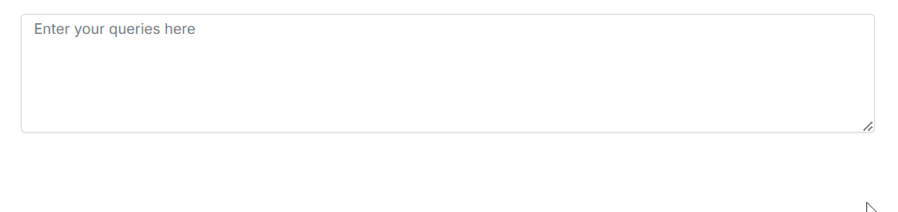
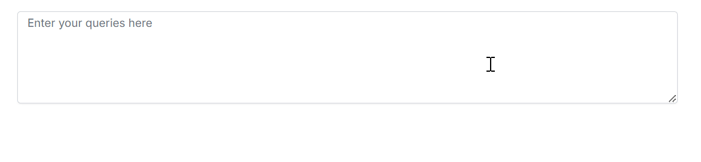

# Customizing Appearance of Suggestions

The [ShowSuggestionOnPopup](https://ej2.syncfusion.com/react/documentation/api/smart-textarea#aisuggestionhandler) property in Syncfusion React Smart TextArea allows you to control how text suggestions are displayed to the users.

* If `ShowSuggestionOnPopup` is `Enable`, suggestions displayed in the pop-up window




function SmartTextarea() {
    return (
        

            

                

                    

                        <SmartTextAreaComponent
                            id='smart-textarea'
                            placeholder={'Enter your queries here'}
                            floatLabelType={'Auto'}
                            rows={5}
                            userRole={'Employee communicating with internal team'}
                            UserPhrases={phrasesData}
                            aiSuggestionHandler={serverAIRequest}
                            ShowSuggestionOnPopup={'Enable'}
                        ></SmartTextAreaComponent>
                    

                

            

        

    );
}

export default SmartTextarea;




* If `ShowSuggestionOnPopup` is `false`, suggestions displayed inline.




function SmartTextarea() {
    return (
        

            

                

                    

                        <SmartTextAreaComponent
                            id='smart-textarea'
                            placeholder={'Enter your queries here'}
                            floatLabelType={'Auto'}
                            rows={5}
                            userRole={'Employee communicating with internal team'}
                            UserPhrases={phrasesData}
                            aiSuggestionHandler={serverAIRequest}
                            ShowSuggestionOnPopup={'Disable'}
                        ></SmartTextAreaComponent>
                    

                

            

        

    );
}

export default SmartTextarea;




By default `showSuggestionOnPopup` is `None`.

## See also

* [Getting Started with Syncfusion React Smart TextArea](./getting-started)