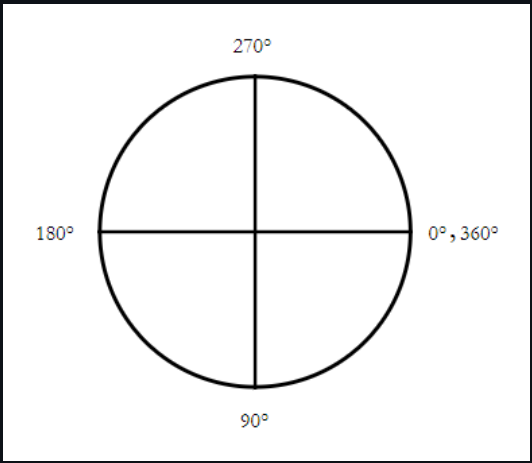

# Display Options in React Speed dial component

The action items in React Speed Dial can be displayed in `Linear` and `Radial` display modes by setting [`mode`](https://ej2.syncfusion.com/react/documentation/api/speed-dial#mode) property.

## Open option

You can use [`opensOnHover`](https://ej2.syncfusion.com/react/documentation/api/speed-dial#opensonhover) property to open actions items on hover itself. By default action items displayed only when clicking the speed dial button.












## Animation

The Speed Dial items can be animated during the opening and closing of the popup action items. You can customize the animation's `effect`, `delay`, and `duration` by setting [`animation`](https://ej2.syncfusion.com/react/documentation/api/speed-dial#animation) property. By default, Speed Dial animates with a `fade` effect and supports all [`speeddialanimation`](https://ej2.syncfusion.com/react/documentation/api/speed-dial/speedDialAnimationEffect/) effects.

Below example demonstrates the Speed Dial items with applied Zoom effect.












## Modes

You can use the [`Mode`](https://helpej2.syncfusion.com/react/documentation/api/speed-dial#mode) property to either display the menu in linear order like a list or like a radial menu in radial (circular) direction.

## Linear mode

In `Linear` display mode, Speed Dial action items are displayed in a list-like format either horizontally or vertically. By default, Speed Dial items are displayed in `Linear` mode.

### Direction

You can open the action items on the top, left, up, and down side of the Speed Dial button by setting [`direction`](https://ej2.syncfusion.com/react/documentation/api/speed-dial#direction) property. The default value is `Auto` where the action items are displayed based on the [`position`](https://ej2.syncfusion.com/react/documentation/api/speed-dial#position)of the Speed Dial.

The `Linear` directions of Speed Dial are as follows:

* Left - Action items are displayed on the left side of the button.
* Right - Action items are displayed on the right side of the button.
* Up - Action items are displayed on the top of the button.
* Down - Action items are displayed on the bottom of the button.
* Auto - Action items display direction auto calculated based on `position` of the Speed Dial. If Speed Dial is position at bottom right, then action items displayed at top.












# Radial mode

The React Speed Dial action items can be displayed in a circular patter like a radial menu by setting [`mode`](https://ej2.syncfusion.com/react/documentation/api/speed-dial/#mode) property. You can customize the `direction`, `startAngle`, `endAngle` and `offset` by setting [`radialSettings`](https://ej2.syncfusion.com/react/documentation/api/speed-dial#radialsettings) property.

## Direction

You can open the action items in either clockwise or anticlockwise by setting [`direction`](https://ej2.syncfusion.com/react/documentation/api/speed-dial/radialSettingsModel/#direction) property. The default value is [`Auto`](https://ej2.syncfusion.com/react/documentation/api/speed-dial/radialDirection/) where the action items are displayed based on the `position` property of the Speed Dial.

```ts
{/* Import the Speed Dial. */}
import { SpeedDialComponent, SpeedDialItemModel, RadialSettingsModel } from '@syncfusion/ej2-react-buttons';
import * as React from 'react';

{/* To render Speed Dial.*/}
function App() {

  const items: SpeedDialItemModel[] = [
    { iconCss: 'e-icons e-cut' },
    { iconCss: 'e-icons e-copy' },
    { iconCss: 'e-icons e-paste' },
    { iconCss: 'e-icons e-edit' },
    { iconCss: 'e-icons e-save' }
  ];

  const radialSettings: RadialSettingsModel = { direction: 'AntiClockwise' };

  return (
    {/* Initialize the SpeedDial component. */}
    <SpeedDialComponent id='speeddial' openIconCss='e-icons e-edit' closeIconCss='e-icons e-close' items={items} mode= 'Radial' radialSettings= {radialSettings} target="#targetElement"></SpeedDialComponent>
  );
}
export default App;
```

## start and end angle

You can modify the start and end angle of action items by setting [`startAngle`](https://ej2.syncfusion.com/react/documentation/api/speed-dial/radialSettingsModel/#startangle) and [`endAngle`](https://ej2.syncfusion.com/react/documentation/api/speed-dial/radialSettingsModel/#endangle) properties. If the angle is not defined, the action items are displayed based on the `position` property of the Speed Dial.

The SpeedDial angle starts with `0` degree in the right side and increases in the clockwise direction.



```ts
{/* Import the Speed Dial. */}
import { SpeedDialComponent, SpeedDialItemModel, RadialSettingsModel } from '@syncfusion/ej2-react-buttons';
import * as React from 'react';

{/* To render Speed Dial.*/}
function App() {

  const items: SpeedDialItemModel[] = [
    { iconCss: 'e-icons e-cut' },
    { iconCss: 'e-icons e-copy' },
    { iconCss: 'e-icons e-paste' },
    { iconCss: 'e-icons e-edit' },
    { iconCss: 'e-icons e-save' }
  ];

  const radialSettings: RadialSettingsModel = { direction: 'AntiClockwise', startAngle: 180, endAngle: 360 };

  return (
    {/* Initialize the SpeedDial component. */}
    <SpeedDialComponent id='speeddial' openIconCss='e-icons e-edit' closeIconCss='e-icons e-close' items={items} mode= 'Radial' radialSettings= {radialSettings} position='MiddleCenter' target="#targetElement"></SpeedDialComponent>
  );
}
export default App;
ReactDom.render(<App />,document.getElementById('button'));
```

## Offset

You can modify the offset distance between action items and Speed Dial button using [`offset`](https://ej2.syncfusion.com/react/documentation/api/speed-dial/radialSettingsModel/#offset) property.

```ts
{/* Import the Speed Dial. */}
import { SpeedDialComponent, SpeedDialItemModel, RadialSettingsModel } from '@syncfusion/ej2-react-buttons';
import * as React from 'react';

{/* To render Speed Dial.*/}
function App() {

  const items: SpeedDialItemModel[] = [
    { iconCss: 'e-icons e-cut' },
    { iconCss: 'e-icons e-copy' },
    { iconCss: 'e-icons e-paste' },
    { iconCss: 'e-icons e-edit' },
    { iconCss: 'e-icons e-save' }
  ];

  const radialSettings: RadialSettingsModel = { offset: '80px' };

  return (
    {/* Initialize the SpeedDial component. */}
    <SpeedDialComponent id='speeddial' openIconCss='e-icons e-edit' closeIconCss='e-icons e-close' items={items} mode= 'Radial' radialSettings= {radialSettings} target="#targetElement"></SpeedDialComponent>
  );
}
export default App;
```

Below example demonstrates the radial menu settings of the Speed Dial.










