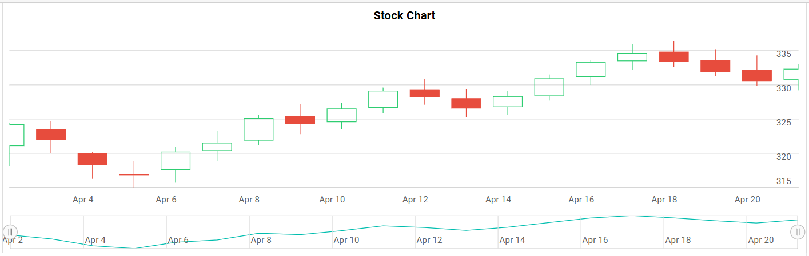

---
layout: post
title: Getting Started with React Stock Chart Component | Syncfusion
description: Checkout and learn about getting started with Syncfusion Essential React Stock Chart component, it's elements, and more details.
control: Getting started 
platform: ej2-react
documentation: ug
domainurl: ##DomainURL##
---
<!-- markdownlint-disable MD036 -->

# Getting Started with React Stock Chart Component

This section describes the steps to create a simple Stock Chart.

A quick video overview of the React Stock Charts setup is available:



## Prerequisites

Before getting started, ensure that your development environment meets the [system requirements for Syncfusion® React UI components](https://ej2.syncfusion.com/react/documentation/system-requirement)

## Before You Begin

This guide uses the React application structure generated by Vite with the TypeScript template.

The main files used in this guide are:

* `src/App.tsx` — Defines the root React component.
* `src/main.tsx` — Application entry point.
* `index.html` — Root HTML file.

> **Note:** In a Vite React TypeScript application, the root component is commonly generated as `src/App.tsx`. If your application uses JavaScript, the equivalent file is typically `src/App.jsx`.

> **Note:** This guide uses the TypeScript template for better type checking with Chart models.

## Installation and configuration

> **Note:** As an alternative, you can create a React application using [`create-react-app`](https://github.com/facebook/create-react-app) For detailed instructions, refer to this [documentation](https://ej2.syncfusion.com/react/documentation/getting-started/create-app).

### Step 1: Set up the React environment

Use [Vite](https://vitejs.dev/) to create and manage React applications. Vite provides a fast development environment and optimized builds for modern React applications. Syncfusion® React documentation also recommends Vite for setting up React applications.

Start by opening a terminal on your system **(Command Prompt, PowerShell, or Terminal)**. You may work from the default C: drive location or create a new folder and open the terminal in it.

### Step 2: Create a React application

Create a new React application using the below command.

```bash
npm create vite@latest my-chart-app -- --template react-ts
```

If Vite prompts you to install dependencies and start the project immediately, choose **No**. The Syncfusion package is installed in a later step.

Navigate to the project folder:

```bash
cd my-chart-app
```

Install the application dependencies:

```bash
npm install
```

> **Note:** If you prefer JavaScript instead of TypeScript, create the application using `npm create vite@latest my-chart-app -- --template react`.

### Step 3: Install the Syncfusion® React Chart package

All Syncfusion Essential® JS 2 packages are available in the [npmjs.com](https://www.npmjs.com/~syncfusionorg) registry.

Install the React Chart package using the following command:

```bash
npm install @syncfusion/ej2-react-charts --save
```

> Installing `@syncfusion/ej2-react-charts` automatically installs the required dependency packages. The –save will instruct NPM to include the Chart package inside of the **dependencies** section of the package.json.

The steps up to this point can be completed using the initially opened terminal or command prompt. For adding Chart components, open the project in the IDE installed on your device.

### Step 4: Add Stock Chart to the project

Add the Stock Chart component to `src/App.tsx` using the following code.

```tsx
import { StockChartComponent } from '@syncfusion/ej2-react-charts';
function App() {
    return (<StockChartComponent />);
}
export default App;

```

> **Note:** This will render an empty stock chart area by running `npm run dev` in terminal ([Refer Step 7](#step-7-run-the-application)). Proceed to the next steps to add data, series, and necessary module injections to visualize your data.

### Step 5: Module injection

Stock Chart features are delivered as separate modules and must be explicitly injected. Here, the CandleSeries and DateTime modules are used to render basic stock chart.

* `CandleSeries` - Inject this module in to `services` to use candle series.
* `DateTime`  - Inject this module in to `services` to use DateTime feature.

Import the above-mentioned modules from the chart package and inject them into the `services` section of the Stock Chart component as follows.

```tsx
import { StockChartComponent, CandleSeries, DateTime, Inject } from '@syncfusion/ej2-react-charts';
function App() {
    return (
        <StockChartComponent id='stockcharts'>
            <Inject services={[CandleSeries, DateTime]} />
        </StockChartComponent>
    );
}
export default App;
```

**Note:** At this stage, no stock chart is rendered because the Stock Chart component has not yet been configured with a data source.

### Step 6: Populate Stock Chart with data

The chart data should be provided as a JSON array in the following format. You can define the data in the same `src/App.tsx` file or place it in a separate file (for example, `src/datasource.ts`) and import it into `App.tsx`.

```tsx
export const data: Object[] = [
    {
        "x": new Date('2012-04-02T00:00:00.000Z'),
        "open": 320.71,
        "high": 324.07,
        "low": 317.74,
        "close": 323.78,
        "volume": 45638000
    }, 
    {
        "x": new Date('2012-04-03T00:00:00.000Z'),
        "open": 323.03,
        "high": 324.30,
        "low": 319.64,
        "close": 321.63,
        "volume": 40857000
    }, 
    {
        "x": new Date('2012-04-04T00:00:00.000Z'),
        "open": 319.54,
        "high": 319.82,
        "low": 315.87,
        "close": 317.89,
        "volume": 32519000
    }, 
    {
        "x": new Date('2012-04-05T00:00:00.000Z'),
        "open": 316.44,
        "high": 318.53,
        "low": 314.60,
        "close": 316.48,
        "volume": 46327000
    }
];
```

After defining the required data set, bind the data to the Chart component in the `StockChartSeriesDirective` tag. The following code snippet demonstrates the complete configuration required to render a basic chart.

```tsx
import { StockChartComponent, StockChartSeriesCollectionDirective, StockChartSeriesDirective, Inject, DateTime, CandleSeries } from '@syncfusion/ej2-react-charts';

let data = [
  { x: new Date('2012-04-02'), open: 320.71, high: 324.07, low: 317.74, close: 323.78, volume: 45638000 },
  { x: new Date('2012-04-03'), open: 323.03, high: 324.30, low: 319.64, close: 321.63, volume: 40857000 },
  { x: new Date('2012-04-04'), open: 319.54, high: 319.82, low: 315.87, close: 317.89, volume: 32519000 },
  { x: new Date('2012-04-05'), open: 316.44, high: 318.53, low: 314.60, close: 316.48, volume: 46327000 },
  { x: new Date('2012-04-06'), open: 317.20, high: 320.50, low: 315.30, close: 319.80, volume: 38200000 },
  { x: new Date('2012-04-07'), open: 320.00, high: 322.90, low: 318.50, close: 321.10, volume: 35500000 },
  { x: new Date('2012-04-08'), open: 321.50, high: 325.20, low: 320.80, close: 324.70, volume: 41200000 },
  { x: new Date('2012-04-09'), open: 325.00, high: 326.80, low: 322.40, close: 323.90, volume: 39800000 },
  { x: new Date('2012-04-10'), open: 324.20, high: 327.00, low: 323.10, close: 326.10, volume: 42100000 },
  { x: new Date('2012-04-11'), open: 326.30, high: 329.20, low: 325.50, close: 328.70, volume: 44500000 },
  { x: new Date('2012-04-12'), open: 328.90, high: 330.50, low: 326.70, close: 327.80, volume: 36700000 },
  { x: new Date('2012-04-13'), open: 327.60, high: 329.00, low: 324.90, close: 326.20, volume: 35200000 },
  { x: new Date('2012-04-14'), open: 326.40, high: 328.70, low: 325.20, close: 327.90, volume: 33900000 },
  { x: new Date('2012-04-15'), open: 328.00, high: 331.10, low: 327.30, close: 330.50, volume: 41000000 },
  { x: new Date('2012-04-16'), open: 330.80, high: 333.20, low: 329.60, close: 332.90, volume: 43800000 },
  { x: new Date('2012-04-17'), open: 333.10, high: 335.50, low: 331.80, close: 334.20, volume: 46200000 },
  { x: new Date('2012-04-18'), open: 334.40, high: 336.00, low: 332.20, close: 333.00, volume: 38900000 },
  { x: new Date('2012-04-19'), open: 333.20, high: 334.80, low: 330.90, close: 331.50, volume: 36000000 },
  { x: new Date('2012-04-20'), open: 331.70, high: 333.90, low: 329.50, close: 330.20, volume: 34800000 },
  { x: new Date('2012-04-21'), open: 330.40, high: 332.60, low: 328.80, close: 331.90, volume: 37000000 }
];

function App() {
  return (<StockChartComponent id='stockchart' title='Stock Chart' primaryXAxis={{
    valueType: 'DateTime',
    majorGridLines: { width: 0 }, majorTickLines: { color: 'transparent' },
    crosshairTooltip: { enable: true }
  }} primaryYAxis={{
    labelFormat: 'n0',
    lineStyle: { width: 0 }, rangePadding: 'None',
    majorTickLines: { width: 0 }
  }} height='350' enablePeriodSelector={false} >
    <Inject services={[DateTime, CandleSeries]} />
    <StockChartSeriesCollectionDirective>
      <StockChartSeriesDirective dataSource={data} xName="x" high="high" low="low" close="close" open="open" type='Candle'>
      </StockChartSeriesDirective>
    </StockChartSeriesCollectionDirective>
  </StockChartComponent>);
}

export default App;
```

### Step 7: Run the application

Run the application using the following command:

```bash
npm run dev
```
Open the generated local URL (for example, `localhost:5173/`) from terminal in the browser. The application displays the basic stock chart as shown below:



> You can refer to our [React Stock Chart](https://www.syncfusion.com/react-components/react-stock-chart) feature tour page for its groundbreaking feature representations. You can also explore our [React Stock Chart example](https://ej2.syncfusion.com/react/demos/#/bootstrap5/stock-chart/default) that shows you how to present and manipulate data.