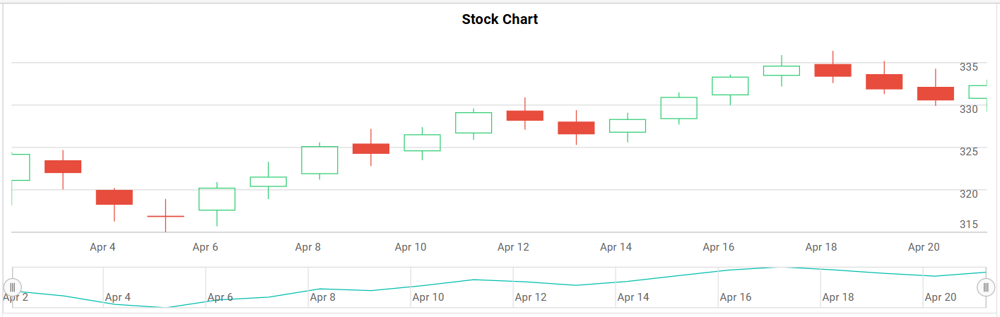

---
layout: post
title: Getting Started with React Stock Chart | Syncfusion
description: Learn how to get started with the Syncfusion React Stock Chart Component. Explore setup, features, examples, and customization options.
control: Getting started
platform: ej2-react
documentation: ug
domainurl: ##DomainURL##
---
<!-- markdownlint-disable MD036 -->

# Getting Started with React Stock Chart

This section describes the steps to create a simple Stock Chart component.

A quick video overview of the React Stock Charts setup is available:



## Prerequisites

Before getting started, ensure that your development environment meets the [system requirements for Syncfusion® React UI components](https://ej2.syncfusion.com/react/documentation/system-requirement). That page documents the supported React, Node.js, and npm versions, and includes the React-version compatibility table for Syncfusion React components.

## Set up a development environment

To set up a React application quickly, use `create-vite-app`, which provides a faster development environment, smaller bundle sizes, and optimized builds compared to traditional tools like `create-react-app`. For detailed steps, refer to the Vite [installation instructions](https://vitejs.dev/guide). Vite sets up the environment using JavaScript and optimizes applications for production.

> As an alternative, you can create a React application using [`create-react-app`](https://github.com/facebook/create-react-app). For detailed instructions, refer to this [documentation](https://ej2.syncfusion.com/react/documentation/getting-started/create-app).

To create a new React application, run one of the following commands based on your preferred language:

**React with JavaScript**

```
npm create vite@latest my-app -- --template react
```

**React with TypeScript**

```
npm create vite@latest my-app -- --template react-ts
```

During the setup process, the CLI will prompt you for a few configuration options. Select the following:

- **Which linter to use?** → **ESLint**
- **Install with npm and start now?** → **Yes**

Selecting **Yes** automatically installs the project dependencies and starts the development server.

After verifying that the application starts successfully, terminate the development server in the terminal and proceed to the next step.

Then, navigate to the project directory:

```
cd my-app
```

## Install the Syncfusion® React Chart package

All Syncfusion Essential® JS 2 packages are published to the [npm registry](https://www.npmjs.com/~syncfusionorg).

Install the React Chart package using the following command:

```bash
npm install @syncfusion/ej2-react-charts
```

## Add the Stock Chart to the project

Open the application entry file (`src/App.jsx` or `src/App.tsx`) and the Stock Chart component using the following code.



import { StockChartComponent } from '@syncfusion/ej2-react-charts';

function App() {
  return (<StockChartComponent id="stock-chart" />);
}
export default App;



> Running `npm run dev` at this point renders an empty Stock Chart area. Continue with the next steps to register a theme, inject modules, add data, and configure a series so the chart can render the data.

## Adding CSS reference

Themes for Syncfusion® React Stock Chart components can be applied using CSS or SASS files from the [npm theme packages](https://ej2.syncfusion.com/react/documentation/appearance/theme#theme-packages), CDN, CRG, or [Theme Studio](https://ej2.syncfusion.com/react/documentation/appearance/theme-studio). For more information, see the [themes documentation](https://ej2.syncfusion.com/react/documentation/appearance/theme).

This guide uses the Tailwind 3 theme as an example, sourced from the theme package. In this package, each component includes an `index.css` file that automatically loads all the required dependency styles. To install the [Tailwind 3](https://www.npmjs.com/package/@syncfusion/ej2-tailwind3-theme) theme package, use the following command:



npm install @syncfusion/ej2-tailwind3-theme


yarn add @syncfusion/ej2-tailwind3-theme



The required styles for the Stock Chart component are imported in the `src/App.css` file. Make sure `src/App.tsx` imports `App.css` (the Vite template already includes `import './App.css';`).



@import "@syncfusion/ej2-tailwind3-theme/styles/stock-chart/index.css";



## Inject Required Modules

Stock Chart features are delivered as separate modules and must be explicitly injected. The `Inject` component takes a `services` array that registers the modules the Stock Chart component is allowed to use; injecting only the modules you need keeps the bundle small. Here, the `CandleSeries` and `DateTime` modules are used to render a basic stock chart:

* `CandleSeries` — Inject this module into `services` to render a candle series.
* `DateTime` — Inject this module into `services` to enable the DateTime axis.

Import the modules from the Chart package and register them through the `Inject` component as follows.



import { StockChartComponent, CandleSeries, DateTime, Inject } from '@syncfusion/ej2-react-charts';

function App() {
  return (
    <StockChartComponent id="stock-chart">
      <Inject services={[CandleSeries, DateTime]} />
    </StockChartComponent>
  );
}
export default App;



> At this stage, no stock chart is rendered because the Stock Chart component has not yet been configured with a data source.

## Populate the Stock Chart with data

The Stock Chart expects data to be provided through the [`dataSource`](https://ej2.syncfusion.com/react/documentation/api/stock-chart/index-default#datasource) property as a JSON array. Each data object should include the x (date), [`open`](https://ej2.syncfusion.com/react/documentation/api/stock-chart/stockseriesmodel#open), [`high`](https://ej2.syncfusion.com/react/documentation/api/stock-chart/stockseriesmodel#high), [`low`](https://ej2.syncfusion.com/react/documentation/api/stock-chart/stockseriesmodel#low), and [`close`](https://ej2.syncfusion.com/react/documentation/api/stock-chart/stockseriesmodel#close) properties, which are used to render the stock series.

You can define the data in the same `src/App.tsx` file or place it in a separate file (for example, `src/datasource.ts`) and import it into `App.tsx`.









        


## Run the application

Run the application using the following command:

```bash
npm run dev
```

Open the generated local URL (for example, `http://localhost:5173/`) in the browser. The application displays the basic stock chart as shown below:



## See also

* [React Stock Chart feature tour](https://www.syncfusion.com/react-components/react-stock-chart).
* [React Stock Chart example](https://ej2.syncfusion.com/react/demos/#/bootstrap5/stock-chart/default).
* [Stock Chart technical indicators](https://ej2.syncfusion.com/react/documentation/stock-chart/technical-indicators).
* [Stock Chart period selector](https://ej2.syncfusion.com/react/documentation/stock-chart/period-selector).
* [Stock Chart range selector](https://ej2.syncfusion.com/react/documentation/stock-chart/range-selector).
* [Stock Chart tooltip](https://ej2.syncfusion.com/react/documentation/stock-chart/tool-tip).
* [Stock Chart API reference](https://ej2.syncfusion.com/react/documentation/api/stock-chart/index-default)