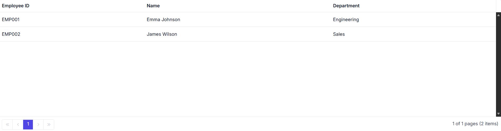

# Getting Started with Syncfusion A2UI

This section walks through creating a simple React app that renders a Syncfusion EJ2 React component from a list of [A2UI v0.9](https://a2ui.org/) messages using the [`@syncfusion/ej2-react-a2ui`](https://www.npmjs.com/package/@syncfusion/ej2-react-a2ui) package. The example below uses a `DataGrid` for illustration, but the same pattern — define an A2UI v0.9 message list, feed it to a `MessageProcessor` configured with `syncfusionCatalog`, and render the result with `<SyncfusionA2UIProvider/>` — works for every component in the catalog (`Chart`, `Scheduler`, `Calendar`, `RichTextEditor`, `Diagram`, `Spreadsheet` and more).

## Prerequisites

The following tools and runtime are required to build and run a Syncfusion A2UI React application.

| Tool | Version |
|------|---------|
| React | 15.5.4 or higher |
| Node.js (optional) | 14.0.0 or above |

### React supported versions

| React version | Minimum @syncfusion/ej2-react-* version |
|---------------|----------------------------------------|
| [React v19](https://react.dev/blog/2024/12/05/react-19) | 29.1.33 and above |
| [React v18](https://react.dev/blog/2022/03/29/react-v18) | 20.2.36 and above |
| [React v17](https://legacy.reactjs.org/blog/2020/10/20/react-v17.html) | 18.3.50 and above |


## Set up a development environment

To set up a React application quickly, use [create-vite](https://vitejs.dev/guide/#scaffolding-your-first-vite-project), which provides a faster development environment, smaller bundle sizes, and optimized builds compared to traditional tools like create-react-app. Vite sets up the environment using JavaScript and optimizes applications for production.

As an alternative, you can create a React application using [create-react-app](https://create-react-app.dev/). For detailed instructions, refer to its documentation.

To create a new React application, run one of the following commands based on your preferred language:

**React with JavaScript**

```bash
npm create vite@latest my-app -- --template react
```

**React with TypeScript**

```bash
npm create vite@latest my-app -- --template react-ts
```

Both commands scaffold a Vite project named `my-app` using the selected template and skip interactive prompts because the `--template` flag is supplied. If you omit the flag, Vite will instead walk you through framework, variant, and linter selection interactively.

After the scaffold completes, install the dependencies and start the dev server once to confirm the project is wired up:

```bash
cd my-app
npm install
npm run dev
```

Verify the Vite dev server starts (the terminal prints a `http://localhost:5173/` URL), then stop it and proceed to the next step. You do not need to navigate again; the `cd my-app` above already places you in the project directory.

## Install the Syncfusion A2UI React package

The [`@syncfusion/ej2-react-a2ui`](https://www.npmjs.com/package/@syncfusion/ej2-react-a2ui) package is published to the npm registry. It bundles the A2UI v0.9 runtime, all Syncfusion EJ2 React adapters, and `Zod` as regular dependencies, so a single install line is enough:




npm install @syncfusion/ej2-react-a2ui --save




### Install a Syncfusion theme package

Themes for Syncfusion React components can be applied using CSS or SASS files from the npm theme packages, CDN, CRG, or Theme Studio.

This guide uses the **Tailwind 3** theme as an example. In this package, each component includes an `index.css` file that automatically loads all the required dependency styles. To install the Tailwind 3 theme package, use the following command:




npm install @syncfusion/ej2-tailwind3-theme --save




> **Note**: Replace `@syncfusion/ej2-tailwind3-theme` with the theme package that matches your design system: 
> * `@syncfusion/ej2-material-theme` (Material), 
> * `@syncfusion/ej2-fluent2-theme` (Fluent 2), 
> * `@syncfusion/ej2-material3-theme` (Material 3), or
> * `@syncfusion/ej2-bootstrap5-theme` (Bootstrap 5).

### Clear Vite's default styles

By default, Vite projects include a `src/index.css` file with default styles. These default styles may conflict with Syncfusion component styles. Clear all content from `src/index.css` to prevent style conflicts.

### Import the component styles

The required styles for each component family the agent will render are imported in the `src/App.css` file. The example below imports the stylesheet for the `DataGrid` used in the getting-started code sample; add an `@import` line for every additional component family the agent may use (chips, buttons, schedule, chart, etc.):




@import "@syncfusion/ej2-tailwind3-theme/styles/grid/index.css";




## Render your first Syncfusion A2UI surface

Replace the contents of `src/App.tsx` with the snippet below. It wires up the `MessageProcessor` with `syncfusionCatalog`, subscribes to `onSurfaceCreated`, and processes three A2UI v0.9 messages that together render a `DataGrid` with two employee rows.







What the snippet does, in order:

1. Imports the `SyncfusionA2UIProvider` and `syncfusionCatalog` from the package, plus the `MessageProcessor` and types from `@a2ui/web_core/v0_9` and `@a2ui/react/v0_9`.
2. Declares a static `MESSAGES` array with three A2UI v0.9 messages: a `createSurface`, an `updateComponents` that adds a `Column` containing a `SyncfusionDataGrid`, and an `updateDataModel` that supplies the grid's rows.
3. Creates the `MessageProcessor` once inside `useRef` so it survives re-renders, and registers `syncfusionCatalog` as the catalog it should resolve components against.
4. In the `useEffect`, subscribes to `onSurfaceCreated` (so the latest `SurfaceModel` lands in component state) and immediately calls `processor.processMessages(MESSAGES)` to render the surface.
5. Renders the surface with `<SyncfusionA2UIProvider surface={surface} />`. The provider is generic — swap `SyncfusionDataGrid` for any other component in the catalog (`SyncfusionChart`, `SyncfusionScheduler`, `SyncfusionCalendar`, `SyncfusionTextBox`, …) and the same pipeline renders it.

## Run the application

Run the application using the following command:

```bash
npm run dev
```



Open the generated local URL (for example, `http://localhost:5173/`) in the browser. The application displays a Syncfusion EJ2 `DataGrid` with the two employee rows, paging, and sorting enabled — rendered entirely from the static A2UI v0.9 message list above.

## Register the Syncfusion license key

Syncfusion<sup style="font-size:70%">&reg;</sup> EJ2 React components require a valid license key to be registered before they render without a trial-license watermark. The A2UI adapters call into the same EJ2 components under the hood, so a registered key is required even when the UI itself is generated by an agent.

For instructions on generating and registering a license key, see:

* [How to generate a Syncfusion React license key](../licensing/license-key-generation)
* [How to register a Syncfusion React license key](../licensing/license-key-registration)

## See also

* [Overview](./overview)
* [A2UI v0.9 protocol](https://a2ui.org/)
