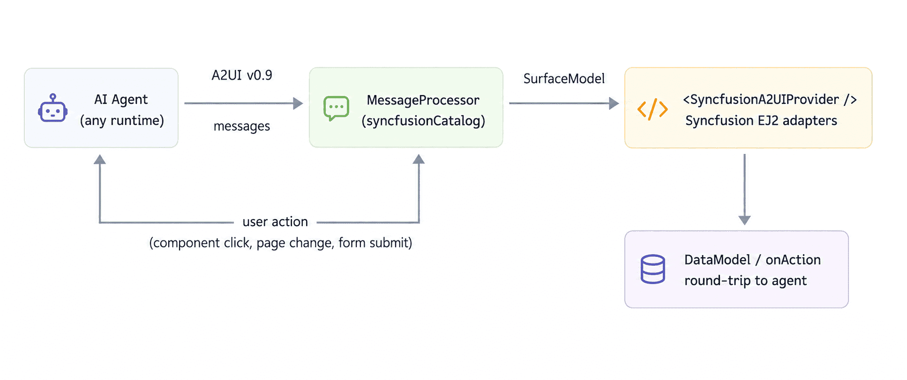

# Overview of Syncfusion A2UI for React

The **Syncfusion&reg; A2UI React** package (`@syncfusion/ej2-react-a2ui`) bridges the [A2UI v0.9](https://a2ui.org/) agent-to-UI protocol with Syncfusion's production-grade **EJ2 React** component library. It lets an AI agent stream a sequence of structured UI messages — instead of raw HTML, or text — that the host application renders as fully interactive, data-bound Syncfusion components: data grids, charts, schedulers, forms, inputs, and more.

In short, the package turns a chat-style agent response into a working, on-brand React UI without writing any component code by hand.

> **Preview release**
>
> The `@syncfusion/ej2-react-a2ui` package is currently in **preview (beta)** and is published on npm with a pre-release tag, for example `1.0.1-beta.0`. During the preview:
>
> - The package is **feature-complete** for the listed components but the API, catalog id, and Zod schemas may evolve before the first stable release.
> - The **A2UI v0.9 wire format** is stable, but minor additive changes (new components, new properties) are expected.

## What problem does it solve?

Modern AI agents are expected to do more than return text. A user who asks *"Show me last quarter's sales by region"* expects an interactive chart, not a markdown table. A user who asks *"Schedule a meeting with the design team next Tuesday"* expects a calendar picker, not a confirmation string.

A2UI is an open protocol that defines a small, JSON-RPC-shaped message format for agents to describe UIs declaratively. The protocol specifies four message types — `createSurface`, `updateComponents`, `updateDataModel`, and `deleteSurface` — and a tree of named components. The receiving host app runs those messages through a `MessageProcessor` to build a `SurfaceModel` and render it.

`@syncfusion/ej2-react-a2ui` is the Syncfusion implementation of that "render side":

- It ships a **catalog of 50+ Syncfusion EJ2 React adapters** (58 components in total when the A2UI layout primitives are included) that implement the A2UI component contract.
- It validates every message against a Zod schema at runtime, so malformed agent output is rejected with a clear error instead of failing silently.
- It binds the data and user actions between Syncfusion widgets and the A2UI `DataModel` automatically.
- It exposes a `<SyncfusionA2UIProvider />` that renders any produced surface with a single component, wrapped in an error boundary.

## How it works

1. The user sends a prompt to an A2UI-compatible agent (any framework, any LLM).
2. The agent emits a stream of A2UI v0.9 messages.
3. The host app passes them to a `MessageProcessor` configured with `syncfusionCatalog`.
4. The processor validates each message against the bundled Zod schemas, builds a `SurfaceModel`, and emits it on `onSurfaceCreated`.
5. `<SyncfusionA2UIProvider surface={surface} />` walks the model and renders every component with its Syncfusion adapter.
6. The user interacts with the surface; the action handler forwards the action to the agent, which produces the next message stream. The cycle repeats.

## Who is it for?

`@syncfusion/ej2-react-a2ui` is for React teams that want to combine the power of a generative agent with the look, feel, accessibility, and feature depth of Syncfusion EJ2:

- **Application builders** adding a conversational, AI-driven layer to an existing Syncfusion-powered product.
- **Internal tooling teams** giving non-developers a natural-language way to explore operational data (grids, charts, schedulers, dashboards).
- **Customer support / CRM teams** that need the agent to show real, interactive forms and reports — not just text suggestions.
- **Anyone shipping Syncfusion React UIs** who wants the same components to be reachable from a chat surface, an MCP server, or an autonomous agent.

## What you get in the @syncfusion/ej2-react-a2ui package

- **A2UI primitives** — `Column`, `Row`, `Text`, `Image`, `Icon`, `Divider`, etc., bundled inside `syncfusionCatalog` from `basicCatalog`.
- **`<SyncfusionA2UIProvider />`** — a one-line renderer with a built-in `SurfaceErrorBoundary` that turns render errors into a graceful inline message instead of crashing the host app.
- **`syncfusionCatalog`** — the A2UI `Catalog` instance, ready to pass straight to `MessageProcessor`.
- **TypeScript declarations + Zod schemas** for every component, so the host app and any agent SDK can share one source of truth for the wire format.

## When to use it (and when not to)

**Use `@syncfusion/ej2-react-a2ui` when:**

- You are building (or already have) a React app that uses Syncfusion EJ2 components and want a chat or agent surface in front of it.
- You want the agent to emit *interactive* Syncfusion widgets (grids, charts, schedulers) that the user can manipulate, not just static screenshots or pre-rendered HTML.
- You want runtime validation of every agent message against a Zod schema.
- You need bidirectional data binding so the agent can react to what the user does inside the surface.

**Consider the plain `@a2ui/react` package when:**

- You are prototyping and do not need the feature depth of Syncfusion components.
- Your design system uses a different React component library and you do not want to bring in EJ2.

## Need help?

Two support channels are available while you integrate Syncfusion A2UI for React:

* **Syncfusion Direct-Trac support** — log a private incident with the Syncfusion engineering team for bugs, account / licensing questions, and priority responses: [https://www.syncfusion.com/support/directtrac/incidents](https://www.syncfusion.com/support/directtrac/incidents).
* **Syncfusion community forum** — ask the wider Syncfusion community, browse prior answers, or share patterns: [https://www.syncfusion.com/forums/](https://www.syncfusion.com/forums/).

## Next steps

- **[Getting Started](./getting-started)** — install the package, wire up a `MessageProcessor`, and render your first surface in under five minutes.
- **[A2UI v0.9 protocol](https://a2ui.org/)** — the open protocol this package implements.
