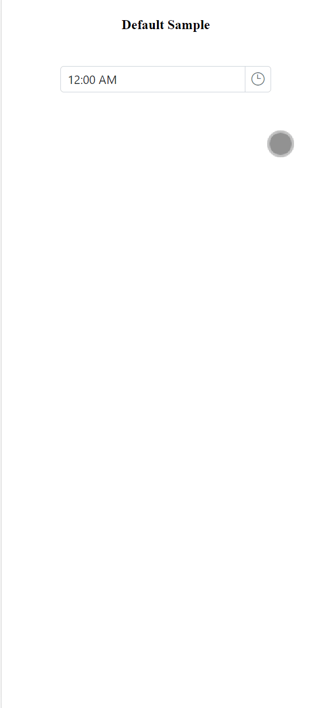

# Style and Appearance in React TimePicker

The following CSS structure enables you to customize the React TimePicker component's appearance. Apply these styles with appropriate specificity to override default styles for your use case.

## Customizing the appearance of React TimePicker wrapper element

Use the following CSS to customize the appearance of wrapper element.

```css
/* To specify height and font size */
.e-input-group input.e-input, .e-input-group.e-control-wrapper input.e-input, .e-input-group textarea.e-input, .e-input-group.e-control-wrapper textarea.e-input {
        font-size: 20px;
        height: 40px;
}
```

## Customizing the React TimePicker icon element

Use the following CSS to customize the React TimePicker icon element

```css
/* To specify background color and font size */
.e-time-wrapper .e-time-icon.e-icons, *.e-control-wrapper.e-time-wrapper .e-time-icon.e-icons {
        font-size: 20px;
        background-color: beige;
}
```

## Customizing the React TimePicker popup

Use the following CSS to customize the React TimePicker popup

```css
/* To specify height */
.e-timepicker.e-popup {
        height: 100px;
}
```

## Customizing the React TimePicker popup content

Use the following CSS to customize the React TimePicker popup content

```css
/* To specify height */
.e-timepicker.e-popup .e-list-parent.e-ul li.e-list-item {
        background-color: beige;
        font-size: 20px;
}
```

## Full screen mode support in mobiles and tablets

The full-screen mode feature optimizes the React TimePicker for mobile and tablet devices by expanding the popup to occupy the entire screen. This provides improved visibility and touch-friendliness in both landscape and portrait orientations.

To enable full-screen mode, set the [`fullScreenMode`](https://ej2.syncfusion.com/react/documentation/api/timepicker#fullScreenMode) property to `true`:

```typescript
// import the ripple effect
import { enableRipple } from '@syncfusion/ej2-base';
// import the timepicker
import { TimePickerComponent } from '@syncfusion/ej2-react-calendars';
import * as React from "react";
import * as ReactDOM from "react-dom";
// enable ripple effect
enableRipple(true);

function App(){
    const mobileMode:boolean = true;

    return <TimePickerComponent id="timepicker" fullScreenMode={this.mobileMode} />
};
ReactDOM.render(<App />, document.getElementById('timer'));
```

