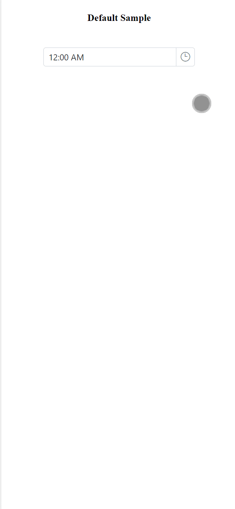

# Style appearance in React Timepicker component

The following content provides the exact CSS structure that can be used to modify the control's appearance based on the user preference.

## Customizing the appearance of TimePicker wrapper element

Use the following CSS to customize the appearance of wrapper element.

```css
/* To specify height and font size */
.e-input-group input.e-input, .e-input-group.e-control-wrapper input.e-input, .e-input-group textarea.e-input, .e-input-group.e-control-wrapper textarea.e-input {
        font-size: 20px;
        height: 40px;
}
```

## Customizing the TimePicker icon element

Use the following CSS to customize the TimePicker icon element

```css
/* To specify background color and font size */
.e-time-wrapper .e-time-icon.e-icons, *.e-control-wrapper.e-time-wrapper .e-time-icon.e-icons {
        font-size: 20px;
        background-color: beige;
}
```

## Customizing the TimePicker popup

Use the following CSS to customize the TimePicker popup

```css
/* To specify height */
.e-timepicker.e-popup {
        height: 100px;
}
```

## Customizing the TimePicker popup content

Use the following CSS to customize the TimePicker popup content

```css
/* To specify height */
.e-timepicker.e-popup .e-list-parent.e-ul li.e-list-item {
        background-color: beige;
        font-size: 20px;
}
```

## Full Screen Mode: Enhancing the TimePicker Component (Mobile Support Only)

We have introduced the full screen mode functionality in our TimePicker component, enabling users to see the TimePicker popup element in full-screen mode for better visibility and an upgraded user experience. It is important to mention that this feature is exclusively available for mobile devices in both landscape and portrait orientations. To activate the full screen mode within the TimePicker component, simply set the `fullScreenMode` API value to `true`. This action will extend the popup element to occupy the entire screen on mobile devices.

```typescript
// import the ripple effect
import { enableRipple } from '@syncfusion/ej2-base';
// import the timepicker
import { TimePickerComponent } from '@syncfusion/ej2-react-calendars';
import * as React from "react";
import * as ReactDOM from "react-dom";
// enable ripple effect
enableRipple(true);

function App(){
    const mobileMode:boolean = true;

    return <TimePickerComponent id="timepicker" fullScreenMode={this.mobileMode} />
};
ReactDOM.render(<App />, document.getElementById('timer'));
```

